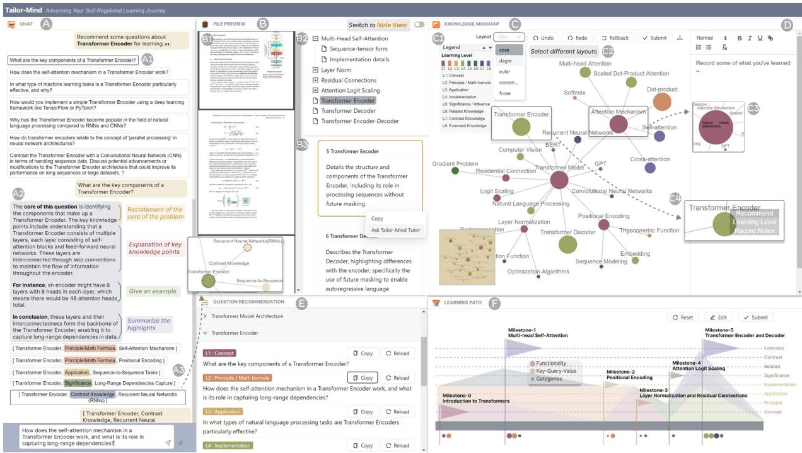
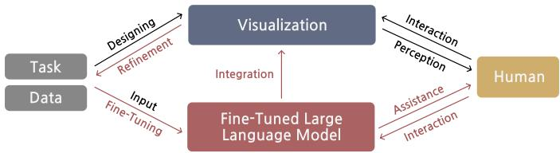
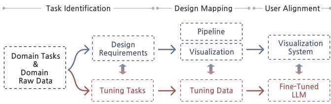
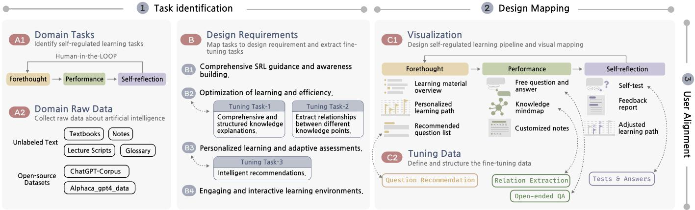
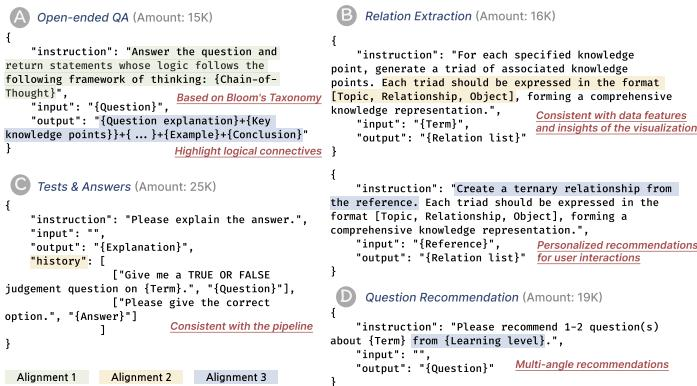
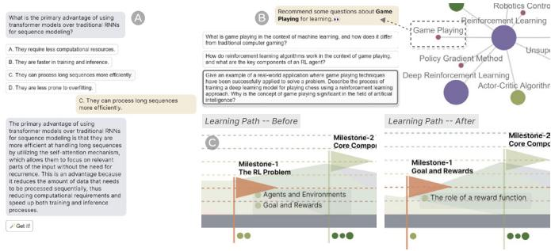
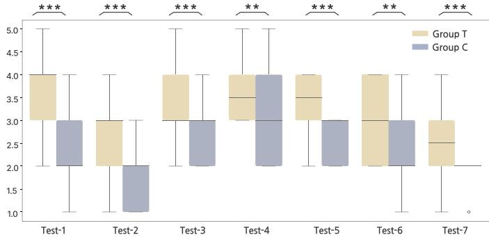
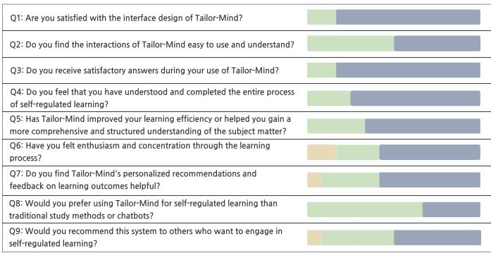

# Fine-Tuned Large Language Model for Visualization System: A Study on Self-Regulated Learning in Education

Lin Gao , Jing Lu, Zekai Shao $\textcircled{1}$ , Ziyue Lin, Shengbin Yue $\textcircled{1}$ , Chiokit Ieong, Yi Sun, Rory James Zauner, Zhongyu Wei $\textcircled{1}$ and Siming Chen $\textcircled{1}$ 

Fig. 1: The overview of Tailor-Mind. The Chat View (A) enables users to engage in conversations and receive recommended questions (A1), enhancing their knowledge exploration. Intelligent responses provide in-depth explanations (A2) and guide users to discover new knowledge connections (A3). The File Preview (B) displays learning materials (B1), knowledge structures in a tree widget (B2), and knowledge cards (B3). The Knowledge MindMap (C) visualizes the network of knowledge based on the learning levels (C1), allowing users to select different layouts (C2). Knowledge nodes display users’ notes (C3), support recommended questions, and allow for the modification of learning goals (C4). Users are also encouraged to take notes in a rich text editor (D). The Question Recommendation (E) offers questions about extracted knowledge points on various learning levels. The Learning Path (F) helps users understand their learning plans and delve into each detailed learning objective.

Abstract—Large Language Models (LLMs) have shown great potential in intelligent visualization systems, especially for domainspecific applications. Integrating LLMs into visualization systems presents challenges, and we categorize these challenges into three alignments: domain problems with LLMs, visualization with LLMs, and interaction with LLMs. To achieve these alignments, we propose a framework and outline a workflow to guide the application of fine-tuned LLMs to enhance visual interactions for domain-specific tasks. These alignment challenges are critical in education because of the need for an intelligent visualization system to support beginners’ self-regulated learning. Therefore, we apply the framework to education and introduce Tailor-Mind, an interactive visualization system designed to facilitate self-regulated learning for artificial intelligence beginners. Drawing on insights from a preliminary study, we identify self-regulated learning tasks and fine-tuning objectives to guide visualization design and tuning data construction. Our focus on aligning visualization with fine-tuned LLM makes Tailor-Mind more like a personalized tutor. Tailor-Mind also supports interactive recommendations to help beginners better achieve their learning goals. Model performance evaluations and user studies confirm that Tailor-Mind improves the self-regulated learning experience, effectively validating the proposed framework. 

Index Terms—Fine-tuned large language model, visualization system, self-regulated learning, intelligent tutorial system 

# 1 INTRODUCTION

The rapid advancement of large language models (LLMs) has captured significant attention [32, 47, 65] and opened new avenues for tack-

• Lin Gao, Jing Lu, Zekai Shao, Ziyue Lin, Shengbin Yue, Chiokit Ieong, Yi Sun, Zhongyu Wei, and Siming Chen are with the School of Data Science at Fudan University. S. Chen is also with the Shanghai Key Laboratory of Data Science. S. Chen is the corresponding author. E-mail: lingao23@m.fudan.edu.cn, simingchen@fudan.edu.cn 

• Rory James Zauner is with the Faculty of Computer Science, University of Vienna, Vienna, Austria. 

Received 31 March 2024; revised 1 July 2024; accepted 15 July 2024. Date of publication 10 September 2024; date of current version 29 November 2024. This article has supplementary downloadable material available at https://doi.org/10.1109/TVCG.2024.3456145, provided by the authors. Digital Object Identifier no. 10.1109/TVCG.2024.3456145 

ling specialized domain problems [25, 26]. Increasingly, researchers are applying these general models to specific areas, with supervised fine-tuning [54] emerging as a practical approach. By training on domain-specific datasets, this method enhances the model’s performance in fields such as healthcare [46], legal [62], and education [7]. Domain-specific LLMs, fine-tuned in this way, demonstrate improved decision-making, knowledge integration, retrieval, and logical reasoning, addressing issues of instability and inaccuracy commonly found in general models when applied to domain-specific tasks [66]. Visualization systems are also commonly used to solve domain-specific problems because they reveal data insights and provide a good user experience through interactions. Some researchers have specifically proposed general frameworks in the visualization community to guide analysts in designing and implementing visualization workflows for domain tasks [1, 21]. However, traditional visualization systems that incorporate small-scale models have limited capabilities for intelligent analysis. Due to the intelligence of LLMs, many researchers are considering integrating LLMs into the visual interaction processes of domain-specific problems. 

However, integrating LLMs and visualization systems to address domain-specific problems encounters some difficulties, owing to their distinct capabilities, which complicate the optimal leveraging of their respective strengths. The first challenge is the adaptation of LLMs to domain-specific problems. For the strong domain barriers in these problems, general LLMs mostly lack the ability to handle specific, complex domain knowledge and therefore cannot effectively solve domain problems. The second challenge is synchronizing visualization with LLMs. LLMs lack knowledge of visualization and an understanding of visualization systems. To empower visualization systems with LLM capabilities, it is crucial to ensure that models internalize the visualization process and visual mappings as knowledge and actions. The third challenge involves understanding and enhancing interactions with LLMs. LLMs need to understand various types of interactions and how to provide personalized interactive recommendations. Ensuring LLMs accurately interpret user intentions from different interactions is vital for achieving effective and personalized interactive experiences. 

Existing LLM-empowered visualization systems can intelligently and automatically solve problems [12, 52]. However, they merely embed LLM into the system without enhancing the model’s knowledge and behavior for complex, domain-specific knowledge. Additionally, some efforts address domain-specific problems by fine-tuning [15, 50]. However, these fine-tuned models are constructed in isolation from the visualization process and do not consider the tasks and requirements involved in visualization. Therefore, there is a lack of work that integrates domain knowledge, visualization, and interaction to leverage LLMs for domain-specific problems. 

In this paper, we analyze the relationships and patterns among LLMs, domain knowledge, visualization, and interaction, identifying three alignment objectives: domain problems with LLMs, visualizations with LLMs, and interactions with LLMs. Based on these alignments, we propose a conceptual framework to guide the tuning of LLMs for domain-specific tasks in visualization systems. We apply our proposed framework to the educational domain, introducing Tailor-Mind for artificial intelligence (AI) beginners. A preliminary study with students and teachers reveals a need for intelligent interactive systems in Self-Regulated Learning (SRL), which our approach aims to address. By integrating expert insights with user needs, learning tasks are defined, leading to the establishment of design requirements and fine-tuning objectives for the domain model. This optimization ensures the model fits the learning tasks and maintains interactive functionality between visualization and students’ learning process. To our knowledge, this work presents the first conceptual framework that combines fine-tuned models and visualization systems to tackle domain-specific problems. The contributions are as follows: 

• A conceptual framework that integrates fine-tuned LLMs into interactive visualization systems, alongside a workflow of applying the framework to different domains. 

• Applying the framework to the education domain, we introduce Tailor-Mind, an interactive visualization system for artificial intelligence beginners supported by a fine-tuned LLM. The system supports intelligent exploration of knowledge and personalized 

recommendations during the self-regulated learning process. 

• The evaluation of model performance, alongside findings from usage scenarios and user study, validates Tailor-Mind’s effectiveness in facilitating SRL experiences. This substantiates the framework’s rationality and feasibility and offers the educational domain valuable insights for promoting active, iterative learning. 

# 2 RELATED WORK

This section reviews related work on fine-tuned LLMs for domainspecific applications and LLM-empowered visualization systems, especially in the education domain. 

# 2.1 LLM-based Visualization System for Domain Tasks

The exceptional performance of LLMs has facilitated their integration into visual interactions. Currently, their power can be leveraged in several ways: external knowledge bases, prompt engineering, agent settings, and data fine-tuning. 

External knowledge bases. External knowledge bases enhance LLMs by providing vast repositories of structured information [23]. DocFlow [38] intelligently classifies documents by incorporating document information retrieval techniques based on user questions. Peng et al. [36] proposed an LLM-AUGMENTER system that augments LLM with plug-and-play modules based on external knowledge. 

Prompt engineering. Through prompt engineering, LEVA [64] enables LLMs to generate the declarative syntax of a visual analytics system, understand view relationships, and interpret diagram information to provide analysis tasks and interaction recommendations. Works tailored to specific scenarios, such as interior design [12] and virtual museum tours [52], enhance user experiences by interpreting inputs and adapting outputs, thereby facilitating intelligent and personalized solutions. Simultaneously, there is work [44] that focuses on visualizing prompt performance and methods for iterative optimization. 

Agent setting. A unique application of prompt projects lies in agent design, where the LLM-based conversational agent enhances user immersion in conjunction with interaction design [28,56]. The sandbox is another scenario where LLM-based agents are used to simulate social behaviors [35]. AgentLens [29] illustrates the evolution of LLM-based autonomous systems through hierarchical temporal visualization. 

Data fine-tuning. Several systems employ data fine-tuning to personalize models, primarily focusing on addressing natural language questions. CommonsenseVIS [50] adds concept and relation alignments to improve model behavior contextualization and question-answering ability. PlantoGraphy [15] uses a fine-tuned model to transform garden scene layouts into realistic landscape renderings. 

The above work demonstrates that integrating LLMs into visualization systems improves user experience. LLM performance in domain tasks is becoming increasingly critical, and the challenge of enhancing domain task completion through the LLM-empowered visualization system remains a concern. Our work focuses on aligning model performance with visualization and interaction to assist domain task-solving. 

# 2.2 Fine-tuning LLMs for Domain Specific Applications

The advent of LLMs like ChatGPT [31] and LLaMa [47] has catalyzed research into leveraging their formidable powers across diverse professional domains. Wei et al. [54] introduced an innovative instruction fine-tuning technique to bolster the models’ adaptability to domain tasks [67]. In the judiciary, projects like DISC-LawLLM [62] has made significant headway in addressing intricate tasks such as legal element identification, case sorting, and judgment forecasting. In the financial sector, FinGPT [60] stands as a testament to the potential of large models developed through a thorough analysis of financial narratives, social discourse, and fiscal reports. In healthcare, BenTsao [48] has improved models’ question-answering capabilities and proposed a finetuned dataset [8] leveraging technologies like knowledge graphs [49]. Initiatives such as EduChat [7] and Taoli Llama [61] have enhanced the utility of large models, meeting the growing call for accessible models in the educational sphere [2, 45]. Moreover, in specific disciplines, Yue et al. [63] trained the MAmmoTH series of models with enhanced mathematical reasoning ability by mixing Chain of Thought (CoT) [55] and Programming of Thought (PoT) [4]. PromptProtein [53] 

focused on protein sequence prediction, demonstrating the value of discipline-specific LLMs. 

Instruction fine-tuning is acknowledged for enhancing model efficacy and adaptability in targeted domains. Yet, developing fine-tuning datasets is intricate and laborious, with the dataset’s quality and volume being pivotal to the model’s domain-specific outcomes [40, 51]. For many developers, constructing datasets for fine-tuning presents a formidable and time-intensive challenge [24, 39]. 

# 2.3 Intelligent Tutorial System and Educational Agent

Since the illustrating workflow pertains to education, it is essential to analyze how previous studies utilized LLM alongside visualization to augment the pedagogical landscape [17]. A crucial aspect of an intelligent tutorial system (ITS) is interactive visualization, offering an intuitive and engaging educational journey [6]. Wang et al. [69] have innovated by automating slide generation from Jupyter Notebooks. TransforLearn [10] provides an interactive way to understand the Transformer model and data flows. Kabdo et al. [5] have proposed AlgoSolve, a tool aiding learners in algorithmic problems. The advancement of LLMs has given rise to LLM-empowered ITS [20]. Storyfier [37] utilizes LLMs in language practice, generating contexts that encompass target words. UKP-SQuARE [9] offers a platform to operate, assess, and analyze various QA models. Another critical area in ITS is using educational agents to instruct, motivate, and engage learners [57]. HypoCompass [30] proposes a learning-by-teaching approach, where one agent functions as a student, while a novice oversees the debugging process. Ruffle & Riley [41] demonstrate student and teacher roles, executing tutorial scripts from textbooks. 

LLM-enhanced approaches offer novel learning solutions yet often fail to meet domain-specific standards, with effectiveness tied to the model’s capabilities. Moreover, these methods primarily act as chatbots, lacking comprehensive learner guidance. In educational theory, fostering students’ SRL capabilities is paramount [34]. Consequently, we integrate the proposed framework within the educational context, constructing instructional datasets for fine-tuned domain models and merging the model with a visualization system to assist users in accomplishing SRL tasks. 

# 3 FINE-TUNED LLM FOR VISUALIZATION SYSTEM

In Sec. 3.1, the challenges of integrating LLMs into visualization systems are summarized in three alignments. To address these challenges, we discuss the proposed framework (Sec. 3.2) and analyze how it can be applied to solve domain problems (Sec. 3.3). 

# 3.1 Problem Definition

Given user preferences for visual interaction [27], enhancing the intelligence of visualization systems becomes crucial. However, integrating LLMs into visualization systems presents multiple challenges. To tackle these, we propose three alignments. We define “alignment” as the mutual adaptation and coordination between LLMs and various elements such as visualization systems, domain knowledge, and user interactions, aimed at meeting multifaceted requirements and optimizing performance for models’ targeted behaviors. 

A1 Alignment between domain problems and LLMs. It is critical to integrate domain-specific knowledge (e.g., terminology and concepts), experiences, and insights into the LLM and match the linguistic patterns. This helps LLMs to skillfully solve complex tasks [11] that require a deep understanding of domain specificity. 

A2 Alignment between visualizations and LLMs. It’s essential to account for the context in which visualization operates, including the specific data features or insights. The visualization design and its alignment with model outputs are paramount. This design extends beyond visual representation [42] to encompass the system’s pipeline to reflect domain-specific problem-solving. 

A3 Alignment between interactions and LLMs. LLMs should interpret user intents behind interactions, including natural language, non-verbal cues, and visual elements. Furthermore, since user interactions can be aimless and uncertain, LLMs need to adapt to exploratory queries and offer guided hints. 

# 3.2 Framework

Based on the traditional framework of visual analytics processes [1, 21], we think of the impact of the LLM’s addition and propose the conceptual framework, as illustrated in Fig. 2. In this framework, we use domain tasks and data as inputs to provide people with task solution results and experiences through an intelligent visualization system based on the fine-tuned LLM. 

Fig. 2: Framework of integrating fine-tuned LLM into visualization system. The black lines indicate relationships in traditional processes, and the red lines highlight connections that are introduced or altered by the involvement of fine-tuned LLM.

Node Description. Task possesses strong domain-specific traits and is typically a complex domain problem consisting of multiple sub-tasks. Data consists of the data provided by users and the data needed to be transformed into domain knowledge. Human is the subject involved in the whole process. Additionally, humans are the end users of the fine-tuned LLM and visualization system, and they interact with them to accomplish the task. Visualization refers to the visualization system, which provides interaction and visual perception. Humans use the visualization system as a platform to complete tasks. Fine-tuned LLM outperforms the small-scale model and excels at handling domain tasks than the generalized LLM. 

Fine-tuning aligns LLM with domain requirements. Fine-tuning requires that models learn to “know” domain knowledge and “apply” knowledge to solve problems. Converting domain data into high-quality knowledge is a key aspect of fine-tuning. High-quality data for finetuning can help models distill insights and knowledge from it. Moreover, fine-tuning involves teaching LLM the processing flow and expertise from domain-specific tasks. The model needs to develop behaviors for handling domain-specific problems by comprehending the logic and sequence between sub-tasks rather than processing a task in isolation. 

Integration and refinement of LLMs with visualization systems. In the process of integration, the fine-tuned model needs to understand the original intent of the visualization design, including the design purposes, data features, and communications of relevant insights. The model also needs to learn the contextual logic required for the insights to align the visualization. Refinement strategies can be extracted from visual designs and system workflows, and they can be applied to facilitate model handling of domain problems in the visualization system. 

Intelligent assistance and interaction from LLM align with user requirements. The fine-tuned LLM aligns with human preferences, habits, and behavioral patterns. This adaptation enables the LLM to seamlessly deliver intelligent assistance during user interactions, whether through natural language processing or visual interface engagement. Users can facilitate problem-solving through guided interactions from fine-tuned LLM, ensuring that aimless queries are supported in a coherent and purposeful manner. 

# 3.3 Application of the Framework

We can derive insights for implementing intelligent visualization interaction processes from the conceptual framework. Therefore, we propose a general workflow (Fig. 3) along with corresponding guidelines and provide a detailed explanation based on its application to an educational problem. We focus on SRL, a process where students plan, monitor, and evaluate their own learning, as intelligent and online learning platforms have shifted students toward greater self-initiative rather than traditional teacher guidance. The workflow process undergoes three phases, with guidelines using $\ " \Rightarrow \ "$ to represent the influence or guidance of one aspect on another. 

Task Identification. In a traditional visualization workflow, the first step is to refine design requirements based on the needs of domain experts and target users. Based on the supported user needs and the 

Fig. 3: Workflow for applying the framework. All three phases of the workflow are designed to achieve the alignment challenges. 

existing LLM’s gaps in domain knowledge and capabilities (A1), we derive targeted tuning tasks to enhance the model’s domain knowledge and performance. 

• (Design Requirements $\Rightarrow$ Tuning Tasks) Extract tasks that require enhanced intelligence from the requirements. 

• (Tuning Tasks $\Rightarrow$ Design Requirements) Constructing usage scenarios helps to validate and iterate on the needs of potential users. 

Regarding its application in education, we conducted a preliminary study on SRL to identify the design requirements for helping beginners deeply understand knowledge and personalize their learning process. From this, we distilled key tasks for fine-tuning, such as optimizing domain-specific Q&A to enhance knowledge comprehension and providing personalized recommendations to tailor the learning experience. We refined these functionalities through continuous user engagement to enhance the intelligent SRL process. 

Design Mapping. Based on the design requirements, we further developed visualization views and summarized the visual exploration pipeline. By integrating LLMs, the entire visualization process becomes more intelligent and interactive. We need to collect and construct tuning data to adapt to the visualization system (A2). 

• (Pipeline $\Rightarrow$ Tuning Data) We need to summarize patterns in the process of solving problems through visual interactions, guiding model behavior using multi-turn dialogues or CoT approaches. 

• (Visualization $\Rightarrow$ Tuning Data) To support the functionalities of different visualization views, we need to construct data structures that align with their designs. This includes understanding encoding methods, data source characteristics, and forms of data insights. Additionally, the mapping relationships in visualization standardize the data structure and instruction format. 

• (Tuning Data $\Rightarrow$ Pipeline) Concrete tuning data supplements and ⇒optimizes the pipeline design, integrating intelligent interaction into the exploration process. 

• (Tuning Data $\Rightarrow$ Visualization) Based on the tuning data, the model generates data that aligns with the expected visualization views, improving the accuracy of the results. In-depth data analysis provides more visualization design options, enriching the representation of the data. 

In the context of SRL, based on the detailed pipeline process segmented into forethought, performance, and self-reflection phases, we constructed data for four scenarios in alignment with fine-tuning tasks. For example, to align with the interactive process of self-assessment in the last phase, we constructed fine-tuning data in the form of multiturn dialogues encompassing question recommendations, answers, and explanations. Additionally, we developed supported instruction finetuning data for various visualization views. For instance, summarizing knowledge points involved constructing a knowledge graph with a node-link network view to facilitate the recommendation of multiple related knowledge points. This also provided relational guidance and automatic addition functionalities for the node-link network view. 

User Alignment. A prototype of the visualization is used to obtain user suggestions for iterative optimization to capture user intent (A3). From user feedback, tuning data should be refined to improve the performance of fine-tuned LLM. 

• (Visualization System $\Rightarrow$ Fine-tuned LLM) The system’s user experience optimizes the model’s recommendation capabilities, enhancing interactive recommendations and intent inferences. By analyzing interaction records, we identify user characteristics and interaction patterns, enabling targeted and personalized improvements to the model’s output. 

• (Fine-tuned $\mathbf { L L M } \Rightarrow$ Visualization System) Integrating the finetuned model into each system module provides more intelligent interaction methods to support the initial domain problem. 

In education, we combined the fine-tuned model with the visualization system to form the final system, Tailor-Mind, for prototype user experience collection. Based on user feedback, we encoded user group (students) characteristics into the model to optimize its capabilities. For instance, considering beginners’ traits, we provided question recommendations to simplify the questioning process and encourage divergent thinking. By treating model answers as reference material, we further tuned the model to intelligently extract key information and structured data, helping students grasp essential points. 

# 4 REQUIREMENT ANALYSIS OF TAILOR-MIND

Recognizing the need for effective tools to support SRL, we conducted a preliminary study to identify the design requirements of the visualization system and specific fine-tuning tasks for intelligent SRL. 

# 4.1 Interviews and Surveys

We interviewed two domain experts and investigated how students adopt SRL in their studies. 

Our research involved two thirty-minute interviews with a distinguished education researcher (E1), who studies students’ learning behaviors, and a university lecturer (E2) who teaches AI. E1 advocated for Zimmerman’s SRL model [72] to guide our study, emphasizing the need to cultivate students’ initiative and enthusiasm. E2, from a teaching perspective, noted the difficulty students face in linking various knowledge areas. E2 suggested that an ideal ITS should reduce cognitive load, enhance learner engagement, and offer personalized knowledge representation. Both experts concurred on the significance of promoting SRL over passive or task-specific learning methods. 

We also recruited students with experience in machine learning and deep learning courses and received 16 responses (7 female, 9 male). This group included 3 Ph.D. students, 8 M.S. students, and 5 undergraduates, all from the Computer Science and Data Science disciplines. The results showed that all participants had attempted SRL but were confused about practical implementations. Their main challenges and needs are depicted in Fig. 4. Notably, almost everyone desired personalized and timely assessments of their learning outcomes. 

<table><tr><td colspan="2">Difficulties in self-regulated learning</td><td colspan="2">Requirements</td></tr><tr><td>5</td><td>Lack of effective learning planning</td><td>14</td><td>Clear learning objectives and planning</td></tr><tr><td>12</td><td>Hard to maintain motivation &amp; self-discipline</td><td>11</td><td>Personalized learning resources &amp; support</td></tr><tr><td>6</td><td>Hard to understand complex content</td><td>11</td><td>Timely feedback &amp; suggestions</td></tr><tr><td>9</td><td>Lack of feedback &amp; guidance</td><td>12</td><td>Tracking &amp; assessment of learning progress</td></tr><tr><td>13</td><td>Struggle with self-evaluation</td><td>14</td><td>Interactive learning platform</td></tr></table>

Fig. 4: Results of student surveys. The left chart indicates the difficulties encountered by beginners in SRL. The right side demonstrates their need for a visualization system that supports intelligent aids to SRL.

# 4.2 Challenges for Self-Regulated Learning

Through interviews with experts and student surveys, we identified several main challenges during the SRL process. 

C1 Limited knowledge of SRL. E1 indicated that the primary challenge for many students in engaging with self-regulated scientific and effective learning stems from a lack of awareness. This observation aligns with findings from our student surveys. 

C2 Lack of motivation and guidance. E1 mentioned that maintaining enthusiasm and focus is difficult, especially in self-learning. She emphasized that appropriate goal-setting and guidance are crucial for sustaining students’ self-motivation and self-discipline throughout the typical SRL process. 

C3 Complex and esoteric knowledge. E2 highlighted that a major barrier for many students is the complex organization of knowledge. It is a great challenge to understand, apply, and interconnect different concepts independently. This complexity often overwhelms students, hindering their ability to achieve satisfactory learning outcomes through SRL. 

C4 Lack of immediate feedback. The cost and accessibility of personalized tutoring present significant barriers. Existing methods fall short of providing personalized feedback as well. As shown in Fig. 4, assessing their learning progress is challenging. 

# 4.3 Requirements for Tailor-Mind

In response to the challenges outlined in Sec. 4.2, we present the following requirements for the intelligent assistance of SRL. 

R1 Comprehensive SRL guidance and awareness building. Tailor-Mind should facilitate users in adhering to the SRL process (C1) to foster active learning. Leveraging insights from educational models and theories, it’s critical to specify and encode detailed sub-tasks within the foundational SRL framework. We should also educate users about the significance of setting goals, implementing effective learning strategies, and reflecting (C2). 

R2 Optimization of learning depth and efficiency. We must align our teaching goals to provide clear and well-organized explanations. To support beginners in applying and transferring knowledge while reducing cognitive load, presenting knowledge in a structured and simplified way is crucial (C3). Visual representations are important in breaking down complex information and illustrating the relationships between knowledge points. 

R3 Personalized learning and adaptive assessments. Tailoring the learning journey to individual needs is crucial. Offering users intelligent recommendations for learning objectives, paths, and content can significantly enhance personalized learning experiences. By analyzing learning performance across various objectives, Tailor-Mind must deliver targeted and suitable feedback to facilitate dynamic and iterative learning, empowering students to progress effectively and adaptively (C4). 

R4 Engaging and interactive learning environments. To keep students’ enthusiasm and focus during SRL (C2), Tailor-Mind should provide visual guidance throughout the learning process via interactions. Simultaneously, the explanation of intricate knowledge points should be captivating and engaging (C3). 

# 5 TAILOR-MIND

In this section, we follow the workflow (Fig. 3) of the proposed conceptual framework in Sec. 3.2 to facilitate the SRL process, as shown in Fig. 5. Specifically, Sec. 5.1 details the learning process and identifies sub-tasks under each stage. In Sec. 5.2, we introduce the fine-tuning tasks and corresponding tuning datasets to align the domain requirements with LLMs (A1). We purposely analyze some forms of data construction that consider visualization (A2) and user interaction alignment (A3). The user interface of Tailor-Mind is illustrated in Sec. 5.3. 

# 5.1 Workflow and Self-Regulated Learning Process

Guided by the conceptual framework proposed in Fig. 2, we have integrated the fine-tuned LLMs into a visualization system that supports intelligent SRL for beginners. The specific implementation workflow is shown in Fig. 5. Starting with the domain tasks (Fig. 5A1), we conducted a detailed requirement analysis (Fig. 5B). To help AI beginners with a comprehensive SRL process (R1), we propose a detailed SRL pipeline (Fig. 5C1) based on Zimmerman’s model [72]. The sub-tasks in the pipeline serve as the main objectives for visualization design and fine-tuning work. Finely segmenting the domain space aids in better aligning the model with domain problems. The pipeline consists of three stages: forethought, performance, and self-reflection. 

Forethought involves planning and goal-setting. Analyzing useruploaded learning materials, we recommend personalized learning paths (R3), helping beginners organize resources and set achievable goals, thereby enhancing motivation (R4). During the performance stage, beginners employ strategies from the forethought stage. Besides acquiring knowledge from the LLM, we facilitate the application of this knowledge, for instance, through notepads and knowledge mind-maps, enabling learners to track their progress. Self-reflection, identified as the most challenging stage for beginners, involves synthesizing learning into structured notes. Based on evaluations from tests aligned with set goals, we provide feedback and help students dynamically adjust learning paths for continuous learning experiences (R3). 

# 5.2 Fine-tuned LLM for Self-Regulated Learning

Through the task identification in Fig. 5- $\textcircled{1}$ , we have collected raw data for AI teaching (Fig. 5A2), including unlabeled data and conversation data related to the topic. We iterated on the fine-tuning tasks and the specific data formats, prompted by adjustments made after collecting user feedback with the prototype model and system. The initial finetuning tasks focused solely on augmenting domain knowledge, aimed at enhancing and expanding knowledge, which did not incorporate visualization design mapping and user alignment. Consequently, we refined the tuning tasks (T1-T3) based on design requirements and raw data (Fig. 5B) and established four scenarios. 

T1 Comprehensive and structured knowledge explanations. Initially, multi-turn dialogues were extracted from raw data. Focusing on learning efficiency and cognitive depth, we integrated Bloom’s Taxonomy [22] into the model’s thought chain [55] in Open-ended QA (Fig. 6A). User feedback analysis has led to incorporating visual suggestions, such as highlighting, in the responses. 

T2 Extract relationships between different knowledge points. The Relation Extraction reflects the networked structural data of disciplinary knowledge (Fig. 6B). After the initial iteration, to assist users in linking paragraph text to network visualization, we expanded this task to arbitrary texts, aiding users in obtaining personalized relationship recommendations based on model responses as references. Fine-tuning for data features helps bridge the gap between model output and data visualization, thus enhancing user comprehension and interaction. 

T3 Intelligent recommendations. Intelligent recommendations primarily involve suggesting Tests & Answers and Question Recommendation. In Fig. 6C, aligned with the self-reflection stage of the pipeline, we utilized a multi-turn dialogue format. This strategy provides the model with a contextual environment conducive to timely feedback, incorporating phases of question recommendation, answering, and detailed explanations. Through the visualization system, the model recommends questions at different learning levels (Fig. 6D), guiding beginners in a structured and comprehensive learning approach. 

Based on the described tasks and scenarios, we have compiled a total of 74,932 fine-tuning data entries. The construction of tuning data involves extracting multi-turn dialogues from reference [59] and invoking terms. The fine-tuning process is developed on the open-source LLM Baichuan2-7B-chat [58], which is trained on a high-quality corpus of 2.6 trillion tokens, achieving a high level of performance in both English and Chinese. We conducted supervised low-rank adaptation [13] fine-tuning on the constructed tuning dataset, which endows the model with knowledge reasoning and educational behavior patterns. The training process had a learning rate of 5e-5, underwent 3 training epochs, and was completed on $4 \times 4 0 9 0$ GPUs. We describe the entire data construction and fine-tuning process in Supplementary Materials. 

# 5.3 User Interface

We design a visual interface including the views and interactions representative of the SRL pipeline outlined in Sec. 5.1. In Fig. 5- $\textcircled{3}$ , we consider the alignment of the user interaction with the fine-tuned model. 

# 5.3.1 Chat View

The Chat View (Fig. 1A) serves as a primary gateway, supporting the upload of learning materials and providing a guided introduction to SRL. We consider the presentation of LLM outputs in the Chat View as a visual representation of knowledge, summarizing the multi-turn dialogues between users and LLMs as interactions. Therefore, to reduce cognitive load, we will emphasize logical connectives in responses such as For instance (Fig. 1A2). In general, the responses will be carried out according to the following steps: interpreting the question, explaining key knowledge points, giving examples, and summarizing. The visualization of knowledge extends beyond text dialogues to include rich text formats, such as button selections (Fig. 1A1). As illustrated in Fig. 1A3, selecting some buttons about knowledge relationships can trigger the addition of new nodes and edges in the Knowledge MindMap. 

# 5.3.2 File Preview

The File Preview (Fig. 1B) provides users with a preview of the uploaded learning materials (Fig. 1B1). Given the fine-tuned model’s limitations in multimodal processing, ChatGPT is employed to parse 

Fig. 5: In applying workflow to SRL in education, we outline the process in three phases. Phase $\textcircled{1}$ involves establishing a fundamental understanding of the SRL task (A1) and collecting data on artificial intelligence (A2). The design requirements (B) align with those outlined in Sec.4.3 from which we derive the tuning tasks. Phase $\textcircled{2}$ details the SRL pipeline sub-tasks and visualizations (C1), leading to the creation of fine-tuning data (C2). In phase $\textcircled{3}$ , we enhance the fine-tuning effects and visualization interactions by integrating user feedback within the visualization system.

Fig. 6: Refined fine-tuning datasets with examples, where different highlights indicate various alignments. Data construction for tuning tasks (A for T1, B for T2, C and D for T3) has undergone one iteration.

the learning materials, thereby ensuring the precision of the subsequent outcomes. The knowledge structure tree widget (Fig. 1B2) is constructed based on the relationships of knowledge points within the file. Users can interact through clicks to view the corresponding knowledge cards (Fig. 1B3). These cards shed light on the significance or application of the respective knowledge points in the context of the material. Each knowledge card features the ability to copy and ask questions, which facilitates a seamless transition to the Chat View for in-depth explanation and reduces aimless exploration for beginners. 

# 5.3.3 Question Recommendation

Integrating Bloom’s Taxonomy with educational objectives, we classify eight learning levels from basic to advanced. The fine-tuned model recommends questions based on the knowledge points extracted from the file across the eight learning levels. Additionally, each question supports content copying and resetting (Fig. 1E). 

# 5.3.4 Learning Path

We depict key knowledge points along the learning path as milestones, visualized as small flags in Fig. 1F. Each flag’s color corresponds to the learning level required for that knowledge point, and flag height represents the importance. Larger flags signify greater significance. Beneath each flag, specific expressions of knowledge are encoded as colored dots, with colors matching those used system-wide for learning levels and sizes denoting importance. Hovering over these flags reveals detailed expressions derived from the model. Numerical analysis is facilitated by stacked bar charts that tally these colored dots, allowing for comparison of learning paths before and after the self-reflection stage. The timeline on which these milestones are placed uses a relative scale to represent time spent between them, as we lack direct access to the users’ actual learning abilities. 

Incorporating the importance and relevance of knowledge points, the system offers personalized recommendations. Users can customize their learning path within the Knowledge MindMap using reset, edit, and submit buttons to adjust milestone data as needed. 

# 5.3.5 Knowledge MindMap

A knowledge point is a fundamental concept or piece of information that serves as a building block, enabling students to incrementally understand complex AI systems. Based on this, we represent knowledge point entities as nodes and illustrate the logical relationships between them as edges. The nodes’ color and size mirror the design mappings used for milestone flags in the Learning Path. At the same time, tutors suggest that we correspond the relationships between knowledge points to learning levels, ensuring logical consistency and reducing cognitive load for users. To display the structural features of knowledge points, we support various layouts for the network structure (Fig. 1C1), including the “dagre” layout to show hierarchical relationships and the “concentric” layout to highlight core knowledge points. Each node supports recommended questions, setting goals, and taking notes (Fig. 1C3). Questions recommended regarding this knowledge point can be discussed directly in Chat View (Fig. 1A1). After completing the note-taking, the model processes it into a word cloud returned on the selected node (Fig. 1C2), which is convenient for preview and can serve as a learning marker. Users can also customize the network structure based on their understanding of knowledge points, performing operations such as adding, deleting, and editing nodes or edges. In addition to taking notes on a particular knowledge point node, users can also record any discoveries in Fig. 1D. 

# 6 EVALUATION

In this section, we evaluate the fine-tuned LLM (SFT-2.0) by comparing the performances of the other four models on the test datasets through both human and OpenAI GPT-4 [32] (Sec. 6.1). Two usage scenarios are narrated to illustrate how Tailor-Mind can help the SRL process in Sec. 6.2. We further conduct an in-person study and interviews with participants and analyze the results in Sec. 6.3. 

# 6.1 Model Performance

There is a lack of authoritative benchmark datasets for evaluation in AI education. The generic benchmark dataset, such as AGIEval [71] and C-Eval [16], is intended to general models and is not suitable to test a specific model’s output with a standardized structure. Therefore, we consider constructing a dedicated test dataset, setting subjective evaluation criteria, and comparing the performances among several models. The evaluation results are shown in Table. 1. Detailed evaluation results and analyses are available in the Supplementary Materials. 

Settings. We generated a dataset comprising 280 test data entries for seven fine-tuning tasks across eight AI subdomains using GPT-4, 

aiming to cover a wide range of issues within the domain as comprehensively as possible. Each task included five questions of varying difficulties, each accompanied by an optimal answer for subsequent evaluation reference. This dataset assesses LLMs’ accuracy and depth in understanding and addressing domain-specific issues, thereby reflecting the models’ ability to assimilate and apply domain knowledge (A1). Throughout this process, we conducted manual reviews and engaged in self-reflection with GPT-4 to ensure the dataset’s accuracy [18]. We selected the Base-model, EduChat [7], OpenAI GPT-3.5 [31] and the SFT-1.0 model (without user alignment and visualization alignment), to compare with the final fine-tuned model SFT-2.0. These models were chosen to facilitate a multifaceted comparison, including domain expertise, output consistency, and alignment requirements, as detailed in the Supplementary Material. To ensure fairness and objectivity, model information was kept undisclosed to referees. 

Methods. To assess model performances and their alignment with user perceptions (A3), we introduced a referee model to simulate realworld scenarios. Leveraging GPT-4, known for its alignment with controlled and crowdsourced human preferences [70], we employed it to evaluate outputs based on Accuracy, Completeness, and Clarity, scoring each criterion from 0 to 5. These criteria facilitate the evaluation of model outputs for consistency with design intentions, data characteristics, and domain insights (A2), with interpretations varying slightly across different tasks. Specifically, Accuracy assesses alignment with the reference answer in content, semantics, and structure, Completeness ensures no detail is overlooked, and Clarity evaluates logical coherence and clear expression. To mitigate bias, ground truth is provided. Scores are averaged over multiple rounds to capture different dimensions and simulate user interactions, addressing uncertainties and the exploratory nature of model feedback (A3). Additionally, seven AI experts manually rated these criteria to enrich the evaluation process. 

Results. From Table. 1, the SFT-2.0 model outperforms the other models in all aspects of the evaluation by humans. The following findings are drawn from the results: (1) The SFT-2.0 model’s responses are accurate and follow the logic of knowledge presentation. Experts generally indicated that the model output was highly structured and could be aligned with the subsequent visualization design. However, other models, even when given a detailed prompt, still did not fulfill all the requirements. (2) The SFT-2.0 model exhibits the most stable performance with the smallest variance across the three criteria, primarily due to the benefits and effects of fine-tuning. The stability of model outputs is particularly important for user interaction and presentation in the visualization system. (3) The SFT-2.0 model is more in line with user preferences. Although we emphasized that the referee model should not be influenced by response length when scoring completeness, it still tended to judge longer responses as better. This issue particularly existed in the Question Recommendation task, leading to the result in Table. 1 that considered GPT-3.5’s answers more complete. Experts corrected this by pointing out that "GPT-3.5’s answers are redundant and not conducive to direct understanding, and the results from the SFT-2.0 model are more suitable for beginners". 

# 6.2 Usage Scenario

We illustrate usage scenarios with Tailor-Mind from two perspectives: a beginner’s enhanced understanding of the Transformer model and a beginner’s preparatory journey in Reinforcement Learning (RL). 

# 6.2.1 Integrating Knowledge and Deepening Understanding

Evelyn is a data analyst who needs to make sequence predictions for her current work. Therefore, she uploads the authoritative learning material that she found on a website, hoping to understand the Transformer better and determine whether it meets her work requirements. In the forethought phase, she discovers that the knowledge points listed in the File Preview (Fig. 1B2) seemed familiar, but there was significant forgetfulness and a lack of understanding of how they are related to each other. After understanding the file structure and learning path, Evelyn begins her study of model components. By the time she reaches the final milestone, she locates the “Transformer Encoder” node in the Knowledge MindMap (Fig. 1C4) and continues the study based on the recommended questions. She selects the first candidate question (Fig. 1A1) and intends to understand the encoder’s composition against 

the corresponding part in the material. The clear and structured response in Fig. 1A2 satisfies her, and she says, "This example shows me that such a structure represents an encoder block, and it takes multiple encoder blocks to make up an encoder layer". 

The multiple relationships suggested at the bottom of the response catch her attention, and she chooses the last button to add to her customized MindMap (Fig. 1A3) as she has previously learned that the advent of the Transformer replaces many of the scenarios in which Recurrent Neural Networks (RNNs) are used. While editing the added RNNs node, she notices that the only node connected from the “Transformer Encoder” is “Parallel”, which is highly recommended in terms of importance. Therefore, she continues to ask for the recommended questions related to “Parallel” and selects the option “What is parallel processing, and how does it differ from sequential processing?”. After understanding the answer, she says, "I always knew that the Transformer was superior to RNNs, but I never understood the specific reasons. Now I realize that it’s the Transformer’s capability for parallelization that makes it better at handling long sequence data, which aligns well with my upcoming work requirements". 

In the self-reflection stage, she is asked to answer the question about why Transformer is superior to RNNs (Fig. 7A). She easily chooses the correct answer and gains a deeper understanding of the point. Moreover, Evelyn expresses that this process allows her to integrate many fragmented pieces of knowledge, enriching her knowledge network. 

# 6.2.2 Stimulating Interest and Exploratory Learning

Rex, a senior undergraduate student, is asked to do a preview of the course material about RL. As a result, he seeks the help of Tailor-Mind to sort through the material highlights and lighten his class load. After uploading the material, he follows the recommended learning path for question-driven learning in RL concepts, problems, and core components. While exploring the Knowledge MindMap, he is attracted to the “Game Playing” node and triggers the question recommendation function (Fig. 7B). After understanding the “Game Playing” by RL, he becomes more interested in the upcoming course. Rex says, "Without the intuitive navigation of the RL application provided by Knowledge MindMap, I might regard RL as a somewhat boring topic". 

Rex’s careful and diligent study during the performance stage helps him successfully complete most of the test questions, which filled him with anticipation for upcoming lessons. However, he encounters a mistake due to a vague understanding when answering questions about the “Reward Function”. The learning path reminds him to reinforce his understanding of the reward function, as shown in Fig. 7C. Simultaneously, he also brings this question into the classroom. 

Fig. 7: Usage Scenarios for Tailor-Mind. (A) is about the scenario of consolidating understanding. (B) and (C) are intermediate processes in exploratory learning.

# 6.3 User Study

We demonstrated the effectiveness of Tailor-Mind through a user study. We designed a comparative experiment to facilitate learning of the Transformer model, while the control group employed solely GPT-4. With challenges in Sec. 4.2 and expert recommendation, we observed 7 metrics of participants’ behaviors throughout the process. They are study duration, the number of questions attempted, question level, study plan adoption, study plan completion rate, note-taking practice, and engagement in self-reflection. Detailed procedures and experimental records can be found in our Supplementary Materials. 

<table><tr><td rowspan="2">Model</td><td colspan="4">Evaluation by Human</td><td colspan="4">Evaluation by GPT-4</td></tr><tr><td>ACC</td><td>CPL</td><td>CLR</td><td>Average</td><td>ACC</td><td>CPL</td><td>CLR</td><td>Average</td></tr><tr><td>Base-model</td><td>3.68 (±1.22)</td><td>3.71 (±1.22)</td><td>3.28 (±1.80)</td><td>3.55</td><td>3.54 (±1.91)</td><td>3.86 (±1.77)</td><td>3.75 (±1.54)</td><td>3.72</td></tr><tr><td>EduChat</td><td>3.45 (±2.33)</td><td>3.42 (±2.32)</td><td>2.96 (±2.65)</td><td>3.28</td><td>3.11 (±2.98)</td><td>3.45 (±2.91)</td><td>3.32 (±2.04)</td><td>3.30</td></tr><tr><td>GPT-3.5</td><td>4.11 (±0.60)</td><td>3.93 (±0.58)</td><td>3.79 (±1.44)</td><td>3.94</td><td>4.09 (±1.34)</td><td>4.09 (±1.21)</td><td>3.98 (±0.66)</td><td>4.05</td></tr><tr><td>SFT-1.0</td><td>3.48 (±1.09)</td><td>3.29 (±1.17)</td><td>3.22 (±1.21)</td><td>3.33</td><td>2.97 (±2.29)</td><td>3.00 (±2.03)</td><td>3.35 (±1.73)</td><td>3.10</td></tr><tr><td>SFT-2.0</td><td>4.40 (±0.51)</td><td>4.03 (±0.58)</td><td>4.46 (±0.54)</td><td>4.30</td><td>4.15 (±0.98)</td><td>4.06 (±0.97)</td><td>4.39 (±0.58)</td><td>4.20</td></tr></table>

Table 1: Evaluation of model performance using metrics ACC (Accuracy), CPL (Completeness), and CLR (Clarity), where bold indicates the best result and underline the second best. Our model (SFT-2.0) performs well in both human and GPT-4 assessments.

# 6.3.1 Experimental Set-up

We recruited 24 participants with a background in computer science who have not previously studied the Transformer model. Among them, 8 were undergraduate students, 16 were postgraduate students, and 14 identified themselves as male, 10 as female. We assessed the participants’ understanding of SRL and their usual study habits through a pre-study questionnaire and accordingly divided them into two groups, Group T and Group C, with 12 members in each. Group T (T1-T12) utilized the Tailor-Mind to complete SRL tasks, and Group C (C1-C12) used the state-of-the-art LLM GPT-4. 

We conducted an in-person observational experiment for each participant. The session began with a briefing on the purpose of our user study and an explanation of the whole process. After a concise 3-5 minute tutorial introducing the participants to SRL’s background knowledge, concepts, and procedures, we provided an introduction and tutorial on the visual and interactive features of Tailor-Mind for Group T. An observational study was conducted with all participants to assess their learning experience with specified material on the Transformer model. Throughout this process, the 7 metrics were systematically recorded. The results of these observational metrics are documented in the Supplementary Material. Upon completing the SRL tasks, participants answered objective questions to assess their learning performance. Additionally, face-to-face interviews were conducted to explore insights and issues observed. Group T participants also responded to supplementary subjective questions regarding their use of Tailor-Mind. 

# 6.3.2 Results and Analysis

Enhanced efficiency in self-regulated learning. In addition to better performance on all objective questions, as shown in Fig. 8A, we have observational results and a summary of interviews that corroborate this finding. First, Tailor-Mind’s responses are so precise and comprehensive that they minimize cognitive load while elaborating key concepts, making it particularly beneficial for novices. Participants T2, T7, and T10 expressed appreciation for examples provided in explanations that aided in understanding abstract concepts. T5 favored the inclusion of summaries with each answer, facilitating note-taking. T8 discussed Tailor-Mind in clarifying concepts such as layer normalization over batch normalization, "The answers were neither too detailed nor too vague for beginners." In contrast, participants in Group C posed more generalized questions, which resulted in information-laden answers and challenged beginners’ comprehension. C3 and C6 noted that although responses were comprehensive, areas of confusion persisted, as Chat-GPT seemed to assume they possessed prior knowledge. C10 remained skeptical about the answers provided by ChatGPT and is constantly concerned that it may make mistakes. We also observed that C2 and C12 twice sought simpler explanations of previous responses in more accessible language. Meanwhile, visualization also plays a crucial role in comprehension. T8 initially found network structures complex but observed enhanced hierarchical understanding after switching to the “dagre” layout. Second, questions level, one of the observational metrics, revealed that Tailor-Mind facilitated participants in delving into more profound questions. T2 was impressed by the quality of the recommended questions, highlighting the model’s ability to prompt multi-faceted questions and deeper exploration of concepts and their interrelations. T4 commented that "I felt inspired by recommended questions to initiate spontaneous questions." 

Improved learning habits and promotion of iterative learning. On one hand, Tailor-Mind guided participants toward a more structured learning habit. Group T was compelled to understand and establish a learning plan, in contrast to Group C, where only four participants 

A Comparison of Performance Outcomes on Objective Experimental Questions

$\odot$ Results of Subjective Experimental Questions

Strongly Disagree Disagree Neutral Agree Strongly Agree

Fig. 8: User study results. The box-plot (A) displays the performance outcomes of two groups on objective experimental questions. The number of asterisks (*) in the upper indicates the significance level of the test (*, **, *** for p ${ < } 0 . 0 5$ , 0.01, and 0.005, respectively). (B) presents the detailed objective experimental questions and the corresponding distribution of satisfaction levels. Q1 through 3 pertain to Usability; Q4 to 6 focus on Effectiveness; Q7 indicates Customization; and Q8 and Q9 are about Recommendation. The results show that Tailor-Mind improves learning performance and receives good user feedback.

spontaneously engaged in planning. Interview results indicated that understanding key and difficult points aided in setting objectives. T4 and T6 found it easier to grasp key points from File Preview. T2 appreciated the categorization and basic segmentation of knowledge points, "The system recommended a learning sequence that follows a logical progression, which could mitigate issues of missing prerequisite knowledge and was recognized only after I completed all the tasks.". Conversely, Group C largely depended on the learning material to question and determine their learning needs, and they were often unclear about what needed to be studied. Their questions were typically raised in response to confusion about GPT’s prior answers, guiding subsequent inquiry. On the other hand, the whole process encouraged participants in Group T to reflect not only in the self-reflection stage. T2, T7, and T8 spontaneously conducted self-assessments, validating their knowledge through recommended complex questions before the self-reflection stage. T6 appreciated the final test, which highlighted areas of misunderstanding despite their initial confidence in comprehension. "Many test questions are designed from a speculative perspective, presenting issues that may be classified as ’partially true’." The self-reflection phase also facilitated participants’ planning for further learning. Both T10 and T12 developed clear plans for their upcoming learning goals. 

T7, a participant with good self-learning habits, used spontaneous questions to verify whether he understood the knowledge correctly, thus further consolidating or correcting his understanding of knowledge points. "Through self-assessment and new learning paths, I found mistakes in questions about Layer Normalization. I need to consolidate its principles and functions further." In contrast, five participants in Group C were involved in self-reflection. 

Enhanced user engagement and facilitation of active learning. The exit questionnaire, depicted in Fig. 8B, consisted of nine evaluation questions from four aspects. Tailor-Mind received high ratings in these four aspects. Participants expressed willingness to continue learning with Tailor-Mind and recommended it to other beginners. At the same time, we found that the process of users formulating questions became simplified. An automatic array of recommended questions rendered it more user-friendly and encouraged participants to engage more readily. This not only strengthened their curiosity about exploring these questions but also propelled them to seek out and delve into novel knowledge areas independently. T4 shared a sense of accomplishment upon encountering and accurately responding to a question about the differences between “positional encoding” and “one-hot encoding” in the self-reflection stage. T7 acknowledged an initial reluctance towards adopting new methodologies. For him, determining where to start and sustaining motivation posed considerable challenges. However, Tailor-Mind made the learning journey more seamless and rewarding, significantly enhancing T7’s enthusiasm for delving deeper into uncharted knowledge. This shift not only reflected T7’s growing competence in navigating the system but also underscored the system’s role in nurturing an enduring passion for learning. Additionally, we observed that most participants in Group C complained about the slow response of GPT, and many did not know how to pose questions effectively. 

# 7 DISCUSSION

# 7.1 Discussion on Tailor-Mind

Generalizability of Tailor-Mind. Tailor-Mind can generalize to selflearning in all disciplines with structured knowledge. For any discipline and learner, maintaining refining knowledge structures is a general requirement of scientific self-learning, which is ensured by our visualization system and tuning methods. Currently, LLMs have uncertain capabilities in extracting semantic and structural information from images, audio, and video materials. Hence, Tailor-Mind does not support learning from these types of content and is not connected to web resources. However, with rapid advancements in multimodal large model capabilities, Tailor-Mind’s framework and underlying fine-tuning mechanisms can be flexibly extended by converting non-text data into text format [19] and utilizing online data. 

Enhancement for pipeline. The SRL pipeline’s three stages offer potential for technical enhancements. In the forethought phase, future integration with web searches could complement question list recommendations, broadening the spectrum of learning resources. The performance phase could see the automatic optimization of human-recorded notes and their incorporation into a knowledge map. Meanwhile, the self-reflection stage might expand to include various self-assessment forms, such as error correction during learning. Additionally, employing multiple agents [35] throughout the whole SRL process could enrich the learning experience, with each agent assuming specific roles like tutoring, concentration monitoring, and incentives for learning. The single-person SRL process can be further extended to community learning to obtain a wider range of learning experiences and effects. 

# 7.2 Discussion on General Framework

Generalizability of the framework. Our frameworks involves specific domain, visualization system, user interactions, and LLMs. (1) Specific domain: Our framework is well-suited for domains that are highly specialized, information-dense, and characterized by broad and deep knowledge. These domains are also highly structured, with well-defined rules and standards, and their tasks are problem-solving or decisionmaking oriented, requiring a user-centered approach. Therefore, the limitations of our framework lie in handling tasks that are highly subjective, lack clear norms, and have strong emotional dependencies, such as artistic creativity and open-ended experimental research. (2) Visualization systems: The well-defined functions of views in visualization 

systems ensure compatibility with our framework. In this work, we designed the visualization system to prioritize user interaction. We believe that visual analytic (VA) systems focused on data analysis can also benefit from our framework. VA systems designed for text data can easily standardize requirements and domain knowledge into text-based fine-tuning tasks. For VA systems dealing with non-textual data, our framework could adapt as tuning methods evolve to teach models to analyze data, such as invoking numerical analysis APIs. (3) LLMs: Although we verified the process on a relatively small open-source model, the entire process is also applicable to stronger closed-source models, such as GPT-4, since it can be fine-tuned. In specific applications of the framework, it is crucial to consider the trade-offs between model performance and access costs, ensuring the selection of the most suitable model for the given task. 

Iterative and customized fine-tuning. Considering the variations in users with different levels of knowledge and behavioral preferences, we find that personalized and customized fine-tuning could be beneficial. However, this process requires an initial automatic assessment of the user’s knowledge level regarding the material, followed by adjusting the fine-tuning tasks based on that knowledge level, making automation challenging and costly. We believe that current fine-tuning based on the behavioral patterns of the majority of users can meet most user needs. Although the information may be slightly overwhelming for beginners, interactive guidance in the interface can mitigate this issue. 

Performances of fine-tuned LLM. Fine-tuning standardizes model outputs through instruction data. It aligns LLM outputs with latent behavioral norms embedded in the data, resulting in more controllable, stable, and consistent outputs [3]. However, as we cannot consider all possible data scenarios, and given the inherent randomness in generative models, the model still produces seemingly plausible but nonsensical responses, known as “hallucinations” [14]. Fully training a specialized LLM for every domain is impractical and resource-intensive [68]. To reduce erroneous outputs, future work should include not only a self-reflection mechanism [43] but also an error reporting system to enhance trustworthiness. This requires accurately and promptly identifying LLM errors and providing effective solutions. In addition to logging erroneous data, multi-agent collaborative supervision is also a viable solution. Additionally, alignment with user interactions can be further improved. Beyond current efforts in aligning with human preferences [33], users should participate in constructing tuning data by supporting feedback and correction of model errors. 

Effectiveness and comprehensiveness of evaluation. Our evaluation includes multiple effects and comprehensive methods, yet may still involve limitations. For the quantitative evaluation of a model, a common approach in the NLP community for fine-tuning tasks in specialized domains, where GPT’s output is considered as ground truth, is comparing it with open-source models. We adopt this experimental setup and extend the comparison to GPT-3.5, demonstrating the rigor of our evaluation. In evaluating the system, we noted differences in users’ knowledge levels but did not conduct grouped experiments to assess the impact of different user profiles on system effectiveness. Additionally, we did not examine the differences in system usage before and after fine-tuning by a large pool of users, considering the cost associated with controlling all variables for comparative experiments. However, comparing the fine-tuned model and system against GPT-4 (a strong baseline) showcases our system’s superiority. 

# 8 CONCLUSION

To summarize, we proposed a framework integrating fine-tuned LLMs into visualization systems to achieve intelligent and interactive domain problem-solving. Based on this framework, we summarize a workflow for solving the three alignments among domain knowledge, visualization, interaction, and LLMs. To demonstrate the application of our framework, we introduce Tailor-Mind, an interactive intelligent visualization system. Following a detailed SRL pipeline, we designed fine-tuning data to improve intelligent decision-making and personalized recommendations. Through two usage scenarios, we illustrated that Tailor-Mind is suitable for beginners and aids in knowledge consolidation. Model performance evaluations and user studies confirmed that Tailor-Mind is effective in promoting the scientific, active, and iterative SRL, which also validates the proposed framework and workflow. 

# ACKNOWLEDGMENTS

The authors wish to thank Professor Yan Ding and her team from the Institute of Higher Education, Fudan University, for valuable feedback on this project. This work is supported by Natural Science Foundation of China (NSFC No.62202105, 62102323) and Shanghai Municipal Science and Technology Major Project (2021SHZDZX0103). 

# REFERENCES

[1] N. Andrienko, T. Lammarsch, G. Andrienko, G. Fuchs, D. Keim, S. Miksch, and A. Rind. Viewing Visual Analytics as Model Building. Computer Graphics Forum, 37(6):275–299, 2018. doi: 10.1111/cgf.13324 2, 3 

[2] A. Baladón, I. Sastre, L. Chiruzzo, and A. Rosá. RETUYT-InCo at BEA 2023 shared task: Tuning open-source LLMs for generating teacher responses. In E. Kochmar, J. Burstein, A. Horbach, R. Laarmann-Quante, N. Madnani, A. Tack, V. Yaneva, Z. Yuan, and T. Zesch, eds., Proceedings of the 18th Workshop on Innovative Use of NLP for Building Educational Applications (BEA 2023), pp. 756–765. Association for Computational Linguistics, Toronto, Canada, July 2023. doi: 10.18653/v1/2023.bea-1.61 2 

[3] H. Chen, Y. Zhang, Q. Zhang, H. Yang, X. Hu, X. Ma, Y. Yanggong, and J. Zhao. Maybe only $0 . 5 \%$ data is needed: A preliminary exploration of low training data instruction tuning, 2023. doi: 10.48550/arXiv.2305. 09246 9 

[4] W. Chen, X. Ma, X. Wang, and W. W. Cohen. Program of thoughts prompting: Disentangling computation from reasoning for numerical reasoning tasks, 2023. doi: 10.48550/arXiv.2211.12588 2 

[5] K. Choi, H. Shin, M. Xia, and J. Kim. Algosolve: Supporting subgoal learning in algorithmic problem-solving with learnersourced microtasks. In Proceedings of the 2022 CHI Conference on Human Factors in Computing Systems, pp. 1–16, 2022. doi: 10.1145/3491102.3501917 3 

[6] T. Crow, A. Luxton-Reilly, and B. Wuensche. Intelligent tutoring systems for programming education: a systematic review. In Proceedings of the 20th Australasian Computing Education Conference, pp. 53–62, 2018. doi: 10.1145/3160489.3160492 3 

[7] Y. Dan, Z. Lei, Y. Gu, Y. Li, J. Yin, J. Lin, L. Ye, Z. Tie, Y. Zhou, Y. Wang, A. Zhou, Z. Zhou, Q. Chen, J. Zhou, L. He, and X. Qiu. Educhat: A large-scale language model-based chatbot system for intelligent education, 2023. doi: 10.48550/arXiv.2308.02773 2, 7 

[8] Y. Du, S. Zhao, Y. Chen, R. Bai, J. Liu, H. Wu, H. Wang, and B. Qin. The calla dataset: Probing llms’ interactive knowledge acquisition from chinese medical literature, 2023. doi: 10.48550/arXiv.2309.04198 2 

[9] H. Fang, H. Puerto, and I. Gurevych. UKP-SQuARE: An interactive tool for teaching question answering. In E. Kochmar, J. Burstein, A. Horbach, R. Laarmann-Quante, N. Madnani, A. Tack, V. Yaneva, Z. Yuan, and T. Zesch, eds., Proceedings of the 18th Workshop on Innovative Use of NLP for Building Educational Applications (BEA 2023), pp. 195–204. Association for Computational Linguistics, Toronto, Canada, July 2023. doi: 10.18653/v1/2023.bea-1.17 3 

[10] L. Gao, Z. Shao, Z. Luo, H. Hu, C. Turkay, and S. Chen. Transforlearn: Interactive visual tutorial for the transformer model. IEEE Transactions on Visualization and Computer Graphics, 30(1):891–901, 2024. doi: 10. 1109/TVCG.2023.3327353 3 

[11] Q. He, J. Zeng, W. Huang, L. Chen, J. Xiao, Q. He, X. Zhou, J. Liang, and Y. Xiao. Can large language models understand real-world complex instructions? Proceedings of the AAAI Conference on Artificial Intelligence, 38(16):18188–18196, Mar. 2024. doi: 10.1609/aaai.v38i16.29777 3 

[12] Y. Hou, M. Yang, H. Cui, L. Wang, J. Xu, and W. Zeng. C2ideas: Supporting creative interior color design ideation with a large language model. In Proceedings of the CHI Conference on Human Factors in Computing Systems, CHI ’24. Association for Computing Machinery, New York, NY, USA, 2024. doi: 10.1145/3613904.3642224 2 

[13] E. J. Hu, yelong shen, P. Wallis, Z. Allen-Zhu, Y. Li, S. Wang, L. Wang, and W. Chen. LoRA: Low-rank adaptation of large language models. In International Conference on Learning Representations, 2022. doi: 10. 48550/arXiv.2106.09685 5 

[14] L. Huang, W. Yu, W. Ma, W. Zhong, Z. Feng, H. Wang, Q. Chen, W. Peng, X. Feng, B. Qin, and T. Liu. A survey on hallucination in large language models: Principles, taxonomy, challenges, and open questions. ArXiv, abs/2311.05232, 2023. doi: 10.48550/arXiv.2311.05232 9 

[15] R. Huang, H. Lin, C. Chen, K. Zhang, and W. Zeng. Plantography: Incorporating iterative design process into generative artificial intelligence 

for landscape rendering. In Proceedings of the CHI Conference on Human Factors in Computing Systems, CHI ’24. Association for Computing Machinery, New York, NY, USA, 2024. doi: 10.1145/3613904.3642824 2 

[16] Y. Huang, Y. Bai, Z. Zhu, J. Zhang, J. Zhang, T. Su, J. Liu, C. Lv, Y. Zhang, J. Lei, Y. Fu, M. Sun, and J. He. C-Eval: A Multi-Level Multi-Discipline Chinese Evaluation Suite for Foundation Models. Advances in Neural Information Processing Systems, 36:62991–63010, Dec. 2023. doi: 10. 48550/arXiv.2305.08322 6 

[17] G.-J. Hwang, H. Xie, B. W. Wah, and D. Gaševic. Vision, challenges, ´ roles and research issues of artificial intelligence in education, 2020. doi: 10.1016/j.caeai.2020.100001 3 

[18] Z. Ji, T. Yu, Y. Xu, N. Lee, E. Ishii, and P. Fung. Towards mitigating LLM hallucination via self reflection. In H. Bouamor, J. Pino, and K. Bali, eds., Findings of the Association for Computational Linguistics: EMNLP 2023, pp. 1827–1843. Association for Computational Linguistics, Singapore, 2023. doi: 10.18653/v1/2023.findings-emnlp.123 7 

[19] Y. Jiang, X. Yan, G.-P. Ji, K. Fu, M. Sun, H. Xiong, D.-P. Fan, and F. Khan. Effectiveness assessment of recent large vision-language models. Visual Intelligence, 2, 06 2024. doi: 10.1007/s44267-024-00050-1 9 

[20] E. Kasneci, K. Seßler, S. Küchemann, M. Bannert, D. Dementieva, F. Fischer, U. Gasser, G. Groh, S. Günnemann, E. Hüllermeier, et al. Chatgpt for good? on opportunities and challenges of large language models for education. Learning and individual differences, 103:102274, 2023. doi: 10.1016/j.lindif.2023.102274 3 

[21] D. Keim, G. Andrienko, J.-D. Fekete, C. Görg, J. Kohlhammer, and G. Melançon. Visual Analytics: Definition, Process, and Challenges. In A. Kerren, J. T. Stasko, J.-D. Fekete, and C. North, eds., Information Visualization, vol. 4950, pp. 154–175. Springer Berlin Heidelberg, Berlin, Heidelberg, 2008. doi: 10.1007/978-3-540-70956-5_7 2, 3 

[22] D. R. Krathwohl. A revision of bloom’s taxonomy: An overview. Theory Into Practice, 41(4):212–218, 2002. doi: 10.1207/s15430421tip4104_2 5 

[23] P. Lewis, E. Perez, A. Piktus, F. Petroni, V. Karpukhin, N. Goyal, H. Küttler, M. Lewis, W.-t. Yih, T. Rocktäschel, S. Riedel, and D. Kiela. Retrievalaugmented generation for knowledge-intensive nlp tasks. In Proceedings of the 34th International Conference on Neural Information Processing Systems, NIPS ’20. Curran Associates Inc., Red Hook, NY, USA, 2020. doi: 10.48550/arXiv.2005.11401 2 

[24] M. Li, Y. Zhang, Z. Li, J. Chen, L. Chen, N. Cheng, J. Wang, T. Zhou, and J. Xiao. From quantity to quality: Boosting llm performance with selfguided data selection for instruction tuning, 2023. doi: 10.48550/arXiv. 2308.12032 3 

[25] C. Ling and et al. Domain specialization as the key to make large language models disruptive: A comprehensive survey, 2023. doi: 10.48550/arXiv. 2305.18703 2 

[26] D. Y. Liu, L. M. Xu, X. M. Lin, X. Wei, W. J. Yu, Y. Wang, and Z. M. Wei. Machine learning for semiconductors. Chip, 1(4):100033, 2022. doi: 10. 1016/j.chip.2022.100033 2 

[27] J. Liu, T. Dwyer, G. Tack, S. Gratzl, and K. Marriott. Supporting the problem-solving loop: Designing highly interactive optimisation systems. IEEE Transactions on Visualization and Computer Graphics, 27(2):1764– 1774, 2020. doi: 10.1109/TVCG.2020.3030364 3 

[28] Y. Liu, S. Chen, H. Cheng, M. Yu, X. Ran, A. Mo, Y. Tang, and Y. Huang. How ai processing delays foster creativity: Exploring research question co-creation with an llm-based agent. In Proceedings of the CHI Conference on Human Factors in Computing Systems, CHI ’24. Association for Computing Machinery, New York, NY, USA, 2024. doi: 10.1145/3613904 .3642698 2 

[29] J. Lu, B. Pan, J. Chen, Y. Feng, J. Hu, Y. Peng, and W. Chen. Agentlens: Visual analysis for agent behaviors in llm-based autonomous systems. IEEE Transactions on Visualization and Computer Graphics, pp. 1–17, 2024. doi: 10.1109/TVCG.2024.3394053 2 

[30] Q. Ma, H. Shen, K. Koedinger, and S. T. Wu. How to teach programming in the ai era? using llms as a teachable agent for debugging, 2024. doi: 10. 1007/978-3-031-64302-6_19 3 

[31] OpenAI. Chatgpt: Optimizing language models for dialogue. https: //www.openai.com/chatgpt, 2023. 2, 7 

[32] OpenAI. Gpt-4 technical report. https://cdn.openai.com/papers/ gpt-4.pdf, 2024. 1, 6 

[33] L. Ouyang and et al. Training language models to follow instructions with human feedback, 2022. doi: 10.48550/arXiv.2203.02155 9 

[34] E. Panadero. A review of self-regulated learning: Six models and four directions for research. Frontiers in psychology, 8:422, 2017. doi: 10. 3389/fpsyg.2017.00422 3 

[35] J. S. Park, J. O’Brien, C. J. Cai, M. R. Morris, P. Liang, and M. S. Bernstein. Generative agents: Interactive simulacra of human behavior. In Proceedings of the 36th Annual ACM Symposium on User Interface Software and Technology, UIST ’23. Association for Computing Machinery, New York, NY, USA, 2023. doi: 10.1145/3586183.3606763 2, 9 

[36] B. Peng, M. Galley, P. He, H. Cheng, Y. Xie, Y. Hu, Q. Huang, L. Liden, Z. Yu, W. Chen, and J. Gao. Check your facts and try again: Improving large language models with external knowledge and automated feedback, 2023. doi: 10.48550/arXiv.2302.12813 2 

[37] Z. Peng, X. Wang, Q. Han, J. Zhu, X. Ma, and H. Qu. Storyfier: Exploring vocabulary learning support with text generation models. In Proceedings of the 36th Annual ACM Symposium on User Interface Software and Technology, UIST ’23. Association for Computing Machinery, New York, NY, USA, 2023. doi: 10.1145/3586183.3606786 3 

[38] R. Qiu, Y. Tu, Y.-S. Wang, P.-Y. Yen, and H.-W. Shen. Docflow: A visual analytics system for question-based document retrieval and categorization. IEEE Transactions on Visualization and Computer Graphics, 30(2):1533– 1548, 2024. doi: 10.1109/TVCG.2022.3219762 2 

[39] T. Schick, J. Dwivedi-Yu, R. Dessì, R. Raileanu, M. Lomeli, L. Zettlemoyer, N. Cancedda, and T. Scialom. Toolformer: Language models can teach themselves to use tools, 2023. doi: 10.48550/arXiv.2302.04761 3 

[40] T. Schick and H. Schütze. Generating datasets with pretrained language models, Nov. 2021. doi: 10.18653/v1/2021.emnlp-main.555 3 

[41] R. Schmucker, M. Xia, A. Azaria, and T. Mitchell. Ruffle&riley: Towards the automated induction of conversational tutoring systems, 2023. doi: 10. 48550/arXiv.2310.01420 3 

[42] D. Shi, W. Cui, D. Huang, H. Zhang, and N. Cao. Reverse-engineering information presentations: recovering hierarchical grouping from layouts of visual elements. Visual Intelligence, 1, 06 2023. doi: 10.1007/s44267 -023-00010-1 3 

[43] N. Shinn, B. Labash, and A. Gopinath. Reflexion: an autonomous agent with dynamic memory and self-reflection. ArXiv, 2023. doi: 10.48550/ arXiv.2303.11366 9 

[44] H. Strobelt, A. Webson, V. Sanh, B. Hoover, J. Beyer, H. Pfister, and A. M. Rush. Interactive and visual prompt engineering for ad-hoc task adaptation with large language models. IEEE Transactions on Visualization and Computer Graphics, 29(1):1146–1156, 2023. doi: 10.1109/TVCG.2022. 3209479 2 

[45] A. Tack, E. Kochmar, Z. Yuan, S. Bibauw, and C. Piech. The BEA 2023 shared task on generating AI teacher responses in educational dialogues. In E. Kochmar, J. Burstein, A. Horbach, R. Laarmann-Quante, N. Madnani, A. Tack, V. Yaneva, Z. Yuan, and T. Zesch, eds., Proceedings of the 18th Workshop on Innovative Use of NLP for Building Educational Applications (BEA 2023), pp. 785–795. Association for Computational Linguistics, Toronto, Canada, July 2023. doi: 10.18653/v1/2023.bea-1.64 2 

[46] A. J. Thirunavukarasu, D. S. J. Ting, K. Elangovan, L. Gutierrez, T. F. Tan, and D. S. W. Ting. Large language models in medicine. Nature Medicine, 29(8):1930–1940, Aug. 2023. doi: 10.1038/s41591-023-02448-8 2 

[47] H. Touvron, T. Lavril, G. Izacard, X. Martinet, M.-A. Lachaux, T. Lacroix, B. Rozière, N. Goyal, E. Hambro, F. Azhar, A. Rodriguez, A. Joulin, E. Grave, and G. Lample. Llama: Open and efficient foundation language models, 2023. doi: 10.48550/arXiv.2302.13971 1, 2 

[48] H. Wang, C. Liu, N. Xi, Z. Qiang, S. Zhao, B. Qin, and T. Liu. Huatuo: Tuning llama model with chinese medical knowledge, 2023. doi: 10. 48550/arXiv.2304.06975 2 

[49] H. Wang, S. Zhao, Z. Qiang, Z. Li, N. Xi, Y. Du, M. Cai, H. Guo, Y. Chen, H. Xu, B. Qin, and T. Liu. Knowledge-tuning large language models with structured medical knowledge bases for reliable response generation in chinese, 2023. doi: 10.48550/arXiv.2309.04175 2 

[50] X. Wang, R. Huang, Z. Jin, T. Fang, and H. Qu. Commonsensevis: Visualizing and understanding commonsense reasoning capabilities of natural language models. IEEE Transactions on Visualization and Computer Graphics, p. 1–11, 2023. doi: 10.1109/tvcg.2023.3327153 2 

[51] Y. Wang, Y. Kordi, S. Mishra, A. Liu, N. A. Smith, D. Khashabi, and H. Hajishirzi. Self-instruct: Aligning language models with self-generated instructions, 2023. doi: 10.48550/arXiv.2212.10560 3 

[52] Z. Wang, L.-P. Yuan, L. Wang, B. Jiang, and W. Zeng. Virtuwander: Enhancing multi-modal interaction for virtual tour guidance through large language models. In Proceedings of the CHI Conference on Human Factors in Computing Systems, CHI ’24. Association for Computing Machinery, New York, NY, USA, 2024. doi: 10.1145/3613904.3642235 2 

[53] Z. Wang, Q. Zhang, S.-W. HU, H. Yu, X. Jin, Z. Gong, and H. Chen. 

Multi-level protein structure pre-training via prompt learning. In The Eleventh International Conference on Learning Representations, 2023. 2 

[54] J. Wei, M. Bosma, V. Y. Zhao, K. Guu, A. W. Yu, B. Lester, N. Du, A. M. Dai, and Q. V. Le. Finetuned language models are zero-shot learners, 2022. doi: 10.48550/arXiv.2109.01652 2 

[55] J. Wei, X. Wang, D. Schuurmans, M. Bosma, B. Ichter, F. Xia, E. H. Chi, Q. V. Le, and D. Zhou. Chain-of-thought prompting elicits reasoning in large language models. In Proceedings of the 36th International Conference on Neural Information Processing Systems, NIPS ’22. Curran Associates Inc., Red Hook, NY, USA, 2024. doi: 10.48550/arXiv.2201. 11903 2, 5 

[56] G. Wu, S. Guo, J. Hoffswell, G. Y.-Y. Chan, R. A. Rossi, and E. Koh. Socrates: Data story generation via adaptive machine-guided elicitation of user feedback. IEEE Transactions on Visualization and Computer Graphics, 30(1):131–141, 2024. doi: 10.1109/TVCG.2023.3327363 2 

[57] Z. Xi and et al. The rise and potential of large language model based agents: A survey, 2023. doi: 10.48550/arXiv.2309.07864 3 

[58] A. Yang and et al. Baichuan 2: Open large-scale language models, 2023. doi: 10.48550/arXiv.2309.10305 5 

[59] D. Yang, R. Yuan, Y. Fan, Y. Yang, Z. Wang, S. Wang, and H. Zhao. RefGPT: Dialogue generation of GPT, by GPT, and for GPT. In H. Bouamor, J. Pino, and K. Bali, eds., Findings of the Association for Computational Linguistics: EMNLP 2023, pp. 2511–2535. Association for Computational Linguistics, Singapore, 2023. doi: 10.18653/v1/2023.findings-emnlp.165 5 

[60] H. Yang, X.-Y. Liu, and C. D. Wang. Fingpt: Open-source financial large language models, 2023. doi: 10.48550/arXiv.2306.06031 2 

[61] J. Yu, J. Zhu, Y. Wang, Y. Liu, H. Chang, J. Nie, C. Kong, R. Chong, XinLiu, J. An, L. Lu, M. Fang, and L. Zhu. Taoli llama. https:// github.com/blcuicall/taoli, 2023. 2 

[62] S. Yue, W. Chen, S. Wang, B. Li, C. Shen, S. Liu, Y. Zhou, Y. Xiao, S. Yun, X. Huang, and Z. Wei. Disc-lawllm: Fine-tuning large language models for intelligent legal services, 2023. doi: 10.48550/arXiv.2309.11325 2 

[63] X. Yue, X. Qu, G. Zhang, Y. Fu, W. Huang, H. Sun, Y. Su, and W. Chen. Mammoth: Building math generalist models through hybrid instruction tuning, 2023. doi: 10.48550/arXiv.2309.05653 2 

[64] Z. Yuheng, Y. Zhang, Y. Zhang, X. Zhao, J. Wang, Z. Shao, C. Turkay, and S. Chen. Leva: Using large language models to enhance visual analytics. IEEE transactions on visualization and computer graphics, PP, 03 2024. doi: 10.1109/TVCG.2024.3368060 2 

[65] A. Zeng and et al. GLM-130b: An open bilingual pre-trained model. In The Eleventh International Conference on Learning Representations, 2023. doi: 10.48550/arXiv.2210.02414 1 

[66] H. Zhang, G. Li, J. Li, Z. Zhang, Y. ZHU, and Z. Jin. Fine-Tuning Pre-Trained Language Models Effectively by Optimizing Subnetworks Adaptively. In Advances in Neural Information Processing Systems, vol. 35, pp. 21442–21454. Curran Associates, Inc., 2022. doi: 10.48550/arXiv.2211. 01642 2 

[67] S. Zhang, L. Dong, X. Li, S. Zhang, X. Sun, S. Wang, J. Li, R. Hu, T. Zhang, F. Wu, and G. Wang. Instruction tuning for large language models: A survey, 2023. doi: 10.48550/arXiv.2308.10792 2 

[68] Z. Zhang, C. Zheng, D. Tang, K. Sun, Y. Ma, Y. Bu, X. Zhou, and L. Zhao. Balancing specialized and general skills in llms: The impact of modern tuning and data strategy. ArXiv, abs/2310.04945, 2023. doi: 10.48550/ arXiv.2310.04945 9 

[69] C. Zheng, D. Wang, A. Y. Wang, and X. Ma. Telling stories from computational notebooks: Ai-assisted presentation slides creation for presenting data science work. In Proceedings of the 2022 CHI Conference on Human Factors in Computing Systems, CHI ’22. Association for Computing Machinery, New York, NY, USA, 2022. doi: 10.1145/3491102.3517615 3 

[70] L. Zheng, W.-L. Chiang, Y. Sheng, S. Zhuang, Z. Wu, Y. Zhuang, Z. Lin, Z. Li, D. Li, E. Xing, H. Zhang, J. E. Gonzalez, and I. Stoica. Judging llm-as-a-judge with mt-bench and chatbot arena. In Advances in Neural Information Processing Systems, vol. 36, pp. 46595–46623. Curran Associates, Inc., 2023. doi: 10.48550/arXiv.2306.05685 7 

[71] W. Zhong, R. Cui, Y. Guo, Y. Liang, S. Lu, Y. Wang, A. Saied, W. Chen, and N. Duan. Agieval: A human-centric benchmark for evaluating foundation models, 2023. doi: 10.48550/arXiv.2304.06364 6 

[72] B. J. Zimmerman. Chapter 2 - attaining self-regulation: A social cognitive perspective. In M. Boekaerts, P. R. Pintrich, and M. Zeidner, eds., Handbook of Self-Regulation, pp. 13–39. Academic Press, San Diego, 2000. doi: 10.1016/B978-012109890-2/50031-7 4, 5 

