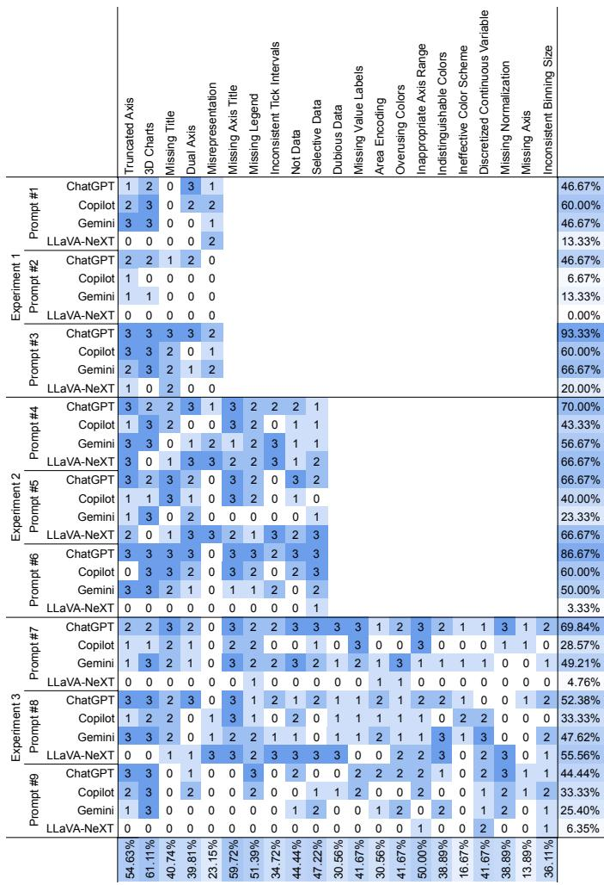
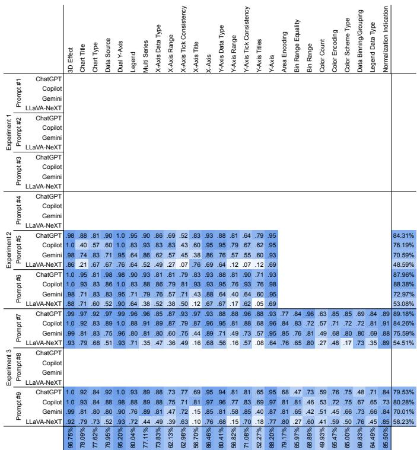

# How Good Or Bad Are LLMs at Detecting Misleading Visualizations?

Abstract—In this study, we address the growing issue of misleading charts, a prevalent problem that undermines the integrity of information dissemination. Misleading charts can distort the viewer’s perception of data, leading to misinterpretations and decisions based on false information. The development of effective automatic detection methods for misleading charts is an urgent field of research. The recent advancement of multimodal Large Language Models (LLMs) has introduced a promising direction for addressing this challenge. We explored the capabilities of these models in analyzing complex charts and assessing the impact of different prompting strategies on the models’ analyses. We utilized a dataset of misleading charts collected from the internet by prior research and crafted nine distinct prompts, ranging from simple to complex, to test the ability of four different multimodal LLMs in detecting over 21 different chart issues. Through three experiments–from initial exploration to detailed analysis–we progressively gained insights into how to effectively prompt LLMs to identify misleading charts and developed strategies to address the scalability challenges encountered as we expanded our detection range from the initial five issues to 21 issues in the final experiment. Our findings reveal that multimodal LLMs possess a strong capability for chart comprehension and critical thinking in data interpretation. There is significant potential in employing multimodal LLMs to counter misleading information by supporting critical thinking and enhancing visualization literacy. This study demonstrates the applicability of LLMs in addressing the pressing concern of misleading charts. 

Index Terms—Deceptive Visualization, Large Language Models, Prompt Engineering 

# 1 INTRODUCTION

Misleading visualizations have long been identified and included in public discourse. In the 1950s, Huff published How to Lie with Statistics [15], a book that surfaced the deceptive nature of poorly constructed charts with examples from newspapers. These charts manipulated the data’s visual representation to appear supportive of their intended claims. Recognizing these discrepancies is crucial when harnessing the power of data visualizations to inform rather than mislead. Education and critical scrutiny remain the most effective tools for identifying misleading visualizations [3, 8]. Conversely, developing automated tools to detect misleading charts represents a promising area of research. 

Recent advancements in the automatic detection of misleading visualizations have largely centered around visualization linters [7, 19, 27]. These tools scrutinize the structural programming of charts, identifying violations of established visualization guidelines. Designed to integrate with visualization authoring tools, they alert creators to the potential for misleading content in their charts before publication. Essentially, these innovations serve as a safeguard on the producer side. However, the challenge becomes more complex for data consumers, who frequently encounter visualizations in the form of unstructured bitmap images, often embellished with diverse styles and annotations. This variety poses significant challenges for automated systems, leading to a critical gap: the lack of tools to assist or safeguard the everyday consumers of data visualizations, mainly the general public. Bridging this gap is crucial, and we urgently need tools to enable data consumers to navigate and interpret data visualizations accurately. 

The recent development of Large Language Models (LLMs) [1] has opened up massive new opportunities, making it possible to tackle complex problems that were once impossible for computer algorithms to solve. Previous studies have already showcased the remarkable abilities of LLMs to reason logically and interpret data [11]. While these models were originally designed for processing and generating text, the introduction of multimodal LLMs has been a pivotal advancement [30] for visualization research. These multimodal models can understand 

different types of input, including images, significantly broadening the ways they can be used. This advancement in LLMs offers a promising approach to a crucial issue: detecting misleading charts from a consumer’s point of view. The capabilities of multimodal LLMs open up the possibility of creating tools that help people who use data visualizations to better navigate and comprehend visual information, filling a vital need in our digital world. 

Do multimodal LLMs possess the nuanced understanding required to identify and flag misleading elements in data visualizations? To explore this question, our study undertook a thorough assessment of three proprietary [29, 30, 35] and one open-source multimodal LLM [22]. Given that the effectiveness of LLMs is significantly shaped by the textual prompts fed them, our initial step was to conduct an exploratory experiment. This involved crafting three sets of prompts designed to guide the LLMs in recognizing five specific issues within charts. Pushing the boundaries further, our investigation expanded to assess the LLMs’ capabilities in handling an increasing complexity of problems, conducting further experiments that presented the models with charts containing 10 and then 21 different issues. 

One of the challenges we faced was the growing difficulty in scaling the number of issues for detection by the LLMs as we broadened the range of issues to be detected. As we expanded the scope, we inevitably had to increase the level of detail of descriptions and instructions, leading to longer prompts and responses. This escalation resulted in an increase in the length of both the prompts and the generated responses, presenting a significant challenge. Despite advancements that have expanded the context length LLMs can handle, the processing and generation of lengthy texts remains a computationally intensive and memory-demanding task. Utilizing the insights gained from our exploratory experiments, our ninth and final prompt was designed to guide the LLMs in detecting 21 different issues. Instead of designing a single prompt, our final attempt was to generate prompts dynamically, facilitated within a multi-round conversation setup. 

Our evaluation revealed the exceptional ability of multimodal LLMs to interpret charts presented as bitmap images. Following our instructions, these models demonstrated the capabilities of recognizing different chart elements, exercising critical thinking in data interpretation, and detecting a wide range of issues in misleading charts. Interestingly, LLMs consistently sought additional context for the charts, showcasing an innate caution that proved instrumental in uncovering issues like dubious data sources and concealed information. Their proficiency in detecting charts with fabricated data was particularly impressive–a 

challenge that goes beyond structural analysis to require a critical evaluation of the charts’ textual content. These findings showed multimodal LLMs’ sophisticated visual understanding and analytical capabilities, unveiling their potential as a powerful resource in creating effective systems for detecting misleading charts. 

In a short summary, we aim to provide a glimpse of the potential of utilizing multimodal LLMs to detect misleading visualizations. Throughout the study, we share the following results: 

1. Three experiments with a total of nine prompts across different prompting strategies covering up to 21 charting issues. 

2. Evaluation of the prompts on four different multimodal LLMs from proprietary companies and the open-source community. 

3. Findings on the challenges of applying LLMs to detecting prob lematic charts and the strengths and weaknesses of LLMs on similar applications. 

All the materials used in the experiments are publicly available on $\mathrm { O S F ^ { 1 } }$ . These include (1) datasets, (2) prompts, (3) program code, (4) conversation logs, and (5) experiment results. 

# 2 RELATED WORK

This work intersects four areas of research: (1) Misleading Visualizations, (2) Visualization Linters, (3) Chart Analysis with Computer Vision, and (4) Chart Question Answering with LLMs. 

# 2.1 Misleading Visualizations

The discourse on misleading visualizations dates back to the pre-digital era, notably beginning with Darrell Huff’s seminal work, How to Lie with Statistics [15], in the 1950s. In this book, Huff exposed the manipulative potential of data in journalism. Subsequently, in the book The Visual Display of Quantitative Information [36], Tufte introduced essential concepts like Graphical Integrity and Lie Factors, advancing the discussion on how visual data representations can distort the truth. More recently, Cairo’s How Charts Lie [6] offers a contemporary viewpoint on the issue, exploring the intricacies of recognizing dubious data sources and the malicious intentions behind visual designs, particularly in the digital media landscape. These publications provide a comprehensive foundation that informs our understanding of the complexities and ethical issues in data visualization. 

Recent academic research has significantly deepened our understanding of misleading visualizations, especially in today’s digital era, where misinformation can quickly proliferate online. Researchers like Pandey et al. [32] and Correll et al. [9] have revealed the subtle ways visualizations can be manipulated–for example, by truncating axes–to drastically alter data interpretation. This expanding body of research emphasizes the urgent need for vigilance in data presentation and perception. Further studies by Lee et al. [18] and Lisnic et al. [20] investigate how visualizations contribute to the spread of misinformation on social media and other platforms, underlining the extensive consequences of these deceptive techniques. In an effort to construct a taxonomy of these deceptions, Lo et al. [24] compiled a wide range of misleading visualizations from the internet, creating a detailed taxonomy with 74 unique issues. These academic contributions build upon the discussions initiated by early literature and highlight the continuous challenge and significance of devising methods to counter misinformation in data visualization. These works offer crucial insights into the mechanics of deceit and the essential role of integrity in data’s visual representation. 

Data visualization literacy and critical data thinking is an important topic in education. Chevalier et al. have highlighted the significance of embedding critical thinking within visualization literacy education, advocating for its introduction as early as elementary education [8]. This sentiment is echoed and expanded upon at the university level by Bergstrom and West. In their semester-long course, they instructed students to critically assess the data they encountered, especially through data visualizations. Their work has culminated in a comprehensive book on the subject [4]. In today’s data-driven world, the ability to critically evaluate and interpret information become an essential skill. 

Data plays a crucial role in decision-making, influencing policies, and shaping public opinion, highlighting the critical need for individuals to possess the skills to scrutinize data with skepticism and insight. It’s vital to embed critical data thinking within educational curricula and to develop and sharpen tools that enable the public to effectively engage with data visualizations. Such tools are essential in cultivating an informed society that approaches data visualizations with a critical eye, promoting a more nuanced and discerning consumption of information in our data-intensive reality. 

# 2.2 Visualization Linters

In the field of data visualization, significant progress has been made in creating automated systems that are designed to help chart creators produce visualizations that are clear and not misleading. Inspired by the concept of linters in computer programming—which detect potential errors in code to alert programmers about possible issues leading to incorrect or inefficient outcomes—these visualization linters are a step forward in ensuring the integrity of visual data representations. McNutt and Kindlmann introduced a linter for matplotlib, a popular charting library, implementing rules derived from the Algebraic Visualization Design (AVD) framework to improve the clarity and effectiveness of charts [27]. Similarly, VizLinter [7] uses Answer Set Programming (ASP) to analyze charts created with Vega-Lite, another popular charting library, by scrutinizing chart specifications with established best practices. Expanding the scope, GeoLinter [19] applies cartographic principles to map visualizations in Vega-Lite, ensuring that they are not misleading from a cartographic perspective. These tools highlight the research focus on the production side of data visualization, emphasizing tools that integrate seamlessly with visualization libraries to support chart creators. 

While existing research on automated detection systems has largely focused on aiding chart creators in the production process, there is a growing emphasis on empowering consumers to critically evaluate the accuracy and reliability of visual data presentations. Toward this end, Fan et al. have pioneered a system specifically for analyzing line charts in bitmap format [12]. This system begins with reverse engineering [33] the chart to extract visualization specifications from its bitmap image. It then compares these specifications against established best practices, alerting users to any discrepancies or violations directly on the chart image with overlays highlighting misleading aspects alongside corrected versions or annotations, facilitating a more informed interpretation of the data. Similarly, Hopkins et al. have introduced a visual interface that flags potential issues within charts, directing users’ attention to areas that might lead to misinterpretation [13]. Lo et al. analyzed and evaluated six different explanation strategies in explaining common charting issues to the general public [23]. These innovations are crucial for improving data literacy among visual data consumers, yet their success heavily relies on the accuracy of chart specification extraction. Even slight errors at this stage can compromise the system’s effectiveness, emphasizing the importance of precision in chart analysis and visualization reverse engineering. 

# 2.3 Chart Analysis with Computer Vision

Chart analysis is a fast-developing area within computer vision research focused on extracting data and facilitating question-answering through visual representations. An initial effort in this field is the creation of the FigureQA dataset, which includes over 100,000 chart images and more than one million binary yes-or-no question-answer pairs, serving as a critical benchmark for evaluating progress in chart analysis [17]. This initiative has encouraged further research, with projects expanding the dataset through synthesis or compilation of real-world charts, enriching the resources for development. Highlighting the community’s dedication to chart analysis, the annual Competition on Harvesting Raw Tables from Infographics [10], initiated by Davila et al., invites participants to complete seven complex chart analysis tasks. Together, these tasks form a pipeline that starts with identifying chart types from the chart image, then detecting text, classifying text roles, analyzing axes and legends, identifying plot elements, and finally extracting data. The competition, with its annotated dataset of over 

17,000 synthetic and 16,000 scientific journal-sourced chart images, continues to push the limits of computer vision in visualization reverse engineering, improving tools and techniques for machines to understand the vast information in data visualizations. 

Chart analysis research has rapidly expanded its scope to include sophisticated question-answering setups, moving from simple binary questions to complex open-ended queries that require mathematical reasoning [14]. This shift marks a substantial advancement in the ability to interpret nuanced data. During the research, numerous datasets were introduced for benchmarking [16, 26, 28]. A common approach to this challenge is treating chart question-answering similarly to table question-answering by extracting the underlying data from charts. This strategy utilizes advanced techniques developed for table questionanswering [26]. 

# 2.4 Chart Question Answering with LLMs

The integration of LLMs has further propelled these advancements, with initiatives like Matcha [21] applying LLMs on code generation to transform chart images back into program code and associated data tables for further processing. Similarly, UniChart’s [25] encoder-decoder framework demonstrates a versatile approach to chart question-answering, potentially bypassing the need for data table generation. These developments highlight a significant leap toward bridging visual data representations with actionable insights, showcasing the field’s progress toward more intuitive and effective data extraction and interpretation methods, thereby enhancing visualization tools for academic research and practical applications. 

Effective prompting is the key to successfully integrating LLMs into chart analysis. An advancement in this area was introduced by Marsh et al. [11]. The authors developed a prompt constructor module that effectively bridges the gap between the complex requirements of chart question-answering tasks and the operational capabilities of LLMs. This module translates these tasks into prompts that enable LLMs to generate relevant and precise outputs. With this strategic prompting mechanism, their system has achieved state-of-the-art results in the field. 

Our study builds on this foundation, utilizing multimodal LLMs to identify misleading elements in visual data presentations, a step forward in refining visual data analysis methods and exploring LLMs’ potential in mitigating misinformation spread through data visualizations. 

# 3 METHODOLOGY

Our experiments aim to explore the capabilities of multimodal LLMs in identifying misleading visualizations and distinguishing them from more specialized machine learning models. LLMs are known for their impressive ability to generalize and adapt to a wide range of tasks beyond their initial programming through methods like zero-shot, oneshot, or few-shot learning [2]. The ability of multimodal LLMs in chart understanding, critically assessing the deceptiveness of these visualizations, and the potential of applying multimodal LLMs in detecting misleading charts are unexplored. This investigation seeks to determine if such capacities exist and, if so, how crafting prompts alongside the chart images can effectively direct LLMs to produce the intended analytical outcomes. 

We began the investigation with an exploratory experiment, collecting various visualizations, including misleading and valid charts. The objective of the exploration phase is to establish a baseline for evaluating LLMs’ ability to distinguish between these two types of charts. Building upon the insights gained in the exploratory experiment, the second phase of the experiments sharpens the focus on enhancing and broadening the prompts to capture a wider range of chart issues. However, this expansion poses scalability challenges, particularly in managing the length of the prompts and also the length of the outputs from the LLMs, leading to degraded performance. To address these issues, the third phase investigates strategies to overcome these limitations, facilitating a more exhaustive examination of the 21 most common issues in charts. Each stage progressively deepens our understanding of multimodal LLMs’ analytical capabilities in detecting visual deceptions. 

Multimodal LLMs: Our experiments covered four distinct multimodal LLMs: (1) ChatGPT by OpenAI (gpt-4-1106-vision-preview) [30], (2) Copilot by Microsoft (model name not specified) [29], (3) Gemini by Google (gemini-pro-vision) [35], and (4) LLaVA-NeXT (llava-v1.6-mistral-7b-hf) [22]. ChatGPT, Copilot, and Gemini are developed by proprietary companies, whereas LLaVA-NeXT is an open-source multimodal LLM. Notably, at the time of our experiments, LLaVA-NeXT has achieved state-of-the-art results across various multimodal LLM benchmarks among open-source LLMs. Due to hardware constraints, our experiments were conducted with the 7B parameter variant of LLaVA-NeXT, despite the more advanced state-of-the-art 34B parameter model. Nevertheless, including LLaVA-NeXt in our evaluation covers an important landscape of LLM research. The LLaVA-NeXt model was run on a server with an Nvidia Titan RTX 24GB graphical processing unit. On the other hand, the proprietary models were evaluated via their Application Programming Interfaces (APIs). We have made the program code of the experiments publicly available on the $\mathrm { O S F ^ { 1 } }$ . 

Dataset: Our study compiled an evaluation dataset from previous research on misleading charts circulated on the internet [24]. The dataset was collected through search engines and social media. The chart images are annotated with the issues identified from the original web page or social media post. A total of 74 unique chart issues were identified in the study, providing a diverse sample of misleading charts that the general public may encounter. 

In the initial phase of our exploratory study, we focused on the five most frequently identified issues: (1) Truncated Axis, (2) 3D Chart, (3) Missing Title, (4) Dual Axis, and (5) Misrepresentation. We subsequently expanded to include the ten most common issues in Experiment Two by including (6) Missing Axis Title, (7) Missing Legend, (8) Inconsistent Tick Intervals, (9) Not Data, and (10) Selective Data. In the third experiment, the study was further broadened to cover up to 21 issues due to a tie for the 20th spot, with both the 20th and 21st issues appearing an equal number of 25 times in the dataset. These additional issues included (11) Dubious Data, (12) Missing Value Labels, (13) Area Encoding, (14) Overusing Colors, (15) Inappropriate Axis Range, (16) Indistinguishable Colors, (17) Ineffective Color Scheme, (18) Discretized Continuous Variable, (19) Missing Normalization, (20) Missing Axis, and (21) Inconsistent Binning Size. For each issue, we randomly sampled six images, dividing them equally into development and test sets, resulting in sets for evaluation across five $\left( \mathrm { N } { = } 3 0 \right)$ ), ten $\left( \mathrm { N } { = } 6 0 \right)$ ), and 21 issues $\left( \mathrm { N } { = } 1 2 6 \right)$ ). 

Moreover, we included a set of valid charts to evaluate if LLMs can distinguish between misleading and accurate representations. This valid set, randomly sampled from a collection by Brokin et al. [5], consisted of chart images from various sources, including news and governmental organizations. Through stratified sampling from this pool of 2,000 chart images–excluding infographics and charts with issues like missing titles or 3D effects–we assembled a valid chart set of 24 images. This set was evenly sampled from four sources, each contributing six images, and covered six different chart types, each represented by four images. This sampling method ensured wide coverage of sources and chart types, minimizing bias toward particular charting styles, data types, or chart types. Unlike the misleading chart set, which was expanded throughout the progression of our experiments, the valid chart set remained the same throughout the study. The valid set is divided evenly into development and test sets while maintaining its stratified property. 

For each of our experiments, we organized the datasets as follows: (1) for Experiment One, we had a total of 54 images $( N = 5 4 )$ ), with 27 in the development set $( N _ { d e \nu } = 2 7 _ { . }$ ) and 27 in the test set $( N _ { t e s t } = 2 7 $ ); (2) for Experiment Two, the total was 84 images $( N = 8 4$ ), split equally into 42 for development $N _ { d e \nu } = 4 2$ ) and 42 for testing $( N _ { t e s t } = 4 2$ ); and (3) for Experiment Three, we worked with 150 images $N = 1 5 0 $ ), divided into 75 for development $N _ { d e \nu } = 7 5$ ) and 75 for testing $( N _ { t e s t } = 7 5 )$ ). Unlike traditional machine learning models, our study lacked a training phase, hence the development set was used for creating prompts, and the test set was strictly for evaluation purposes. 

Evaluation Metrics: Throughout the various stages of our experi-

Table 1: Experiment One Results: Accuracy (Acc.) represents the ratio of correct answers to the total questions asked. The F1-score (F1) is the harmonic mean of Precision (Prec.) and Recall (Rec.). Across prompts, the models showed higher recall and lower precision, suggesting a tendency toward false positive In Prompt #2, Copilot chose 3 on a 5-point Likert scale in $78 \%$ of cases, with accurate scores in the remaining six cases (three misleading and three valid). Relevance (Rel.) is the percentage of relevant responses. An LLM’s response is considered as relevant if the chart issue is mentioned in the response through keyword matching.

<table><tr><td rowspan="2"></td><td colspan="5">ChatGPT</td><td colspan="5">Copilot</td><td colspan="5">Gemini</td><td colspan="5">LLaVA-NeXT-7B</td></tr><tr><td>Acc.</td><td>Prec.</td><td>Rec.</td><td>F1</td><td>Rel.</td><td>Acc.</td><td>Prec.</td><td>Rec.</td><td>F1</td><td>Rel.</td><td>Acc.</td><td>Prec.</td><td>Rec.</td><td>F1</td><td>Rel.</td><td>Acc.</td><td>Prec.</td><td>Rec.</td><td>F1</td><td>Rel.</td></tr><tr><td>Prompt #1</td><td>66.67%</td><td>0.63</td><td>1.00</td><td>0.77</td><td>46.67%</td><td>59.26%</td><td>0.58</td><td>1.00</td><td>0.73</td><td>60.00%</td><td>55.56%</td><td>0.56</td><td>1.00</td><td>0.71</td><td>46.67%</td><td>59.26%</td><td>0.58</td><td>1.00</td><td>0.73</td><td>13.33%</td></tr><tr><td>Prompt #2</td><td>40.74%</td><td>0.71</td><td>0.71</td><td>0.71</td><td>46.67%</td><td>22.22%</td><td>1.00</td><td>1.00*</td><td>1.00*</td><td>6.67%</td><td>55.56%</td><td>0.60</td><td>0.69</td><td>0.64</td><td>13.33%</td><td>40.74%</td><td>0.50</td><td>0.07</td><td>0.13</td><td>0.00%</td></tr><tr><td>Prompt #3</td><td>66.67%</td><td>0.63</td><td>1.00</td><td>0.77</td><td>93.33%</td><td>74.07%</td><td>0.72</td><td>0.87</td><td>0.79</td><td>60.00%</td><td>59.26%</td><td>0.60</td><td>0.80</td><td>0.69</td><td>66.67%</td><td>48.15%</td><td>0.52</td><td>0.80</td><td>0.63</td><td>20.00%</td></tr></table>

* In Prompt #2, Copilot responded "Neither" (Score: 3) for $78 \%$ of the test cases. 

ments, as we gained additional insights into the behavior of the LLMs, we fine-tuned our evaluation metrics accordingly. In the initial exploratory study, we employed accuracy and F1-score as indicators of classification performance, alongside keyword matching on the reported issues, to assess the relevance of the generated outputs. From Prompt #3 of Experiment One and after, we discovered that the LLMs consistently followed our naming of each issue. Therefore, exact matching is used in these experiments, and keyword matching is only used for Prompt #1 and Prompt $\# 2$ of Experiment One. If the chart issue is mentioned in the response, we consider the response as relevant, and vice versa. 

In order to process the LLM outputs, after each prompt, we fed the prompt and output as a conversation dialogue into the LLM and ask it to summarize the dialogue in JSON format. The reported results are based on this JSON instead of the free-formed responses. 

As we progressed to Experiment Two and Experiment Three, expanding the misleading charts set led to an imbalance between the number of misleading and valid charts. We recognized that accuracy was inadequate as a measure of performance. Consequently, we rely on the F1-score in Experiment Two and Experiment Three. Additionally, beginning with the third prompt, we introduced factual questions about the charts into our queries to the LLMs. This enabled us to directly measure the LLMs’ capabilities in chart comprehension. Therefore, we labeled these chart properties manually on all the 150 chart images and included factual correctness as a metric for evaluation in Experiment Two and Experiment Three. 

Overall, we conducted three experiments, each with a progressively larger set of issues to cover and posed different sets of challenges. We employed different prompting strategies in different stages to effectively instruct the LLMs to detect misleading visualizations. 

# 4 EXPERIMENT ONE: EXPLORATION PHASE

Our understanding of how to prompt multimodal LLMs to identify misleading charts—a task they have not previously encountered—is limited. Thus, we began our exploration with a straightforward prompt: “Does this chart depict data truthfully or misleadingly?”. Through this approach, we aim to incrementally gain insights into effectively interacting with LLMs for the purpose of developing an automated system capable of detecting misleading visualizations. 

To initiate this exploration, we started with a small set of misleading $( N _ { m i s l e a d i n g } = 3 0 $ ) and valid $( N _ { \nu a l i d } = 2 4 )$ charts divided equally into a development set and a test set. To analyze the results objectively, without relying on our interpretation of the text generated by the LLMs, we re-input the dialogues generated in response to each prompt back into the LLMs, requesting the LLMs to summarize the dialogue in JSON format. This method allows for a structured and unbiased analysis of the LLMs’ responses. 

In this preliminary experiment, we tested three types of prompts: (1) direct inquiry, (2) Likert scale assessment, and (3) Chain of Thought (CoT) reasoning [38]. We evaluated the outcomes based on accuracy, F1-score, and relevance of the responses generated by the models. 

Prompt #1 (Direct Ask): The initial prompt we experimented with was directly asking: “Does this chart depict data truthfully or misleadingly?” When applied through web user interfaces, the responses often elaborated on the characteristics of misleading visualizations and provided a checklist rather than offering a direct “truthful” or “misleading” 

answer. To guide the responses more effectively, we appended the instruction with “Answer ‘truthful’ or ‘misleading’. Name the issues and explain your answer.” following the initial question. After receiving each response, we formatted the question and response into a dialogue and requested that the LLMs summarize this dialogue in JSON format. An illustration of various prompts and responses from different LLMs is presented in Fig. 1. 

Results of Prompt #1: In the test set comprising 27 responses, most LLMs labeled the charts as “misleading,” resulting in high recalls and low precisions. ChatGPT showed a marginally better capability by correctly identifying three out of 12 valid charts. The issue of misrepresentation was the most commonly cited problem, with responses noting concerns such as “lack of scale consistency” and “disproportional representation.” Tab. 1 shows the results of Experiment One. 

Despite the tendency of LLMs to criticize charts excessively, the results were encouraging in terms of their ability to identify certain issues, such as the inappropriate use of 3D effects, dual axes, and truncated axes. On the other hand, the absence of titles on charts did not seem to be flagged as a problem by any of the LLM responses. While not directly misleading, the omission of a title results in a loss of context, rendering the chart less comprehensible. The concept of “lacking context” was, however, frequently mentioned in the feedback. Fig. 4 shows the summary of the issues recognized by the LLMs across different prompts. 

Prompt #2 (Likert Scale): Based on the findings of Prompt #1, we considered introducing more nuance to the responses using a 5-point Likert scale, where the midpoint represents insufficient information to make a definitive judgment. This adjustment allows the LLMs to provide answers that aren’t strictly “truthful” or “misleading.” We grouped their responses into three categories: scores of 1 or 2 as “truthful,” a score of 3 as “neither,” and scores of 4 or 5 as “misleading.” In addition to accuracy and the F1-score, it became necessary to track the proportion of responses categorized as “neither.” 

Results of Prompt #2: When utilizing this more nuanced prompt, all LLMs exhibited a decline in performance compared to the initial prompt, with the exception of Copilot, which achieved a perfect F1- score. Copilot’s responses were particularly notable, with 21 out of 27 categorized as “neither,” alongside three correctly identified as misleading and three as truthful. Despite this, the relevance of the responses to the specific issues present in the charts was minimal. Overall, using a Likert scale prompt did not effectively guide LLMs in pinpointing issues within charts. 

Prompt #3 (Chain of Thought): In the third prompt, we implemented the CoT prompting strategy, which encourages LLMs to undergo a reasoning process before delivering a definitive answer. This approach is inspired by the methodology that guides LLMs through a step-by-step analytical process, culminating in a reasoned conclusion [38]. 

The prompt was designed to inquire about critical aspects of potential charting issues, such as the presence of a title, the use of 3D effects, and whether the axis begins at zero, among others. Subsequently, we presented a set of guidelines and questioned whether the chart adhered to all these criteria. 

Results of Prompt #3: Despite the F1-scorefor this prompt being similar to those of the first prompt, there was a notable enhancement in the relevance of the responses. By providing clear instructions, the 

<table><tr><td rowspan="2" colspan="2">Chart Image / Prompts</td><td colspan="4">Multimodal Large Language Models</td></tr><tr><td>ChatGPT</td><td>Copilot</td><td>Gemini</td><td>LaVAs-NOXT</td></tr><tr><td>Chart Image</td><td>FEDERAL WELFARE RECEIVED IN U.S.
SOURCE: U.S. Census Survey
LIST TAYLOR HAMILTON OF HIS GOLD MEDLINE; NAS 651
mediamatters.org</td><td>Misleading.
This chart seems designed in a way that may exaggerate the growth in federal welfare received. The most significant issue is the y-axis, which does not start at zero. By starting at a number higher than zero (approximately 94 million in this case), the chart can make the increase appear much more dramatic than it actually is. In a more accurately represented graph, the bars would be less pronounced.
Additionally, the increments between the values on the y-axis are inconsistent, with some intervals representing a change of 1 million and others 2 million, which can further distort the perception of the data&#x27;s change over time.
To accurately represent the data, the y-axis should start at zero, or at the very least, use consistent increments to fairly depict the size of the changes over the quarters shown.</td><td>Misleading. The issues with this chart are that the y-axis does not start at zero, and the increments are inconsistent, which can exaggerate the perceived increase in federal welfare received.
This image shows a misleading representation of the increase in federal welfare received in the U.S., making it relevant for discussions on data visualization ethics.</td><td>misleading
The chart has a y-axis that starts at 94M instead of 0, making the changes in the data appear larger than they are.</td><td>The chart is in the middle &quot;FEDERAL WELFARE RECEIVED IN U.S.&quot; and it shows the number of Americans receiving federal welfare in millions. The chart is presented by Fox News, which is a news organization known for its conservative political stance.
The chart is misleading for several reasons:
1. Selective Time Period. The chart only shows data from 2009 to 2011, which is a relatively short period of time. It does not provide context for the overall trend or the reasons for the changes in welfare recipients during that time.
2. Lack of Context. The chart does not provide any information about the total population of the United States, the percentage of the population receiving welfare, or the reasons for the changes in welfare recipients. Without the context, it is difficult to understand the significance of the data.
3. Selective Data. The chart only shows data for three years (2009, 2010, and 2011), which may not be representative of the overall trend. It does not show data for the years before or after these years, which could provide a more comprehensive view of the trend.
4. Visual Manipulation. The chart uses a combination of red and gray bars, which can create a visual bias. The red bars are taller than the gray bars, which may lead viewers to perceive the red years as having higher welfare recipients than the gray years, even if the actual numbers are not significantly different.
5. Source Credibility. The source of the data is cited as the U.S. Census Bureau, but the specific data set or the methodology used to calculate figures is not provided. This lack of transparency can raise questions about the reliability of the data.
6. Political Bias. The chart is presented by Fox News, which is known for its conservative political stance. This could suggest that the chart is intended to support a particular political narrative, which may influence how the data is interpreted.
In conclusion, the chart is misleading because it presents a limited view of the data, lacks context, and may be influenced by political bias. It does not provide a comprehensive or accurate representation of the trend in federal welfare recipients in the United States.</td></tr><tr><td>Prompt #1</td><td>Does this chart depict data truthfully or misleadingly? Answer &quot;truthful&quot; or &quot;misleading&quot;. Name the issues and explain your answer.</td><td>To accurately represent the data, the y-axis should start at zero, or at the very least, use consistent increments to fairly depict the size of the changes over the quarters shown.</td><td>Score: 4
Issues:
- Lack of proper scaling. The y-axis does not start at 0, which can cause misrepresentations
- Insufficient labeling. The values of the y-axis increments are not clearly defined for all bars, making it difficult to ascertain the exact values.
- Data source and context: The source is identified as the U.S. Census Survey, but there&#x27;s no explanation of what measure of welfare is being used or the context for the data changes.
Explanation: The graph is given a score of 4 (Somewhat Misleading) because the scale of the y-axis does not start at zero, which is a common technique used to exaggerate differences in bar charts. This scaling can lead to misinterpretation of the actual difference and trends shown in the data, as the visual impact suggests more dramatic changes than the numbers may actually indicate.
Furthermore, the increments on the y-axis are not labeled consistently throughout, so the viewer cannot easily discern the exact numerical differences between the bars. Without clear information about what specific welfare measures are included and how they were calculated or the context for why these numbers have changed, the reader cannot fully understand what the graph is intended to convey.</td><td>Score: 4
Issues:
- &quot;Inconsistent y-axis scale**: The y-axis does not have a consistent scale, which can lead to misinterpretation of the data.
- &quot;Unclear data representation**: The bars appear to show a significant increase in federal welfare received over the quarters, but with a closer look, the difference in values on the y-axis is not proportional, leading to an exaggerated visual representation.
Explanation: The chart is rated as &quot;somewhat misleading&quot; due to the inconsistent scaling on the y-axis, which can lead to misinterpretation of the data. While the bars visually suggest a substantial increase in federal welfare received over the quarters, the difference in values on the y-axis is not proportional, resulting in an exaggerated representation. It&#x27;s essential to approach such charts with caution and critically evaluate the data presentation.</td><td>Score: 5
Issues:
1. The chart has a y-axis that starts at 94M instead of 0, exaggerating the changes in the data.
2. The chart shows absolute numbers. The increased number of people receiving welfare could be due to population growth, not necessarily a change in the percentage of people receiving welfare.
3. The chart does not provide enough information about the source of the data or the methodology used to collect it.
Explanation: The chart is highly misleading because it exaggerates the changes in the data, does not provide enough context, and does not provide enough information about the source of the data or the methodology used to collect it.
Explanation: The chart is presented in a straightforward manner, but it lacks context and information that would allow for a more accurate assessment of the data. The selective time frame could lead to a misleading interpretation of the trend in welfare recipients, as it does not show a comprehensive view of the issue. A description without more information, it is difficult to determine the accuracy of the data presented. The chart could be misleading if viewers do not understand the limitations of the data presented.</td></tr><tr><td>Prompt #2</td><td>Rate the chart in the image in a 5-point scale:
1. Highly Accurate: No risk of misunderstanding.
2. Accurate: Straightforward and minimal risk of incorrect conclusions.
3. Lacking Information: Not enough information to decide between accurate and misleading.
4. Somewhat Misleading: Misinterpretation possible without caution.
5. Highly Misleading: Likely to mislead or distort understanding.
Give a score, name the issues and explain your answer.
Answer in the following format:
Score: 1 to 5
Issues: a list of issues, if any
Explanation: why you gave the score you did</td><td>Score: 4
Issues:
- Lack of proper scaling. The y-axis does not start at 0, which can cause misrepresentations
- Insufficient labeling. The values of the y-axis increments are not clearly defined for all bars, making it difficult to ascertain the exact values.
- Data source and context: The source is identified as the U.S. Census Survey, but there&#x27;s no explanation of what measure of welfare is being used or the context for the data changes.
Explanation: The graph is given a score of 4 (Somewhat Misleading) because the scale of the y-axis does not start at zero, which is a common technique used to exaggerate differences in bar charts. This scaling can lead to misinterpretation of the actual difference and trends shown in the data, as the visual impact suggests more dramatic changes than the numbers may actually indicate.
Furthermore, the increments on the y-axis are not labeled consistently throughout, so the viewer cannot easily discern the exact value of the data. Without clear information about what specific welfare measures are included and how they were calculated or the context for why these numbers have changed, the reader cannot fully understand what the graph is intended to convey.</td><td>Score: 4
Issues:
- &quot;Inconsistent y-axis scale**: The y-axis does not have a consistent scale, which can lead to misinterpretation of the data.
- &quot;Unclear data representation**: The bars appear to show a significant increase in federal welfare received over the quarters, and the difference in values on the y-axis is not proportional, resulting in an exaggerated visual representation.
Explanation: The chart is rated as &quot;somewhat misleading&quot; due to the inconsistent scaling on the y-axis, which can lead to misinterpretation of the data. While the bars visually suggest a substantial increase in federal welfare received over the quarters, the difference in values on the y-axis is not proportional, resulting in an exaggerated visual representation. It&#x27;s essential to approach such charts with caution and critically evaluate the data presentation.</td><td>Score: 5
Issues:
1. The chart has a y-axis that starts at 94M instead of 0, exaggerating the changes in the data.
2. The chart shows absolute numbers. The increased number of people receiving welfare could be due to population growth, not necessarily a change in the percentage of people receiving welfare.
3. The chart does not provide enough information about the sources of the data or the methodology used to collect it.
Explanation: The chart is highly misleading because it exaggerates the changes in the data, does not provide enough context, and does not provide enough information about the source of the data or the methodology used to collect it.
Explanation: The chart is presented in a straightforward manner, but it lacks context and information that would allow for a more accurate assessment of the data. The selective time frame could lead to a misleading interpretation of the trend in welfare recipients. Additionally, the chart may not show a comprehensive view of the issue. A description without more information, it is difficult to determine the accuracy of the data presented. The chart could be misleading if viewers do not understand the limitations of the data presented.</td><td></td></tr><tr><td>Prompt #3</td><td>Answer the following questions regarding the chart in the image:
1. Does the chart have a title?
2. Is there a 3D effect applied to the chart?
3. Is it a bar chart? If yes, does the y-axis start at zero?
4. Is it a line chart? Does it have two y-axes?
5. Does the visual representation proportional to the data? Does visual representation align with data magnitude?
A chart should follow the following guidelines:
1. Chart Title: A chart should have a title.
2. No 3D: A chart should not have 3D effects.
3. No Truncated Axis: If the chart is a bar chart, it should start its y-axis at zero.
4. No Dual Axis: If the chart is a line chart, it should not have dual axis.
5. Draw To Scale: A chart should have its visual representation proportional to the depicting data.
Does the chart in the image meet all the above guidelines? If not, what information does it violate? Answer in the following format:
Met Guidelines: Yes/No
Issues: a list of violations, if any
Explanation: why the chart met or did not meet the guidelines</td><td>Met Guidelines: No
Issues:
Explanation: The chart does have a title, but the y-axis does not start at zero, which can cause misrepresentations
Explanation: The chart does not have a title, but the y-axis does not start at zero, which can cause misrepresentations
Explanation: The chart does not have a title, but the y-axis does not start at zero, which can cause misrepresentations
Explanation: The chart does not have a title, but the y-axis does not start at zero, which can cause misrepresentations
Explanation: The chart does not have a title, but the y-axis does not start at zero, which can cause mis Representations
Explanation: The chart does not have a title, but the y-axis does not start at zero, which can cause misrepresentations
Explanation: The chart does not have a title, but the y-axis does not start at zero, which can cause misrepresentations
Explanation: The chart does not have a title, but the y-axis does not start at zero, which can cause misrepresentations
Explanation: The chart does not have a title, but the y-axis does notstart at zero, which can cause misrepresentations
Explanation: The chart does not have a title, but the y-axis does not start at zero, which can cause misrepresentations
Explanation: The chart does not have a title, but the y-axis does not start at zero, which can cause misrepresentations
Explanation: The chart does not have a title, but the y-axis does not start at zero, which can cause misrepresentations
Explanation: The chart does not have atitle, but the y-axis does not start at zero, which can cause misrepresentations
Explanation: The chart does not have atitle, but the y-axis does not start at zero, which can cause misrepresentations
Explanation: The chart does not have atitle, but the y-axis does not start at zero, which can cause misrepresentations
Explanation: The chart does not have atitle, but the y-axis does not start at zero, which can cause misrepresentations
Explain: Why the chart met or did not meet the guidelines</td><td>In summary:
- &quot;No 3D Effect&quot;: &quot;The chart violates the 3D effect&quot;, which means &quot;the y-axis is not equal to 0&quot;. 
- &quot;No 3D Effect&quot;: &quot;The chart violates the 3D effect&quot;, which means &quot;the y-axis is not equal to 0&quot;. 
- &quot;No Truncated Axis&quot;: &quot;The chart does not have a title&quot;, which means &quot;the y-axis is not equal to 0&quot;. 
- &quot;Truncated Axis&quot;: &quot;The chart does not have a title&quot;, which means &quot;the y-axis is not equal to 0&quot;. 
- &quot;Truncated Y-axis&quot;: &quot;The chart does not have a title&quot;, which means &quot;the y-axis is not equal to 0&quot;. 
- &quot;Truncated Y-axis&quot; : &quot;The chart does not have a title&quot;, which means &quot;the y-axis is not equal to 0&quot;. 
- &quot;Truncated Y-axis&quot; : &quot;The chart does not have a title&quot;, which means &quot;the y-axis is not equal to 0&quot;. 
- &quot;Truncated Y-axis&quot; : &quot;The chart does not have a title&quot;, which means &quot;the y-axis is not equal to 0&quot;. 
- &quot;Truncated Y-axis&quot; : &quot;The chart does not havea title&quot;, which means &quot;the y-axis is not equal to 0&quot;. 
- &quot;Truncated Y-axis&quot; : &quot;The chart does not have a title&quot;, which means &quot;the y-axis is not equal to 0&quot;. 
- &quot;Truncated Y-axis&quot; : &quot;The chart does not have a title&quot;, which means &quot;the y-axis is not equal to 0&quot;. 
- &quot;Truncated Y-axis&quot; : &quot;The chart does not have a title&quot;, which means &quot;they-axis is not equal to 0&quot;. 
- &quot;Truncated Y-axis&quot; : &quot;The chart does not have a title&quot;, which means &quot;the y-axis is not equal to 0&quot;. 
- &quot;Truncated Y-axis&quot; : &quot;The chart does not have a title&quot;, which means &quot;the y-axis is not equal to 0&quot;. 
- &quot;Truncated Y-axis&quot; : &quot;The chart does not have a title&quot;, which means &quot;the y-axis is not equal to 1&quot;. 
- &quot;Truncated Y-axis&quot; : &quot;The chart does not have a title&quot;, which means &quot;the y-axis is not equal to 1&quot;. 
- &quot;Truncated Y-axis&quot; : &quot;The chart does not have a title&quot;, which means &quot;the y-axis is not equal to 1&quot;. 
- &quot;Truncated Y-axis&quot; : &quot;The chart does not have a title&quot;, which means &quot;the y-axis is not equal to 1&quot;. 
- &quot;TruncatedY-axis&quot; : &quot;The chart does not have a title&quot;, which means &quot;the y-axis is not equal to 1&quot;. 
- &quot;TruncatedY-axis&quot; : &quot;The chart does not have a title&quot;, which means &quot;the y-axis is not equal to 1&quot;. 
- &quot;TruncatedY-axis&quot; : &quot;The chart does not have a title&quot;, which means &quot;the y-axis is not equal to 1&quot;. 
- &quot;TruncatedY-axis&quot; : &quot;The chartdoes not have a title&quot;, which means &quot;the y-axis is not equal to 1&quot;. 
- &quot;TruncatedY-axis&quot; : &quot;The chart does not have a title&quot;, which means &quot;the y-axis is not equal to 1&quot;. 
- &quot;TruncatedY-axis&quot; : &quot;The chart does not have a title&quot;, which means &quot;the y-axis is not equal to 1&quot;. 
- &quot;TruncatedY-axis&quot; : &quot;The chart does not have a title&quot;, which meanis &quot;the y-axis is not equal to 1&quot;. 
- &quot;TruncatedY-axis&quot; : &quot;The chart does not have a title&quot;, which meanis &quot;the y-axis is not equal to 1&quot;. 
- &quot;TruncatedY-axis&quot; : &quot;The chart does not have a title&quot;, which meanis &quot;the y-axis is not equal to 1&quot;. 
- &quot;TruncatedY-axis&quot; : &quot;The chart does not have a title&quot;, which meanis &quot;the y axis is not equal to 1&quot;. 
- &quot;TruncatedY-axis&quot; : &quot;The chart does not have a title&quot;, which meanis &quot;the y-axis is not equal to 1&quot;. 
- &quot;TruncatedY-axis&quot; : &quot;The chart does not have a title&quot;, which meanis &quot;the y-axis is not equal to 1&quot;. 
- &quot;TruncatedY-axis&quot; : &quot;The chart does not have a title&quot;, which meanis &quot;the y-axis is not equal 0&quot;. 
- &quot;TruncatedY-axis&quot; : &quot;The chart does not have a title&quot;, which meanis &quot;the y-axis is not equal 0&quot;. 
- &quot;TruncatedY-axis&quot; : &quot;The chart does not have a title&quot;, which meanis &quot;the y-axis is not equal 0&quot;. 
- &quot;TruncatedY-axis&quot; : &quot;The chart does not have a title&quot;, which meanis &quot;the y-axis is not equal 0&quot;. 
- &quot;Truncated Y-axis&quot; : &quot;The chart does not have a title&quot;, which meanis &quot;the y-axis is not equal 0&quot;. 
- &quot;TruncatedY-axis&quot; : &quot;The chart does not have a title&quot;, which meanis &quot;the y-axis is not equal 0&quot;. 
- &quot;TruncatedY-axis&quot; : &quot;The chart does not have a title&quot;, which meanis &quot;the y-axis is not equal 0&quot;. 
- &quot;TruncatedY-axis&quot; : &quot;The chartdoes not have a title&quot;, which meanis &quot;the y-axis is not equal 0&quot;. 
- &quot;TruncatedY-axis&quot; : &quot;The chart does not have a title&quot;, which meanis &quot;the y-axis is not equal 0&quot;. 
- &quot;TruncatedY-axis&quot; : &quot;The chart does not have a title&quot;, which meanis &quot;the y-axis is not equal 0&quot;. 
- &quot;TruncatedY-axis&quot; : &quot;The chart does not have a title&quot;, whichmeanis &quot;the y-axis is not equal 0&quot;. 
- &quot;TruncatedY-axis&quot; : &quot;The chart does not have a title&quot;, whichmeanis &quot;the y-axis is not equal 0&quot;. 
- &quot;TruncatedY-axis&quot; : &quot;The chart does not have a title&quot;, whichmeanis &quot;the y-axis is not equal 0&quot;. 
- &quot;TruncatedY-axis&quot; : &quot;The chart does not have a title&quot;, whichmeanis &quot;the y-axis isnot equal 0&quot;. 
- &quot;TruncatedY-axis&quot; : &quot;The chart does not have a title&quot;, whichmeanis &quot;the y-axis is not equal 0&quot;. 
- &quot;TruncatedY-axis&quot; : &quot;The chart does not have a title&quot;, whichmeanis &quot;the y-axis is not equal 0&quot;. 
- &quot;TruncatedY-axis&quot; : &quot;The chart does not have a title&quot;, whichmeanis &quot;the y-axis is not equal 0&quot;. 
- “TruncatedY-axis” : &quot;The chart does not have a title&quot;, whichmeanis &quot;the y-axis is not equal 0&quot;. 
- &quot;TruncatedY-axis&quot; : &quot;The chart does not have a title&quot;, whichmeanis &quot;the y-axis is not equal 0&quot;. 
- &quot;TruncatedY-axis&quot; : &quot;The chart does not have a title&quot;, whichmeanis &quot;the y-axis is not equal 0&quot;. 
- &quot;TruncatedY-axis&quot; : &quot;The chart does nothave a title&quot;, whichmeanis &quot;the y-axis is not equal 0&quot;. 
- &quot;TruncatedY-axis&quot; : &quot;The chart does not have a title&quot;, whichmeanis &quot;the y-axis is not equal 0&quot;. 
- &quot;TruncatedY-axis&quot; : &quot;The chart does not have a title&quot;, whichmeanis &quot;the y-axis is not equal 0&quot;. 
- &quot;TruncatedY-axis&quot; : &quot;The chart does not have a title&quot;, whichmeanis&quot;the y-axis is not equal 0&quot;. 
- &quot;TruncatedY-axis&quot; : &quot;The chart does not have a title&quot;, whichmeanis &quot;the y-axis is not equal 0&quot;. 
- &quot;TruncatedY-axis&quot; : &quot;The chart does not have a title&quot;, whichmeanis &quot;the y-axis is not equal 0&quot;. 
- &quot;TruncatedY-axis&quot; : &quot;The chart does not have a title&quot;, whichmeanis &quot;the y-axis is not equal0&quot;. 
- &quot;TruncatedY-axis&quot; : &quot;The chart does not have a title&quot;, whichmeanis &quot;the y-axis is not equal 0&quot;. 
- &quot;TruncatedY-axis&quot; : &quot;The chart does not have a title&quot;, whichmeanis &quot;the y-axis is not equal 0&quot;. 
- &quot;TruncatedY-axis&quot; : &quot;The chart does not have a title&quot;, whichmeanis &quot;the y-axis is not equal 0&quot;. 
- &quot;Tr truncatedY-axis&quot; : &quot;The chart does not have a title&quot;, whichmeanis &quot;the y-axis is not equal 0&quot;. 
- &quot;Tr truncatedY-axis&quot; : &quot;The chart does not have a title&quot;, whichmeanis &quot;the y-axis is not equal 0&quot;. 
- &quot;Tr truncatedY-axis&quot; : &quot;The chart does not have a title&quot;, whichmeanis &quot;the y-axis is not equal 0&quot;. 
- &quot;Tr truncatedY-axis&quot; : &quot;Thechart does not have a title&quot;, whichmeanis &quot;the y-axis is not equal 0&quot;. 
- &quot;Tr truncatedY-axis&quot; : &quot;The chart does not have atitle&quot;, whichmeanis &quot;the y-axis is not equal 0&quot;. 
- &quot;Tr truncatedY-axis&quot; : &quot;The chart does not have atitle&quot;, whichmeanis &quot;the y-axis is not equal 0&quot;. 
- &quot;Tr truncatedY-axis&quot; : &quot;The chart does not have atitle&quot;, whichmeanis &quot;the y-axis is not equal 0&quot;. 
- &quot;Tr truncatedY-axis&quot; : &quot;The chart does not have atitle&quot;, whichmeanis &quot;they-axis is not equal 0&quot;. 
- &quot;Tr truncatedY-axis&quot; : &quot;The chart does not have atitle&quot;, whichmeanis &quot;the y-axis is not equal 0&quot;. 
- &quot;Tr truncatedY-axis&quot; : &quot;The chart does not have atitle&quot;, whichmeanis &quot;the y-axis is not equal 0&quot;. 
- &quot;Tr truncatedY-axis&quot; : &quot;The chart does not have atitle&quot;, whichmeanis &quot;the y-axis is not equal 0”. 
- &quot;Tr truncatedY-axis&quot; : &quot;The chart does not have atitle&quot;, whichmeanis &quot;the y-axis is not equal 0&quot;. 
- &quot;Tr truncatedY-axis&quot; : &quot;The chart does not have atitle&quot;, whichmeanis &quot;the y-axis is not equal 0&quot;. 
- &quot;Tr truncatedY-axis&quot; : &quot;The chart does not have atitle&quot;, whichmeanis &quot;the y-axis is not equal 0&quot;. 
- &quot;Tr truncatedY- axis&quot; : &quot;The chart does not have atitle&quot;, whichmeanis &quot;the y-axis is not equal 0&quot;. 
- &quot;Tr truncatedY-axis&quot; : &quot;The chart does not have atitle&quot;, whichmeanis &quot;the y-axis is not equal 0&quot;. 
- &quot;Tr truncatedY-axis&quot; : &quot;The chart does not have atitle&quot;, whichmeanis &quot;the y-axis is not equal 0&quot;. 
- &quot;Tr truncatedY-axis&quot; : &quot;The chart doesnot have atitle&quot;, whichmeanis &quot;the y-axis is not equal 0&quot;. 
- &quot;Tr truncatedY-axis&quot; : &quot;The chart does not have atitle&quot;, whichmeanis &quot;the y-axis is not equal 0&quot;. 
- &quot;Tr truncatedY-axis&quot; : &quot;The chart does not have atitle&quot;, whichmeanis &quot;the y-axis is not equal 0&quot;. 
- &quot;Tr truncatedY-axis&quot; : &quot;The chart does not have atitle&quot;, whichmean is &quot;the y-axis is not equal 0&quot;. 
- &quot;Tr truncatedY-axis&quot; : &quot;The chart does not have atitle&quot;, whichmeanis &quot;the y-axis is not equal 0&quot;. 
- &quot;Tr truncatedY-axis&quot; : &quot;The chart does not have atitle&quot;, whichmeanis &quot;the y-axis is not equal 0&quot;. 
- &quot;Tr truncatedY-axis&quot; : &quot;The chart does not have atitle&quot;, whichmeanis &quot;the y-axis is not equall to 0&quot;. 
- &quot;Tr truncatedY-axis&quot; : &quot;The chart does not have atitle&quot;, whichmeanis &quot;the y-axis is not equal 0&quot;. 
- &quot;Tr truncatedY-axis&quot; : &quot;The chart does not have atitle&quot;, whichmeanis &quot;the y-axis is not equal 0&quot;. 
- &quot;Tr truncatedY-axis&quot; : &quot;The chart does not have atitle&quot;, whichmeanis &quot;the y-axis is not equal 0&quot;. 
- &quot;Tn trancndY-axis&quot; : &quot;The chart does not have atitle&quot;, whichmeanis &quot;the y-axis is not equal 0&quot;. 
- &quot;Tn trancndY-axis&quot; : &quot;The chart does not have atitle&quot;, whichmeanis &quot;the y-axis is not equal 0&quot;. 
- &quot;Tn trancndY-axis&quot; : &quot;The chart does not have atitle&quot;, whichmeanis &quot;the y-axis is not equal 0&quot;. 
- &quot;TntrancndY-axis&quot; : &quot;The chart does not have atitle&quot;, whichmeanis &quot;the y-axis is not equal 0&quot;. 
- &quot;Tn trancndY-axis&quot; : &quot;The chart does not have atitle&quot;, whichmeanis &quot;the y-axis is not equal 0&quot;. 
- &quot;Tn trancndY-axis&quot; : &quot;The chart does not have atitle&quot;, whichmeanis &quot;the y-axis is not equal 0&quot;. 
- &quot;TrancndY-axis&quot; : &quot;The chart does not have atitle&quot;, whichmeanis &quot;the y-axis is not equal 0&quot;. 
- &quot;TrancndY-axis&quot; : &quot;The chart does not have atitle&quot;, whichmeanis &quot;the y-axis is not equal 0&quot;. 
- &quot;TrancndY-axis&quot; : &quot;The chart does not have atitle&quot;, whichmeanis &quot;the y-axis is not equal 0&quot;. 
- &quot;TrancndY- axis&quot; : &quot;The chart does not have atitle&quot;, whichmeanis &quot;the y-axis is not equal 0&quot;. 
- &quot;TrancndY-axis&quot; : &quot;The chart does not have atitle&quot;, whichmeanis &quot;the y-axis is not equal 0&quot;. 
- &quot;TrancndY-axis&quot; : &quot;The chart does not have atitle&quot;, whichmeanis &quot;the y-axis is not equal 0&quot;. 
- &quot;TrancndY-axis&quot; : &quot; The chart does not have atitle&quot;, whichmeanis &quot;the y-axis is not equal 0&quot;. 
- &quot;TrancndY-axis&quot; : &quot;The chart does not have atitle&quot;, whichmeanis &quot;the y-axis is not equal 0&quot;. 
- &quot;TrancndY-axis&quot; : &quot;The chart does not have atitle&quot;, whichmeanis &quot;the y-axis is not equal 0&quot;. 
- &quot;TrancndY-axis&quot; : &quot;The chart does nothave atitle&quot;, whichmeanis &quot;the y-axis is not equal 0&quot;. 
- &quot;TrancndY-axis&quot; : &quot;The chart does not have atitle&quot;, whichmeanis &quot;the y-axis is not equal 0&quot;. 
- &quot;TrancndY-axis&quot; : &quot;The chart does not have atitle&quot;, whichmeanis &quot;the y-axis is not equal 0&quot;. 
- &quot;TrancndY-axis&quot; : &quot;The chart does not have atitle&quot;,whichmeanis &quot;the y-axis is not equal 0&quot;. 
- &quot;TrancndY-axis&quot; : &quot;The chart does not have atitle&quot;, whichmeanis &quot;the y-axis is not equal 0&quot;. 
- &quot;TrancndY-axis&quot; : &quot;The chart does not have atitle&quot;, whichmeanis &quot;the y-axis is not equal 0&quot;. 
- &quot;TrancndY-axis&quot; : &quot;The chart does not have atitle&quot;, whichmeanis &quot;thely-axis is not equal 0&quot;. 
- &quot;TrancndY-axis&quot; : &quot;The chart does not have atitle&quot;, whichmeanis &quot;the y-axis is not equal 0&quot;. 
- &quot;TrancndY-axis&quot; : &quot;The chart does not have atitle&quot;, whichmeanis &quot;the y-axis is not equal 0&quot;. 
- &quot;TrancndY-axis&quot; : &quot;The chart does not have atitle&quot;, whichmeanis &quot;the y-axis is not equall to 0&quot;. 
- &quot;TrancndY-axis&quot; : &quot;The chart does not have atitle&quot;, whichmeanis &quot;the y-axis is not equal 0&quot;. 
- &quot;TrancndY-axis&quot; : &quot;The chart does not have atitle&quot;, whichmeanis &quot;the y-axis is not equal 0&quot;. 
- &quot;TrancndY-axis&quot; : &quot;The chart does not have atitle&quot;, whichmeanis &quot;the y-axis is not equal 0&quot;.</td><td></td><td></td></tr></table>

ns, and phrases in red indicate incorrect inter Thought strategy for a structured reasoning process with LLMs. The example chart has a major issue of truncated axis and a minor issue of 3D effects on the bars. Phrases in blue denote accurate Fig. 1: Experiment One Prompts: Prompt #1 directly asks if the chart is misleading or truthful. Prompt #2 requests a rating on a 5-point Likert scale, with 3 being neutral. Prompt #3 applies the Chain of 

Table 2: Experiment Two Results: The F1-score (F1), precision (Prec.), and recall (Rec.) assess the LLMs’ performance in an imbalanced setting $( N _ { m i s l e a d i n g } = 3 0 , N _ { \nu a l i d } = 1 2 )$ . Compared to Experiment One, the high-recall, low-precision situation has been improved but we are still observing large percentage of false positives. Relevance (Rel.) is the percentage of relevant responses. An LLM’s response is considered as relevant if the chart issue is reported as one of the pitfalls. Factual Correctness (Fact.) measures the percentage of correct answers to the factual questions about the chart, e.g., chart type, title, axis, scale, and encoding.

<table><tr><td rowspan="2"></td><td colspan="5">ChatGPT</td><td colspan="5">Copilot</td><td colspan="5">Gemini</td><td colspan="5">LLaVA-NeXT-7B</td></tr><tr><td>Prec.</td><td>Rec.</td><td>F1</td><td>Rel.</td><td>Fact.</td><td>Prec.</td><td>Rec.</td><td>F1</td><td>Rel.</td><td>Fact.</td><td>Prec.</td><td>Rec.</td><td>F1</td><td>Rel.</td><td>Fact.</td><td>Prec.</td><td>Rec.</td><td>F1</td><td>Rel.</td><td>Fact.</td></tr><tr><td>Prompt #4</td><td>0.81</td><td>0.83</td><td>0.82</td><td>70.00%</td><td>-</td><td>0.92</td><td>0.80</td><td>0.86</td><td>43.33%</td><td>-</td><td>0.92</td><td>0.73</td><td>0.81</td><td>56.67%</td><td>-</td><td>0.86</td><td>0.40</td><td>0.55</td><td>66.67%</td><td>-</td></tr><tr><td>Prompt #5</td><td>0.95</td><td>0.67</td><td>0.78</td><td>66.67%</td><td>84.31%</td><td>0.86</td><td>0.40</td><td>0.55</td><td>40.00%</td><td>76.19%</td><td>1.00</td><td>0.30</td><td>0.46</td><td>23.33%</td><td>70.59%</td><td>0.72</td><td>0.93</td><td>0.81</td><td>66.67%</td><td>48.73%</td></tr><tr><td>Prompt #6</td><td>0.94</td><td>0.53</td><td>0.68</td><td>86.67%</td><td>87.96%</td><td>0.92</td><td>0.73</td><td>0.81</td><td>60.00%</td><td>88.38%</td><td>1.00</td><td>0.33</td><td>0.50</td><td>50.00%</td><td>72.97%</td><td>0.00</td><td>0.00</td><td>0.00</td><td>3.33%</td><td>53.08%</td></tr></table>

LLMs were able to demonstrate an understanding of the charts and accurately identify issues as directed. This indicates that, with precise guidance, LLMs can effectively engage in the task of chart analysis. 

Discussion of Experiment One: In this exploratory experiment, we established an experimental setup to assess LLMs’ abilities in chart comprehension, critical thinking, and adherence to instructions. Traditional algorithmic detection systems often yield straightforward yesor-no answers. However, the LLM responses were notably non-binary. For example, in response to Prompt #2, “it depends” was a frequent reply. This tendency aligns with advancements in LLM training, particularly the emphasis on generating human-like responses through reinforcement learning based on human feedback [31]. A plausible reason for this pattern is the preference for “it depends” responses by human annotators over unequivocal but potentially incorrect answers. 

We introduced a checklist with issue names to reduce the ambiguity in parsing responses. For Prompts #1 and #2, keyword matching was employed to determine if the responses addressed the identified issues within the charts. By contrast, in Prompt #3, we provided a checklist, and the LLMs consistently used the specified terminology in their responses. This approach significantly clarified the evaluation of the responses’ relevance, making the results from Prompt #3 much clearer than those from the earlier prompts. 

For our subsequent experiment, rather than seeking a simple yes-orno verdict, we instructed the LLMs to categorize identified issues by their severity, including an option for inconclusive findings. 

# 5 EXPERIMENT TWO: CONSOLIDATION AND EXPANSION PHASE

In the first experiment, we derived three key insights regarding the efficacy of prompting LLMs to perform the task of detecting misleading charts: (1) posing factual questions and providing a checklist are beneficial, (2) LLMs tend to avoid giving definitive answers, and (3) LLMs followed our naming of the issues. 

In Experiment One, we found that the third prompt, which utilized the CoT strategy, was particularly effective in guiding LLMs to pinpoint issues in charts. While the CoT strategy has proven effective in previous studies [38], our construction of Prompt #3 included reasoning steps and a checklist of potential chart issues. We are interested in distinguishing between the impacts of the checklist and the CoT strategy. To explore this, Prompt #5 replicates the approach of Prompt #3, and Prompt #4 employs only a checklist, omitting the CoT reasoning steps. 

As the experiment progressed to include more issues, the length of prompts, incorporating extensive issue definitions and related factual questions, hinted at potential scalability challenges. Particularly, Prompt #5 revealed that posing numerous questions within a single prompt might lead LLMs to overlook earlier questions, focusing instead on the final checklist question only. To address this, Prompt #6 adopts a multi-pass conversation approach, dividing the extensive Prompt #5 into smaller prompts within a continuous dialogue format. This forces the LLMs to answer all the factual questions and reasoning steps before jumping to the checklist question to give the final answer. 

In the second experiment, we expanded the scope to include the ten most common issues, thereby enlarging the dataset of misleading charts. The dataset for this phase comprised 60 misleading charts with the same set of 24 valid charts in the first experiment. Both sets are evenly divided into development and testing sets. 

Given the dataset’s imbalance between misleading and valid charts, we determined that accuracy was inadequate and opted to rely on the 

F1-score instead. In Prompts #5 and #6, the LLMs were prompted to include the final judgment of chart issues and the answers to the factual questions. Therefore, for Prompts #5 and #6, we also evaluated the accuracy of responses to factual questions. Fig. 2 shows the prompts evaluated in Experiment Two. 

Prompt #4 (Checklist Only): We instructed LLMs to go through a checklist and categorize identified issues into three levels of concern: major, minor, and either potential or inconclusive pitfalls. 

Prompt #5 (Chain of Thought): The prompt was structured on top of the checklist in Prompt #4 in a tiered manner, divided into three segments. The first segment posed basic inquiries regarding the chart’s structure, including the type of chart, presence of 3D effects, axis, legends, and data source. The second tier involved more complex questions necessitating interpretation, such as determining the data type represented on the axis, the range of the axis, and whether the axis ticks were evenly spaced. Given the observed ability of LLMs to contextualize their analysis based on chart content, we investigated whether the information presented in the chart alone was sufficient for understanding, or if additional details such as a chart title or axis titles were necessary. The final set of questions, addressing the data directly, was the most intricate, probing whether the data might have been selectively chosen or fabricated. 

Prompt #6 (Split Chain of Thought): During the execution of Prompt #5, we noted instances where the LLMs’ generated responses either reached the output limit or the models bypassed the initial two sets of questions, opting to respond directly to the final checklist. To address this, we segmented the prompt into three parts, presenting them to the LLMs in successive rounds while incorporating the preceding dialogue. This method allowed for a more manageable and structured approach to eliciting detailed analyses from the LLMs. 

Experiment Two Results and Discussion In categorizing the responses, we classified charts as “misleading” if they presented at least one major issue; otherwise, they were deemed valid. The outcomes of Experiment Two are summarized in Tab. 2. While the three prompts yielded a similar F1-score, the quantity and relevance of the issues identified varied across different prompts. Specifically, LLMs reported a greater number of irrelevant issues when responding to the checklist in Prompt #4. In contrast, when engaging with the factual questions in Prompts #5 and #6, the incidence of reported issues decreased, yet the mention of relevant issues remained fairly consistent. Regarding these factual questions, the LLMs demonstrated a surprising ability to understand the charts, accurately answering questions about recognizing different chart components, and correctly interpreting scales and encodings. This was achieved without specific training or one-shot or few-shot demonstrations, relying solely on the instructions within the prompts, showcasing the LLMs’ impressive capacity for visual interpretation. Fig. 5 shows the results of the factual questions answered by the LLMs. 

An interesting discovery from this experiment was the LLMs’ ability to identify charts intended as parodies created with fictitious data rather than genuine information. Fig. 2 shows an example chart that was flagged as “Not Data,” with advisories against considering it as factual. 

During this experiment, it was noted that LLaVA-NeXT experienced issues with repetitive outputs, echoing certain sentences until they reached the maximum token count and terminated, leading to outputs that contained considerable repetitions. This significantly impacted its performance. Similarly, Gemini indicated errors suggesting that it faced issues with repetitions, too. To address these erratic responses, 

<table><tr><td>Chart Image</td><td>The Robofraud was UNPRECEDENTED
Until 2011, Rules were more obstructions of waterfall
waterfall in a Canadian Federal Election.</td><td>Summary:
- Major Pitfalls:
- Truncated Axis: ...
- Misrepresentation: ...
- Minor Pitfalls:
- Missing Axis Title: ...
- Inconsistent Tick Intervals: ...</td><td>Prompt #6 - 1</td><td>Answer the following questions regarding the chart structure:
1. Chart Title: Does the chart have a title?
2. Chart Type: What type is the chart? (Bar, Line, Pie, Area, Scatterplot, Choropleth, etc.)
3. Y-Axis: Does the chart have a y-axis?
[Skipped...] 
11. Data Source: Does the chart indicate the data source?</td><td>1. Chart Title: Yes, the chart has a title: &quot;The Robofraud was UNPRECEDENTED.&quot;
2. Chart Type: This is a bar chart.
3. Y-Axis: Yes, the chart has a y-axis.
[Skipped...] 
11. Data Source: Yes, the chart indicates &quot;DESIGN CREDIT: DANI VACHON&quot; in the lower right corner, which may refer to the designer rather than the data source. The data source itself is not specified within the information given.</td></tr><tr><td>Prompt #4</td><td>Following is the &quot;Common Pitfalls Checklist&quot; for data visualization. Go through the checklist and identify any pitfalls in the chart.
1. Missing Title: ...
2. Missing Axis Title: ...
3. Missing Legend: ...
4. Truncated Axis: ...
5. Dual Axis: ...
6. Inconsistent Tick Intervals: ...
7. 3D Charts: ...
8. Misrepresentation: ...
9. Selective Data: ...
10. Not Data: Check if the chart is not based on data but may be mistaken as such. This includes illustrative graphics or parodies intended for emphasis or fun that could be interpreted as representing factual data points.
Does the chart fall into any of these pitfalls? If yes, indicate which pitfall does this chart fall into in the following format:
Summary:
- Major Pitfalls: ...
- Minor Pitfalls: ...
- Potential or Inconclusive Pitfalls: ...</td><td>- Selective Data: ...
- Not Data: Given the source URL (SHITHARPERDID), there is a potential that this chart is satirical or not meant to be a factual representation of data, but rather an illustrative graphic intended for emphasis. Further investigation is needed to confirm whether this is meant to be taken as a presentation of actual data or as a parody.</td><td>Prompt #6 - 2</td><td>Answer the following questions about interpreting the chart:
1. Y-Axis Data Type: Identify the y-axis data type.
(Quantitative, Temporal, Nominal, Ordinal, Binned)
2. Y-Axis Range: Identify the start and end points of the y-axis.
3. Y-Axis Tick Consistency: Are y-axis ticks evenly spaced?
[Skipped...] 
13. Fictional Dataset: Is the chart depicting a dataset made up for fun or parody?</td><td>1. Y-Axis Data Type: ...
2. Y-Axis Range: ...
3. Y-Axis Tick Consistency: ...
[Skipped...] 
13. Fictional Dataset: The chart may be depicting a dataset made up for fun or parody, considering the source URL provided contains &quot;SHIT HARPER DID,&quot; which implies a political critique or satirical purpose. The choice of color, font, and labeling also suggests a non-serious tone.</td></tr><tr><td>Prompt #5</td><td>Answer the following questions regarding the chart structure:
1. Chart Title: ...
[Skipped...] 
11. Data Source: Does the chart indicate the data source?
Answer the following questions about interpreting the chart:
1. Y-Axis Data Type: ...
[Skipped...] 
14. Fictional Dataset: ...
Following is the &quot;Common Pitfalls Checklist&quot; for data visualization. Go through the checklist and identify any pitfalls in the chart.
1. Missing Title: ...
[Skipped...] 
10. Not Data: Check if the chart is not based on data but may be mistaken as such. This includes illustrative graphics or parodies intended for emphasis or fun that could be interpreted as representing factual data points.
Does the chart fall into any of these pitfalls? If yes, indicate which pitfall does this chart fall into in the following format:
Summary:
- Major Pitfalls: ...
- Minor Pitfalls: ...
- Potential or Inconclusive Pitfalls: ...</td><td>Chart Structure:
1. Chart Title: Yes, ...
[Skipped...] 
11. Data Source: Yes, there is a data source indicated at the bottom (&quot;DESIGN CREDIT: DANI VACHON&quot;).
Interpretation of the Chart:
1. Y-Axis Data Type: ...
[Skipped...] 
14. Fictional Dataset: The chart seems to illustrate a concept, potentially with humor or exaggeration, rather than depicting an actual dataset.
Common Pitfalls Checklist:
Summary:
- Major Pitfalls:
- Truncated Axis: ...
- Misrepresentation: ...
- Not Data: The chart may not be based on quantitative data but it is presented in a format that suggests it is data-driven.
- Minor Pitfalls:
- Missing Legend: ...
- Missing Axis Title: ...
- Inconsistent Tick Intervals: ...
- Potential or Inconclusive Pitfalls: 
- Selective Data: ...</td><td>Prompt #6 - 3</td><td>Following is the &quot;Common Pitfalls Checklist&quot; for data visualization. Go through the checklist and identify any pitfalls in the chart.
1. Missing Title: ...
2. Missing Axis Title: ...
3. Missing Legend: ...
[Skipped...] 
10. Not Data: Check if the chart is not based on data but may be mistaken as such. This includes illustrative graphics or parodies intended for emphasis or fun that could be interpreted as representing factual data points.
Does the chart fall into any of these pitfalls? If yes, indicate which pitfall does this chart fall into in the following format:
Summary:
- Major Pitfalls: ...
- Minor Pitfalls: ...
- Potential or Inconclusive PITfalls: ...</td><td>Summary:
- Major Pitfalls:
- Missing Axis Title: ...
- Misrepresentation: ...
- Selective Data: ...
- Not Data: The chart appears to be satirical or illustrative data rather than an accurate representation of data. It also references a URL that suggests it may be politically motivated or parodic.
- Minor Pitfalls:
- Missing Legend: ...
- Potential or Inconclusive Pitfalls:
- Truncated Axis: ...
- Inconsistent Tick Intervals: ...
- Dual Axis: ...</td></tr></table>

Fig. 2: Experiment Two Prompts: Prompt #4 poses a checklist for LLMs to go through. Prompt #5 applies the Chain of Thought strategy. Prompt #6 modifies Prompt #5 to prevent LLMs from bypassing reasoning questions. The example chart contains fictional data for parody purposes. Phrases in blue denote accurate interpretations. Portions of the prompt and responses are omitted for clarity.

we adjusted the temperature setting of Gemini, which, as per API documentation, influences the randomness of the response. In other cases, generating long outputs triggered the maximum token limitation and prematurely returned incomplete responses. We simply reran the experiment with the same prompt and image for these cases. 

Experiment Two highlighted a limitation of LLMs: as the number of issues to be detected increases, so does the length of the prompts. For LLMs with input length restrictions, this poses a scalability challenge. Additionally, more comprehensive prompts lead to longer responses, potentially exceeding the maximum response length the model can generate. For instance, the ChatGPT API has a limit of 5000 tokens, while Gemini’s limit is 2048 tokens on the newly generated text. The complexity of prompts also increases the likelihood of repetitive output issues. 

Addressing the prompt length constraint, we found that while the checklist in Prompt #4 was shorter, it also prompted LLMs to report more irrelevant issues. Conversely, Prompt #6 demonstrated a successful workaround, yielding relevant results and improved factual accuracy. 

# 6 EXPERIMENT THREE: TACKLING SCALABILITY ISSUES

In Experiment Two, expanding the scope to cover ten issues revealed challenges associated with lengthy prompts or responses, leading to premature termination and omission of reasoning questions. Additionally, despite LLMs correctly answering the factual questions in Experiment Two, they occasionally made contradictory decisions in their final assessments, such as noting a missing title but not recognizing it as an issue in their conclusive response. We incorporated more interpretive questions within the prompts to refine this aspect in Experiment Three. 

Prompt #7 (Split Chain of Thought): The initial layer consisted of basic factual inquiries, followed by a second layer examining data types, encoding, and scales, akin to the approach in Prompt #6. The third layer required LLMs to evaluate the chart more critically, considering the necessity of explicit titles and axes or the suitability of the axis range and color scheme. The strategy of segmenting prompts into multiple conversational passes proved effective in Experiment Two. Yet, as we sought to identify a broader range of 21 chart issues in Experiment Three, the length of each segmented prompt also increased considerably. The resulting full prompt comprises approximately 6,500 characters and totaling 1,550 tokens. Fig. 3 shows an example of Prompt #7. 

Prompt #8 (Direct JSON Output): Directly instructing LLMs to go through a checklist was deemed ineffective based on findings from Experiment Two. In Experiment Three, we tried to condense responses while maintaining the reasoning steps by instructing LLMs to produce a direct issue list in JSON format. 

Prompt #9 (Dynamic Chain of Thought): Another approach involved dynamically constructing split prompts based on LLM responses, starting with basic questions about chart properties and tailoring follow-up queries based on these initial answers. For instance, if an LLM identified a chart as a pie chart, subsequent questions about axis range or tick consistency were deemed irrelevant and omitted from the follow-up prompt. 

Experiment Three Results and Discussion: Prompt #8 encountered issues similar to those observed with Prompt #4, with a tendency to over-report issues in the charts. Specifically, when using Prompt #8, despite a high F1-score, Copilot identified major issues in 74 charts, deeming only one chart as valid, which was inaccurately classified as a false negative. The F1-score, generally appropriate for datasets with 

<table><tr><td colspan="2">Chart Image / Prompts</td><td>ChatGPT</td><td></td><td>Prompts</td><td>ChatGPT</td></tr><tr><td>Chart Image</td><td>Average Annual Global Temperature in Fahrenheit 1880-2015</td><td>1. Chart Title: Yes, the chart has a title: &quot;Average Annual Global Temperature in Fahrenheit 1880-2015.&quot;2. Chart Type: The chart is a line chart.3. Y-Axis: Yes, the chart has a y-axis.4. Dual Y-Axis: No, the chart does not appear to have two y-axes, only one is visible.5. Y-Axis Titles: The y-axis title is not directly visible, but it presumably represents temperature in Fahrenheit since that is mentioned in the title.6. X-Axis: Yes, the chart has an x-axis.7. X-Axis Title: The x-axis title is not explicitly given, but the axis is labeled with years, indicating it represents time from 1880 to 2015.8. Legend: No, the chart does not include a legend. However, since there appears to be only one data series, a legend may not be necessary.9. Multi Series: No, the chart does not depict more than one data series; there is only one line visible.10. 3D Effect: No, the chart does not indicate the data source on the visible part of the image.</td><td>Prompt #7 - 3</td><td>Answer the following questions about interpreting the chart:1. Chart Description: Describe the chart in the image.2. Data Description: Describe the data depicted in the chart.3. Insight: Describe the message that the chart delivers.4. Need Explicit Title: Is explicit title needed to comprehend the chart?5. Need Explicit Axis: Is explicit axis needed to comprehend the chart?6. Need Explicit Axis Title: Is explicit axis title needed to comprehend the chart?7. Need Explicit Value Labels: Are explicit value labels needed to comprehend the chart?8. Inappropriate Y-Axis Range: 1. Does the selection of y-axis range compress or stretch the visual impact of variations?9. Inappropriate X-Axis Range: 1. Does the selection of x-axis range compress or stretch the visual impact of variations?10. Binning: ...[Skipped...]21. Fictional Dataset: ...</td><td>1. Chart Description: The chart is a line chart that shows the average annual global temperature in Fahrenheit from 1880 to 2015. The temperature scale is on the y-axis, and the years are on the x-axis.2. Data Description: The data depicted in the chart shows a relatively flat line which suggests that the average global temperature has had little variation over the years from 1880 to 2015 according to this chart.3. Insight: The message that the chart aims to convey is the trend of average annual global temperatures over the specified period. However, due to the scale of the y-axis, any fluctuations or trends in temperature may be less visually pronounced.[Skipped...]8. Inappropriate Y-Axis Range: The selection of the y-axis range here seems to significantly compress the visual impact of variations in the temperature data.9. Inappropriate X-Axis Range: The selection of the x-axis range does not appear to stretch or compress the visual impact of variations; it displays the full range of years in question.[Skipped...]</td></tr><tr><td>Prompt #7 - 1</td><td>Answer the following questions regarding the chart structure:1. Chart Title: Does the chart have a title?2. Chart Type: What type is the chart? (Bar, Line, Pie, Area, Scatterplot, Choropleth, etc.)3. Y-Axis: Does the chart have a y-axis?4. Dual Y-Axis: Does the chart have two y-axis?5. Y-Axis Titles: What are the y-axis titles?6. X-Axis: Does the chart have an x-axis?7. X-Axis Title: What is the x-axis title?8. Legend: Does the chart include a legend?9. Multi Series: Does the chart depict more than one data series?10. 3D Effect: Is there a 3D effect applied to the chart?11. Data Source: Does the chart indicate the data source?</td><td>1. Y-Axis Data Type: The data type for the y-axis is quantitative, as it represents a measurable quantity, which in this case is temperature.2. Y-Axis Range: The start point on the y-axis appears to be around -10, and the end point is at 110. This is inferred from the visible axis, as the exact numbers are not fully visible.3. Y-Axis Tick Consistency: Yes, the y-axis ticks are evenly spaced.4. X-Axis Data Type: ...5. X-Axis Range: The start point on the x-axis is 1880 and the end point is 2015.[Skipped...]13. Bin Range: ...</td><td>Prompt #7 - 4</td><td>Following is the &quot;Common Pitfalls Checklist&quot; for data visualization. Go through the checklist and identify any pitfalls in the chart.1. Missing Title: ...2. Missing Axis Title: ...3. Missing Legend: ...[Skipped...]8. Inappropriate Axis Range: Check if the selected range for axes compresses or stretches the visual impact of variations.[Skipped...]21. Not Data: ...After all, indicate which pitfall does this chart fall into in the following format:Summary:- Major Pitfalls: ...- Minor Pitfalls: ...- Potential or Inconclusive Pitfalls:[Skipped...]</td><td>Summary:- Major Pitfalls:- Inappropriate Axis Range: The y-axis range seems to be inappropriate because it uses a scale that significantly compresses the variation in the data. The full range of the y-axis diminishes the visual impact of any fluctuations that might be present and could lead to a misinterpretation of the stability of global temperatures over time.- Minor Pitfalls:[Skipped...] - Potential or Inconclusive Pitfalls:[Skipped...]</td></tr><tr><td>Prompt #7 - 2</td><td>Answer the following questions regarding the data type, encoding and scale:1. Y-Axis Data Type: Identify the y-axis data type. (Quantitative, Temporal, Nominal, Ordinal, Binned)2. Y-Axis Range: Identify the start and end points of the y-axis.3. Y-Axis Tick Consistency: Are y-axis ticks evenly spaced?4. X-Axis Data Type: Identify the x-axis data type. (Quantitative, Temporal, Nominal, Ordinal, Binned)5. X-Axis Range: Identify the start and end points of the x-axis.[Skipped...]13. Bin Range: ...</td><td>1. Y-Axis Data Type: The data type for the y-axis is quantitative, as it represents a measurable quantity, which in this case is temperature.2. Y-Axis Range: The start point on the y-axis appears to be around -10, and the end point is at 110. This is inferred from the visible axis, as the exact numbers are not fully visible.3. Y-Axis Tick Consistency: Yes, the y-axis ticks are equally spaced.4. X-Axis Data Type: ...5. X-Axis Range: The start point on the x-axis is 1880 and the end point is 2015.[Skipped...]13. Bin Range: ...</td><td>Prompt #7 - 4</td><td>Following is the &quot;Common Pitfalls Checklist&quot; for data visualization. Go through the checklist and identify any pitfalls in the chart.1. Missing Title: ...2. Missing Axis Title: ...3.Missing Legend: ...[Skipped...]8. Inappropriate Axis Range: Check if the selected range for axes compresses or stretches the visual impact of variations.[Skipped...]21. Not Data: ...After all, indicate which pitfall does this chart fall into in the following format:Summary:- Major Pitfalls: ...- Minor Pitfalls: ...- Potential or Inconclusive Pitfalls: ...</td><td>Summary:- Major Pitfalls:- Inappropriate Axis Range: The y-axis range seems to be inappropriate because it uses a scale that significantly compresses the variation in the data. The full range of the y-axis diminishes the visual impact of any fluctuations that might be present and could lead to a misinterpretation of the stability of global temperatures over time.- Minor Pitfalls:[Skipped...] - Potential or Inconclusive Pitfalls:[Skipped...]</td></tr></table>

Fig. 3: Experiment Three Prompt #7 extends Prompt #6 in applying the Chain of Thought strategy to include additional chart issue definitions. The example chart has a major issue of setting the y-axis range inappropriately. Phrases in blue denote accurate interpretations. Portions of the prompt and responses are omitted for clarity. 

an imbalance between categories, was utilized for evaluation. The test dataset for this phase included 63 misleading charts and 12 valid charts. Other than prompt #8, both prompts #7 and #9 showed more balanced performance, correctly identifying valid charts (true negatives) and accurately highlighting issues in misleading charts (true positives). Tab. 3 shows the results of Experiment Three. 

Prompt #9, designed to reduce the number of excessively reported issues by filtering the checklist based on factual responses provided earlier in the conversation, reported fewer issues. However, its relevance score decreased compared to Prompt #7, which did not implement any filtering mechanism. 

LLaVA-NeXT encountered significant difficulties with Prompts #7 and #9, as well as with Prompt #6 from Experiment Two, suggesting it may struggle with multi-pass prompts. This issue might stem from its smaller model size of 7B parameters instead of a larger 34B parameter model. Our current hardware constraints prevent us from testing the larger model, presenting a challenge for future evaluations of opensource models. 

# 7 DISCUSSION

LLMs demonstrated capabilities in chart comprehension. Given that the LLMs we assessed were not specifically trained to identify issues in charts, their performance exceeded our initial expectations. This was particularly notable in their ability to analyze images (a task generally reserved for computer vision systems) and their comprehension of textual content within those images. As shown in Fig. 5, LLMs accurately answered most questions regarding chart properties such as chart type, data type, data encoding, titles, and the use of 3D effects. However, they encountered difficulties with questions related to color 

counting and tick consistency checking, which is a known weakness in LLMs [39]. Consequently, as illustrated in Fig. 4, LLMs performed less effectively on chart issues related to colors or inconsistencies in the taxonomy [24], including overusing colors, indistinguishable colors, ineffective color schemes, and inconsistent tick intervals. On the other hand, it was surprising to see that these models are capable of differentiating between fictional and factual data, especially since such discernment is challenging for rule-based algorithmic detection systems. This capability was demonstrated in the identification of “not data” charts, where LLMs had shown a robust understanding of charts and accurately reported the clues of fictional data in the images. 

Chain of Thought is the most effective prompting strategy in our experiments. Over the course of the three experiments, we explored various prompting strategies to optimize LLM performance. The intermediate output aided the model in building an understanding of complex misleading elements from simple chart properties. The concept of misrepresentation is challenging due to the logical dissonance of graphical integrity–the chart’s geometry not reflecting the textual information on the chart. 

The CoT strategy emerged as the most effective, yet as we expanded the range of issues for detection, the prompts’ length increased significantly. To address this, we tested three alternative strategies: (1) dividing the prompt into a conversational format, (2) incorporating reasoning steps without explicitly including them in the output, and (3) dynamically generating prompts based on previous responses. Our findings indicated that Prompts #4 and #8, which did not include reasoning steps in the output, led to over-reporting issues. Based on our experiments, Prompt #7 was identified as the most effective. However, expanding the scope to encompass more issues poses a challenge, as 

Table 3: Experiment Three Results: The F1-score (F1), precision (Prec.), and recall (Rec.) assess the LLMs’ performance in an imbalanced setting $( N _ { m i s l e a d i n g } = 6 3 , N _ { \nu a l i d } = 1 2 )$ . Relevance (Rel.) is the percentage of relevant responses. An LLM’s response is considered as relevant if the chart issue is reported as one of the pitfalls. Factual Correctness (Fact.) measures the percentage of correct answers to the factual questions about the chart, e.g., chart type, title, axis, scale, and encoding. It does not apply to Prompt #8 since it instructed LLMs to reply only to the summary question.

<table><tr><td rowspan="2"></td><td colspan="5">ChatGPT</td><td colspan="5">Copilot</td><td colspan="5">Gemini</td><td colspan="5">LLaVA-NeXT-7B</td></tr><tr><td>Prec.</td><td>Rec.</td><td>F1</td><td>Rel.</td><td>Fact.</td><td>Prec.</td><td>Rec.</td><td>F1</td><td>Rel.</td><td>Fact.</td><td>Prec.</td><td>Rec.</td><td>F1</td><td>Rel.</td><td>Fact.</td><td>Prec.</td><td>Rec.</td><td>F1</td><td>Rel.</td><td>Fact.</td></tr><tr><td>Prompt #7</td><td>0.98</td><td>0.67</td><td>0.79</td><td>69.84%</td><td>88.59%</td><td>1.00</td><td>0.41</td><td>0.58</td><td>28.57%</td><td>83.70%</td><td>0.94</td><td>0.52</td><td>0.67</td><td>49.21%</td><td>75.75%</td><td>1.00</td><td>0.02</td><td>0.03</td><td>4.76%</td><td>55.26%</td></tr><tr><td>Prompt #8</td><td>0.86</td><td>0.89</td><td>0.88</td><td>52.38%</td><td>-</td><td>0.84</td><td>0.98</td><td>0.91*</td><td>33.33%</td><td>-</td><td>0.93</td><td>0.41</td><td>0.57</td><td>47.62%</td><td>-</td><td>0.83</td><td>0.40</td><td>0.54</td><td>55.56%</td><td>-</td></tr><tr><td>Prompt #9</td><td>0.91</td><td>0.48</td><td>0.62</td><td>44.44%</td><td>79.45%</td><td>0.92</td><td>0.38</td><td>0.54</td><td>33.33%</td><td>81.13%</td><td>0.95</td><td>0.60</td><td>0.74</td><td>25.40%</td><td>72.13%</td><td>0.83</td><td>0.08</td><td>0.14</td><td>6.35%</td><td>60.02%</td></tr></table>

* In Prompt #8, Copilot responded "Misleading" $\#$ of Major Issues $\geq 1$ ) for $9 9 \%$ of the test cases. 

Fig. 4: Issues detected by LLMs across different prompts, each issue appeared three times in the test set. Edge numbers indicate the correct identification percentage for each row or column.

it would significantly increase the prompt’s length and complexity, potentially leading to lengthy response times and extensive outputs. 

To address the scalability issue, alternative approaches should be considered. Leveraging the LLMs’ ability to generate [11] or retrieve prompts [34] from a prompt pool according to the input chart image and the conversational contexts could reduce prompt size while maintaining relevance. The prompt pool could be built from an example dataset synthesized from previous work on taxonomy [24] and visualization guidelines derived from different visualization linters [7, 27]. 

Recent developments in prompt engineering include the agentic approach. The mixture of agents (MoA) approach–utilizing multiple LLMs (with homogeneous or heterogeneous weights), each taking different roles in a conversation–has demonstrated improvement over the Chain of Thought approach [37]. Our experiments demonstrated consistent chart comprehension capabilities across different LLMs. Applying the MoA and retrieval-based approaches may be promising next steps. 

Fig. 5: Percentage of factual questions accurately answered by LLMs on chart properties, axes, scale, and encoding. Edge numbers indicate the correct answer percentage for each row or column.

A benchmark dataset is urgently needed. Our evaluation efforts were limited by two main factors: (1) the absence of a benchmark dataset and (2) the need for refined evaluation metrics. Although prior research has addressed the detection of misleading charts, there lacks a shared dataset and metrics for benchmarking purposes. Consequently, we compiled our dataset of misleading and valid charts from existing studies on using visualizations on the internet. This study serves as a foundation for subsequent research, facilitating comparison and overcoming the obstacles identified in our three experiments. 

# 8 CONCLUSION

In this research, we explored the application of multimodal LLMs to the challenge of automatically detecting misleading charts. Through a series of three experiments, which progressed from an initial set of five types of issues to an eventual examination of 21 issues, we identified effective strategies for prompting multimodal LLMs. This progression allowed us to refine our approach and understand the nuances of utilizing LLMs for this specific task. Each experiment contributed to a deeper understanding of how LLMs interpret and analyze charts and data, revealing both the capabilities and limitations of these models in the context of misleading visualizations. Our findings unveil the potential and capabilities of LLMs in augmenting traditional methods for chart analysis and identifying misleading elements in charts. The significant development of LLMs provides a promising direction for further research in developing tools to support critical thinking on data interpretation and visualizations. 

[1] J. Achiam, S. Adler, S. Agarwal, L. Ahmad, I. Akkaya, F. L. Aleman, D. Almeida, J. Altenschmidt, S. Altman, S. Anadkat, et al. Gpt-4 technical report. arXiv preprint arXiv:2303.08774, 2023. 1 

[2] I. Beltagy, A. Cohan, R. Logan IV, S. Min, and S. Singh. Zero-and few-shot nlp with pretrained language models. In Proceedings of the 60th Annual Meeting of the Association for Computational Linguistics: Tutorial Abstracts, pp. 32–37, 2022. 3 

[3] C. T. Bergstrom and J. West. Calling bullshit in the age of big data. Calling Bullshits. Data Reasoning in a Digital World. Available online at: http://callingbullshit.org, 2017. 1 

[4] C. T. Bergstrom and J. D. West. Calling bullshit: The art of skepticism in a data-driven world. Random House Trade Paperbacks, 2021. 2 

[5] M. A. Borkin, A. A. Vo, Z. Bylinskii, P. Isola, S. Sunkavalli, A. Oliva, and H. Pfister. What makes a visualization memorable? IEEE Transactions on Visualization and Computer Graphics, 19(12):2306–2315, 2013. 3 

[6] A. Cairo. How Charts Lie: Getting Smarter about Visual Information. WW Norton & Company, 2019. 2 

[7] Q. Chen, F. Sun, X. Xu, Z. Chen, J. Wang, and N. Cao. Vizlinter: A linter and fixer framework for data visualization. IEEE Transactions on Visualization and Computer Graphics, 28(1):206–216, 2021. 1, 2, 9 

[8] F. Chevalier, N. H. Riche, B. Alper, C. Plaisant, J. Boy, and N. Elmqvist. Observations and reflections on visualization literacy in elementary school. IEEE Computer Graphics and Applications, 38(3):21–29, 2018. 1, 2 

[9] M. Correll, E. Bertini, and S. Franconeri. Truncating the y-axis: Threat or menace? In Proceedings of the 2020 CHI Conference on Human Factors in Computing Systems, pp. 1–12, 2020. 2 

[10] K. Davila, B. U. Kota, S. Setlur, V. Govindaraju, C. Tensmeyer, S. Shekhar, and R. Chaudhry. Icdar 2019 competition on harvesting raw tables from infographics (chart-infographics). In 2019 International Conference on Document Analysis and Recognition (ICDAR), pp. 1594–1599. IEEE, 2019. 2 

[11] X. L. Do, M. Hassanpour, A. Masry, P. Kavehzadeh, E. Hoque, and S. Joty. Do llms work on charts? designing few-shot prompts for chart question answering and summarization. arXiv preprint arXiv:2312.10610, 2023. 1, 3, 9 

[12] A. Fan, Y. Ma, M. Mancenido, and R. Maciejewski. Annotating line charts for addressing deception. In Proceedings of the 2022 CHI Conference on Human Factors in Computing Systems, pp. 1–12, 2022. 2 

[13] A. K. Hopkins, M. Correll, and A. Satyanarayan. Visualint: Sketchy in situ annotations of chart construction errors. In Computer Graphics Forum, vol. 39, pp. 219–228. Wiley Online Library, 2020. 2 

[14] E. Hoque, P. Kavehzadeh, and A. Masry. Chart question answering: State of the art and future directions. In Computer Graphics Forum, vol. 41, pp. 555–572. Wiley Online Library, 2022. 3 

[15] D. Huff. How to lie with statistics. WW Norton & Company, 1954. 1, 2 

[16] K. Kafle, B. Price, S. Cohen, and C. Kanan. Dvqa: Understanding data visualizations via question answering. In Proceedings of the IEEE conference on computer vision and pattern recognition, pp. 5648–5656, 2018. 3 

[17] S. E. Kahou, V. Michalski, A. Atkinson, Á. Kádár, A. Trischler, and Y. Bengio. Figureqa: An annotated figure dataset for visual reasoning. arXiv preprint arXiv:1710.07300, 2017. 2 

[18] C. Lee, T. Yang, G. D. Inchoco, G. M. Jones, and A. Satyanarayan. Viral visualizations: How coronavirus skeptics use orthodox data practices to promote unorthodox science online. In Proceedings of the 2021 CHI Conference on Human Factors in Computing Systems, pp. 1–18, 2021. 2 

[19] F. Lei, A. Fan, A. M. MacEachren, and R. Maciejewski. Geolinter: A linting framework for choropleth maps. IEEE Transactions on Visualization and Computer Graphics, 2023. 1, 2 

[20] M. Lisnic, C. Polychronis, A. Lex, and M. Kogan. Misleading beyond visual tricks: How people actually lie with charts. In Proceedings of the 2023 CHI Conference on Human Factors in Computing Systems, pp. 1–21, 2023. 2 

[21] F. Liu, F. Piccinno, S. Krichene, C. Pang, K. Lee, M. Joshi, Y. Altun, N. Collier, and J. M. Eisenschlos. Matcha: Enhancing visual language pretraining with math reasoning and chart derendering. arXiv preprint arXiv:2212.09662, 2022. 3 

[22] H. Liu, C. Li, Y. Li, B. Li, Y. Zhang, S. Shen, and Y. J. Lee. Llava-next: Improved reasoning, ocr, and world knowledge, January 2024. 1, 3 

[23] L. Y.-H. Lo, Y. Cao, L. Yang, and H. Qu. Why change my design: Explaining poorly constructed visualization designs with explorable explanations. IEEE Transactions on Visualization and Computer Graphics, 2023. 2 

[24] L. Y.-H. Lo, A. Gupta, K. Shigyo, A. Wu, E. Bertini, and H. Qu. Misinformed by visualization: What do we learn from misinformative visualizations? In Computer Graphics Forum, vol. 41, pp. 515–525. Wiley Online Library, 2022. 2, 3, 8, 9 

[25] A. Masry, P. Kavehzadeh, X. L. Do, E. Hoque, and S. Joty. Unichart: A universal vision-language pretrained model for chart comprehension and reasoning. arXiv preprint arXiv:2305.14761, 2023. 3 

[26] A. Masry, D. X. Long, J. Q. Tan, S. Joty, and E. Hoque. Chartqa: A benchmark for question answering about charts with visual and logical reasoning. arXiv preprint arXiv:2203.10244, 2022. 3 

[27] A. McNutt and G. Kindlmann. Linting for visualization: Towards a practical automated visualization guidance system. In VisGuides: 2nd Workshop on the Creation, Curation, Critique and Conditioning of Principles and Guidelines in Visualization, 2018. 1, 2, 9 

[28] N. Methani, P. Ganguly, M. M. Khapra, and P. Kumar. Plotqa: Reasoning over scientific plots. In Proceedings of the IEEE/CVF Winter Conference on Applications of Computer Vision, pp. 1527–1536, 2020. 3 

[29] Microsoft. Microsoft copilot in bing. https://www.bing.com/chat. Accessed: 31-3-2024. 1, 3 

[30] OpenAI. Gpt-4v(ision) system card. https://cdn.openai.com/ papers/GPTV_System_Card.pdf. Accessed: 31-3-2024. 1, 3 

[31] L. Ouyang, J. Wu, X. Jiang, D. Almeida, C. Wainwright, P. Mishkin, C. Zhang, S. Agarwal, K. Slama, A. Ray, et al. Training language models to follow instructions with human feedback. Advances in Neural Information Processing Systems, 35:27730–27744, 2022. 6 

[32] A. V. Pandey, K. Rall, M. L. Satterthwaite, O. Nov, and E. Bertini. How deceptive are deceptive visualizations? an empirical analysis of common distortion techniques. In Proceedings of the 2015 CHI Conference on Human Factors in Computing Systems, pp. 1469–1478, 2015. 2 

[33] J. Poco and J. Heer. Reverse-engineering visualizations: Recovering visual encodings from chart images. In Computer Graphics Forum, vol. 36, pp. 353–363. Wiley Online Library, 2017. 2 

[34] O. Rubin, J. Herzig, and J. Berant. Learning to retrieve prompts for incontext learning. In Proceedings of the 2022 Conference of the North American Chapter of the Association for Computational Linguistics: Human Language Technologies, pp. 2655–2671, 2022. 9 

[35] G. Team, R. Anil, S. Borgeaud, Y. Wu, J.-B. Alayrac, J. Yu, R. Soricut, J. Schalkwyk, A. M. Dai, A. Hauth, et al. Gemini: a family of highly capable multimodal models. arXiv preprint arXiv:2312.11805, 2023. 1, 3 

[36] E. R. Tufte and P. R. Graves-Morris. The visual display of quantitative information. Graphics press Cheshire, CT, 1983. 2 

[37] J. Wang, J. Wang, B. Athiwaratkun, C. Zhang, and J. Zou. Mixtureof-agents enhances large language model capabilities. arXiv preprint arXiv:2406.04692, 2024. 9 

[38] J. Wei, X. Wang, D. Schuurmans, M. Bosma, F. Xia, E. Chi, Q. V. Le, D. Zhou, et al. Chain-of-thought prompting elicits reasoning in large language models. Advances in neural information processing systems, 35:24824–24837, 2022. 4, 6 

[39] Z. Yang, L. Li, K. Lin, J. Wang, C.-C. Lin, Z. Liu, and L. Wang. The dawn of lmms: Preliminary explorations with gpt-4v (ision). arXiv preprint arXiv:2309.17421, 9(1):1, 2023. 8 

