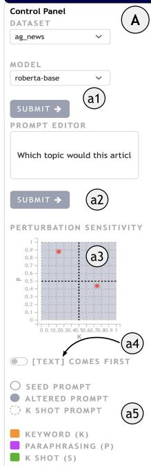
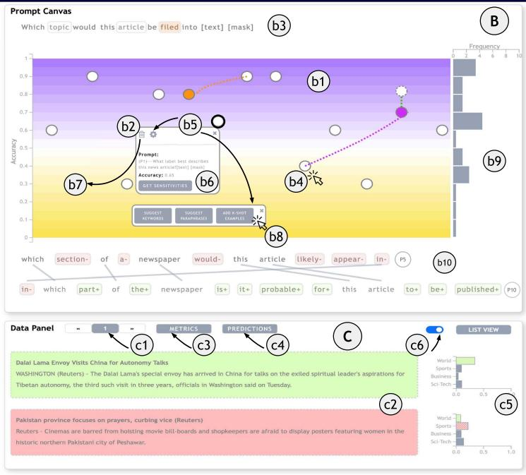
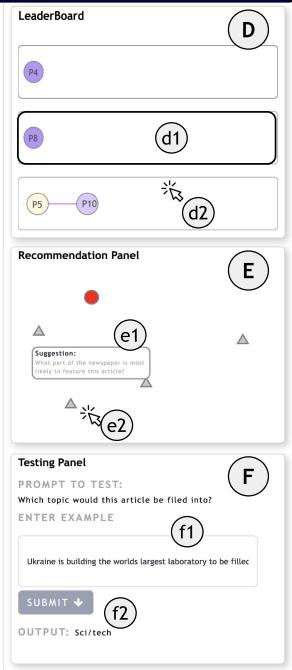
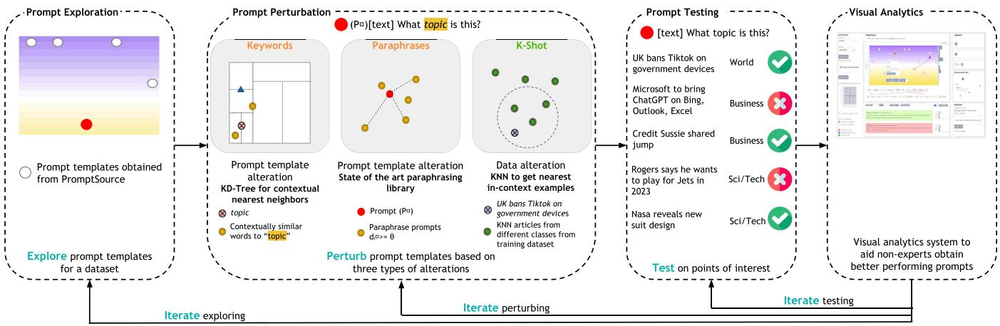
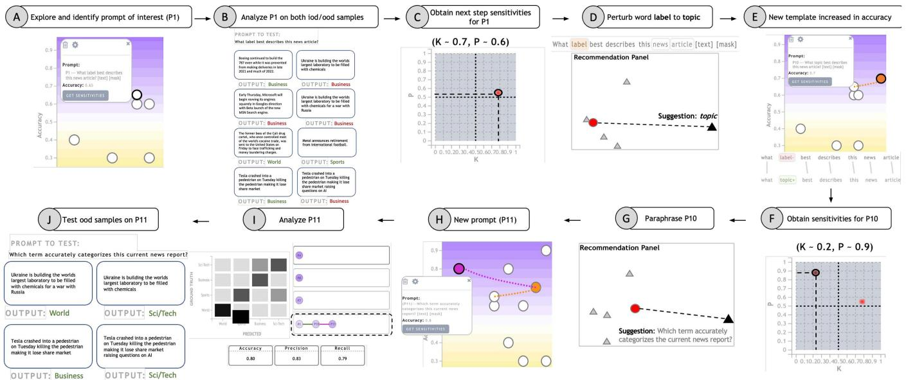
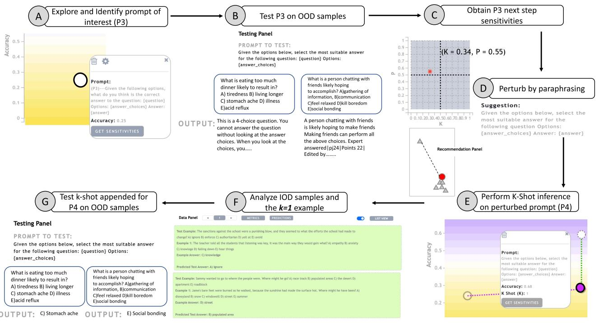
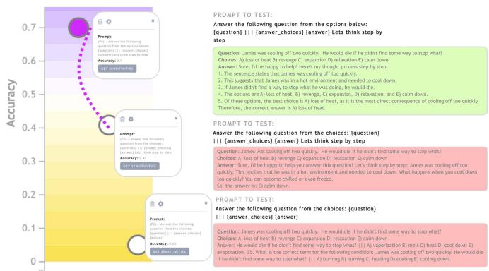
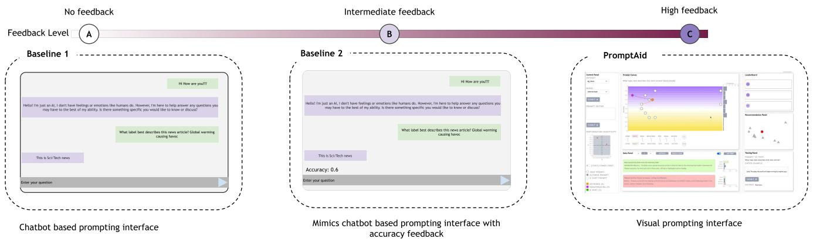
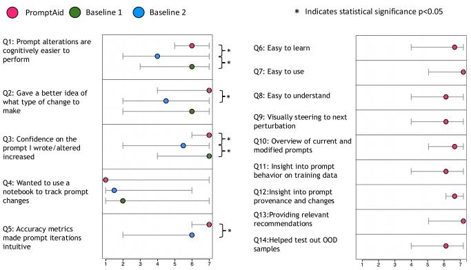

# PromptAid: Visual Prompt Exploration, Perturbation, Testing and Iteration for Large Language Models

Aditi Mishra , Bretho Danzy, Utkarsh Soni, Anjana Arunkumar , Jinbin Huang , Bum Chul Kwon and Chris Bryan 

Abstract—Large language models (LLMs) have gained widespread popularity due to their ability to perform ad-hoc natural language processing (NLP) tasks with simple natural language prompts. Part of the appeal for LLMs is their approachability to the general public, including individuals with little technical expertise in NLP. However, prompts can vary significantly in terms of their linguistic structure, context, and other semantics, and modifying one or more of these aspects can result in significant differences in task performance. Non-expert users may find it challenging to identify the changes needed to improve a prompt, especially when they lack domain-specific knowledge and appropriate feedback. To address this challenge, we present PROMPTAID, a visual analytics system designed to interactively create, refine, and test prompts through exploration, perturbation, testing, and iteration. PROMPTAID uses coordinated visualizations which allow users to improve prompts via three strategies: keyword perturbations, paraphrasing perturbations, and obtaining the best set of in-context few-shot examples. PROMPTAID was designed through a pre-study involving NLP experts, and evaluated via a robust mixed-methods user study. Our findings indicate that PROMPTAID helps users to iterate over prompts with less cognitive overhead, generate diverse prompts with the help of recommendations, and analyze the performance of the generated prompts while surpassing existing state-of-the-art prompting interfaces in performance. 

Index Terms—Radiosity, global illumination, constant time. 

# I. INTRODUCTION

T HE emergence of large language models (LLMs) has ush-ered in a paradigm shift in the field of natural language ered in a paradigm shift in the feld of natural language processing (NLP) [1]. In addition to achieving state-of-theart performance across various NLP tasks such as translation, named entity recognition, and question answering [2], LLMs are widely accessible to non-technical users because they can easily be adapted for specific downstream tasks using natural language instructions, a process known as prompting [1]. In part, 

Received 18 May 2024; revised 13 January 2025; accepted 19 January 2025. Date of publication 27 January 2025; date of current version 5 September 2025. This work was supported in part by the U.S. National Science Foundation under Grant CNS-2224066, Grant DUE-2216542, and Grant DGE-2350036. Recommended for acceptance by Y. Wu. (Corresponding author: Aditi Mishra.) 

Aditi Mishra, Bretho Danzy, Utkarsh Soni, Anjana Arunkumar, Jinbin Huang, and Chris Bryan are with Arizona State University, Tempe, AZ 85281 USA (e-mail: amishr45@asu.edu; bdanzy $@$ asu.edu; usoni1@asu.edu; aarunku5@asu.edu; jhuan196@asu.edu; cbryan16@asu.edu). 

Bum Chul Kwon is with IBM research, Cambridge, MA 02142 USA (e-mail: bumchul.kwon@us.ibm.com). 

This article has supplementary downloadable material available at https://doi.org/10.1109/TVCG.2025.3535332, provided by the authors. 

Digital Object Identifier 10.1109/TVCG.2025.3535332 

the ease and intuitiveness of prompting has led to the widespread adoption of LLM-based tools across diverse areas, including entertainment, business, and entertainment [3], [4], [5]. 

Prompting enables us to leverage LLMs as few shot learners [6], where a trained LLM can perform downstream tasks solely based on giving it a small number of (“a few”) instructions and task demonstrations via prompts. For an example sentiment analysis task, a prompt might be formatted as, Determine the sentiment of the following review. An example of a review is “The book was a fun read” and the sentiment is “positive.” The LLM learns the downstream task without needing to retrain on a new training dataset or update the parameters of the underlying model, and can subsequently be prompted using the same template to determine the sentiment of a new review (e.g., The book was long and boring.). 

Despite the remarkable performance of LLMs across tasks that traditionally have required training deep learning networks from scratch [7], there is growing recognition that creating effective prompts for downstream tasks is critical to their success. Moreover, this is a non-trivial activity, particularly for nonexpert users, and such users can struggle to construct optimal prompts effectively [8], [9], [10]. As a result, new prompting strategies are continually being proposed, such as identifying prompts that lead to more errors, identifying why those errors occur, and resolving the error to bias the language model correctly [8], [9]. However, appropriately adapting the language model usually requires domain knowledge of the downstream task and multiple iterations of creating, refining, and analyzing prompts [10]. For non-expert users, how do we support the successful refinement of prompts? One potential strategy— highlighted across several recent calls to action [8], [9], [10]—is to employ user-friendly interfaces to aid the prompting process. 

We investigate such a strategy in this paper. Specifically, we develop and present a visual analytics system called PROMPTAID that is designed for non-expert users to explore, perturb, refine, and test prompt templates iteratively. PROMPTAID is designed based on a pre-study with three NLP experts. The system consists of multiple, coordinated visualizations for exploring prompts and supports several semi-automated strategies for improving prompts: keyword suggestions, paraphrases, and in-context example recommendations. To demonstrate the usefulness of PROMPTAID, we showcase three use cases and conduct a rigorous user study where non-expert participants must create prompts to perform various zero- and few-shot learning tasks, using PROMP-TAID and two baseline interfaces that mimic existing commercial 

LLM tools. Our results indicate that PROMPTAID markedly outperforms the baseline interfaces in terms of prompt performance; PROMPTAID was also considered the better tool across a number of reflective measures (cognitive load, confidence in prompts, etc.), and many of PROMPTAID’s features, such as interactive and visual recommendations for prompt perturbation and iteration, were considered highly useful based on qualitative participant feedback. 

The main contributions of this paper include the following: (1) We analyze design challenges and goals for prompting by non-experts, with a focus on optimizing performance and reducing cognitive effort, based on a pre-study with NLP researchers and by literature review. (2) We develop PROMPTAID, a visual analytics interface that lets a user interactively and semi-automatically perturb prompts both linguistically and contextually, based on system recommendations, to obtain better accuracies using open sourced language models. (3) Based on our experience in creating and robustly evaluating PROMPTAID, we discuss how interactive and visualization-driven prompt crafting can augment user performance and efficiency while lowering cognitive efforts. 

# II. RELATED WORK

In this section, we first review relevant prior literature on language models and prompt engineering. Then, we identify a research gap in visual analytics to support prompt engineering for few-shot learning LLMs. 

# A. Language Models and Prompt Engineering

While the emergence of LLMs is relatively recent, the first language model (named ELIZA), debuted almost 60 years ago, using pattern recognition and a rules-based logic to mimic human conversation [11]. The recent development of the transformer architecture [12], which model sequential data (e.g., natural language) via a self-attention approach, along with the vast amount of data available on the internet, has led to the development of LLMs, which include BERT [13], RoBERTa [13], ALBERT [14] and GPT-2,3 [7] and more recently GPT-4 [15]. Broadly, LLMs are believed to capture the semantics and syntax of human language because they are trained with large parameters and large datasets. The embeddings from these pre-trained models can be fine-tuned using a small dataset to perform more narrowly defined, downstream NLP tasks, such as text classification, summarization and knowledge retrieval. This can be done by adding task-specific layers to the end of LLMs and updating partial or all parameters with the backpropagation method. This paradigm to solve a specific task is called pre-train $^ +$ fine-tune [16], [17], [18]. 

In recent years, NLP has seen a paradigm shift from pre-train $^ +$ fine-tune to pre-train $^ +$ prompt [1]. Given a task description (or context) in natural language, the LLM can be prompted to to perform downstream tasks without requiring changes to the underlying model. For example, Brown et al. [6] demonstrated that GPT-3 can handle a wide variety of NLP tasks with only a few task demonstrations and prompts as context. 

However, to elicit appropriate responses, a prompt must be properly designed (or engineered). Human language is highly 

nuanced and varied, and writing prompts in different ways (even with subtle changes) can lead to considerably different responses from the model. Recent studies [8], [9], [19] have identified several pain points for prompting, which roughly can be divided into two types of challenges: 

(1) Linguistic Challenges: There are many ways that a desired prompt can be formulated, and altering components such as word choice, phrasing, length, prefixes, and other linguistic elements can significantly impact the performance of the task, even holding consistent the prompt’s other components. As a result, current solutions employ a brute force strategy to generate various prompt combinations [19]. 

(2) Contextual Challenges: In a few-shot setting, developing an optimal set of priming examples requires a user to select a small set of examples that effectively represent the desired task and can achieve high performance. For a non-expert (e.g., a user without sufficient expertise to identify the most effective examples for a given task, or set the number of $k$ examples to optimize a prompt’s performance), this can be especially challenging and cause significant cognitive load [8]. 

To alleviate the problems with prompt engineering, Mishra et al. [20] introduced a technique in which an LLM is used to generate task-specific questions which the user can answer. This was shown to provide better context for the LLM for a downstream task. However, there is not yet a solution that can automatically or semi-automatically find the best prompts for desired tasks with given LLMs without undergoing iterative human-in-the-loop processes. 

# B. Visual Analytics for Prompt Engineering and NLP

Given the recent emergence of the pre-train $^ +$ prompt paradigm, the HCI and visualization communities have begun developing techniques and tools to augment the prompting process. For a recent high-level overview and discussion on emerging challenges and opportunities within this space, see Yang et al. [21]. Here we focus on tools developed specifically to improve prompting paradigms. An early example of this is PromptIDE [19], which provides an interface to experiment with prompt variations, visualize their performance, and subsequently try to optimize the prompts. Similarly, ChainForge [22], provides users with the ability to write, evaluate, and iterate over prompts. In contrast to both of these, PROMPTAID generates both prompt recommendations that can be refined by users, and also supports zero- and few-shot prompting. Similarly, ScatterShot [23] provides users with avenues to create high quality demonstration sets (in context examples) to optimize the language model outputs. While these tools are similar to PromptAid in that, ultimately, they aim to make it easier for humans to create and refine prompts, most of these tools support the refinement process through either keyword alterations, UI-based interactions, or only support a specific prompting paradigm (e.g., [23]) when compared to PROMPTAID which can provide both linguistic (keywords and paraphrase) and contextual (kshot) recommendations. 

Finally, considering text-to-image models, several recent tools have been introduced, including PromptMagician [24], 

PromptCharm [25], PromptTHis [26], and Promptify [27]. While they support various workflows for image fine-tuning and variation, they focus solely on image generation and editing workflows. 

For the more general visual analysis of NLP models, several prior tools can broadly be categorized as supporting two types of tasks: (1) greying black boxed NLP models [28], [29], [30], [31], [32], [33], [34], [35], primarily for model developers and experts, and (2) understanding post hoc model behavior based on input variances [36], [37], 

One relevant tool is the Language Interpretability Tool (LIT) [36], which supports analysis of NLP models at the global and local levels by visualizing embedding spaces, saliency, accuracy metrics, and more. We were in part inspired by this tool to treat each prompt template in the work as an “NN model,” supporting both global and instance-level analysis, along with projecting the prompts into an embedding space (see Section III). Moreover, we support users validating their understanding of generated prompts by providing them the ability to test their “models.” However, in contrast to the LIT, PROMPTAID supports an iterative prototyping approach based on semi-automated recommendations and human feedback (and also focuses on prompt engineering, not general NLP models). Another relevant tool is NLIZE [37], which lets users visually perturb an natural language inference model’s internal hidden states to evaluate model outputs. We expand upon this perturbation approach: NLIZE does not let users perturb the input being sent to the model, but PROMPTAID lets novice users alter the input provided to the LLM based on system recommendations. 

# III. DESIGN CHALLENGES AND GOALS

In line with the prior visualization interface targeted for prompting [19], we identify a set of design challenges (C1- C3) that novice users encounter when interrogating language models, based on a pre-study with three NLP experts. We chose NLP experts who were familiar with prompting LLMs for tasks without requiring fine-tuning. Based on this pre-study, we obtain five key design goals (G1-G5) that guide the design of PROMPTAID. 

# A. Design Challenges

Each design challenge is associated with a specific process that PROMPTAID aims to assist novice users with. These processes are indicated by labels in blue-gray boxes. 

(C1) ; Navigating and exploring a vast prompt space is difficult. Constructing natural language prompts requires synthesizing intricate linguistic components such as keywords, phrasing, and structure, all of which can impact the output of an LLM [8]. The space of possible natural language prompts can also rapidly expand which can be challenging for non-expert users to navigate when they want to identify an optimal prompt template. Current brute force solutions can impose a high cognitive load on users [19], which can be further complicated by the tendency of humans to overgeneralize from single failures [9], [38]. In other words, a prompt might perform well globally but poorly on a specific instance, and users 

might underestimate its overall effectiveness. There is a need for systems that allow users to explore the prompt space and analyze the performances of prompt templates. Such insights can ultimately lead users to craft optimal prompts for their tasks. 

(C2) ; A high cognitive effort is required to source words, paraphrase prompts, and obtain priming examples. Though LLMs demonstrated impressive capabilities in generalizing to new tasks with only a few examples, previous studies [8], [9], [20] revealed that generating these changes and selecting the k-shot examples necessary for these new tasks entail higher cognitive effort for non-expert users. Furthermore, the k-shot examples chosen by users can significantly influence the results on new data, which may result in under- or overgeneralization of the prompts [8]. With vast amounts of data available on the Internet, users may attempt to find similar words for instruction and come up with k-shot examples for testing, but there is no guarantee that the words chosen for instruction capture users’ intentions accurately and that the k-shot examples are optimal for their intended purpose. Even when employing AI-based recommendations, human intervention is required to ensure that the task’s semantics remain unchanged or the sentence is grammatically correct during the perturbations. Consequently, interactive systems can be instrumental in assisting users in identifying suitable suggestions for instruction and generating examples. 

(C3) ; Evaluating prompts in global and instance levels is challenging. Finally, LLMs are inherently stochastic (as they use a statistical model to predict the probability of the next word), meaning that the answers produced by the model can vary for the same prompt. Previous studies (e.g., [8]) have identified this as a significant challenge for prompt evaluation, as users need more global metrics to comprehend how a prompt performs over a small test set, instead of relying on a single data point. They also highlight the user’s needs to compare the performance of diverse prompts on a small representative test set. However, presenting such results in a raw and tabular format can be cognitively taxing for non-expert users; this makes visualization a promising approach, due to its ability to graphically encode complex and abstract information into meaningful representations. Therefore, visualizations need to provide a view for evaluation of prompt performances, accompanied by global and instance metrics for users to compare the performance of prompts. Furthermore, users should be able to evaluate a prompt based on their custom-curated examples. 

# B. Design Goals

The following design goals were derived with help of NLP experts to address the design challenges described above. We provide the corresponding challenges wherever appropriate. 

(G1) Provide an overview of prompts retrieved or altered: The increasing adoption of language and image-based prompting models (e.g., Dall.E) has resulted in a rapid expansion of datasets containing crowd-sourced prompts tailored to specific tasks, such as summarizing lengthy text paragraphs or facilitating natural language question-answering [39], [40], [41]. In preliminary studies, multiple participants observed that enabling 

PROMPT-AID

Fig. 1. PROMPTAID’s interface consists of six main linked sections which support (A) selecting models, domains and entering custom prompt templates, (B) exploring the prompt space, (C) analyzing instance level performance of a prompt template, (D) comparing versions of prompt templates over multiple iterations, (E) obtaining recommendations for prompt template alteration, and (F) testing generated templates on in or out of distribution data points.

end-users to navigate, explore, and analyze prompts based on their semantic similarity and performance (C1) could aid in the design of better prompts. As such, the application of visualization techniques can offer a means to present users with an overview of prompts, grouping them according to similarity and performance. 

(G2) Support both global and instance-level analysis of prompts: Testing on a single data point might not give users sufficient insight into how well (or poorly) each prompt performs. The stochastic nature of LLMs must also be accounted for. Thus, users should be able to test prompts and obtain a heuristic accuracy on smaller datasets in a faster feedback loop for prototyping purposes (C1, C3). Further, only explaining a prompt from a global perspective might lead the user to overlook important details, resulting in misinterpretations of why a prompt performed better or worse. To enable detailed inspection, while not overwhelming users by revealing too many details, visualizations need to show data points (examples), their predicted probabilities over classes, and other accuracy metrics such as precision and recall to help analyze and compare the performance of multiple prompts. 

(G3) Provide recommendations for prompts: While G1, G2 are crucial for the comprehension of the overall behavior of a set of prompts based on their semantic similarities, global, and instance-based performance, however these metrics do not offer users the means to modify the prompts to improve results. A prompt’s efficacy can be influenced by linguistic elements, such as the selection of keywords and sentence phrasing, as well as contextual components, such as the use k-shot examples. As such, the process of varying not only the linguistic components 

but also the selection of the best examples for the k-shot setting can be mentally taxing for the end user. To address this issue, the interface should support both linguistic and contextual modifications, and provide visualizations that recommend prompt changes in a way that not only eases cognitive overload but also aids end users in creatively thinking in new directions (C2). 

(G4) Provide visual steering and immediate feedback for changed prompts: While running preliminary experiments for this work, we realized that the prompt space could expand exponentially. This is because there could be numerous changes that can be made to the original prompt while maintaining the semantics. The prompt space can further expands in size if we allow for contextual changes as well. It is challenging to read the individual prompts in the text without visual aid. Thus, visual steering can make navigating the prompt space less cognitively demanding (C2). 

(G5) Allow users to generate custom examples: While the heuristic accuracy of a prompt template can be calculated, users might also want to enter examples of their choices and observe the LLM’s outputs. This process can aid in evaluating the robustness of the prompt template on various examples (C3). Thus, the interface should provide users the ability to test custom-curated samples. 

# IV. BACKEND SYSTEM DESIGN

In this section, we discuss the design of the PROMPTAID system by describing how different views support the design goals (G1-G5). Fig. 2 shows an overview of the system pipeline which consists of a backend module (this Section) and a 

Fig. 2. PromptAidemploys a multi-phase approach: templates are embedded in a latent space and clustered based on similarity in the exploration phase. In the perturbation phase, contextual keywords, paraphrases, and in-context examples are recommended using KD-Tree, the Parrot library, and KNN, respectively. Users can then test alterations on data points of interest in the testing phase. The frontend interface employs visual analytics to streamline these processes iteratively, leading to the generation of desired prompt templates.

frontend interface (described in Section V). The pipeline integrates several methods, such as K-D Trees, K-NN, a stateof-the-art paraphrasing framework, and LLMs to automatically extract relevant recommendations based on the changes the user wishes to make on a given prompt template. 

# A. Dataset and Model

To showcase the feasibility of PROMPTAID for NLP tasks, we support three common tasks, namely topic classification, sentiment analysis and commonsense question answering using the benchmark datasets of ag_news [42], amazon_polarity [43] and CSQA [44], respectively. We utilize a set of prefix seed prompt templates [1] retrieved from the PromptSource library [39]. The templates specifically consist of the instruction to solve a task which is then appended to a task instance to form a prompt for the LM. 

To test the prompt templates, we integrate three open-source language models into PROMPTAID: RoBERTa-base, GPT-2, implemented using the OpenPrompt library [45] in Python and LLaMA-2 13 billion [46] was prompted using API calls. The results are calculated based on user interactions on the fly using a Node.js server. 

The prompt templates were subjected to empirical validation using a test sample comprising 200 data points. It is imperative to acknowledge that the computational time necessary for accuracy calculation escalates significantly when dealing with larger models. Consequently, in the interest of optimizing the user experience, we have limited the presentation of results to a subset of 20 data points. For an in-depth examination of the computational time associated with accuracy calculations across different data point quantities, see Table ?? in the Appendix. 

# B. Keyword, Paraphrasing, and K-Shot Recommendations

Building upon prior work that has explored the challenges faced by non-expert users in generating effective prompts for language models [8], [9], we consider the impact of keyword 

and phrasing choices (linguistic challenges), as well as the use of $\mathrm { k \Omega }$ -shot examples (contextual challenges) to inform prompt crafting. While factors such as prompt length, structure, and kshot ordering may also affect prompt performance, these require further investigation — see Section VIII. 

In our system, we allow users to choose linguistic alterations from the recommendation panel only, as these directly affect the prompt template. K-shot examples are dynamically calculated and presented to the user, as they pertain to each specific data point, and do not alter the prompt template. While our initial prototypes considered allowing users to choose their own k-shot examples, we found that this approach could be overwhelming for a novice user, as it would require the selection of examples for each data point in the test set to obtain an accurate global accuracy metric. To reduce cognitive load, we instead provide users with pre-selected recommendations for k-shot examples. That said, users can enter their few-shot examples and prompt templates in the Prompt Editor panel to obtain predictions. 

When providing linguistic recommendations, we consider the trade-off between relevancy and diversity. We define relevancy as the degree to which recommended words or phrases are closely related to the prompt that is being modified, while diversity refers to recommendations that are more distant in the embedding space. In some domains, such as luxury fashion, diversity of recommendations may be more important than relevancy, as rare and exclusive items are highly valued [47]. Conversely, in e-commerce applications, relevant recommendations that align with specific user goals are more valuable. To our knowledge, prior research has not yet investigated the effects of altering recommendations towards more diverse words; we currently assign equal weights to both relevancy and diversity in our recommendation output and have found this works well (e.g., see use cases and user study in Sections VI, VII and VI-B). However, further research and testing are needed to optimize these trade-offs; PROMPTAID’s weights can be easily updated based on future findings. 

Keyword Recommendations: Prior research has demonstrated that the choice of keywords in a prompt template can significantly impact its effectiveness [8]. Specifically, prompts containing words that explicitly specify the task at hand can outperform those with abstract descriptions of the same task [48]. To facilitate the creation of effective prompt templates, we use K-D trees to identify words that are contextually similar to the word the user intends to change, for the specific task being performed. 

To accomplish this, we first append the task type to the end of the prompt template $P _ { t } ( . )$ , and send the resulting prompt to sentence transformer models (LLMs) to obtain contextual embeddings of the words. We use a K-D tree to identify words that are similar to the word the user intends to alter. To do this, we obtain the nearest words from a 10,000-word public web corpus [49], which is vectorized using the same sentence transformer model. From this set, we select twenty nearest words and then choose five words closest and five words farthest from the word being altered. To maintain semantic coherence in the prompt template after substitution and to avoid repetitions, we additionally perform lemmatization to remove words with the same root word. 

Paraphrase Recommendations: Paraphrasing-based approaches aim to generate candidate prompt instructions that are similar to the seed prompt while being sufficiently different to offer a range of options. An ideal paraphrase should preserve the meaning of the original prompt instruction, be grammatically correct, and differ from the seed prompt [50]. To achieve this, we employ a state-of-the-art paraphrasing library called Parrot [50]. Notably, this library supports parameters to account for both relevancy and diversity in paraphrased recommendations. However, in practice, we found that in certain cases, the library returned paraphrased statements that were highly similar to the seed prompt template $( P _ { t } ( . ) )$ (e.g., only changing a single word). To ensure that the paraphrased prompt template maintains sufficient distinction, we define a threshold $\theta$ based on pairwise Levenshtein distances between the seed prompt and the paraphrases, as well as between the paraphrases themselves, and exclude any new paraphrases with a distance $\leq \theta$ . 

To determine the appropriate threshold, we conducted a set of preliminary experiments and found that for seed prompt templates with length $< 1 0$ , a threshold of $\theta = 2 0$ tended to produce paraphrases sufficiently different from the seed prompt. For seed prompt templates longer than 10 characters, we set a threshold of $\theta = 2 5$ . In practice, we found these values tended to balance between relevant and diverse paraphrases that were both meaningful and distinct from the seed prompt. 

$K$ -Shot Example Recommendations: Prior research has underscored the importance of example selection in few-shot learning settings, with the choice of examples potentially resulting in outcomes ranging from state-of-the-art performance to random guessing [51]. To address this issue, prior studies have attempted to identify an optimal set of examples that can yield the best results from a language model [52], [53]. Our method for obtaining k-shot samples is inspired by Liu et al.’s [52] approach, which uses a KNN-based method to select k-shot examples based on similarities between the example set and test instances. Their approach outperformed a baseline of random selection on 

various NLP tasks, including question answering, table-to-text generation, and sentiment analysis. 

To accomplish this, we first identify the five nearest examples $x _ { 1 } , x _ { 2 } , \ldots , x _ { 5 }$ to a given test point $x _ { t e s t }$ from the training dataset $D _ { t r a i n }$ , which in our case were the a_news and the amazon_polarity datasets. We limited the number of examples to five, as we found that adding additional examples (for both task classification and sentiment analysis) did not significantly improve the performance of the prompt template. Similarly, Lie et al. [52] found that increasing the number of examples did not lead to improved performance on an IMDB dataset for a sentiment analysis task. This also helped provide a more responsive user experience, as increasing $k$ led to longer processing times. 

To identify the k-shot examples, we convert both the test data point $x _ { t e s t }$ and the data points in the training dataset $D _ { t r a i n }$ into vector representations using a general-purpose sentence transformer model (specifically, the all-MiniLM-L6-v2 model [54]. Then, for each test point, we identify the five nearest neighbors from the $D _ { t r a i n }$ . We found that the nearest neighbors of the test point from the train set generally belonged to the same class as the test point, which could lead to the language model merely copying the label, resulting in a bias towards the example point labels. To mitigate this issue, if $k > 1$ , we chose the $\left( k - 1 \right)$ closest neighbors from classes different from that of the test data point and one which belonged to the same class as the test data point, else we choose the nearest point from another class to the test data point. 

Finally, we order the $\mathrm { k \Omega }$ -shot examples based on their cosine distances using the following inequality: $d ( x _ { t e s t } , x _ { i } ) <$ $d ( x _ { t e s t } , x _ { j } )$ , where $x _ { i } , x _ { j } \epsilon D _ { t r a i n }$ . These examples are inserted into the prompt template $P _ { t } ( x _ { i } )$ being tested and concatenated $[ P _ { t } ( x _ { 1 } ) y _ { 1 } , P _ { t } ( x _ { 2 } ) y _ { 2 } , . . . P _ { t } ( x _ { k } ) y _ { k } ]$ to form the k-shot example set. This example set is then sent along with $x _ { t e s t }$ to the LLM. To identify the optimal value of $k$ in the k-shot setting, we iteratively ran the concatenated examples with $k \epsilon [ 1 , 5 ]$ and returned the $k$ with the highest accuracy metrics. 

# C. Perturbation Sensitivities

“Next step” linguistic perturbation sensitivities in PROMPTAID are calculated to visually steer non-expert users towards the “right” perturbation choice (i.e., keywords or paraphrasing) in the next step, to ultimately increase the performance of the prompt template. We obtain these sensitivities through the sampling of prompt templates for each perturbation type from the initial template and subsequently measuring their average heuristic accuracy on the test dataset. Refer to section IV-B to see why we choose to showcase only linguistic perturbations. 

# V. FRONTEND SYSTEM DESIGN : PROMPTAID

In this section, we describe the design of PROMPTAID interface. PROMPTAID is designed to support (G1–G5) by letting users iteratively explore, perturb, and test prompts and prompt templates while adhering to emerging best practices for interacting with LLMs [8], [9], including precise control in altering and iterating prompts and clear system feedback that leads to actionable insights (i.e., ultimately leading to improved 

prompts). Fig. 1 shows the interface, which is composed of six linked panels (A)–(F). Henceforth, we refer to the panels and sub-panels of Fig. 1 without pretending “Figure” to save repetition in this Section. 

(A) The Control Panel lets users select a desired dataset and LLM (a1). A Prompt Editor (a2) lets users enter personalized prompts, which on submission, loads the newly written prompt template on the prompt canvas panel. The Perturbation Sensitivity plot (a3) is a scatter plot representing (x-axis) the average heuristic accuracy for next step perturbation on changing a keyword for a prompt, and (y-axis) the same for next step perturbation of paraphrasing the prompt template. This lets the user see what kind of linguistic perturbations to a prompt template can potentially increase its performance in the next step for 0-shot settings (G4). Below, a [TEXT] toggle (a4) highlights prompt templates in which the data point is appended at the beginning of the prompt template, to help users compare the performances of the templates based on their structure. The bottom of this panel provides a legend (a5). 

(B) The Prompt Canvas Panel provides an overview of the prompts being retrieved, written, and altered. It contains the following parts: The primary chart (showing a purple-to-yellow background) shows loaded prompts as circles (b1). The vertical position maps the accuracy of the prompt on the testing dataset, and the horizontal position arranges the circles as a 1-dimensional t-SNE projection, where more similar prompts are placed closer together, as this can help users understand if (and when) similarly worded prompts also have similar performance (G1). This visualization is meant to allow the users to freely explore the prompt space. The specific choice of 1D t-SNE was done to condense the complexity of pairwise prompt relations along a single axis, enabling users to easily discern similarities and differences between prompts (as stated above). The inclusion of accuracy scores as a backdrop serves as an intuitive gauge of prompt performance for end users. Higher performing prompts are positioned higher on the canvas, conveying a clear message that superior performance translates into upward scaling within the visualization. 

At right, a histogram shows the frequency of prompt templates based on performance (b9). 

Upon hovering, a tooltip is displayed (b2), and the prompt is shown in the panel’s header (b3). The tooltip shows the template number, prompt template, its accuracy, and user controls, which allows the user to choose from three improvement/perturbation options: keyword suggestions, paraphrase suggestions and the addition of k-shot examples (b5, b8), along with a “Get Sensitivities” button (b6) to calculate the heuristic perturbation accuracies for the next step, and a delete icon to erase the prompt (b7). 

When selecting an improvement option (b8), the prompt in the panel’s header (b8) is highlighted: The “Suggest Keywords” button highlights non-stopwords in the prompt template in the panel’s header, and displays contextually similar words for the clicked word in the recommendation panel (E). The “Suggest Paraphrasing” button likewise generates new paraphrases of the prompt template in the recommendation panel. The “Get K-Shot Example” button adds an optimal set of $k$ in-context examples 

to the prompt and displays the k-shot prompt template on the Prompt Canvas Panel. Clicking on a prompt template colorcodes the data panel for instance-based analysis and populates the template to test in the Testing Panel (F). 

The panel’s footer (b10) acts as a version comparison tool between two iterations of prompt templates: users can track words and position changes, and see what is added, removed, or maintained between between the two versions. 

(C) The Data Panel supports detailed instance analysis for the selected dataset (G2). Two data points are shown on a page; the user can navigate pages to see other points (c1). Correctly classified data points have green backgrounds (incorrect are red) (c2). In case of RoBERTa and GPT2,clicking the Predictions button (c4) toggles bar charts for each data point displaying the logits for each class (c5). In these cases of correct classification, the green-striped bar represents the class to which the data point was classified. For incorrect classifications, the green stripe denotes the ground truth, while the red-striped bar represents the predicted class. However, in the case of the LLaMA-2 13 billion model, we just showcase the generated outputs. While LLaMA-2 is an open sourced model, we however performed inferences using API calls because downloading the model for inferences would add to the computational and time costs. 

While a general way to evaluate the outputs from a generative model would be using ROUGE [55] or BLEU [56] scores, in the case of CSQA the ground truth consists of just a single choice and the corresponding option. We use regular expressions (RegEx) to identify the presence of the the predicted option or the word in the generated text. If the correct option and the corresponding option to it is found, we consider it to be a correct prediction. 

Clicking the Metrics button (c3) shows accuracy metrics, including precision, recall, and a confusion matrix, for each prompt template. These metrics provide a global quantitative measure of the effectiveness of the prompt template, enabling users to evaluate its performance across the tested dataset. This panel gives users the capacity to discern particular instances in which the model’s outputs from the anticipated or accurate outcomes. This perspective helps users to detect errors like misclassifications and inaccuracies in the process of debugging and to determine the origins of them. 

When a k-shot prompt template is selected, this only displays one data point appended with the corresponding optimal k-shot examples and its logits. Other data points appended with their optimal k examples can be viewed by using the page navigator button. 

(D) The LeaderBoard and Provenance Panel serves as a tracking mechanism to monitor the various versions of a prompt template. This panel complements the Prompt Canvas panel by providing a condensed, comparative ranking of the effectiveness of different prompt versions. It provides a global view of how much users have changed their instructions, along with the position on the leaderboard which offers users a quick and clear visual indication of whether their prompt adjustments are moving in the right direction. 

Each version is shown inside a rectangle band, ordered in descending order based on the heuristic accuracy of the prompt template. Inside each band, a circle labeled with the prompt 

serial number denotes the initial seed prompt template, color coded purple-to-yellow corresponding to the accuracy levels in the prompt canvas panel. 

Hovering over a rectangle band (d1) highlights the associated prompt template in the Prompt Canvas Panel. As the prompt template undergoes iterations in the prompt canvas panel, new linked circles are added to the right of the original seed prompt template; these symbolize the type of perturbation applied (indicated by the legend in the control panel). Clicking inside the rectangle band (d2) populates the Prompt Canvas Panel’s footer (b10), showing a textual comparison of differences between the various prompt template versions. 

(E) The Recommendation Panel shows either keyword or paraphrase recommendations, based on the perturbation choice made in the Prompt Canvas Panel (G3). A red circle that designates the word or prompt template currently undergoing modification; triangles represent suggested perturbations. Points are placed based on their similarity using a t-SNE layout, with contextually similar points positioned closer to the red dot than those that are farther apart. A hover tooltip (e1) shows suggested keywords or paraphrases. Such a layout would allow users to visualize the contextual similarity of suggested keywords or paraphrases in a spatial layout and the impact on it’s accuracy. Clicking a triangle (e2) initiates the modification of the initial prompt template, with the newly altered prompt being loaded into the Prompt Canvas Panel. The modified prompt also has a link connecting it to the old prompt template, which is colorcoded to indicate the type of perturbation applied. 

(F) The Testing Panel supports testing a prompt template on a selection of desired data points, including both in-distribution or out-of-distribution (OOD) samples (G5), to validate the user’s comprehension of the generated prompt template. Examples can be entered into a text box (f1); once submitted, the output is generated based on the predictions made by the LLM (f2). 

# VI. USAGE SCENARIO

To demonstrate how PROMPTAID can explore, perturb, and iterate prompts for higher accuracy, we present a usage scenario (organized into three use cases) from the perspective of Gary, a non-expert in AI/NLP. In the first use case, Gay needs to perform zero-shot prompting for a topic classification task on the ag_news benchmark dataset. Gary has a set of OOD snippets of news articles he wishes to both classify and validate his own conclusion(s) about the task. These OOD samples are a set of recent news snippets obtained from the internet. This use case is also presented in the demo video, found in the supplementary materials. 

The second use case demonstrates PROMPTAID’s ability to support k-shot prompting, by having Gary perform a commonsensense question answering task using the LLaMa-2 13 billion model on the CSQA benchmark dataset. 

The last use case showcases PROMPTAID’s ability to accommodate an emerging prompting methodologies, specifically Chain-of-Though (COT) prompting [57]. Gary performs additional analysis with the COT prompting style, to see if the interface can suggest changes to improve the prompt accuracy. 

Prompt instructions in the first use case are tested on a test set with 20 data points. As discussed in Section IV-A, this is done to the optimize an efficient user experience while maintaining good performance. We provide a further evaluation of the generated prompts on multiple data points (up to a maximum of 200 points) in the Appendix; see Appendix B and C for more details. The second and the third use case were tested on a test dataset of size 200 data points. 

# A. Use Case 1: Improving Zero-Shot Prompting

Gary’s analysis and his specific actions are shown in Fig. 3. Gary selects the ag_news dataset and Roberta-base model, which populates the Prompt Canvas with ten seed prompt templates (P1-P10), each with a corresponding accuracy achieved by the prompt on a testing dataset, which Gary evaluates by hovering over each prompt. Upon closer inspection, he discovers that pairs of prompts differ only in the order in which the textual data, i.e where the [text] tag occurs in a prompt template, with one variant placing the textual data before the prompt and the other placing it after. The prompts with differing textual data orders appear at the same vertical position on the chart, indicating that their content is identical apart from the order of the textual data. 

To investigate whether the order of textual data has an effect on prompt performance, Gary clicks the [TEXT] toggle in the Control Panel. He observes that prompts with textual data appended before the prompt tend to perform worse than those with textual data appended after the prompt. Gary uses this information to design his own custom prompt templates. Upon exploring, he discovers a simple and straightforward prompt template (P1: “What label best describes this news article? [text]”) which achieves an accuracy of $60 \%$ on the testing dataset. However, upon examining the logits for each test data point and checking the data panel, Gary notices that the prompt template appears to be somewhat biased towards Business and Sports. The Business and Sports category is consistently predicted as the second most likely label after its first label for many test data points, even for those which are correctly predicted. 

To further investigate this bias, Gary tests several examples from his own test set by clicking on the circle, which populates the prompt template on the testing panel. He enters eight OOD samples, some of which are ambiguous, to assess the model’s performance. Fig. 3(b) displays the eight samples, where four are correctly classified. For example, the news snippet, “Boeing continued to build the 787 even while it was prevented from making deliveries in late 2021 and much of 2022”, which might appear to be a Sci/Tech news, is correctly classified as a Business news by prompt P1. However, some samples, such as “Early Thursday, Microsoft will begin revving its engines squarely in Google’s direction with the Beta launch of the new MSN Search engine.,” appear to be Business news but are actually Sci/Tech news. Gary also enters news articles designed to confuse the LLM, such as “Ukraine is building the world’s largest laboratory to be filled with chemicals.” 

By examining the model’s predictions for the aforementioned snippet, he aims to determine whether certain words (such as Ukraine and world) bias the LLM towards certain labels such as 

Fig. 3. Use Case 1 using linguistic perturbations (keywords and paraphrasing) on the RoBERTa-base model for zero-shot settings. In a two step perturbation, the accuracy of the prompt template increases from $60 \%$ to $80 \%$ on the test data set.

Sci/Tech or World news. He notices that the model incorrectly classifies the snippet as World news rather than Sci/Tech, as it contains words such as chemicals and laboratory, which are more typical of Sci/Tech news. Similar to the in-distribution samples, Gary observes that most news articles are being predicted as Business or Sports, and even correctly classified articles tend to belong to these two classes. 

(C) Gary then clicks on the “Get Sensitivities” button for P1 to get an idea of the perturbation type to alter the prompt template. A red dot is loaded in the Sensitivity Panel with a 0.6 value for next step paraphrasing and a 0.7 average accuracy for next step keyword-based change. He then invokes the “Suggest Keywords” action. (D) This draws a bounding box around three words in the prompt template: label, news, and article. He first clicks on news, which does not yield any recommendations except the word itself, and then clicks on label. This populates the recommendation panel with the suggestions, criteria, tag, name, and topic. Gary observes that certain recommendations, such as criteria and name, are not semantically appropriate substitutes for the term label, suggesting that while the recommended words may be contextually similar in the abstract, in the current context and task they do not align with the intended meaning. Consequently, Gary realizes the importance of selecting replacements that steer the language model toward accurately and semantically representing the requirements of the downstream task. Gary selects topic, as this seems relevant to the task of topic classification. 

(E) Clicking on the triangle populates the Prompt Canvas Panel with a new, altered prompt. This accuracy of the new prompt (P10) has increased to about $70 \%$ on the testing set. He again checks the previously mentioned eight data points using the testing panel and finds that out of the eight articles, five are correctly classified or classified into classes that match his mental model. However, one snippet (“Tesla crashed into a pedestrian on Tuesday killing the pedestrian making it lose share 

market now raising questions on AI.”) is still being classified as Business, and the prompt template is unable to classify it as Sci/Tech news. 

He reviews the LeaderBoard Panel and notices that the original template (P1) is now linked to (P10) in a way that indicates the prompt template’s performance has increased. Clicking on the rectangle band shows the version control between the two templates, and Gary sees that only one word has been altered (label is now topic) with every other word being the same. 

To ensure that the results of the data points he is entering are consistent, Gary tries to further improve the prompt (P10). (F) He again clicks on the “Get Sensitivities” button, now for (P10), loading its red dot in the Sensitivity Panel with a higher next step accuracy for Paraphrase based perturbation (0.9) and a low (0.2) Keyword based perturbation. (G) Gary clicks the “Suggest Paraphrases” option for (P10), which populates the Recommendation Panel with five paraphrased recommendations. Most of the recommendations seem to align with the task at hand and are also different from one another: “Tell me the best topic for this news article?,” “What category would this news article best be in?,” and “Which term accurately categorizes this current news report?”, which Gary chooses. 

(H) Clicking this recommended paraphrase loads a new prompt (P11) in the Prompt Canvas Panel, with a purple-colored link to highlight that this is a paraphrase-based change, with the accuracy increasing to $80 \%$ . Clicking on the Data Panel showcases its correct and incorrect data points. (I) The confusion matrix also is darker at the diagonals suggesting that the ground truths are equal to the predictions, and the precision and recall of the template have also increased. This new prompt is also now placed at the fourth position among all the prompts on the LeaderBoard. 

(J) Gary finally tests all eight data points from (B), which were meant to check the robustness of the prompt generated and he finds that all the data points have been correctly classified. 

Fig. 4. Use Case 2 using contextual perturbations on the LLaMA-2 13 billion model for k-shot settings with optimal k returned as $k = 1$ . The accuracy of the prompt template increases from $2 5 \%$ to $68 \%$ by adding few-shot examples recommended by the system.

This helps Gary gain confidence in the prompt template he has generated by keywords and paraphrase-based alterations for zero-shot settings. 

# B. Use Case 2: Adding Few-Shot Priming Examples

In contrast to Use Case 1, Gary wants explore the impact of k-shot examples on the performance of the generative model LLaMA-2 13 billion on question answering task using the benchmark CSQA dataset. Fig. 4 shows his actions. 

He selects the CSQA dataset and the language model to LLaMA-2 13 billion. (A) He observes that in the case of the question answering task, only a few prompts were retrieved from the crowd-sourced dataset and almost all of them seem to be performing badly with the maximum accuracy of a prompt on a 200 sample test set being only $2 5 \%$ . He picks the prompt - Given the following options, what do you think is the correct answer to the question: [question], choices: [choices]. The prompt has the highest accuracy among the set at around $2 5 \%$ . (B) He clicks on the prompt to see the examples in the test set and notices that the generative model seems to be producing large paragraphs of text which lacks the appropriate answer from the choices for almost all the data points even when the instructions from the prompt are clear. He then enters a few OOD samples such as “What is eating too much dinner likely to result in? A) tiredness B) living longer C) stomach ache D) illness $E$ ) acid reflux”, “What is a person chatting with friends likely hoping to accomplish? A) gathering of information, B) communication C) feel relaxed D) kill boredom $E$ ) social bonding”. In all the cases the language model outputs a long paragraph with no mention of an answer. 

(C) Clicking on the “Get Sensitivities” button for (P6), Gary notices that the paraphrase-based perturbation exhibits an 

average accuracy of $60 \%$ , whereas the keyword perturbationbased accuracy performs worse with a $30 \%$ average accuracy score. (D) He clicks on “Suggest Paraphrases,” which provides him with a many suggestions, however Gary chooses: “Given the options below, select the most suitable answer for the following question [question] choices [choices]” Gary deems the paraphrase appropriate and selects it, creating a new prompt template in the Prompt Canvas panel. The performance of this perturbed prompt increases slightly to $30 \%$ . This prompt also showcases a similar behaviour as the previous prompt with long form paragraphs which in itself is not incorrect but is not what Gary wants. 

(E) Gary finally decides to augment the test dataset with k-shot examples to investigate if the template performs better with additional examples. He clicks on the “Add K-Shot Examples” button, and the same prompt template appears in a green dashed border, performing much better with an accuracy score of approximately $68 \%$ on 200 data points. Clicking on the altered prompt, Gary notices that the prompt performs well on just being given 1 example prior to the test sample. The generated answers follow the pattern of the examples (a choice letter followed by the word). (G) He finally evaluates the prompt template using his own examples and notes that the LLM generates a correct output for all the examples, as seen in Fig. 4. 

# C. Use Case 3: Handling Modern Day Prompting Challenges – Zero-Shot COT

From the previous analysis, Gary now shifts his attention to the lowest performing prompt: Answer the following question from the choices: [question] ||| [answer_choices] [answer], which has an accuracy of $5 \%$ on a test dataset of size 200. 

Fig. 5. Use Case 3 showcases a zero shot chain-of-thought prompting style using LLaMA-2 13 billion model on the CSQA dataset. The accuracy of the prompt template increases from $4 1 . 5 \%$ to $70 \%$ on the test data set based on paraphrase based perturbations.

Fig. 5 shows his actions. Gary wants to see if adding a simple edit, “Let’s think step by step”, at the end of this prompt would help its performance. (Specifically, this style of prompting is based on recent COT work by Kojima et al. [58], which shows that adding this addendum to a base prompt can make LLMs into decent zero-shot reasoners, by making it reason through the intermediate steps. Such work has shown that combining COT with few-shot prompting can result in better performance on more complex tasks that require reasoning before responding.) 

Gary enters the prompt in the prompt editor window and clicks submit. The new prompt appears on the prompt canvas panel with a much higher accuracy of $4 1 . 5 \%$ , which suggest the efficacy of this prompting strategy. 

Gary now wishes to see if any of the PROMPTAID’s recommendation can help further improve the accuracy of the new COT prompt. He clicks on the “Get Sensitivities” tab to get the next step perturbations which again seems to suggest to performing a paraphrase-based change. Performing the paraphrase change as stated in the previous use case, Gary chooses a new prompt close the the original prompt: Answer the following question from the options below: [question]  [answer_choices] [answer]. Let’s think step by step. Clicking on the recommendation now showcases the new altered paraphrased prompt on the canvas with a considerably increased $70 \%$ accuracy on the test dataset. Gary clicks on both of the COT prompts to see the LLMs reasoning for each of the data points and finds that the newer prompt consists of steps to reach the final answer which the previous COT prompt tries but fails to do in a few instances. A possible reason for this behavior is due to possibly a higher clarity in the instruction of the paraphrased prompt. 

# VII. EVALUATION

To empirically validate PROMPTAID, we conducted a withinsubject user study. We recruited ten participants (u1–u10) who were non-experts in NLP and language models (except for occasional-to-moderate usage of ChatGPT). This evaluation serves two purposes: (1) To understand if and how PROMP-TAID aids users to iteratively design prompt templates based on linguistic and contextual system recommendations; and (2) to compare PROMPTAID’s visualization and recommendation 

approach against two baseline prompting interfaces based on commercial tools (see Fig. 6). The data measures and analyses are intended to help us understand how varying levels of guidance and complexity impact users’ ability to prompt effectively and accurately. 

# A. Study Design and Setup

Baseline 1: Chatbot-based prompting interface. The first baseline, shown in Fig. 6(a), mimics a commercial, RHLF-based chatbot interface (such as ChatGPT and Gemini, and the chatbots found on Replicate and HuggingFace).1 Within a chatbot interface, the user dialogues with the LLM via a messaging window that provides an input box for entering prompts and shows the history of entered prompts and model responses. 

Baseline 2: Chatbot-based interface with performance feedback. The second baseline, shown in Fig. 6(b), builds upon Baseline 1 by adding performance metrics (specifically, accuracy) to the prompt history. This interface acts as a midpoint between Baseline 1 (which provides no performance feedback) and PROMPTAID, as it lacks visualizations and automated recommendations, but does provide relevant performance feedback (and the history of prompts and responses), which can be used to help user’s iterate and improve their prompts. 

Domains and Model: To ensure a fair comparison, the ag_news dataset (also used in the usage scenarios) and the LLaMA-2 13b model (with RHLF) were utilized for all three interfaces during the study. 

Design: The study consisted of five stages: 

(1) Interface Assignment and Training Stage: The participant was assigned an initial interface. A hands-on training was given to explain system features and interactions. Participants asked as many questions as they want and were given a chance to play with the interface until they are ready to proceed. 

(2) Task Stage: Participants were asked to perform the following two tasks: (t1) linguistic alterations (using keywords and paraphrasing), and (t2) contextual few-shot inferencing, to improve the performance of a given prompt template. Participants were able to make as many perturbations as they wanted using the functionality and features of the assigned interface until they were satisfied with the prompt template. While the task was being performed we also tracked the prompts and the perturbations made by the users. 

No time limit was set for this stage, for two reasons: (1) We wanted to measure the confidence that non-experts had in their “completed” prompt template, rather than a non-final version restricted by time; and (2) we also wanted participants to gain sufficient usage to allow them to subsequently assess each interface in terms of required cognitive effort. 

To finish this Stage, participants completed a short survey by rating the tracking abilities and the cognitive efforts required to change the prompt template, based on a 7-level Likert scale. 

(3,4) Repeat Training and Task Stages with the other Interface: Participants switched to the other interface and repeated the Training and Task Stages. Trials in the second iteration of the 

1https://chatgpt.com/, https://gemini.google.com/, https://replicate.com/, https://huggingface.co/ 

Fig. 6. The interfaces tested in the user study provide feedback from a spectrum of ‘no feedback’ to ‘high feedback.’ (a) Baseline 1: Chatbot-style prompting interface with no feedback; (b) Baseline 2: Chatbot-style interface with performance feedback; (c) PROMPTAID.

task utilize a second prompt template. To minimize potential confounds, the order of interface assignments, the selection of prompt templates, and the trial order were counterbalanced among participants. 

(5) Freeform Analysis Stage: Participants were allowed to freely use and explore PROMPTAID for any of the datasets (ag_news, amazon_reviews and csqa) or models (roberta, gpt2 and LLaMA-2 13b) implemented. No specific task was assigned, but participants were encouraged to put themselves into the following motivating scenario: They were given a set of ambiguous data points and were not sure in which class the data points would be classified. They had to come up with prompt templates which could lead to high accuracy. 

In this Stage, we primarily wanted to assess the overall usability of PROMPTAID (e.g., its general user experience and specific interface features), thus the baseline interface was not used. Participants had ten minutes to complete this stage and used a think-aloud protocol to verbalize their cognitive processes. At the end of the Stage, participants completed a short usability survey, and if desired, they were encouraged to provide additional comments about PROMPTAID and the baseline. To account for the complexity and novelty of the interfaces and study tasks, an administrator sat beside the participants, to answer questions or help them if they became stuck or confused. 

Participants and Apparatus: Ten graduate computer science students were recruited from Arizona State University (average $\mathrm { a g e } = 2 3 . 6 2$ , $\mathrm { S D } = 1 . 4 5$ ; 7 males, 3 females). Though some participants were familiar with general AI/ML concepts, all reported little-to-no experience in NLP and LLMs. Each session lasted between 30–50 minutes, completed using Google Chrome in full screen mode at $3 8 4 0 \times 2 1 6 0$ resolution. The study was completed in a quiet, office-like environment with no distractions. 

# B. Study Results

1) Task Stage Performance: In the task stage, we report quantitative measures for (1) the performance of prompts as perturbations were made by participants, and (2) the user perceived ratings for the three interfaces. 

Prompt performances: We measured the performance of prompts as they were being created by participants. The intent was to understand the varying degrees of efficacy among the different interfaces: How fast can we iteratively improve a prompt, and what performance can we achieve? Each participant was initially presented with a straightforward prompt, specifically: “What label best describes this news article?” with an accuracy of $60 \%$ on 20 test data points. (See Section VI for a reasoning on this and Appendix B for more details.) 

PROMPTAID exhibited markedly superior performance in terms of achieving the final prompt with minimal perturbations. With that interface, all participants were able to improve the prompt accuracy from its initial $60 \%$ performance to an average accuracy of $80 \%$ within two perturbation steps. Conversely, for Baseline 2 (which provided “intermediate” performance feedback), only half of the users experienced any performance improvements at all, with the maximum attained performance for the final prompt being approximately $80 \%$ , and typically requiring 3 to 5 attempts to achieve this. For Baseline 1’s chatbot-style UI with not performance feedback, 6 participants succeeded in elevating prompt performance to $70 \%$ performance on a test dataset (and none achieved $80 \%$ ). As this interface lacked feedback to gauge the performance impacts of prompt changes, on average, participants in this group attempted to modify prompts between 4–6 times before voluntarily concluding the task. 

Perceived interface ratings: For this stage, we also report participant survey ratings about the cognitive effort required, tracking abilities, confidence of their acquired prompt template, and the usage of accuracy metrics for prompt alterations for all three interfaces, see also Fig. 7(Q1–Q5). Where applicable, we report Mann-Whitney U tests to indicate if there is a statistical difference between PROMPTAID and the baselines (using a threshold of $p = 0 . 0 5 )$ ) in terms of ease of generating good performing prompts by providing $U$ and $p$ values. 

We found that PROMPTAID received significantly higher ratings for reducing cognitive effort during prompting, with respect to Baseline 2 $U = 1 8 . 5$ , $p < 0 . 0 0 5 )$ , though this did not hold for Baseline 1 $( p > 0 . 0 0 5 )$ . In terms of confidence in the attained prompt templates, PROMPTAID exhibited a significant advantage over Baseline 2, while in comparison to Baseline 1 PROMPTAID 

Fig. 7. Participant ratings from the user study; median ratings are indicated as circles.

showed no significant change, which might be attributed to the fact users familiarity of chat interfaces like Baseline 1. When asking about the necessity for monitor prompt iterations, PROMP-TAID did not showcase any significant differences compared to the other two baselines. For Baseline 2 this discrepancy may be attributed to the fact that a prompt history panel was provided which showcased users their prompt iterations and in the case of Baseline 1 the familiarity of users to such interfaces where prompt adjustments are iteratively made without explicit tracking, as users often iterate until achieving the desired outcome, similar to many available interfaces like ChatGPT. 

Nevertheless, the collective findings, both for the perceived interfaces ratings as well as the prompt performances, suggest that PROMPTAID not only facilitated effective prompt modifications, but also empowered users to systematically monitor, contrast, and evaluate prompt templates across multiple iterations. This underscores its effectiveness in enhancing user interactions within the prompting environment. 

2) Freeform Stage: User Comments and Survey Ratings: We next report comments and feedback collected during and after the Freeform Analysis Stage. Fig. 7(Q6—Q14) shows survey feedback about the system during this stage. PROMPTAID’s functionality and interface feature were highly rated by almost all the participants (as the baseline was not used in this stage, it does not have corresponding ratings for these questions). We performed an open coding on participant verbalizations (think aloud and additional commentary), and discuss both positive feedback as well as some suggested system improvements below, in the context of the PROMPTAID’s design goals. 

(G3, G4) Visual steering and recommendations were preferred over the “recommendation-free” baselines: All 10 participants preferred PROMPTAID’s visual aids for prompting, compared to both baselines, and were able to obtain betterperforming prompt templates over iterations with less cognitive effort. While this result might seem obvious, given the fact that the two baselines did not provide suggestions or recommendations on how to improve prompts, over half of the participants provided comments that explicitly emphasized this benefit of PROMPTAID: “The visual was fantastic and helped me think of words which I otherwise wouldn’t have” (u3). “The visualizations in the interface were constantly providing feedback on how 

I was doing and making sure I knew what was wrong and how to correct them” (u1). 

Further, while most participants found the baseline interfaces easy to use, almost all of the participants described the baselines as more cognitively taxing: “The commercial interface lacks any feedback to alter previous prompts” (u1). “The interface was difficult to use even with provided feedback, I have no idea how well this prompt is on many examples which would be more beneficial for me than seeing it on one example” (u5). These comments echo the Likert scale ratings in Fig. 7. 

(G1, G2, G3, G4, G5) Iterative prompt improvement across panels: All of PROMPTAID’s six linked panels were used to contextualize prompt template performances and iteratively validate results. Five participants (u1, u2, u3, u6, u7) mentioned that the Prompt Canvas Panel was extremely useful for a global view of prompt templates, comparison purposes, and keeping track of the changes they were making. “The Prompt Canvas was a really useful panel, I could see what changes I was making in each iteration and also their corresponding accuracies which was helpful.” (u1). “While the baseline and the commercial interface has ways to see previous prompts, a lack of any feedback wasn’t helpful at all whereas with PromptAid I knew what changes to make using all the visualizations provided”(u5). 

Almost all the participants especially liked the Perturbation Sensitivity Panel. “The sensitivity panel was really useful and helped me take the decision for next steps and what changes I need to make.” (u5). Many also found the recommendation panel to be useful: “The recommendation panel was extremely useful, the words recommended helped me think of new words” (u10). “The recommendation panel provided me with words which I otherwise wouldn’t have used in the prompt myself.” (u5). 

The Data Panel, along with prediction bars and confusion matrix, was also found useful for analyzing prompt templates. “The scores provided for each class in the Data panel really helped me see what class the prediction was generally leaning towards” (u10). 

All ten participants also felt that the Testing Panel, while simple, was especially useful to validate their prompt templates as iterated. “This panel helped my check the prompts I finally made on whatever example I wanted. I really liked it” (u2). 

It was difficult to improve prompts using the baselines, even when given prompt histories and performance metrics: Three participants (u3, u6, u8) mentioned how Baseline 2’s accuracy metrics were useful when trying to improve prompts, specifically in comparison how Baseline 1 did not provide any performance feedback at all. “The accuracy is useful to make an idea of the global context of the prompt performance.” (u3). Two additional participants (u1, u3) took this point even further, using the history panel to review and strategize when trying to improve their prompts: “The history panel actually showcased that as my prompt became more verbose the accuracy increased which was a useful insight” (u1). However the other five participants felt that the feedback provided in the Baseline 2 was ultimately not significantly helpful, as it did not provide any guidance into how they should change their prompts: “The accuracy and the history doesn’t help me much. It was hard to extract useful information from it”(u5). 

Thus, while many participants appreciated the familiar interfaces of the baselines (“I mean, this is standard prompting, its basically ChatGPT” (u1, with similar comments by u3 and u4)), on both Baseline 1 and 2 almost all the participants had a difficult time coming up with new alterations to improves their prompts: “The commercial one is not bad, but its hard to make changes to get the desired answers” (u5). Several participants also mentioned a feeling of lack of control when using both baselines. “I was constantly feeling a lack of control on what to do and how can I get the answer” (u6). This ultimately helps to highlight how, despite being the “familiar” option for most participants, the chatbot-style interfaces provided little assistance for helping participants to refine prompts effectively (even when giving performance feedback in Baseline 2). 

PromptAid as a tool for more “heavyweight” tasks: Three participants (u1, u5, u8) highlighted the value of using PromptAid for more complex tasks, noting its systematic approach to prompt refinement compared to the two baselines. As one participant explained“I use interfaces like ChatGPT on a daily basis and I am more comfortable with this, so I feel if I were to do a more formal task, I would instead use PromptAid over the ChatGPT-like interfaces as it has better avenues for altering prompts” (u5). While PromptAid currently supports tasks such as CSQA and topic classification, we believe these sorts of more “heavyweight” operations can serve as a useful way to expand its application to broader real-world use cases in the future. 

On-demand training to improve usability: Overall, participants found PROMPTAID easy to learn, use, and understand (e.g., see Fig. 7(Q5–Q7)), though 4 participants (u1, u3, u5, u7, u8) mentioned that additional training time would help them more intuitively understand the system’s functions and improve the overall user experience. Each suggested providing on-demand user guides, tutorials, or breadcrumbs within the interface. “I really like the visual interface but before you explained it to me I was a little overwhelmed” (u3). “The interface was easy to use after you explained it to me, but if some sort of pop ups could be made in the interface to tell the meaning of those panels it would really help us to use it on our own” (u5). As previously mentioned, this functionality was not implemented during the study as the administrator could assist participants who were stuck or confused. 

# VIII. DISCUSSION

We view PROMPTAID as one of the first-of-its-kind attempts to make a generalizable visual interface to support an iterative exploration of prompt space, augmented with AI-backed recommendations for novice users. Here, we discuss takeaways and lessons learned from our development and evaluation of PROMPTAID, such as how visualization-based approaches can make performant prompting more tractable for non-experts, as well as some current limitations in PROMPTAID that can be addressed in future efforts. 

The critical role of humans: While automated techniques have been developed to modify prompts, they often prioritize adversarial testing [59], [60], [61] or improving task performance [62] 

without considering human perspective and coherent meaning. Consequently, prompts generated solely by these methods may lack effectiveness when inserted into large language models. An example of this would be AutoPrompt [63]. When inserted into contemporary LLMs, such prompts frequently fail to generate the intended responses. 

In contrast, PROMPTAID combines automated backend methods with human-in-the-loop steering. This synthesis helps ensure that prompt modifications remain contextually relevant, preserving the intended semantics and grammatical accuracy. The Appendix reports a trio of experiments that demonstrate how a lack of human involvement significantly decreases prompt performance, as automated methods alone tend to alter semantics and grammatical structure, leading to reduced effectiveness. For more details, refer to Appendix A. 

Prompting is still hard for non-expert users, but visual interfaces can significantly help: Despite prompting being hailed as a method to democratize machine learning for the public, our research activities suggest that there are still barriers to be overcome, both in terms of ease of prompting and the domain knowledge required for the task at hand. 

For example, PROMPTAID’s visualization-based approach was found to be highly useful by our non-expert study participants. The system effectively enabled users to experiment with prompts and make context-specific perturbations much more easily compared to the two baseline interfaces. Several participants noted that PROMPTAID’s visualizations not only helped them mentally when changing a prompt (to achieve higher performance), but they also worked as a creativity tool that helped them think of new words or new ways of phrasing statements that they normally would not have thought of on their own. We also believe that tools like PROMPTAID can serve as a stepping stone for researchers to identify further pain points faced by users and to build more accessible systems in the future. 

Future research directions: We explore a trio of automated approaches for perturbing prompts in this paper, and while we felt that certain alteration strategies at times performed better, more research is needed not only in terms of empirical experiments (i.e., testing out various strategies and algorithms for perturbing prompts), but also in greying the black box to understand an LLM’s behavior. Results from such analyses can be leveraged to make better design decisions in prompting. 

Due to the novelty of prompt engineering, we tested PROMP-TAID on two currently-important strategies for perturbation (linguistic and contextual, as outlined in Section II-A). However, there are many other nuanced (and likely interconnected) factors that influence an LLM’s outputs, such as prompt length, structure, and the type of language model used [1], [8]. Prior work [1] has shown that prefix prompts tend to work better on generative models and cloze-style prompts have a better performance on masked language models. Recent work on LLMs and prompting has also led to different ways to prompt a LLM such as Chain of Thought prompting (COT) [57] (which was studied in Use Case 3, see Section VI-C), Tree of Thought (ToT) [64], convserational prompting (e.g., ChatGPT), and more. While PROMPTAID is flexible to account for different styles of prompting, and is model agnostic, these prompting techniques consist of their own 

nuances such as showcasing thoughts (or reasoning), making chains, etc. To further enhance its adaptability, PROMPTAID currently uses a simple contextual neighbor-based search to generate prompt alteration recommendations. With the growing prevalence of LLM-based tools, we aim to incorporate more advanced recommendation algorithms, including generative AI-driven search techniques to provide richer and more tailored prompt alterations. As PROMPTAID can support novel recommendation methods being integrated into its backend, as a part of our future work, we also plan to extend PROMPTAID to accommodate emerging prompting strategies and increasingly complex LLM capabilities. 

Supporting prompt provenance: Another area for investigation pertains to developing enhanced interfaces for monitoring prompt provenance across iterations. While PROMPTAID affords users the ability to monitor prompt provenance, creating more robust frameworks that can demonstrate changes based on individual words, trace parts-of-speech tags over various prompt iterations, monitor prompt performance over iterations, and compare performance across multiple LLMs could provide a more comprehensive understanding of which prompting techniques are more effective with specific LLMs. These frameworks may also assist domain experts in identifying sources of bias and errors in an LLM’s output. In future we aim to develop more intricate prompt-tracking interfaces. 

# IX. CONCLUSION

We design, develop, and validate PROMPTAID, a first-of-itskind visual analytic system that lets humans explore, perturb, test, and iterate over prompts to prompt a language model better. PROMPTAID supports both masked and generative language models and is task agnostic; it supports three types of context-specific changes to a prompt: keywords, paraphrasing, and few-shot priming examples. Results from a controlled user study found these visual encodings preferable to widely available state-of-the-art interfaces for prompting language models. Additionally, participants found the visual steering in the interface to reach better prompts very useful, and were able to more quickly create performant prompts compared to baseline prompting interfaces. Future work intents to expand on the other factors which can affect a prompt performance such as the length of the prompt, the structure of prompts, and providing users with more interpretability while prompting LLMs. 

# REFERENCES

[1] P. Liu, W. Yuan, J. Fu, Z. Jiang, H. Hayashi, and G. Neubig, “Pre-train, prompt, and predict: A systematic survey of prompting methods in natural language processing,” ACM Comput. Surv., vol. 55, no. 9, pp. 1–35, 2023. 

[2] T. Scao and A. Rush, “How many data points is a prompt worth?,” in Proc. Conf. North Amer. Chapter Assoc. Comput. Linguistics: Hum. Lang. Technol., 2021, pp. 2627–2636. 

[3] B. Branch, P. Mirowski, K. Mathewson, S. Ppali, and A. Covaci, “Designing and evaluating dialogue LLMs for co-creative improvised theatre,” 2024, arXiv:2405.07111. 

[4] B. Saha, “Generative artificial intelligence for industry: Opportunities, challenges, and impact,” in Proc. 2024 Int. Conf. Artif. Intell. Inf. Commun., 2024, pp. 81–86. 

[5] E. Alasadi and C. Baiz, “Generative AI in education and research: Opportunities, concerns, and solutions,” J. Chem. Educ., vol. 100, no. 8, pp. 2965–2971, 2023. 

[6] T. Brown et al., “Language models are few-shot learners,” in Proc. Adv. Neural Inf. Process. Syst., 2020, pp. 1877–1901. 

[7] A. Radford, J. Wu, R. Child, D. Luan, D. Amodei, and I. Sutskever, “Language models are unsupervised multitask learners,” OpenAI, vol. 1, no. 8, p. 9, 2019. 

[8] E. Jiang et al., “Promptmaker: Prompt-based prototyping with large language models,” in Proc. Extended Abstr. 2022 CHI Conf. Hum. Factors Comput. Syst., 2022, pp. 1–8. 

[9] J. Zamfirescu-Pereira, R. Wong, B. Hartmann, and Q. Yang, “Why johnny can’t prompt: How non-AI experts try (and fail) to design LLM prompts,” in Proc. 2023 CHI Conf. Hum. Factors Comput. Syst., 2023, pp. 1–21. 

[10] J. Butler et al., “Microsoft New Future of Work Report 2023,” Microsoft, Redmond, WA, USA, Tech. Rep. MSR-TR-2023-34, 2023. 

[11] J. Weizenbaum, “ELIZA—A computer program for the study of natural language communication between man and machine,” Commun. ACM, vol. 9, no. 1, pp. 36–45, 1966. 

[12] A. Vaswani et al., “Attention is all you need,” in Proc. Adv. Neural Inf. Process. Syst., 2017, pp. 6000–6010. 

[13] Y. Liu et al., “Roberta: A robustly optimized BERT pretraining approach,” 2019, arXiv: 1907.11692. 

[14] Z. Lan, M. Chen, S. Goodman, K. Gimpel, P. Sharma, and R. Soricut, “ALBERT: A lite BERT for self-supervised learning of language representations,” 2019, arXiv: 1909.11942. 

[15] J. OpenAI et al., “GPT-4 technical report,” 2024, arXiv:2303.08774. 

[16] A. Radford, K. Narasimhan, T. Salimans, and I. Sutskever, “Improving language understanding by generative pre-training,” OpenAI, 2018. 

[17] J. Sarzynska-Wawer et al., “Detecting formal thought disorder by deep contextualized word representations,” Psychiatry Res., vol. 304, 2021, Art. no. 114135. 

[18] Z. Yang, Z. Dai, Y. Yang, J. Carbonell, R. Salakhutdinov, and Q. Le, “XL-Net: Generalized autoregressive pretraining for language understanding,” in Proc. Adv. Neural Inf. Process. Syst., 2019, pp. 5753–5763. 

[19] H. Strobelt et al., “Interactive and visual prompt engineering for ad-hoc task adaptation with large language models,” IEEE Trans. Vis. Comput. Graphics, vol. 29, no. 1, pp. 1146–1156, Jan. 2023. 

[20] S. Mishra and E. Nouri, “HELP ME THINK: A simple prompting strategy for non-experts to create customized content with models,” in Proc. Annu. Meeting Assoc. Comput. Linguistics, 2023, pp. 11834–11890. 

[21] W. Yang, M. Liu, Z. Wang, and S. Liu, “Foundation models meet visualizations: Challenges and opportunities,” Comput. Vis. Media, vol. 10, pp. 399–424, 2024. 

[22] I. Arawjo, C. Swoopes, P. Vaithilingam, M. Wattenberg, and E. Glassman, “Chainforge: A visual toolkit for prompt engineering and LLM hypothesis testing,” in Proc. 2024 CHI Conf. Hum. Factors Comput. Syst., 2024, pp. 1–18. 

[23] S. Wu, H. Shen, D. Weld, J. Heer, and M. Ribeiro, “Scattershot: Interactive in-context example curation for text transformation,” in Proc. 28th Int. Conf. Intell. User Interfaces, 2023, pp. 353–367. 

[24] Y. Feng et al., “PromptMagician: Interactive prompt engineering for text-to-image creation,” IEEE Trans. Vis. Comput. Graph., vol. 30, no. 1, pp. 295–305, Jan. 2024. 

[25] Z. Wang, Y. Huang, D. Song, L. Ma, and T. Zhang, “Promptcharm: Textto-image generation through multi-modal prompting and refinement,” in Proc. CHI Conf. Hum. Factors Comput. Syst., 2024, pp. 1–21. 

[26] Y. Guo, H. Shao, C. Liu, K. Xu, and X. Yuan, “PrompTHis: Visualizing the process and influence of prompt editing during text-toimage creation,” IEEE Trans. Vis. Comput. Graph., 2024, pp. 1–12, doi: 10.1109/TVCG.2024.3408255. 

[27] S. Brade, B. Wang, M. Sousa, S. Oore, and T. Grossman, “Promptify: Text-to-image generation through interactive prompt exploration with large language models,” in Proc. 36th Annu. ACM Symp. User Interface Softw. Technol., 2023, pp. 1–14. 

[28] H. Strobelt, S. Gehrmann, H. Pfister, and A. M. Rush, “LSTMVis: A tool for visual analysis of hidden state dynamics in recurrent neural networks,” IEEE Trans. Visual. Comput. Graph., vol. 24, no. 01, pp. 667–676, Jan. 2018. 

[29] B. Hoover, H. Strobelt, and S. Gehrmann, “exBERT: A visual analysis tool to explore learned representations in transformer models,” in Proc. 58th Annu. Meeting Assoc. Comput. Linguistics: System Demonstrations, 2020, pp. 187–196. 

[30] T. Jaunet, C. Kervadec, R. Vuillemot, G. Antipov, M. Baccouche, and C. Wolf, “VisQA: X-raying vision and language reasoning in transformers,” IEEE Trans. Vis. Comput. Graph., vol. 28, no. 1, pp. 976–986, Jan. 2022. 

[31] Z. J. Wang, R. Turko, and D. H. Chau, “Dodrio: Exploring transformer models with interactive visualization,” in Proc. Joint Conf. 59th Annu. Meeting Assoc. Comput. Linguistics, 11th Int. Joint Conf. Natural Lang. Process.: System Demonstrations, 2021, pp. 132–141. [Online]. Available: https://zijie.wang/papers/dodrio/ 

[32] J. DeRose, J. Wang, and M. Berger, “Attention flows: Analyzing and comparing attention mechanisms in language models,” IEEE Trans. Vis. Comput. Graph., vol. 27, no. 2, pp. 1160–1170, Feb. 2021. 

[33] J. Vig, A. Madani, L. R. Varshney, C. Xiong, R. Socher, and N. Rajani, “BERTology meets biology: Interpreting attention in protein language models,” in Proc. Int. Conf. Learn. Representations, 2021. [Online]. Available: https://openreview.net/forum?id=YWtLZvLmud7 

[34] J. Vig, “A multiscale visualization of attention in the transformer model,” in Proc. 57th Annu. Meeting Assoc. Comput. Linguistics: System Demonstrations, 2019, pp. 37–42. 

[35] J. Vig and Y. Belinkov, “Analyzing the structure of attention in a transformer language model,” in Proc. 2019 ACL Workshop BlackboxNLP: Analyzing Interpreting Neural Netw. NLP, 2019, pp. 63–76. 

[36] I. Tenney et al., “The language interpretability tool: Extensible, interactive visualizations and analysis for NLP models,” in Proc. 2020 Conf. Empirical Methods Natural Lang. Process.: System Demonstrations, 2020, pp. 107–118. 

[37] S. Liu, Z. Li, T. Li, V. Srikumar, V. Pascucci, and P.-T. Bremer, “Nlize: A perturbation-driven visual interrogation tool for analyzing and interpreting natural language inference models,” IEEE Trans. Vis. Comput. Graph., vol. 25, no. 1, pp. 651–660, Jan. 2019. 

[38] Q. Yang, J. Suh, N.-C. Chen, and G. Ramos, “Grounding interactive machine learning tool design in how non-experts actually build models,” in Proc. 2018 Designing Interactive Syst. Conf., 2018, pp. 573–584. 

[39] S. Bach et al., “Promptsource: An integrated development environment and repository for natural language prompts,” in Proc. 60th Annu. Meeting Assoc. Comput. Linguistics: System Demonstrations, 2022, pp. 93–104. 

[40] Z. Wang, E. Montoya, D. Munechika, H. Yang, B. Hoover, and D. H. Chau, “DiffusionDB: A large-scale prompt gallery dataset for text-to-image generative models,” in Proc. 61st Annu. Meeting Assoc. Comput. Linguistics, 2023, pp. 893–911. 

[41] S. Mishra, D. Khashabi, C. Baral, and H. Hajishirzi, “Cross-task generalization via natural language crowdsourcing instructions,” in Proc. 60th Annu. Meeting Assoc. Comput. Linguistics, 2022, pp. 3470–3487. 

[42] X. Zhang, J. Zhao, and Y. LeCun, “Character-level convolutional networks for text classification,” in Proc. Adv. Neural Inf. Process. Syst., 2015, pp. 649–657. 

[43] J. McAuley and J. Leskovec, “Hidden factors and hidden topics: Understanding rating dimensions with review text,” in Proc. 7th ACM Conf. Recommender Syst., 2013, pp. 165–172. 

[44] A. Talmor, J. Herzig, N. Lourie, and J. Berant, “CommonsenseQA: A question answering challenge targeting commonsense knowledge,” in Proc. 2019 Conf. North Amer. Chapter Assoc. Comput. Linguistics: Hum. Lang. Technol., 2019, pp. 4149–4158. 

[45] N. Ding et al., “Openprompt: An open-source framework for promptlearning,” in Proc. 60th Annu. Meeting Assoc. Comput. Linguistics: System Demonstrations, 2022, pp. 105–113. 

[46] H. Touvron et al., “Llama 2: Open foundation and fine-tuned chat models,” 2023, arXiv:2307.09288. 

[47] J. Sá, V. Queiroz Marinho, A. Magalhães, T. Lacerda, and D. Goncalves, “Diversity vs relevance: A practical multi-objective study in luxury fashion recommendations,” in Proc. 45th Int. ACM SIGIR Conf. Res. Develop. Inf. Retrieval, 2022, pp. 2405–2409. 

[48] L. Reynolds and K. McDonell, “Prompt programming for large language models: Beyond the few-shot paradigm,” in Proc. Extended Abstr. 2021 CHI Conf. Hum. Factors Comput. Syst., 2021, pp. 1–7. 

[49] D. Goldhahn, T. Eckart, and U. Quasthoff, “Building large monolingual dictionaries at the leipzig corpora collection: From 100 to 200 languages,” in Proc. 8th Int. Conf. Lang. Resour. Eval., 2012, pp. 31–43. 

[50] P. Damodaran, “Parrot: Paraphrase generation for NLU,” 2021. 

[51] Y. Lu, M. Bartolo, A. Moore, S. Riedel, and P. Stenetorp, “Fantastically ordered prompts and where to find them: Overcoming few-shot prompt order sensitivity,” in Proc. 60th Annu. Meeting Assoc. Comput. Linguistics, 2022, pp. 8086–8098. 

[52] J. Liu, D. Shen, Y. Zhang, B. Dolan, L. Carin, and W. Chen, “What makes good in-context examples for GPT-3?,” in Proc. 3rd Workshop Knowl. Extraction Integr. Deep Learn. Architectures Deep Learn. Inside Out, 2022, pp. 100–114. 

[53] T. Gao, A. Fisch, and D. Chen, “Making pre-trained language models better few-shot learners,” in Proc. 59th Annu. Meeting Assoc. Comput. Linguistics, 11th Int. Joint Conf. Natural Lang. Process., 2021, pp. 3816– 3830. 

[54] N. Reimers and I. Gurevych, “Sentence-BERT: Sentence embeddings using siamese BERT-networks,” in Proc. 2019 Conf. Empirical Methods Natural Lang. Process., 2019, pp. 3980–3990. 

[55] C.-Y. Lin, “ROUGE: A package for automatic evaluation of summaries,” in Text Summarization Branches Out. Barcelona, Spain. Association for Computational Linguistics, 2004, pp. 74–81. 

[56] K. Papineni, S. Roukos, T. Ward, and W.-J. Zhu, “Bleu: A method for automatic evaluation of machine translation,” in Proc. 40th Annu. Meeting Assoc. Comput. Linguistics, 2002, pp. 311–318. 

[57] J. Wei et al., “Chain-of-thought prompting elicits reasoning in large language models,” in Proc. Adv. Neural Inf. Process. Syst., 2022, pp. 24824–24837. 

[58] T. Kojima, S. Gu, M. Reid, Y. Matsuo, and Y. Iwasawa, “Large language models are zero-shot reasoners,” in Proc. Adv. Neural Inf. Process. Syst., 2022, pp. 22199–22213. 

[59] J. Wang, Z. Liu, K. Park, M. Chen, and C. Xiao, “Adversarial demonstration attacks on large language models,” 2023, arXiv:2305.14950. 

[60] F. Perez and I. Ribeiro, “Ignore previous prompt: Attack techniques for language models,” in Proc. Int. Conf. Neural Inf. Process. Syst. Mach. Learn. Saf. Workshop, 2022. [Online]. Available: https://openreview.net/ forum?id=qiaRo_7Zmug 

[61] A. Zou, Z. Wang, J. Kolter, and M. Fredrikson, “Universal and transferable adversarial attacks on aligned language models,” 2023, arXiv:2307.15043. 

[62] X. Li et al., “Self-alignment with instruction backtranslation,” in Proc. 12th Int. Conf. Learn. Representations, 2024. [Online]. Available: https: //openreview.net/forum?id=1oijHJBRsT 

[63] T. Shin, Y. Razeghi, R. L. Logan IV, E. Wallace, and S. Singh, “AutoPrompt: Eliciting knowledge from language models with automatically generated prompts,” in Proc. 2020 Conf. Empirical Methods Natural Lang. Process., 2020, pp. 4222–4235. [Online]. Available: https://aclanthology. org/2020.emnlp-main.346/ 

[64] S. Yao et al., “Tree of thoughts: Deliberate problem solving with large language models,” in Proc. Adv. Neural Inf. Process. Syst., 2024, pp. 11809– 11822. 

Aditi Mishra is currently working toward the PhD degree in computer science with the School of Computing and Augmented Intelligence, Arizona State University, where she works with the Sonoran Visualization Lab. Her research interests include designing and developing interactive interfaces to enable autonomous agent interpretability and explainability for novice end users. 

Bretho Danzy is currently working toward the PhD degree in computer science with the School of Computing and Augmented Intelligence, Arizona State University, where he works with Dr. Chris Bryan on data visualization with the Sonoran Visualization Lab. His research interest includes generating privacy preserving visualizations. 

Utkarsh Soni is currently working toward the PhD degree in computer science with the School of Computing and Augmented Intelligence, Arizona State University. He works with the Yochan research group directed by Prof Subbarao Kambhampati. His research interests include focuses on enabling preference specification, preference incorporation, and explanation generation in human-in-the-loop reinforcement learning systems. 

Anjana Arunkumar is currently working toward the PhD degree in somputer science with the School of Computing and Augmented Intelligence, Arizona State University, where she works with Dr. Chris Bryan on data visualization with the Sonoran Visualization Lab. Her research interests include the intersection of visual cognition, natural language, and data visualization. 

Bum Chul Kwon received the PhD degree in industrial engineering from Purdue University. He is a research scientist with IBM Research. His research interests include goal is to enhance users’ abilities to gain insights into data through interactive visualization systems, solving real-world healthcare problems, and improving data visualization literacy. 

Jinbin Huang is currently working toward the PhD degree in computer science with the School of Computing and Augmented Intelligence, Arizona State University, where he works with Dr. Chris Bryan on data visualization in the Sonoran Visualization Lab. His research interest includes helping non-experts understand machine learning models. 

Chris Bryan received the PhD degree in computer science from the University of California, Davis, in 2018. He is an assistant Professor in computer science with the Computing and Augmented Intelligence, Arizona State University, where he directs the Sonoran Visualization Laboratory (SVL $@$ ASU). His research interests include information visualization, human-computer interaction, and virtual reality. 