# SNIL: Generating Sports News From Insights With Large Language Models

Liqi Cheng , Dazhen Deng , Xiao Xie , Rihong Qiu , Mingliang Xu , and Yingcai Wu , Senior Member, IEEE 

Abstract—To enhance the appeal and informativeness of data news, there is an increasing reliance on data analysis techniques and visualizations, which poses a high demand for journalists’ abilities. While numerous visual analytics systems have been developed for deriving insights, few tools specifically support and disseminate viewpoints for journalism. Thus, this work aims to facilitate the automatic creation of sports news from natural language insights. To achieve this, we conducted an extensive preliminary study on the published sports articles. Based on our findings, we propose a workflow - 1) exploring the data space behind insights, 2) generating narrative structures, 3) progressively generating each episode, and 4) mapping data spaces into communicative visualizations. We have implemented a human-AI interaction system called SNIL, which incorporates user input in conjunction with large language models (LLMs). It supports the modification of textual and graphical content within the episode-based structure by adjusting the description. We conduct user studies to demonstrate the usability of SNIL and the benefit of bridging the gap between analysis tasks and communicative tasks through expert and fan feedback. 

Index Terms—Language-driven authoring tool, sports visualization, storytelling. 

# I. INTRODUCTION

B ASKETBALL is among the most popular sports in theworld, with countless captivated fans across the globe. world,with countless captivated fans across the globe. Basketball journalists work tirelessly to deliver up-to-date statistics and capture the on-court excitement for their passionate followers. The importance of data in shaping engaging and informative news narratives is growing significantly. As a result, journalists turn to data providers like ESPN and CBS Sports 

Manuscript received 20 January 2024; revised 25 March 2024; accepted 6 April 2024. Date of publication 23 April 2024; date of current version 20 June 2025. This work was supported in part by the Key “Pioneer” R&D Projects of Zhejiang Province under Grant 2023C01120, in part by NSFC under Grant U22A2032, and in part by the Collaborative Innovation Center of Artificial Intelligence by MOE and Zhejiang Provincial Government (ZJU). Recommended for acceptance by S. Bruckner. (Corresponding author: Dazhen Deng.) 

Liqi Cheng, Dazhen Deng, Rihong Qiu, and Yingcai Wu are with the Zhejiang University, Hangzhou 310027, China (e-mail: lycheecheng@zju.edu.cn; dengdazhen@zju.edu.cn; rihong@zju.edu. cn; ycwu@zju.edu.cn). 

Xiao Xie is with the Department of Sports Science, Zhejiang University, Hangzhou 310027, China (e-mail: xxie@zju.edu.cn). 

Mingliang Xu is with the School of Computer and Artificial Intelligence, Engineering Research Center of Intelligent Swarm Systems, Ministry of Education, and National Supercomputing Center in Zhengzhou, Zhengzhou University, Zhengzhou 450001, China (e-mail: iexumingliang@zzu.edu.cn). 

This article has supplementary downloadable material available at https://doi.org/10.1109/TVCG.2024.3392683, provided by the authors. 

Digital Object Identifier 10.1109/TVCG.2024.3392683 

to gather and analyze pertinent statistics in order to uncover data patterns that could spark engaging discussions. Drawing from their exceptional storytelling abilities, journalists can combine these insights with other relevant information to create comprehensive narratives. To effectively communicate these data-driven insights, it is required to possess skills of designing and creating visualizations. Integrating diverse components, such as charts, textual content, and video clips, into a coherent and structured layout is crucial. Nonetheless, this integration process is demanding and frequently constitutes a considerable challenge to the competencies of journalists. 

Data journalism and storytelling are popular in the visualization community [1], [2], [3], [4], [5], but existing studies often center around single data tables and seldom involve videos and event sequences. In this study, we focused on sports scenarios where multiple statistics spreadsheets, sequential data, and video content are usually involved in crafting storytelling narratives. Towards efficient story generation, template-based methods [6] have been developed. These approaches incorporate commonly used statistics, textual descriptions, and charts related to specific topics, allowing journalists to swiftly deliver the latest updates. However, strictly adhering to these templates may result in monotonous sports news, lacking captivating insights tailored to each game’s unique outcomes. 

We propose to create basketball news within a “hypothesistesting” workflow. The idea is inspired by working closely with sports journalists, who reveal a two-stage news composition process. Initially, journalists typically gather information by watching live matches, which generates hypothesized insights into the game. However, these insights may not always be supported by statistical evidence. To verify this, journalists review the game data, summarize overarching trends, and analyze critical indicators and events. If the data contradicts the initial hypotheses, the process circles back to the beginning. To accelerate the process, we started by understanding detailed requirements of sports journalists, following the guidance proposed by Fu et al. [7]. Specifically, we conducted a preliminary study of 120 sports articles on basketball and closely collaborated with two domain experts, paying particular attention to the insights, the narrative structure, and frequently used visualization techniques. 

Based on the preliminary study, we propose a workflow for sports news generation that takes advantage of the efficiency of template-based methods and the power of large language models [8], [9] for text comprehension and generation. In the workflow, users simply need to input an utterance that describes 

the insights drawn from their experience, enabling them to generate a story complete with evidence supporting. The input utterance is parsed and decomposed into entities about player names and other related keywords about basketball games, such as “shots”, “mid range”, and “first quarter”. The entities are then utilized to analyze the task and topic about the news. This information are helpful in deciding appropriate templates that can describe the input utterance with data visualization. The templates are developed based on a comprehensive analysis of popular basketball news. Each template contains multiple episodes of visualizations under a complete narrative structure [10]. We employ large language models (LLMs), specifically gpt-3.5 [11], for utterance parsing and chart generation. The chart styles are inspired by those typically used in basketball news, which can ensure analysis efficiency and communication expressiveness. To facilitate customization, we have developed a system, SNIL, to generate Sports News from Insights with Large language models and supported the interaction between users, templates, and LLMs. The system allows users to modify the orders of episodes and the configuration of visualizations. SNIL regards the user input as an information and logic source instead of a visualization command. This allows for interactive editing and logical interpolation by the user, making the generated content controllable. In summary, our contributions are as follows. 

- A preliminary study that reviews 120 selected sports news and summarizes design considerations for the generation. 

- A workflow that enables the automatic generation of the whole article based on user insight. 

- A system, SNIL, that supports human-AI cooperative generation of basketball news. 

- User studies that validate the utility and application scenarios of the proposed workflow. 

# II. RELATED WORK

This section overviews relevant studies on sports journalism, visualization in sports analytics and communication. 

# A. Visual Storytelling in Sports

Sports journalism aims to report news related to sports. Like other forms of journalism, it informs the public and promotes social cohesion [12], [13], while also reflecting the unique values and culture of the sports community. Sports journalism has been a ground-breaker in digital innovation, leading the way in digital storytelling, data visualization, and virtual community building and inspiring similar transformations in other areas of journalism [14]. 

As Jana Wiske and Thomas Horky [15] argued that due to the transformation of sports into a “media sport,” contemporary sports journalism operates digitally and is also partially driven by data. Journalists seek more profound insights with thoughtful analysis and interpretation of sports data. This trend reflects a broader shift in journalism toward more data-driven and analytical approaches to report [16]. Consequently, sports journalists are increasingly utilizing data visualization tools and techniques [17] to communicate complex information in a clear 

and compelling manner. This changing audience preference urges journalists to adopt a more analytical slant. 

The advancement of visualization technology has led to diverse methods of presenting sports data. In addition to traditional forms like sports magazines and reviews, multimodal forms of sports journalism [18], [19], [20] that integrate text, GIFs, pictures, and videos have become popular. After interviewing with basketball writers, Fu and Stasko [4] designed two interactive visualization systems, NBA GameViz and NBA LineupViz, to support users in creating sports journalism efficiently. Metoyer et al. [21] proposed a method for data extraction using sports journalism texts to develop a narrative visualization by combining evidence with the text through a rule-based visualization approach. Inspired by previous work, Zhi et al. developed Gamebot [22], a chatbot interface for fans to stats-related Q&A and support context by game data visualization. Chen summarized the patterns of seeking and perceiving display content and proposed the framework of story synthesis [23], which enables analysts to create structured narratives. 

Augmentation methods have been proposed to create sports data videos [24]. For example, Chen et al. [25] proposed Sporthesia to improve sports videos with embedded visualization through natural languages. Omniculars [26] is an basketball game viewing prototype for improving audiences’ understanding and engagement with sports data during live games. More recently, virtual reality(VR)-enhanced sports data presentation [27], [28] has emerged as a novel approach to visualizing sports data. This evolution has made insights and interview content about sports more accessible to audiences, fundamentally altering the landscape of sports storytelling. 

# B. Visual Analytics for Sports

The field of sports analytics [29], [30], [31] has become a popular area with academic researchers and industry practitioners. It involves a comprehensive process that encompasses data collection, processing, analysis using statistical models and algorithms, and presenting data to stakeholders [32]. The goal of sports analytics is to extract insights from data to inform decision-making in various sports scenarios [33], such as team management [34], player performance evaluation [35], [36], and game strategy development [37]. 

Data visualization serves an efficient approach to make sense of complex data [38] and to communicate insights in a clear and compelling way. For example, Perin et al. [39] thoroughly reviewed academic and practitioner contributions to sports data visualization. They pointed out two primary roles of sports data visualization: analytical insights and narrative insights. Du et al. [40] categorized sports data into two types: spatiotemporal information and statistical information. They also provided a taxonomy of sports data visualization and summarized the state-of-the-art research and main tasks. For basketball, with statistical information, PluMP [41] extended plus-minus plots to evaluate the impacts of player accomplishments numerically at the team level. CourtVision [42] developed by Goldsberry and Buckets [43] created by Beshai to quantify the range of 

NBA players’ shot performance. With spatio-temporal information, Miller et al. [44], [45] used non-negative matrix factorization to create a low-dimensional representation of offensive player types and defensive skills in professional basketball. OBTracker [36] identified the frequency and effectiveness of off-ball movement patterns and learned the performance of different off-ball players. 

Several studies analyze statistical and spatio-temporal data simultaneously. Losada et al. proposed a visual analytics system, BKViz [46], that focuses on the processing and presentation of play-by-play data showing great potential in terms of facilitating a variety of conclusions. To analyze and evaluate NBA games from diverse views (season, game, and tournament levels), Hung et al. proposed BasketView [47], a multifaceted webbased visualization system. Due to developments in academia, analysis-oriented websites such as Pivot Analysis [48] and ShotQuality [49] have used advanced spreadsheets containing color-coded advanced interactive visualizations. With a goal to address challenging analytics problems, the resulting charts of the aforementioned systems are complex and difficult for nonexperts to understand [50]. In order to communicate complex data to a wider audience, our study employs user-friendly charts which ensure accessibility and understandability to both experts and normal users. 

# III. BACKGROUND

In this section, we first present the background of sports journalism. Then by summarizing our preliminary study, we propose a set of high-level design requirements. Finally, we provide a brief overview of the workflow. 

# A. Background and Concepts

Sports journalism is a special type of news that centers on reporting and analyzing sports-related topics and events. Sports fans can obtain a thorough overview of game progress, staying updated on the latest developments. Analysts, on the other hand, can gain insights from analyses of game stats, enabling them to discern patterns and trends for informed future strategies. Compared to other data news, sports journalism possesses distinctive features. These include timeliness, multimodality, and a high degree of integration with domain knowledge for insightful explanations. For ease of understanding, presented below are critical concepts associated with our generation workflow of sports news. 

- Insight refers to the description of the game based on journalists’ experience and subjective understanding. 

- Topic refers to the topic of sports news, which can encompass specific players, teams, and other aspects. 

- Task refers to the different types of analytical tasks. 

Episode refers to a self-contained segment within data news that contributes to overall narrative [10], [51]. Each episode contains a title, text, and several charts. 

- Narrative structure of data news consists of a sequence of episodes that are connected by logical order. 

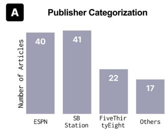

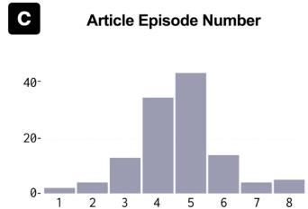

日 The Frequency of Visualization Charts

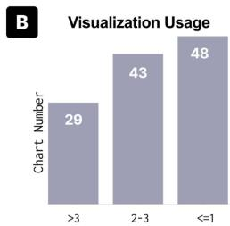

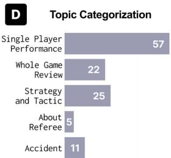

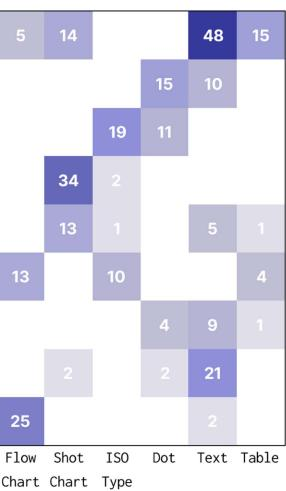

Fig. 1. Statistics in the preliminary study: article publisher categorization, usage of visualizations, distributions of topics, numbers of episodes, and the frequency of visualization charts regarding 9 fact types.

# B. Preliminary Study

To understand the requirements for editing sports news, we reviewed the sports articles and conducted an in-depth interview with journalists. We create a dataset with 120 sports journalism articles of NBA games as the basis of the preliminary study. For each article, we summarized the insights presented, examined the writing structures used, and identified the types of charts included in the articles. Finally, we interviewed journalists to confirm our findings. 

Articles Collection: We searched for NBA game recaps and related news from the January to March 2022-2023 season with Google Search. The collection process followed Google’s default recommendations based on popularity. We selected 120 articles that contained detailed game data analysis, subjective viewpoints of authors, and visual elements. We ensured the collected articles cover all NBA teams. To mitigate analytical bias from single sources, efforts were made to evenly draw from outlets such as ESPN, SB Nation, FiveThirtyEight, and others (Fig. 1(A)). 

Analysis: For each article, we summarized the insights presented, examined the narrative structures used, and identified the types of charts (Fig. 1(B)). 

Interview: We interviewed two senior sports journalists, who are both from top-tier sports news media. They specialize in uncovering the stories behind basketball games and have over five years of experience in delivering NBA news. During the interview, we presented our analysis and discussed with journalists about their creation process. Thus, we have summarized the following findings: 

F1: Insight forms the origin input: The majority of sports news articles are about specific insights. With the assistance of the two expert news journalists, we prioritized the extraction of summary statements from article titles, opening, or closing paragraphs as insights [52], [53]. In cases where multiple article insights existed, we followed the predefined rules outlined in the coding book and finalized the insights through group check discussions [54]. After analyzing the corpus, we discovered that all sports news articles fall into one of five topic categories: single player performance, whole game review, strategy and tactic, referee, and accident. In the 120 data-driven stories we examined (Fig. 1(D)), 57 articles $( 4 7 . 5 \% )$ were found to focus on single player performance. Meanwhile, 25 stories $( 2 0 . 8 \% )$ centered around strategies and tactics, and another 22 stories $( 1 8 . 3 \% )$ provided a comprehensive review of the entire game. The remaining articles covered topics such as accidents (11 articles, $9 . 2 \%$ ) during the game and referee decisions (5 articles, $4 . 2 \%$ ). Each insight has unique tasks. Following the typologies of visual analytics tasks [55] and sports analytics tasks [26], we categorized the tasks into identification, comparison, and summarization. For example, a writer proposed, “the Blazers shot well but played poorly in the second half.” This insight is mainly about the topic of whole game review and the task is comparison. 

F2: Narrative structure behind the insight serves as a writing reference: The narrative structure guides the content creation process by providing a clear framework for unfolding the narrative. We conducted a statistical analysis of the narrative structures and found that linear storytelling is a predominant narrative structure in sports journalism, accounting for approximately $9 5 \%$ , such as induction, deduction, or deduction and summary, to convey insights effectively. Then journalists establish logically chunked episodes. Our findings also suggest that the majority of scrutinized articles consist of 3 to 6 episodes (Fig. 1(C)). 

$F 3$ : Segmenting the content into episodes for writing: Sports news is commonly organized by episodes. The journalists used to divide the narrative into digestible episodes, articulating viewpoints clearly and following a step-by-step approach in writing. This facilitates readers to easily comprehend and follow the unfolding story. Adapted to the specific topic and task, distinct episode divisions are implemented. Each episode is a logical chunk of information that contributes to the overall narrative. The description serves to concisely encapsulate and summarize the content within each episode. 

F4: Visualization is the attention-grabbing highlight: Sports media have increasingly embraced visualizations to enhance quality. Compared to text-only descriptions, charts are more effective at capturing the attention of sports fans [21]. To 

better understand the usage of visualization in sports articles, we classified the sports news visualizations from a data fact perspective [1] and calculated the frequency (Fig. 1(E)). 

F5: The output is multimodal: Sports journalism utilizes a variety of media formats, including videos, tables, text, and charts, to provide information at different levels of detail. It is common to use a combination of visuals and written content to convey specific viewpoints, often accompanied by video clips as supporting evidence. 

# C. Requirement Analysis

This work aims to generate sports articles based on a given insight. Based on the preliminary study and feedback from journalists, we have developed a four-step approach for article creation: 1) query interpretation, 2) narrative structure, 3) visual mapping, and 4) presentation. Each corresponds to a key question derived from the findings. 

Q1: What is the data space behind the insight? The data space plays a pivotal role as the fundamental bedrock that supports the generation of insights. Our raw basketball game data from NBA_API [56] (Section V) consists primarily of event data from play-by-play records, statistics from box scores, and metadata for teams and players. 

R1: Reveal insight-based data space: Prior studies have demonstrated that sports fans are highly interested in game statistics [57]. Therefore, the journalists necessarily have a fundamental understanding of the data space to check. 

Q2: How to create a logical and engaging narrative? A narrative structure template that is closely linked to the topic and task can help journalists avoid the cold start problem [2]. Templates structured around episodes can enhance the quality of data news, effectively integrating insights. 

R2: Optimize the narrative structure: In addition to the templates, it’s essential to integrate domain knowledge to adjust the sequence and content of episodes [58]. The journalists could modify the narrative structure freely. 

Q3: How can we combine data analysis tasks and visualize them effectively? The field of sports data journalism creation involves two applications of data visualization: analytical (exploratory) and narrative (communicative) [39]. There is frequently a disparity between these two forms. 

R3: Expressive story representation: To convey the insights and avoid ambiguity, the generated news should be represented in both visual and textual forms. 

R4: Ensure chart comprehension: Due to an uneven level of understanding of complex and advanced charts among experts and fans [50], elementary and intuitive charts should be used to reduce readers’ cognitive load. 

Q4: How can customize data news in sports journalism? Creating sports news necessitates consideration of multiple factors, such as visual consistency and diverse contents, both of which can impact audience perception of the story being conveyed [59]. Automatically generated visualizations and texts often struggle to meet journalists’ needs. 

R5: Easy story editing: By leveraging an episode-based generation process, users can engage in flexible interactions to make 

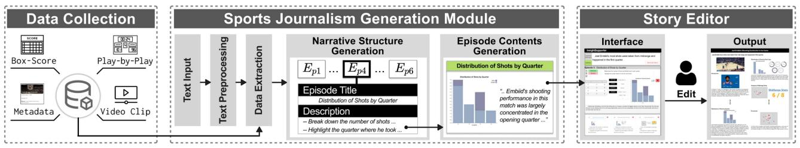

Fig. 2. The workflow encompasses three modules: a data collection module, a sports news generation module, and a story editor.

TABLE I BASKETBALL STATISTICAL DATA DESCRIPTION

<table><tr><td colspan="2">Box Score Data</td></tr><tr><td>Player</td><td>Individual player&#x27;s statistics for the game, such as MIN: playing time, FG: field goal, PTS: points.</td></tr><tr><td>Team</td><td>Entire team&#x27;s overall statistics for the game.</td></tr><tr><td colspan="2">Event Data</td></tr><tr><td>Action Type</td><td>The classification of event types, such as shot type, offensive rebound, and defensive rebound.</td></tr><tr><td>Team Score</td><td>Scores made by Team Home/Away at the event time.</td></tr><tr><td>Position</td><td>The spatial coordinates of events that happened on the court, such as shot, steal, and block position.</td></tr><tr><td>Video Clip</td><td>The video clip containing the event were divided according to the timestamps.</td></tr></table>

modifications to narrative, visualization, and content, thereby creating a compelling data story. 

# IV. SNIL WORKFLOW

Based on the questions and requirements above, we propose a human-AI collaborative workflow (Fig. 2) to generate basketball data news from user input. The system is composed of three components: a data collection module, a sports news generation module, and a story editor. The data collection module fetches data from game IDs, while the sports news generation module parses user input, organizes the narrative of the news, and generates visualization content in each episode. The story editor allows users to edit the logical order, chart types, and text content, thereby enabling the generation of customized news. In the following sections, we introduce the details of our workflow. 

# V. DATA COLLECTION

Sports journalism is a highly time-sensitive field, wherein journalists must retrieve data quickly to report the game [60]. ESPN is a site that both journalists and fans rely on for data. It provides box scores and visualizations, such as game flow, to effectively present statistical information. We employed NBA_API [56], an API client package to retrieve raw datasets from NBA.com. We have constructed a data collector, which enables efficient transformation of the data into play-by-play, box score, and metadata formats, which are then linked to their game IDs. Our goal was to ensure that the resulting data closely aligns with the presentation style found on widely-used sports websites like ESPN. Table I comprehensively describes the basketball data utilized as the foundation for journalism production. The game data are fetched from the user’s selected match. The box score presents statistics for players and teams, while 

the event data includes a comprehensive record of all events during the game. We have cleaned and refined the event data by specifying each event’s technical action types and shot position information. Video clips are frequently utilized in journalism to enhance expressiveness, commonly employed to provide visual support for news or analysis. We have collected raw live NBA game highlights from NBA.com [56] as our video data. 

# VI. SPORTS NEWS GENERATION

# A. Text Preprocessing

The sports news are generated from the user input. A sports news usually consists of the five $W _ { s }$ , i.e., who, what, when, where, and why [21]. The why provides a detailed explanation of the other four $W _ { s }$ . Therefore, we first parse the basic information of the expected news, i.e., four $W _ { s }$ : (who, what, when, and where), from the user input, and try to retrieve related data and compose a narrative-coherent news with multiple episodes to explain the details. The four $W _ { s }$ in basketball sports data news include players and teams (who), the locations or areas on the court (where), specific times or periods (when), and detailed game statistics (what). 

To process user input, we employ several natural language processing (NLP) techniques. Our parsing of texts involves three main steps. The first step is Named Entity Recognition (NER), a fundamental NLP task that involves identifying and classifying five segments of the user input: Player, Team, When, What, and Where. We utilize a pre-trained transformer-based large language model through the PaddleNLP [61] to accurately recognize entities within the input text. 

The second step involves conducting Open Information Extraction and Constituency Parsing on the input to extract propositions and subphrases. Each proposition includes a predicate and an unspecified number of arguments [62]. By decomposing syntactically complex sentences into their constituent relations, we can do data extraction and generate narrative structures to solve subsequent tasks. 

The final step entails the classification of the input text into five predefined categories related to sports journalism topics, along with three tasks (F1), such as the example, “The Lakers hustled more, but the Mavericks’ shooting prevailed, and this helped the Mavericks win the game.” This sentence concerns the topic in strategy and tactic, involving the task of comparison. For the classification, we utilized BERT [63], a pre-trained language representation model. We have added classification layers and fine-tuned the layers with our collected insight examples. The 

model achieved a $9 5 \%$ accuracy rate in topic classification and $96 \%$ in task classification. 

# B. Data Extraction

Our database contains box scores, play-by-play data, video clips, and metadata. The data extraction is composed of two steps. First, we queried box scores from the database using four $W _ { s }$ derived from text preprocessing. Second, we aligned the box scores and play-by-play data with the videos because it is common to accompany the textual label with video highlights in sports journalism. For the alignment, we detected the countdown clocks of the quarters and possessions [36] in the video, such as “1st 5:45”. We leverage PaddleOCR [64] to recognize the time information in the videos. Videos are captured at 30 fps, with detection conducted every 15 frames. This ensures that we can obtain clip videos corresponding to all events in the play-by-play. This division of segments helps explain the data space behind the insight (Q1) and provides a reference for the narrative structure. 

# C. Narrative Structure Generation

Narrative structure generation aims to produce a clear and concise framework for news. The types of narrative structure [65] include linear, non-linear, parallel, and circular structures [66]. Due to the prevalence of linear narratives [67], [68], we prioritize this storytelling type (F2). Linear narratives follow a straightforward progression, presenting episodes to the audience chronologically. In a linear structure, episodes occur sequentially, leading the audience from one scene to the next [69]. The characteristics of a linear narrative have led us to consider a general framework for narrative generation. Referring to the framework for goal-driven narrative video generation [70], we outline a narrative structure generation method for sports articles. In this study, we define a narrative structure to be a series of linguistic narrative episodes $E _ { p i }$ , each accompanying additional description sentences $D _ { i }$ and event sequences $S _ { i } ( \mathbb { F } 3 )$ . Each event sequence is composed of a series of events $S _ { i } =$ $[ e _ { 1 } , e _ { 2 } , e _ { 3 } , \ldots , e _ { k } ]$ , where $k$ represents the number of events. This methodology capitalizes on user inputs to derive event sequences, thereby constructing a narrative. 

An overview of the generation pipeline is showed in Fig. 3. After obtaining the game metadata, user input is received. During the preprocessing, the input is processed through parsing and sentence segmentation, thereby transforming into constituent subphrases and structured semantic vectors. Concurrently, sports-related terms are retrieved based on the domain knowledge $K _ { d o m }$ . The $K _ { d o m }$ is primarily concerned with the professional basketball terminology, specifically action types such as mid-range shots with location and temporal events like final-moment game-winning shots or tactic type in “what”. This stage also determines the story analytical task $K _ { t s k }$ and the topic (F1). In this case, the input is classified under the topic of single player performance, with the task being comparison. 

In the narrative generation stage, it is common to organize linear narratives using a deduction and summary structure. This structure involves positioning the background of the article at the beginning and the conclusion at the end. The construction of 

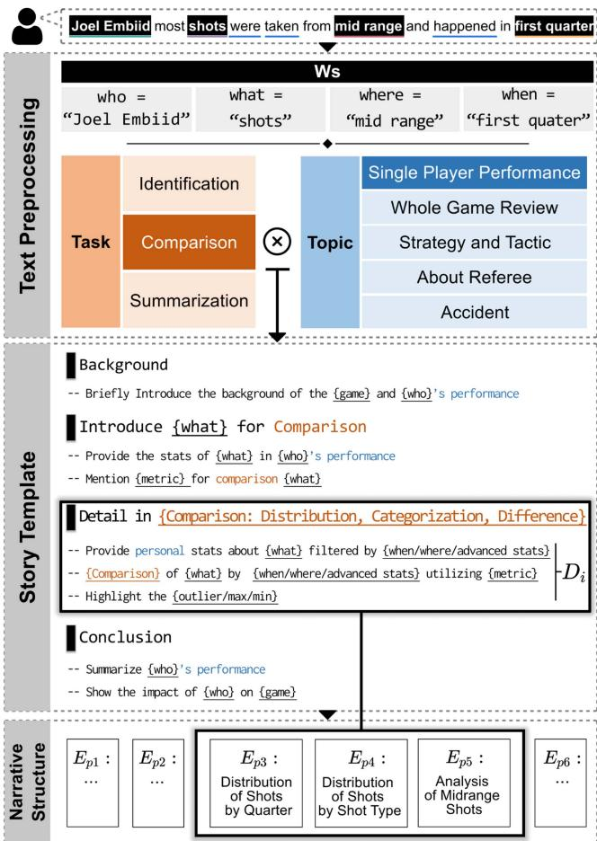

Fig. 3. The pipeline of narrative structure generation. The user input is subjective to preprocessing using nlp methods. Based on the topic and task, a predefined template is selected. After being filled by $W _ { s }$ , metadata and $K _ { d o m }$ , a narrative structure is formed.”.

the story template $K _ { t e m }$ is rooted in the categorization of topic and task, drawing upon our preliminary study’s examination of the structural patterns in diverse sports news. We employed a combination of heuristic rules and machine learning techniques to analyze how words assumed various roles within a text corpus. This analytical procedure contributed to the creation of a comprehensive story template, filled with $n$ episodes, $[ E _ { p 1 } , E _ { p 2 } , E _ { p 3 } , . . . , E _ { p n } ]$ . Each of the episodes is a set that consists of elements: 

- Episode Title reflects the episode contents. 

- Event Sequence comprises all the play-by-play events in data space related to the episode. 

- Description, consisting of short sentences with a verbobject structure, provides an overview of the contents. 

Each topic and task employs unique templates, reflecting their distinct characteristics and requirements. Drawing upon the template in Fig. 3, the background episode offers an initial understanding of the game and player’s performance. Subsequently, we introduce the “what” utilized for comparison, along with the corresponding “metric”. From the perspective of the four $W _ { s }$ , we then delve into the details of the comparison. Finally, 

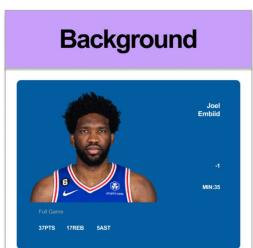

-- Briefly introduce the game and Joel Embiid'sperformance

Joel Embid's Shot Attempts

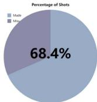

-- Provide the total number of shots Joel Embiidattemptedinthegame

-- Mention the percentage of shots he made 2

Distribution of Shots by Quarter

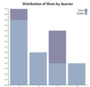

--Break down the number of shots Joel Embiid took ineach quarter

-- Highlight the quarter where he took the most shots 3

DistributionofShots by Shot Type

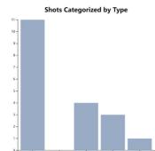

--Categorize Joel Embid'sshots by type (midrange, three-point,layup,etc.)

-- Mention the percentageof shots he took from each type 4

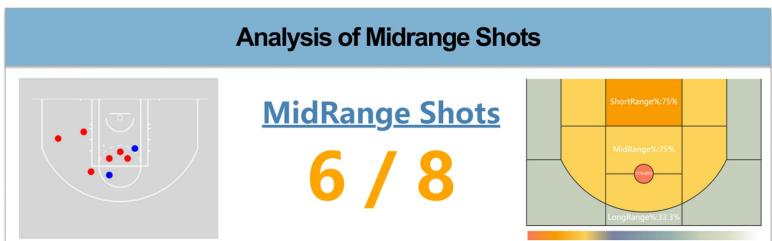

-- Focus on Joel Embiid's mid-range shots

-- Provide the number of mid-range shots he attempted and made

-- Compare his midrangeshoting percentage tohis overallshooting percentage

# Conclusion

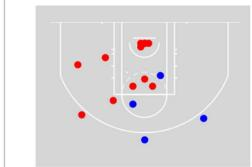

-- Summarize Joel Embiid's shooting performanceinthegame

--Provideinsightsonhis shooting distributionand effectiveness

# User Input:

Joel Embiid most shots were takenfrommid rangeand happened in first quarter. 

·Topic: Single Player Performance 

·Task: Comparison 

Value

Distribution

Proportion

Difference

Fig. 4. A logical narrative structure with six episodes created by SNIL about the insight: “Joel Embiid most shots were taken from mid-range and happened in the first quarter.” Each episode includes title and description to facilitate the generation of charts and text.

the conclusion episode encapsulates the performance and the results. 

Building upon the templates populated using the results of text preprocessing and metadata, we employ $K _ { d o m }$ to elaborate on the basketball technical data statistics-related nouns, including but not limited to “advanced stats” and “metrics”. This process generates episodes focused on shooting aspects such as shooting accuracy and shot types [71]. We utilized the large language models, specifically gpt-3.5 [11], to generate episode titles and description sentences. Prior to the emergence of LLM, there already existed corresponding corpora datasets containing expert knowledge for sports news generation [6]. Given the consistency of game data entries’ attributes, whether they are derived from box score statistics or play-by-play event information, each record contains identical attributes. As a result, we can directly apply expert knowledge from $K _ { d o m }$ and four $W _ { s }$ to extract relevant event sequence $S _ { i }$ . 

Taking the second episode in Fig. 4 as an example, titled “Joel Embiid’s Shot Attempts”, within the episode we have acquired the corresponding event sequence $S _ { i }$ and the central theme revolving around the “introduce shots for comparison”. This episode chiefly centers on the introduction of shot attempts and the metric, which is the field goal percentage. The automatically generated description sentences $D _ { i }$ are formulated based on semantic logic, exemplified by phrases such as “mention the percentage of shots he made”, aimed at elucidating Embiid’s shooting accuracy. 

Finally, a narrative structure is generated (Q2). The author’s choice of narrative mode is closely tied to their personal style and creative expression. However, relying solely on a predetermined narrative mode may not sufficiently address the storytelling challenges. To enable customization, we also apply an interactive 

approach (Section VII) in InsigthSupporter that allows users to modify the structure by adding, removing, and rearranging episodes (R2). 

# D. Episode Contents Generation

The episodes are logical junctures, forming the entire narrative structure (F3). The output of each episode includes textual and graphical representations (R3). In the subsequent sections, we will explain how both of these are generated. 

1) Chart Generation: Based on the description provided, our initial task is to determine whether using charts would be beneficial in supporting the analysis (F4). In the event that visual aids are deemed necessary, we would employ the data fact approach [1], [72], [73] to simplify the complexity of the event sequence $S _ { i }$ and extract the requisite data for chart generation. The data fact approach represents a widely adopted method in the automated generation of data-driven narratives from tabular datasets, where data facts serve as fundamental building blocks. These data facts are derived from the description sentences of the episode. In our approach, we initially referenced the definition of data facts and associated them with data attributes specific to the basketball domain. A data fact [3], [73] is conceptualized as a measurement encompassing a collection of data elements within a designated subspace of the data domain related to insights. This measurement relies on quantifiable data fields that are inherent to fixed attributes within the basketball domain. For the purpose of chart generation, we define data facts as F = {f act_type, measure, breakdown, subspace}. Importantly, fact types are linked with chart types. The categorization of fact types delineates the nature of information each 

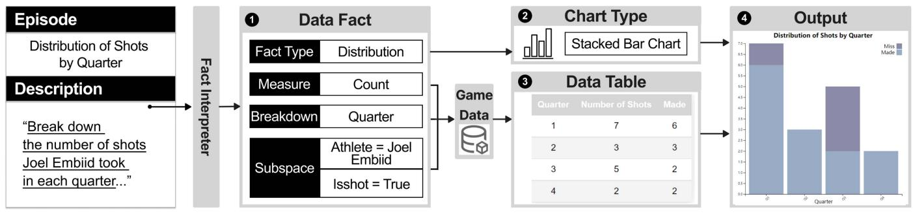

Fig. 5. The chart generation pipeline is initiated from the description sentence “Break down the number of shots Joel Embiid took in each quarter”. The process begins with the fact interpreter parsing the description to generate the data fact. The fact type is identified as distribution, appropriate chart templates are chosen. Utilizing the data fact, a data table is derived from a collection of game data. Ultimately, this process culminates in the generation of a chart titled “Distribution of Shots by Quarter”. We also offer a control panel for modifying the chart type and data fact.

fact conveys, which is determined by the prevalence of visualization charts corresponding to these fact types in basketballfocused sports journalism. 

Referring to the definition in Calliope [1], when the fact type is known, we use the subspaces, measures, and breakdowns as parameters to constrain the facts. Given the consistent nature of attributes and items in basketball technical statistics, we can identify and extract terms from the description. The subspace parameter is mandatory and represented by a set of data filters that partition the data scope of the fact. These filters are based on the column names and terms related to the event sequence $S _ { i }$ . For various fact types, their default breakdown and measurement criteria differ. The breakdowns are either time series or categorical data items used to group the $S _ { i }$ . In the realm of measurements, we offer four commonly utilized methods: count, sum, average, and percentage statistics. Given that the principal measure for data revolves around either the count or percentage of successful shots made, we calculate the statistics pertaining to event items for each group. Using this rule-based approach, we transform the event information in NBA games into the data tables (R4). 

Considering the following instance focused on Joel Embiid’s shooting timings, the data fact {{“Distribution”}, {“Count”}, {“Quarter”}, {{“Athlete” $=$ “Joel Embiid”}, {“Isshot” $=$ “True”}}} serves as guiding the generation based on the description: “Break down the number of shots Joel Embiid took in each quarter”. The data table obtained by applying data facts to the data space processing can be referenced in Fig. 5. This transformation allows us to convert the chart generation problem into the creation of fixed chart types based on text narratives, event data, and tabular data. 

Drawing from preliminary analysis of chart styles prevalent in sports news (as shown in Fig. 1(E)), we have designed visualizations in alignment with Perin’s classification of sports data types [39]. These visualizations accommodate both box score data and tracking data, inclusive of shooting location information. We have developed chart templates for each fact type. These chart templates include the corresponding chart type, predefined chart title formatting, legend color styles that match team colors, and default settings for axes [74]. 

2) Text Generation: The narrative text should be related to the description and offer an interpretation of the chart. We 

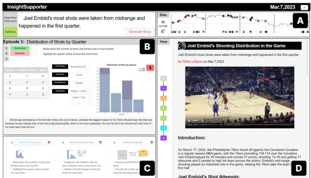

Fig. 6. The online story editor interface of SNIL. (A) The Data View displays events extracted from insight. (B) The Episode Editor supports editing episode elements. (C) The Storyline View offers an overview of the entire news and allows for narrative structure editing. (D) The Story Visualization View presents the generated news results.

utilized gpt-3.5 [11] to generate narrative text for each episode. This approach helps bridge the gap in understanding advanced statistics between experts and fans by presenting the analysis results in descriptive language (R4). Refining the task of the user input into descriptions grouped by episodes, where each episode has its own data facts, addresses the gap between data analysis tasks and data presentation tasks. This allows for a logical expression of narrative texts and charts, thereby improving the coherence of the overall presentation (Q3). 

# VII. STORY EDITOR

To enhance the appeal of the generated content and engage readers, interactive tools must be made available for users to personalize the narrative while maintaining coherence (Q4). 

We design an interface consisting of a data view (Fig. 6(A)), an episode editor (Fig. 6(B)), a storyline view (Fig. 6(C)), and a story visualization view (Fig. 6(D)). 

The data view is presented through an interactive gameflow that captures the score changes as the game progress. By hovering on the icon, users can access the corresponding event, thus revealing the underlying data space that informs the Insight (R1). The storyline view presents a row of generated episode thumbnails, allowing users to customize the order of narrative episodes according to their preferences by adding, removing, 

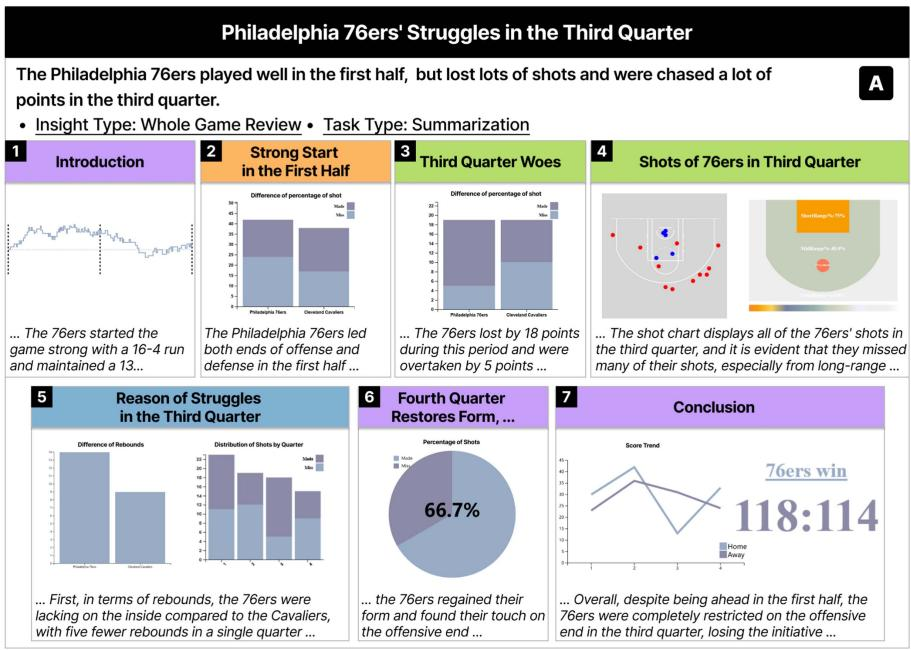

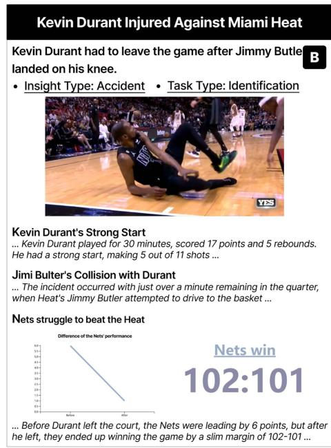

Fig. 7. Two sports news examples generated by SNIL: (A) a story about the whole game review for “Philadelphia 76ers’ struggles in the third quarter” within the storyline mode and (B) a story about the accident for “Kevin Durant Injured Against Miami Heat” within the swiper mode.

or rearranging them (R2). Once selected, the episode editor will display its episode elements. Users can easily modify the description to adjust automatically visual and textual contents within the episode. The data table showcases data details extracted from the included data facts (R4). The text generated by LLMs highlights fields related to the description or the data. Furthermore, users can customize the generated charts and text content (R5). 

The generated sports news can be presented through the widely used swiper mode, known for its linear narrative structure in sports news (F2). The video clips that correspond to the event sequence will be presented before the first episode within the view. To enhance the visual representation of various data facts within each episode, a color-coding scheme is utilized on the process line located on the left-hand side. 

# VIII. EVALUATION

We evaluate SNIL via (1) three examples of sports news created with SNIL, (2) a comparative study to estimate the quality of narrative and visualization of the sports journalism automatically generation module, and (3) controlled usability studies with experts and fans. 

# A. Example Sports News

We selected three news generated by SNIL, each illustrating a different type of insight, as shown in Fig. 4 (Single Player Performance) and Fig. 7(A) (Whole Game Review), Fig. 7(B) (Accident). These instances represent three prominent categories within our classification, encompassing $7 5 . 0 \%$ of all collected articles. The remaining two categories, Strategy and Tactic, and About Referee, present complex content with a higher reading 

threshold, requiring readers to have a foundational understanding of game and referee rules. 

In the first example, one of the journalists collaborating with us selected the March 17th game between the Philadelphia 76ers and the Cleveland Cavaliers. After viewing the game, he provided the insight about single player performance, “Joel Embiid most shots were taken from mid range and happened in first quarter.” A generated journalism describes Embiid’s overall performance in the game, achieving a double-double with 35 points and 17 rebounds and noting his impressive $6 8 . 4 \%$ shooting percentage. The report then continues to describe Embiid’s shooting performance by quarter and by shot type. Further analysis of his shooting performance by quarter reveals that he excelled in the first quarter, particularly in jump shots. Then next episode highlights his midrange shooting performance and described how he made 6 out of 8 midrange shots. Finally, the report summarizes Embiid’s contribution to the game, showcasing his impressive midrange shooting performance in the first quarter. 

The second example, as shown in Fig. 7(A), provides insights on the whole game review of the same match, “The Philadelphia 76ers played well in the first half but missed many shots and fell behind by a significant margin in the third quarter.” The story illustrates the score trend of the entire game by a gameflow chart(Fig. 7 A-1). The 76ers had a strong start, leading the Cavaliers by 13 points at halftime due to their higher shooting accuracy (Fig. 7 A-2). However, the 76ers struggled in the third quarter and were overtaken by five points (Fig. 7 A-3). In the third quarter, the 76ers missed many shots, particularly from beyond the arc, where their three-point shooting percentage was zero (Fig. 7 A-4). The Cavaliers outrebounded the 76ers by five and had more consistent shooting (Fig. 7 A-5). In the fourth quarter, the 76ers bounced back and won by nine points with a 

shooting accuracy of $6 6 . 7 \%$ (Fig. 7 A-6). Finally, the 76ers won the game with a score of 118:114 (Fig. 7 A-7). 

The third example (Fig. 7(B)) showcases a concise news report on an accident that “Kevin Durant had to leave the game after Jimmy Butler landed on his knee.” A video clip is shown, which depicted the moment of Durant’s injury. The story highlights Durant’s exceptional performance on the court as he helped his team score 17 points. Unfortunately, in the third quarter, Jimmy Butler landed on Durant’s knee, causing him to leave the game. Despite leaving the game with a 6-point lead, the Brooklyn Nets managed to secure a hard-fought 102-101 victory in the end. 

# B. Comparative Study

We estimated the quality of the automatically generation module via comparative study between original news and the reproduced version by SNIL. 

Participants: We undertook a study involving 12 sports enthusiasts (P1-P12; $\mathbf { M } = 8 , \mathrm { F } = 4$ ), who were either supporters of various teams or neutral fans. Our target group consisted of avid followers of basketball news. All participants had a minimum of two years of experience in watching NBA games and watched at least one game per week during the season. Moreover, they have a keen interest in basketball games and regularly keep themselves up to date with the latest developments in NBA games by checking news updates on various websites at least three times a week. Four participants had prior experience in data analysis, with two of them frequently analyzing basketball game data. 

Data: To minimize the effects of data inconsistencies on the reception of news, we classified basketball news articles according to the topics. For each category, we selected one article from the sports community that focused on individual basketball games. Our selection aimed to cover a diverse range of visualizations, including three long-form and two short-form articles. For each article, we utilized SNIL to automatically generate a reproduced version of the data news that shared the same insight basis. 

Procedure: We conducted the study using an online meeting format. The study lasted for 40 minutes, consisting of a 30- minute experiment involving both long (8 minutes) and short (3 minutes) news segments, followed by a 10-minute post-study interview using a “Think Aloud” protocol. After filling out a consent form agreeing to record their feedback, participants were required to complete a comparative task. After individually reading both versions, participants were queried on the main content of the news and asked to identify primary insights and overviews for each rendition. Subsequently, participants were informed of the common insights shared between the two articles. They were instructed to rate insightfulness and logicality of the narrative, as well as the understandability and aesthetics of the visualization using a 1-5 scale and choose the option with superior overall quality based on the previous four indicators. As compensation for their participation, each participant was paid $\$ 20$ . 

Results: Fig. 8 displays the 300 ratings we collected from 12 participants. SNIL’s automatically generated journalism 

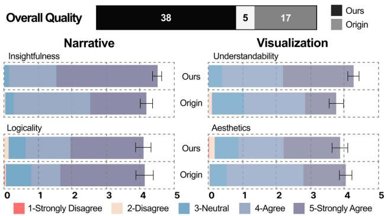

Fig. 8. The assessment of the overall quality, narrative, and visualization was evaluated by 12 participants, using a five-point scale, where 5 represents the highest rating and 1 indicates the lowest.

received relatively favorable ratings in terms of narrative insightfulness and visualization understandability. $63 \%$ (38/60) of the overall quality ratings favored SNIL generated sports news, citing better overall quality on narrative and visualization. In our comparative study, we also collected many positive comments and summarized them below. 

Narrative: Among the feedback, the sports data news generated by SNIL is more insightful and capable of conveying valuable data insights. P2 noticed that the content in our generated journalism was closely aligned with the insight titles and mentioned that “the article (created by SNIL) indeed closely aligns with insights, which is precisely what I wanted to see.” P11 found the reproduced version more informative, stating that “the short news for individual events looks good. Besides the moment of injury, I also want to know how Durant performed.” As a participant with a background in data analysis, P1 preferred sports news that incorporated data analysis and commented that “this actually convinced me. I prefer the type of news with data-supported content, and I agree with the description of Embiid’s offensive tendencies.” For narrative aspect, the data stories generated by SNIL and the original versions received a similar score, indicating the effectiveness of our automated method in a logical arrangement. P9 commented that “the logical order of the news made it easier for me to read, and the episodes were well connected”, but some preferred innovative and captivating storytelling methods that transcend the limits of linear narrative structures and conventions. P6 noted that “for a review of the entire game, interesting narrative such as reverse order and flashbacks can make reading more enjoyable.” Nonetheless, some participants perceive the automatically generated text as dull and uninspiring. P6 also stated, “I prefer to call Luka Donˇci´c as Luka Magic or Don77, which is more fun than his official name.” 

Visualization: In terms of visual aesthetics, the automatically generated charts fall short compared to manually authored ones. However, when it comes to visualization understandability, $86 \%$ of the respondents favored the news charts generated by SNIL, finding them more user-friendly. Participants appreciated our use of common basketball chart types in daily news to express data insights. P1, for instance, read each chart in every episode and stated that “by combining the chart with the episode title, 

I could grasp the insight.” Participants recognized the use of shot charts, area charts, text charts, and game flows, which conform to basketball game data conventions, as they prevent cognitive overload that may arise from complex charts in the original version. P7 commented, “the design of the shot chart and area chart compared to the second one (original version) is more understandable, and I can comprehend the player’s shooting performance more easily.” P12, another participant with a data analytics background, presented an argument that “the Sankey diagram, an advanced chart type in the second one, which encodes scoring types with colors and attempts with bar width, can be broken down into basic charts. In reality, it took me some time to learn and understand this advanced chart.” Furthermore, the vote results reveal a slight discrepancy between the aesthetic quality of automatically generated journalism and that of the original news articles. Some participants noted that the photos of players during matches in the origin news affected the overall attractiveness. P6 commented that “the images of this game are captivating as they show the details of the dunk.” All participants agreed that the swipe mode is suitable for browsing sports news on mobile phones, but other layout formats are also needed. P9 commented that “a dashboard or infographic would enable me to have an overview of the whole story at a glance.” 

# C. Usability Study

Our previous study successfully demonstrated the coherence of the narrative and the comprehensibility of the graphics in automated sports journalism. The purpose of the study was to evaluate the usability. 

Participants: Two experts for journalism writing (denoted as J1,J2) we interviewed earlier also got involved in the usability study. We have recruited two senior sports analysts (denoted as A1, A2) with roles encompassing making comprehensive match reports and scrutinizing the performance of both the college team and adversaries. Additionally, four bloggers participated (denoted as B1-B4) who are actively involved in sports-related community discussions. 

Procedure: Each study included a 10-minute introduction to the SNIL, followed by experts using it to understand its functionality. After familiarisation with the system, the experts were asked to create a sports news in 20 minutes. Each participant can select the most memorable match of their own choosing. During the process, we encouraged them to propose their own insights, and use descriptions to modify contents, and we employed the think-aloud protocol to gather feedback. Finally, we interviewed the experts regarding the system’s efficiency, usefulness, and ease of use. The entire process lasted 40 minutes, and the news was recorded for subsequent analysis. Each participant was paid $\$ 20$ . 

Observations and Feedback: Due to the constrained sample size, our study opted for a qualitative evaluation of the system rather than a quantitative approach. All participants successfully produced a sports news article based on their own insight. However, some participants (B2 and B3) took longer to complete stories due to their limited memory of specific games, thus requiring them to spend additional time reviewing the details. 

The other feedback provided by the participants regarding the system is summarized as follows: 

Efficiency: All participants completed their news production within a short time frame (avg. $1 6 ~ \mathrm { m i n }$ ). Some even experimented with multiple insights before selecting the most effective one for presentation. Bloggers tended to produce shorter news stories. A1 noted that “the ability to retrieve data quickly helped me identify the buzzer beater.” However, A1 also observed that “the video clip lacked a multi-camera perspective replay.” Conversely, sports writers and data analysts preferred to use SNIL to create longer news stories, as J2 noted that “with this system, I am capable of proficiently crafting a narrative by initially generating a draft and subsequently refining it.” J1 was fascinated by the automated process and praised its ability to start with an overview and complete each section with details - a writing style that J1 also employed, saying that “the automation of this process is truly amazing.” 

Usefulness: SNIL’s automated data chart extraction and generation system has garnered expert praise. The tool proves particularly useful for users with limited data analysis or visualization skills. A2 lauded “the system’s ability to meet my data extraction needs and verify my insights.” Meanwhile, J1 said “the diverse organizational forms provided for presenting insights, which have inspired further creativity.” Additionally, two sports analysts endeavored to enhance the descriptions, which enabled SNIL to successfully support advanced basketball metrics such as player efficiency rating (PER) and true shooting percentage $( \mathrm { T S } \% )$ . Data journalists J1 and J2 believe that our implementation of the episode editor module is effective. J1 stated, “the chart types almost cover the visualization methods commonly used in basketball news.” He also proposed, “enhancing the interactivity of the generated graphs”, which would enable readers to explore the data more extensively. SNIL fills the gaps between two tasks by approaching from an analytical standpoint and presenting data in a viewer-friendly visualization. 

Ease of use: Utilizing descriptions in each episode to fine-tune the content of each episode and using option boxes to adjust the charts was well-received by the participants. Notably, participants(J1, J2, A1, A2) acknowledged the controllability of our interactive generation method. J2 remarked, “Attempting direct generation with ChatGPT lacked controllability and failed to meet my expectations. In contrast, the SNIL workflow allowed for a precise and controllable generation.” Similarly, B4 also mentioned, “this natural language-guided interaction generation method, with sufficient data support, may be used for real-time strategic analysis in sports matches.” However, data analyst A2 suggests incorporating the option for “providing users with supplementary recommendations to facilitate the generation.” 

# IX. DISCUSSION AND LIMITATIONS

Communicating insights through multi-modal format: With the development of the multimedia era, people’s demand for data journalism visualization has increased, leading to new multi-modal news dissemination methods. Many techniques have been developed to reduce the cost of producing data journalism by mining insights and lowering the barrier to data 

visualizations. However, creating multi-modal data journalism, including text, images, charts, videos [75], and VR-embedded visualizations [26], remains challenging. In addition to data representation and logical consistency are critical aspects that should be considered when creating multi-modal forms [39]. To address these challenges, we propose an approach based on the writing process, which automates the deconstruction of insights to reconstruct multimedia sports news. Feedback from experts has demonstrated the potential of our approach. J1 remarked, “it is very suitable for leagues with only basic data, such as lower-level or youth leagues, which solves the problem of the lack of match reports.” We hope our work can spark further research into multi-modal generation. 

Enriching visualization and enhancing news with interactivity: SNIL is a proof-of-concept system that generates swipemode news articles with limited chart types and layouts. However, it currently lacks support for style customization. J1 and M2 suggest that the existing generated visual encoding is relatively simple and could encode more information to make the charts more complex within acceptable limits. M1 also points out that “the difference in score between two teams can be highlighted or labeled on a line chart.” Adding interactive features to automatically generated charts, such as filters, lenses, and hovers, particularly connecting multiple charts through interaction, poses a challenge. One possible solution is to model the relationship between charts to address this issue [76]. Providing more advanced visualization representations and enhancing news with interactivity would be valuable for future work. 

Expanding to other topics of data journalism beyond just sports: SNIL specializes in producing sports news. However, its inability to support other topics limits its overall usability [77], [78]. Additionally, other topic-related tasks differ from sports analytics due to the distinct nature of the datasets involved. While we primarily use event sequence data, which can be extended to other topics with similar format datasets, many other topics contain many data columns - sometimes numbering in the hundreds or thousands - posing scalability challenges for our narrative generation module [70]. A promising research direction could involve fine-tuning LLMs with professional domain knowledge to generate news content targeting different topics. Even personalizing training on LLMs to produce text with a unique style could be explored. Nonetheless, it is crucial to maintain the accuracy of the analysis and the quality of the written expression to ensure the success of such an approach. A potential avenue for research is to focus on enhancing the precision of analysis and improving the quality of written expression. 

The utilization of gpt-3.5 [11] comes with inherent limitations: LLMs has notable limitations despite its generally impressive performance across various tasks. One of the reasons for unsatisfactory results in supporting SNIL functions is the absence of current data in gpt-3.5 training set, which only covers up to September 2021, leading to temporal ambiguities in generated text. To enhance SNIL’s effectiveness, including sports news from 2021 to 2023, along with detailed match data and news materials, would be a viable solution. Another challenge stems from LLMs tendency to generate content beyond the expected scope or provide seemingly correct but actually 

erroneous answers, known as the “hallucination problem”[79], which can cause fact-checking issues. The model is also sensitive to slight variations in input phrasing or repeated prompts. Although we have utilized data view and episode editor view with data tables to facilitate fact-checking, it doesn’t fully address safeguarding limitations. While manual review partially helps, we aim to explore the implementation of additional models for AI-generated content verification in the future. Additionally, the interface deployment process of SNIL can sometimes be unstable due to gpt-3.5 lack of full controllability. By employing episode-based narrative structures for news creation and providing interactive means, we have achieved some degree of control over sports news generation. Minimizing these uncertainties remains a future challenge in applying LLM effectively. 

# X. CONCLUSION

We introduce SNIL, a system designed for the automatic generation of basketball news based on an insight, while facilitating adjustments to the narrative structure, textual content, and visualization. Our research findings affirm the effectiveness of a human-AI collaborative workflow for crafting sports news from intricate source data. This approach integrates an episode-based narrative structure with domain expertise and large language models. The challenge of optimizing the use of generative AI for multimodal storytelling remains a subject of future research. 

# REFERENCES

[1] D. Shi, X. Xu, F. Sun, Y. Shi, and N. Cao, “Calliope: Automatic visual data story generation from a spreadsheet,” IEEE Trans. Vis. Comput. Graph., vol. 27, no. 2, pp. 453–463, Feb. 2021. 

[2] M. Sun, L. Cai, W. Cui, Y. Wu, Y. Shi, and N. Cao, “Erato: Cooperative data story editing via fact interpolation,” IEEE Trans. Vis. Comput. Graph., vol. 29, no. 1, pp. 983–993, Jan. 2023. 

[3] J. Zhao et al., “ChartStory: Automated partitioning, layout, and captioning of charts into comic-style narratives,” IEEE Trans. Vis. Comput. Graph., vol. 29, no. 2, pp. 1384–1399, Feb. 2023. 

[4] Y. Fu and J. Stasko, “Supporting data-driven basketball journalism through interactive visualization,” in Proc. CHI Conf. Hum. Factors Comput. Syst., 2022, pp. 1–17. 

[5] J. Gong, W. Ren, and P. Zhang, “An automatic generation method of sports news based on knowledge rules,” in Proc. IEEE/ACIS 16th Int. Conf. Comput. Inf. Sci., 2017, pp. 499–502. 

[6] J. Kanerva, S. Rönnqvist, R. Kekki, T. Salakoski, and F. Ginter, “Templatefree data-to-text generation of finnish sports news,” in Proc. 22nd Nordic Conf. Comput. Linguistics, M. Hartmann and B. Plank, Eds., 2019, pp. 242–252. 

[7] Y. Fu and J. Stasko, “More than data stories: Broadening the role of visualization in contemporary journalism,” IEEE Trans. Vis. Comput. Graphics, to be published, doi: 10.1109/TVCG.2023.3287585. 

[8] Y. Shen, K. Song, X. Tan, D. Li, W. Lu, and Y. Zhuang, “HuggingGPT: Solving AI tasks with ChatGPT and its friends in hugging face,” in Proc. Adv. Neural Inf. Process. Syst., 2023, pp. 38154–38180. 

[9] J. Wei et al., “Emergent abilities of large language models,” 2022, arXiv:2206.07682. 

[10] G. Shirato, N. Andrienko, and G. Andrienko, “Identifying, exploring, and interpreting time series shapes in multivariate time intervals,” Vis. Informat., vol. 7, no. 1, pp. 77–91, 2023. 

[11] OpenAI Inc., “Models - OpenAI API,” 2022. Accessed: Mar. 31, 2023. [Online]. Available: https://platform.openai.com/docs/models/gpt-3-5 

[12] B. S. Thomas Horky, “Sports reporting and journalistic principles,” in Routledge Handbook of Sport Communication, ch. 12, Evanston, IL, USA: Routledge, 2013. 

[13] H. Richards, R. Steen, and J. Novick, “Why sports journalism matters,” in Routledge Handbook of Sports Journalism (1st ed.), ch. 2, Evanston, IL, USA: Routledge, 2020. 

[14] R. Boyle, “Sports journalism,” Digit. Journalism, vol. 5, no. 5, pp. 493–495, 2017. 

[15] J. Wiske and T. Horky, “Digital and data-driven sports journalism,” in Insights on Reporting Sports in the Digital Age, Evanston, IL, USA: Routledge, 2021, pp. 31–48. 

[16] H. S. Kim, K. M. Cho, and M. Kim, “Information-sharing behaviors among sports fans using #hashtags,” Commun. Sport, vol. 9, no. 4, pp. 646–669, 2021. 

[17] S. Okolo, “Can virtual reality improve the health of older sports fans?,” IEEE Potentials, vol. 38, pp. 17–19, May/Jun. 2019. 

[18] N. Ji, Y. Gao, Y. Zhao, D. Yu, and S. Chu, “Knowledge graph assisted basketball sport news visualization,” J. Comput.-Aided Des. Comput. Graph., vol. 33, no. 6, pp. 837–846, 2021. 

[19] M. Liu, Q. Qi, H. Hu, and H. Ren, “Sports news generation from live webcast scripts based on rules and templates,” in Proc. 5th CCF Conf. Natural Lang. Process. Chin. Comput., 24th Int. Conf. Comput. Process. Oriental Lang., 2016, pp. 876–884. 

[20] J. Wang et al., “SportsSum2.0: Generating high-quality sports news from live text commentary,” in Proc. 30th ACM Int. Conf. Inf. Knowl. Manage., 2021, pp. 3463–3467. 

[21] R. Metoyer, Q. Zhi, B. Janczuk, and W. Scheirer, “Coupling story to visualization: Using textual analysis as a bridge between data and interpretation,” in Proc. 23rd Int. Conf. Intell. User Interfaces, 2018, pp. 503–507. 

[22] Q. Zhi and R. Metoyer, “GameBot: A visualization-augmented chatbot for sports game,” in Proc. Extended Abstr. CHI Conf. Hum. Factors Comput. Syst., 2020, pp. 1–7. 

[23] S. Chen et al., “Supporting story synthesis: Bridging the gap between visual analytics and storytelling,” IEEE Trans. Vis. Comput. Graph., vol. 26, no. 7, pp. 2499–2516, Jul. 2020. 

[24] A. A. Khan and J. Shao, “SPNet: A deep network for broadcast sports video highlight generation,” Comput. Electr. Eng., vol. 99, 2022, Art. no. 107779. 

[25] C. Zhu-Tian et al., “Sporthesia: Augmenting sports videos using natural language,” IEEE Trans. Vis. Comput. Graph., vol. 29, no. 1, pp. 918–928, Jan. 2023. 

[26] T. Lin, Z. Chen, Y. Yang, D. Chiappalupi, J. Beyer, and H. Pfister, “The quest for omnioculars: Embedded visualization for augmenting basketball game viewing experiences,” IEEE Trans. Vis. Comput. Graph., vol. 29, no. 1, pp. 962–971, Jan. 2023. 

[27] G. Richard, J. S. Carriere, and M. Trempe, “Basketball videos presented on a computer screen appear slower than in virtual reality,” Cogn. Process., vol. 23, no. 4, pp. 583–591, 2022. 

[28] T. Lin, A. Aouididi, Z. Chen, J. Beyer, H. Pfister, and J.-H. Wang, “VIRD: Immersive match video analysis for high-performance badminton coaching,” IEEE Trans. Vis. Comput. Graph., vol. 30, no. 1, pp. 458–468, Jan. 2024. 

[29] A. Maymin, P. Maymin, and E. Shen, “How much trouble is early foul trouble? Strategically idling resources in the NBA,” Strategically Idling Resour. NBA, NYU Poly Research Paper, Feb. 2012. 

[30] E. Nelson, “What style of ball should a college basketball team play,” Scholars Day, vol. 36, 2018. [Online]. Available: https:// scholarlycommons.obu.edu/scholars_day/36/ 

[31] W. L. Winston, “Basketball statistics 101 the four-factor model,” in Mathletics: How Gamblers, Managers, and Sports Enthusiasts Use Mathematics in Baseball, Basketball, and Football, ch. 3, Princeton, NJ, USA: Princeton Univ. Press, 2009. 

[32] E. Morgulev, O. H. Azar, and R. Lidor, “Sports analytics and the big-data era,” Int. J. Data Sci. Analytics, vol. 5, pp. 213–222, 2018. 

[33] T. Polk, D. Jäckle, J. Häußler, and J. Yang, “CourtTime: Generating actionable insights into tennis matches using visual analytics,” IEEE Trans. Vis. Comput. Graph., vol. 26, no. 1, pp. 397–406, Jan. 2020. 

[34] C. Huth and M. Kurscheidt, “Season ticketing as a risk management tool in professional team sports: A pricing analysis of german soccer and basketball,” J. Risk Financial Manage., vol. 9, pp. 392–392, 2022. 

[35] L. A. Freeman, “The impact of analytics in professional baseball: How long before performance improves,” J. Inf. Technol. Manag., vol. 30, no. 2, pp. 30–41, 2019. 

[36] Y. Wu et al., “OBTracker: Visual analytics of off-ball movements in basketball,” IEEE Trans. Vis. Comput. Graph., vol. 29, no. 1, pp. 929–939, Jan. 2023. 

[37] J. Wang et al., “Tac-Simur: Tactic-based simulative visual analytics of table tennis,” IEEE Trans. Vis. Comput. Graph., vol. 26, no. 1, pp. 407–417, Jan. 2020. 

[38] X. Xie et al., “PassVizor: Toward better understanding of the dynamics of soccer passes,” IEEE Trans. Vis. Comput. Graph., vol. 27, no. 2, pp. 1322–1331, Feb. 2021. 

[39] C. Perin, R. Vuillemot, C. D. Stolper, J. T. Stasko, J. Wood, and S. Carpendale, “State of the art of sports data visualization,” Comput. Graph. Forum, vol. 37, no. 3, pp. 663–686, 2018. 

[40] M. Du and X. Yuan, “A survey of competitive sports data visualization and visual analysis,” J. Visual., vol. 24, pp. 47–67, 2020. 

[41] R. Sisneros and M. Van Moer, “Expanding plus-minus for visual and statistical analysis of NBA box-score data,” in Proc. 1st Workshop Sports Data Vis., 2013. 

[42] K. Goldsberry, “CourtVision: New visual and spatial analytics for the NBA,” in Proc. MIT Sloan Sports Analytics Conf., 2012, pp. 12–15. 

[43] P. Beshai, “Buckets: Basketball shot visualization,” Univ. British Columbia, Dec. 2014, pp. 547–514. 

[44] A. Miller, L. Bornn, R. Adams, and K. Goldsberry, “Factorized point process intensities: A spatial analysis of professional basketball,” in Proc. 31st Int. Conf. Mach. Learn., 2014, pp. 235–243. 

[45] A. Franks, A. Miller, L. Bornn, and K. Goldsberry, “Characterizing the spatial structure of defensive skill in professional basketball,” Ann. Appl. Statist., vol. 9, no. 1, pp. 94–121, 2015. 

[46] A. G. Losada, R. Therón, and A. Benito, “BKViz: A basketball visual analysis tool,” IEEE Comput. Graph. Appl., vol. 36, no. 6, pp. 58–68, Nov./Dec. 2016. 

[47] S. Hung, J. Xu, X. Gao, and G. Chen, “BasketView: Interactive visualization of nba games,” in Proc. Int. Conf. Data Sci. Inf. Technol., 2018, pp. 11–17. 

[48] Pivot analysis, 2019. Accessed: Mar. 31, 2023. [Online]. Available: https: //www.pivotanalysis.com/ 

[49] Shot quality, 2021. Accessed: Mar. 29, 2023. [Online]. Available: https: //shotquality.com/ 

[50] J. L. Rojas-Torrijos and J. García-Cepero, “Percepción del periodismo deportivo de datos entre heavy users. Estudio de caso del modelo predictivo de El País para el Mundial de Fútbol de 2018,” Revista Mediterránea de Comunicación: Mediterranean J. Commun., vol. 11, pp. 295–310, 2020. 

[51] N. Prollochs, S. Feuerriegel, and D. Neumann, “Detecting negation scopes for financial news sentiment using reinforcement learning,” in Proc. 49th Hawaii Int. Conf. Syst. Sci., 2016, pp. 1164–1173. 

[52] N. Akoury, S. Wang, J. Whiting, S. Hood, N. Peng, and M. Iyyer, “STO-RIUM: A dataset and evaluation platform for machine-in-the-loop story generation,” in Proc. Conf. Empir. Methods Natural Lang. Process., B. Webber, T. Cohn, Y. He, and Y. Liu, Eds., 2020, pp. 6470–6484. 

[53] Y. Zhou, X. Meng, Y. Wu, T. Tang, Y. Wang, and Y. Wu, “An intelligent approach to automatically discovering visual insights,” J. Visual., vol. 26, pp. 705–722, 2023. 

[54] W. Zhu et al., “Visualize before you write: Imagination-guided open-ended text generation,” in Proc. Findings Assoc. Comput. Linguistics, A. Vlachos and I. Augenstein, Eds., 2023, pp. 78–92. 

[55] M. Brehmer and T. Munzner, “A multi-level typology of abstract visualization tasks,” IEEE Trans. Vis. Comput. Graph., vol. 19, no. 12, pp. 2376–2385, Dec. 2013. 

[56] S. Patel, “An API client package to access the APIs for NBA.com,” Mar. 2022. Accessed: Oct. 25, 2023. [Online]. Available: https://github. com/swar/nba_api 

[57] J. Otto, S. Metz, and N. Ensmenger, “Sports fans and their informationgathering habits: How media technologies have brought fans closer to their teams over time,” Everyday Inf.: Evol. Inf. Seeking Amer., vol. 16, no. 3, pp. 185–216, 2011. 

[58] S. M. Rebelo, T. Martins, D. Ferreira, and A. Rebelo, “Towards the automation of book typesetting,” Vis. Inform., vol. 7, no. 2, pp. 1–12, 2023. 

[59] J. Hullman, S. Drucker, N. Henry Riche, B. Lee, D. Fisher, and E. Adar, “A deeper understanding of sequence in narrative visualization,” IEEE Trans. Vis. Comput. Graph., vol. 19, no. 12, pp. 2406–2415, Dec. 2013. 

[60] Q. Zhi, S. Lin, P. Talkad Sukumar, and R. Metoyer, “GameViews: Understanding and supporting data-driven sports storytelling,” in Proc. CHI Conf. Hum. Factors Comput. Syst., 2019, pp. 1–13. 

[61] PaddleNLP Contributors, “PaddleNLP: An easy-to-use and high performance NLP library,” 2021. Accessed: Mar. 31, 2023. [Online]. Available: https://github.com/PaddlePaddle/PaddleNLP 

[62] G. Stanovsky, J. Michael, L. Zettlemoyer, and I. Dagan, “Supervised open information extraction,” in Proc. North Amer. Chapter Assoc. Comput. Linguistics, 2018, pp. 885–895. 

[63] J. Devlin, M.-W. Chang, K. Lee, and K. Toutanova, “BERT: Pretraining of deep bidirectional transformers for language understanding,” in Proc. Conf. North Amer. Chapter Assoc. Comput. Linguistics: Hum. Lang. Technol., J. Burstein, C. Doran, and T. Solorio, Eds., 2019, pp. 4171–4186. 

[64] Y. Du et al., “PP-OCRv2: Bag of tricks for ultra lightweight OCR system,” 2021, arXiv:2109.03144. 

[65] E. E. Firat, A. Denisova, M. L. Wilson, and R. S. Laramee, “P-Lite: A study of parallel coordinate plot literacy,” Vis. Inform., vol. 6, no. 3, pp. 81–99, 2022. 

[66] S. He, Y. Chen, Y. Xia, Y. Li, H.-N. Liang, and L. Yu, “Visual harmony: Text-visual interplay in circular infographics,” J. Visual., vol. 27, no. 2, pp. 255–271, 2024. 

[67] E. Domínguez, “Going beyond the classic news narrative convention: The background to and challenges of immersion in journalism,” Front. Digit. Humanities, vol. 4, 2017, Art. no. 244216. 

[68] S. Knobloch-Westerwick, M. Robinson, R. Frazer, and E. Schutz, ““Affective news” and attitudes: A multi-topic experiment of attitude impacts from political news and fiction,” Journalism Mass Commun. Quart., vol. 98, no. 4, pp. 1078–1103, 2021. 

[69] X. Lu, Y. Xu, G. Li, Y. Chen, and G. Shan, “MVST-SciVis: Narrative visualization and analysis of compound events in scientific data,” J. Visual., vol. 26, no. 3, pp. 687–703, 2022. 

[70] Y. Wong et al., “Compute to tell the tale: Goal-driven narrative generation,” in Proc. 30th ACM Int. Conf. Multimedia, 2022, pp. 6875–6882. 

[71] Y. Fu and J. Stasko, “HoopInSight: Analyzing and comparing basketball shooting performance through visualization,” IEEE Trans. Vis. Comput. Graph., vol. 30, no. 1, pp. 858–868, Jan. 2024. 

[72] Y. Chen, J. Yang, and W. Ribarsky, “Toward effective insight management in visual analytics systems,” in Proc. IEEE Pacific Visual. Symp., 2009, pp. 49–56. 

[73] Y. Wang et al., “DataShot: Automatic generation of fact sheets from tabular data,” IEEE Trans. Vis. Comput. Graph., vol. 26, no. 1, pp. 895–905, Jan. 2020. 

[74] P. Soni, C. de Runz, F. Bouali, and G. Venturini, “A survey on automatic dashboard recommendation systems,” Vis. Inform., vol. 8, pp. 67–79, 2024. 

[75] C. Zhu-Tian et al., “Augmenting sports videos with VisCommentator,” IEEE Trans. Vis. Comput. Graphics, vol. 28, no. 1, pp. 824–834, Jan. 2022. 

[76] D. Deng et al., “Revisiting the design patterns of composite visualizations,” IEEE Trans. Vis. Comput. Graph., vol. 29, no. 12, pp. 5406–5421, Dec. 2023. 

[77] J. Feng, K. Wu, and S. Chen, “TopicBubbler: An interactive visual analytics system for cross-level fine-grained exploration of social media data,” Vis. Informat., vol. 7, no. 4, pp. 41–56, 2023. 

[78] D. Deng, A. Wu, H. Qu, and Y. Wu, “DashBot: Insight-driven dashboard generation based on deep reinforcement learning,” IEEE Trans. Vis. Comput. Graph., vol. 29, no. 1, pp. 690–700, Jan. 2023. 

[79] S. Welleck, I. Kulikov, S. Roller, E. Dinan, K. Cho, and J. Weston, “Neural text generation with unlikelihood training,” in Proc. Int. Conf. Learn. Representations, 2020. 

Liqi Cheng received the BS degree in computer science from Zhejiang University, in 2022. He is currently working toward the PhD degree with the State Key Lab of CAD&CG, Zhejiang University. His research interests include human-computer interaction and visual analytics in sports.

Dazhen Deng received the PhD degree in computer science from Zhejiang University, in 2023. He is currently a tenure-track assistant professor with the School of Software Technology, Zhejiang University. His research interests mainly lie in machine learning for visual analytics. For more information, please visit https://dengdazhen.github.io/.

Xiao Xie is currently a research fellow with the Department of Sports Science, Zhejiang University. His research interests include data visualization, visual analytics, and human-computer interaction, with a focus on creating novel visual analysis techniques for supporting sports analysis.

Rihong Qiu is currently working toward the undergraduate degree with the College of Computer Science and Technology, Zhejiang University. His currently interests include machine learning and data visualization.

Mingliang Xu is currently a full professor with the School of Computer and Artificial Intelligence, Zhengzhou University, Zhengzhou, China. He is also the director of Engineering Research Center of Intelligent Swarm Systems, Ministry of Education, and the vice general secretary of the Association for Computing Machinery (ACM) Special Interest Group on Artificial Intelligence (SIGAI) China. He has authored more than 60 journal and conference articles. His research interests include CGs, multimedia, and artificial intelligence.

Yingcai Wu (Senior Member, IEEE) received the PhD degree in computer science from the Hong Kong University of Science and Technology. He is a professor with the State Key Lab of CAD&CG, Zhejiang University. His main research interests are in information visualization and visual analytics, with focuses on urban computing, sports science, immersive visualization, and narrative visualization. Prior to his current position, he was a postdoctoral researcher with the University of California, Davis from 2010 to 2012, a researcher with Microsoft Research Asia

from 2012 to 2015, and a ZJU100 Young Professor with Zhejiang University from 2015 to 2020. For more information, please visit http://www.ycwu.org.
