# The Medical Exploration Toolkit: An Efficient Support for Visual Computing in Surgical Planning and Training

Konrad Mu¨hler, Student Member, IEEE, Christian Tietjen, Felix Ritter, and Bernhard Preim 

Abstract—Application development is often guided by the usage of software libraries and toolkits. For medical applications, the toolkits currently available focus on image analysis and volume rendering. Advanced interactive visualizations and user interface issues are not adequately supported. Hence, we present a toolkit for application development in the field of medical intervention planning, training, and presentation—the MEDICALEXPLORATIONTOOLKIT (METK). The METK is based on the rapid prototyping platform MeVisLab and offers a large variety of facilities for an easy and efficient application development process. We present dedicated techniques for advanced medical visualizations, exploration, standardized documentation, and interface widgets for common tasks. These include, e.g., advanced animation facilities, viewpoint selection, several illustrative rendering techniques, and new techniques for object selection in 3D surface models. No extended programming skills are needed for application building, since a graphical programming approach can be used. The toolkit is freely available and well documented to facilitate the use and extension of the toolkit. 

Index Terms—Visualization applications, life and medical sciences, visualization techniques and methodologies, software engineering, medical visualization, software library, graphical programming. 

# 1 INTRODUCTION

OFTWARE assistants for intervention planning, e.g., for Ssurgery, interventional radiology, or radiation treatment planning, are a relatively recent development. Surgical applications have special demands on visualization and interaction. It is not sufficient to display and analyze slice data and to create volume-rendered images. Instead, an in-depth analysis of the image data needs to be supported with appropriate 3D interaction techniques and advanced visualization techniques. With the MEDI-CALEXPLORATIONTOOLKIT (METK) we present a widely applicable library for application development that closes the gap between image analysis, processing, and basic visualizations on the one hand, and the surgical needs concerning visualization and interaction on the other hand. The METK is based on the image processing and development environment MeVisLab [21], [27]. 

Visual computing in surgical applications has to provide comprehensive patient-related information, including visualizations of the relevant anatomical and pathological structures, and enabling a faithful representation of the area around the pathologies. Moreover, measurements, annotations, resection lines, and other information may be 

. K. Mu¨hler, C. Tietjen, and B. Preim are with the Institute of Simulation and Graphics, Otto-von-Guericke University, POB 4120, 39016 Magdeburg, Germany. E-mail: muehler@isg.cs.uni-magdeburg.de, christian.tietjen@siemens.com, preim@isg.cs.uni-magdeburg.de. 

. F. Ritter is with the Fraunhofer MEVIS-Institute for Medical Image Computing, Universita¨tsallee 29, Bremen, D-28359, Germany. E-mail: felix.ritter@mevis.fraunhofer.de. 

important to directly support preinterventional decisions. On the one hand, flexible visualization and interaction are needed to cope with the peculiarities of individual cases, but on the other hand, strong guidance is desirable to avoid that surgeons are overwhelmed by these facilities. Most of this information, e.g., measurements of the structure’s extent, can only be derived after the segmentation of relevant structures. Further analyses such as infiltration of and distances between structures as well as safety margins and volumes of structures can only be performed after segmentation. 

Visualizations based on presegmented structures are mandatory for operation planning in many fields, due to a high density of soft tissue structures with overlapping image intensity values. Thus, operation planning in the abdominal region (e.g., liver, pancreas, or kidney), the neck region, and the orthopedic interventions is preferably performed using segmented surfaces in combination with the original 2D slices, while in neuro surgery or in emergency cases, volume rendering of the original image data is preferred. The METK development focuses on segmentation-based visualizations but does not support the segmentation process itself, since this process is supported in the underlying MeVisLab. Furthermore, several applications (e.g., HepaVision for liver surgery [5] or NeckVision for neck surgery [8]) and service providers [20] are available to perform this task. The METK can import DICOM segmentation masks as well as polygonal meshes of structures (e.g., in Open Inventor or STL format). 

Open source and freely available toolkits are widespread in the research community. Using toolkits, application prototypes can be built up quickly, reverting to ready-touse basic functions. In the medical domain, toolkits and libraries for image analysis and volume rendering are widely available [7], e.g., the MITK [39], 3DSlicer [24], or VolumeShop [6]. However, they are difficult to extend for 

professionals without a substantial background in computer science, since substantial ${ \mathrm { C } } { + + }$ knowledge is required. The METK supports an easier application building process for surgical applications where no extended programming skills are needed. Instead, graphical programming in combination with script-based interface design is employed. The METK is a turn-key environment because all described functions are fully implemented and basic applications in form of example networks and data sets are provided with the METK. The METK extends the underlying MeVisLab development environment in the following ways: 

1. The METK provides advanced visualization techniques that fit especially the requirements of surgical planning, such as safety margins, vessel visualization, or extensions for 2D viewers. 

2. Animation facilities are provided that enable the usage of animations as prerendered videos or as a support for interactive exploration. 

3. The METK provides a case management that enables applications to load and save collections of many segmented structures, including the image data and further information about the patient. 

4. The METK includes automatic synchronization between all modules of an application. Thus, changes in one part of an application may directly affect other parts. 

5. The METK provides special facilities to save different states of a visualization for later reuse. 

6. To support fast application development, many user interface widgets are available in the METK, e.g., structure lists and interface templates. 

7. To use the METK and to build up own ready-to-use applications, no extended programming skills are needed. Almost all tasks can be solved using script languages like python. 

8. The open source and well-documented data interface enable developers to easily extend the METK by new modules. 

All these techniques and facilities are not available in MeVisLab. In comparison to other toolkits, only a very few of these techniques are available in different systems, e.g., illustrative techniques in VolumeShop [6]. 

Outline. In Section 2, we present conceptual considerations as well as different surgical application scenarios and derive requirements concerning visualization, interaction, case management, and interface design. In Section 3, we review related toolkits and discuss the differences to the METK. In Section 4, we give an overview of the key concepts and present the techniques that we integrated in the METK. Furthermore, details with respect to new techniques for 2D overlay visualizations, to advanced facilities for selecting objects, to reuse once-defined visualization parameters are presented. In Section 5, we describe how application building is achieved using the METK and present some applications where the METK has been successfully applied. In Section 6, we present and compare the evaluation of implementing a reference application in MeVisLab with and without the METK. In Sections 7 and 8, we close with a discussion of the toolkit and the lessons learned, a summary, and an outlook on future developments. 

# 2 REQUIREMENT ANALYSIS FOR SURGICAL PLANNING AND TRAINING

The design of the METK is guided by experiences in several fields of surgical application development. Thus, we present conceptual considerations and selected application scenarios, and derive requirements for surgical applications. 

# 2.1 Conceptual Considerations

A challenging problem, if not the most challenging problem in computer-aided surgery, is a precise understanding of requirements and needs, priorities and relations between them. It turns out that fast prototyping and discussions of initial suggestions are essential for this process. Surgical departments often are too small to include people with substantial IT background. Furthermore, specific features of new applications are hard to describe verbally. Medical doctors are often not aware of the available options. If application prototypes are available in an early stage, the discussions with the users amount to substantial input for the development process. This input is crucial in application development, since the wishes, aims, and experiences are rarely apparent after a first specification of the application. Therefore, we follow a process where we offer different solutions to the medical doctors and ask them to comment on these solutions. To come up very quickly with such prototypes was one of our central requirements during the development of the METK. 

A second major goal was to enable that once developed visualization and interaction techniques are easily reused in a larger department with many projects. Providing a broad common base of techniques, in particular management of image data and related information to a particular case, enables researchers to focus on new aspects and current applications. This involves a large investment in software design but pays off later. From the first project on, the METK significantly enhanced the reuse of newly developed techniques. Two major developers from different projects guided and drove this process. The application of the METK by a broader user group lead to a refinement of the requirements and provided input for technical challenges. 

For a toolkit for application development it is crucial to provide a modular character, where every application can just use the modules it needs. Extendibility is a second major aspect, since the toolkit may be used for a large variety of applications with specific requirements. To guarantee the extendibility, it is important to design an open and extendable structure for communication and data management, where new modules are able to instantly communicate with all other existing modules. 

Our concerns lead to the following requirements for the METK development: 

Ready-to-use applications should be created quickly. Thereby, essential feedback of end users can be obtained in an early development stage. 

The application building process should not require extended programming, like implementing a large number of classes for application logic in ${ \mathrm { C } } { + + }$ . 

Existing applications as well as new applications should be able to be extended by new techniques, 

e.g., for special surgical requirements, obtained from feedback or techniques from newer visualization developments. 

. The developers should be able to handle the large overhead of loading and managing medical image data. 

In the following, we describe selected applications scenarios which lead to refined and more specific requirements of surgical applications. 

# 2.2 Application Scenarios

Scenario 1. Neck dissections are carried out for patients with malignant tumors in the neck or head region to remove lymph node metastases. Depending on the broadening of enlarged lymph nodes, only a few of them or a large part of the neck including muscles must be resected. A large number of structures have to be taken into account (e.g., vessels, muscles, and up to 60 lymph nodes). The surgeons must explore the distances of all larger lymph nodes to vital structures of risk in order to judge if there is enough space to safely resect them individually [17]. 

Scenario 2. In abdominal surgery, the resection of tumors in the liver, kidney, or pancreas is rather similar with respect to the demands of software support. Here, a tumor or several metastases need to be resected with a specific safety margin. In difficult cases (e.g., a tumor in a central or dorsal position, where frontal access is severely limited), this intervention requires in-depth computer-based operation planning. The tumor and especially the surrounding vessels must be carefully inspected in 2D as well as in 3D. The remaining liver volume must be calculated with respect to vessel supply and drainage. The results need to be adequately visualized in 3D as well as in 2D [25]. 

Scenario 3. In spine surgery, small changes of the spine’s anatomy can evoke symptomatic disorders for the patient. Hence, the spine surgeon must inspect the spatial relations between nerval and spinal structures as well as the relation of the spine to surrounding muscles, vessels, and glands. The surgeons need to place virtual needles and implants in the spine region to plan different strategies for the access route in the later intervention. Dedicated 3D visualizations can help the planning surgeons to locate such access routes without injuring important structures [9]. 

# 2.3 Requirements for Surgical Applications

For all scenarios, the exploration of the data set must be as fast as possible in the clinical routine. Presentations are essential for collaborative intervention planning such as tumor board discussions, where a complex case is presented by one medical doctor to initiate an interdisciplinary discussion to finally come to treatment decisions, e.g., a combination of radiation treatment planning and chemotherapy or a chemotherapy to downsize a tumor preoperatively. 

In general, surgeons are medical experts, usually with only modest computer experience. They benefit from faithful spatial renditions of the patient’s individual anatomy, but they usually have no special abilities to explore and handle 3D data. From our experience with surgical applications, we derive basic requirements for such applications: 

1. Surgical applications must primarily support the surgeon’s decision-making process. 

2. Measurement capabilities must be provided to support, e.g., distance, volume, and angle measurements, since these measurements are often closely related to surgical decisions. 

3. Due to the importance of 2D slice data, 2D and 3D views of data should be coherent and synchronized, while the exploration of 3D data must be supported in particular. 

4. Important anatomic structures need to be emphasized, preserving the context. 

5. Dedicated techniques for special surgical fields should be provided (e.g., resection techniques for abdominal surgery, DTI visualization for neurosurgery, and multimodal data visualization for cardiac surgery), while many techniques are usable for several fields. 

6. In many areas, such as Web applications and learning environments, it is essential that systems are not only easy to use, but also are perceived as motivating and appealing which is often summarized as providing a convenient user experience. Surgeons nowadays use highly appealing interfaces designed by educated visual designers, thus expecting an appealing user interface [10], even from research prototypes. 

Case management. One further requirement is an efficient case management. We define a case as a single data set (e.g., an MRI scan), or a collection of data sets, relating to one patient, with additional data such as segmentation information, information about the type of structures, and information about the patient. This information is necessary to provide sophisticated and adapted visualizations. For every application, different standard and default visualization styles may be available. These styles must be identified in many interviews with potential users and medical experts [17]. 

Nearly all surgical applications need an efficient case management, advanced 3D visualizations of segmented structures, and guidance for their exploration. Measurement facilities are less important for patient’s consultation, while resection techniques are primarily necessary for abdominal surgery planning. Thus, a modular approach is necessary where only required features are integrated in an application. 

# 3 RELATED WORK

Since medical visualization and medical image analysis are fields of active research, several toolkits are available. We will discuss them with respect to the presented requirements. Besides related toolkits, there is related work for the individual visualization and exploration techniques we integrated in the METK, e.g., the LiveSync-System [38] as an extended viewpoint selection technique or the work of Viola et al. [35] that discusses aspects of good camera paths for medical volume visualizations. We refer the reader to the cited papers for each technique for a deeper insight— also with respect to related work in these specific methods. 

# 3.1 Visualization Toolkits for Medical Purposes

For the fast generation of visualizations, Bavoil et al. [2] presented VisTrails. VisTrails is a publicly available pipelinebased environment, where visualizations for many fields of use, e.g., time-varying or diffusion tensor data, can be 

created. The system also provides the ability to reuse several parts of previous visualization pipelines using visualization by analogy [29]. VisTrails focuses on the generation and exploration of data sets and not on application building. 

VolumeShop [6] is a stand-alone prototype for the interactive direct volume illustration of single data sets. Providing impressive facilities to create illustrations, it is very useful for presentation purposes where an artist carefully prepares aesthetic visualizations. VolumeShop also enables the testing and development of new visualization techniques, because it is an open source system. However, extensive programming skills are needed. Another system that also aims at the support of visualization experts and artists was presented by Ro¨ßler et al. [28]. They provide a layer on top of the shader programming level to create impressive visualizations of multimodal data sets: a render graph that can be created with different sets of components like lightning, transformations, slicing, or cutting. These graphs are automatically transformed into shader scripts to create visualizations. However, Bruckner and Gro¨ ller [6] and Ro¨ ßler et al. [28] do not support the building of applications based on the presented visualization and interaction techniques. 

The 3DSlicer [24] is an open source environment used in a variety of research applications, mainly in neuroimaging. As the name implies, the focus of the 3DSlicer lies on the 2D slicing of volume data. It only provides some basic 3D visualization techniques. 

The Medical Imaging Interaction Toolkit (MITK) [39] is a ${ \mathrm { C } } { + + }$ framework that is built up on ITK and VTK. It focuses on image analysis algorithms and interaction support for the segmentation and registration of medical images. The developers themselves state that MITK is not intended to be “an application framework.” 

Julius [16] is a software framework that consists of a core application which can be extended by plug-ins. It focuses on the medical image analysis and deformable models and provides algorithms for segmentation, registration, and intraoperative navigation. For visualizations VTK is used, while no special visualizations for surgical applications were mentioned. 

A ${ \mathrm { C } } { + + }$ toolkit specializing in intraoperative support is the Image-Guided Surgery Toolkit (IGSTK) [11]. It supports the development of applications for interventional radiology procedures and image-guided surgery, where external tracking devices are applied. 

A closed framework for the visualization of multimodal medical images is presented by Manssour et al. [19]. They focus on segmentation and registration, but do not demonstrate how individual applications can be created with their framework. 

Another framework for medical image analysis is CAVASS [12]. It provides simple volume rendering and surface visualizations, but no dedicated support for application development, since CAVASS is a fixed system that is only extendable by its open source interface. 

Botha and Post [4] recently introduced a development environment for fast visualization prototyping, the DEVIDE system, which provides substantial capabilities in accessing and changing code and underlying data-flow networks 

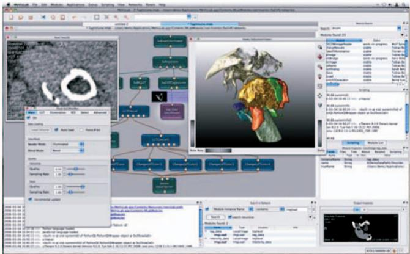

Fig. 1. Screenshot of MeVisLab with a network of modules and several panels opened for parameter input and visualization.

during runtime. DEVIDE supports the development of new visualization and segmentation techniques well. 

SciRun [37] is a problem-solving environment that is based on data-flow networks consisting of single modules, e.g., for scalar and vector visualization, simulation, and image processing. Also end-user applications can be created, called PowerApps. This generation of PowerApps is similar to the module definition language of MeVisLab that is used to create consistent interfaces above the panels of single modules. 

Amira [31] is a commercially available object-oriented extensible toolkit for scientific visualization. It provides a wide range of analysis, simulation, and visualization techniques. Amira offers a visual programming approach where the data-flow metaphor is used to connect modules to a network. Even though there are scripting and basic GUI facilities available, there is a lack of support for application development. Using Amira, no end-user applications can be created. 

# 3.2 The MeVisLab Environment

MeVisLab [27] is a freely as well as commercially available visual programming and rapid prototyping platform for image processing research and development with a focus on medical imaging and visualization (for an example, see Fig. 1). For the commercial version, comprehensive support is provided by MeVis Medical Solutions. The free version is restricted to private or academic research purposes. Complete applications including user interfaces can be built within a common, cross-platform framework. Beside general image processing and visualization tools, MeVisLab includes advanced medical imaging algorithms for segmentation, registration, and quantitative morphological and functional analysis. New image processing algorithms and visualization tools can be integrated as modules using a standardized software interface. Macro modules that allow for a hierarchical encapsulation of networks facilitate the reuse of available developments. Efficient designs of graphical user interfaces can be achieved using an abstract, hierarchical module definition language (MDL) that hides the complexity of the underlying module network to the end user. To add dynamic functionality, Python or JavaScript code may control both network and user interface level elements. 

An integral part of MeVisLab is the object-oriented MeVis Image Processing Library (ML) that provides a general framework for image processing. Each algorithm is represented as a self-descriptive module inside the development environment. Image processing is accomplished in a strictly request-driven manner using paging, caching, and multithreading strategies. In addition, the open source Insight Toolkit (ITK) for performing registration and segmentation has been wrapped into native MeVisLab modules. The MeVis Giga Voxel Renderer (GVR) presents a state-of-the-art multivolume renderer that combines a texture-based multiresolution approach with advanced per object shading techniques [18]. Interactive responsiveness is guaranteed during interactive rendering by time slot management. For visualization and interactive graphics programming, the Open Inventor 3D visualization library as well as the Visualization ToolKit (VTK) are fully integrated into MeVisLab. Even the combination of Open Inventor and VTK modules is possible. Based on Open Inventor, additional functionality has been added, such as customizable 2D and 3D viewer frameworks, annotations, advanced MPR techniques, and support for the OpenGL Shading Language (GLSL). 

# 3.3 Discussion of Toolkits

MeVisLab has many similarities to Amira, SciRun, and a broad overlapping of functionality (see Bitter et al. [3] for a comparison of MeVisLab, Amira, SciRun, and MITK), since all offer visual programming, and Amira and MeVisLab use Open Inventor. However, MeVisLab focuses on medical image data and quantitative image analysis, and provides facilities for application development, like a higher definition language to design user interfaces. However, there is no support for capabilities to handle whole cases as described in Section 2. Even if all techniques of the METK can be developed using MeVisLab (as the complete METK was), MeVisLab itself does not provide those high-level building blocks. MeVisLab focuses on algorithmic functionality and offers the ability to construct reusable building blocks. Using the METK, a developer of medical applications can design a running prototype more efficiently. 

In essence, there are many toolkits and frameworks for medical image analysis and visualization. But some of them are focused on the creation of singular impressive visualizations (e.g., VolumeShop [6]), some of them focus on medical image analysis (e.g., MITK [39], 3DSlicer [24]), and only a few support application building (e.g., SciRun [37], MeVisLab [27]). To the best of our knowledge, there is no toolkit or framework to create efficient medical applications with high-end visualizations, adequate interaction techniques, and user interface guidance. 

# 4 THE ARCHITECTURE OF THE METK

In the MEDICALEXPLORATIONTOOLKIT, each function is encapsulated in a module. Using MeVisLab’s visual programming environment, modules can be freely combined in a data-flow network to build up applications with an individual feature profile. This allows the developer to design applications that support the specific workflow of 

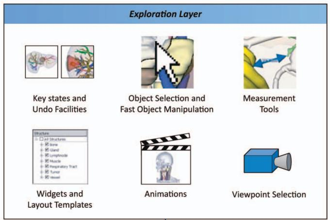

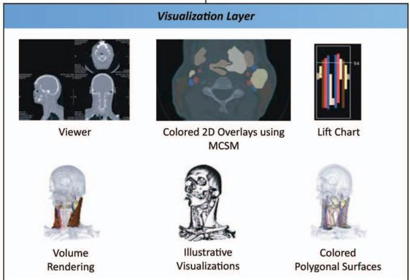

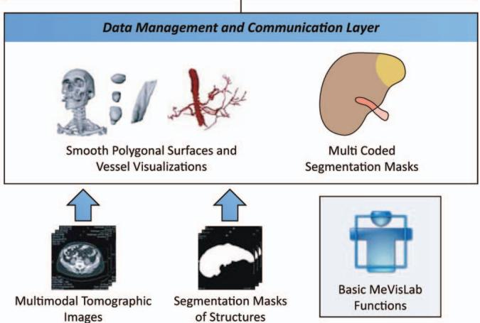

Fig. 2. Layer structure of the METK. A large variety of different visualization and interaction techniques as well as case management facilities and user interface widgets can be freely combined to build up individual surgical applications.

different surgical intervention planning processes in an efficient and fast manner. 

All functions are conceptually organized in three layers: the data management and communication layer, the visualization layer, and the exploration layer (see Fig. 2). The lowest layer imports the case data and provides data management functions. The visualization layer comprises viewer classes and special rendering modules. Basic viewer classes and the volume rendering are reused from MeVisLab. All high-end interaction and exploration techniques that are necessary to create powerful surgical applications, are available within 

the exploration layer. The layers and their provided functions will be described in the next sections. 

# 4.1 Data Management and Communication Layer

The data management and communication layer contains functions for case data management, interapplication communication, and generation of 3D polygonal surfaces. Since DICOM is widely used and standardized, the METK is focused on processing DICOM data. Additionally, segmentation masks can be loaded to automatically generate 3D polygonal surfaces. This operation must only be performed once, since the surfaces are stored for further loadings of a case. Depending on the type of structures, different algorithms for generating the polygonal surfaces are used depending on the metadata, acquired during the segmentation. In most cases, Marching Cubes in combination with a surface smoothing is applied. For vascular structures we use a model-based surface reconstruction that respects the thin and branching structure of vessel trees [30]. Besides segmentation masks, polygonal meshes of structures and secondary objects (e.g., medical probes) can be imported. 

Multimodal data. As the underlying MeVisLab, the METK has the abilities to load multiple modalities like scans from CT, MRI, or PET. The visualization techniques are able to combine different registered data volumes, e.g., an CT and PET scan. To perform the necessary registration between the different data sets, MeVisLab provides a wide range of capabilities in its free version. Thus, they are no integral part of the METK. However, the METK provides an interface to use the multimodal capabilities of MeVisLab in the context of the METK techniques. 

Case and cache management. To reduce the memory consumption and to speed up the whole process of loading and exploring a case, we integrated an efficient case management in the METK. Each structure and each image stack is only loaded once and distributed virtually in the application network. Even if the structures are visualized with different techniques in different viewers (see Fig. 10), it will only be maintained once in the application cache. 

Communication. Besides the data management, the METK provides a communication structure between all modules. Events can be sent between specific modules for a direct intermodule communication and be broadcasted to reach all modules. Therefore, all changes of underlying data and parameters are communicated to all modules “listening” to those parameters, so they can adjust their own parameters, data, and visualizations. This leads to identical visual properties of all structures in all viewers and widgets, and thus to a consistent view of all data. 

Synchronization. Moreover, the currently selected object (CSO) is automatically communicated in the METK. Hence, a synchronized view in different viewers can be provided. If the user selects a structure in a 3D viewer, all 2D viewers can display the suitable slice for this structure and vice versa. If the user picks a structure in a 2D slice, it can be emphasized in all 3D viewers, moving the camera automatically to a good viewpoint on this structure (see Section 4.3). 

Moreover, different 3D viewers can be automatically synchronized in the METK by connecting its camera parameters (position, orientation, etc.). This can be used to explore different data sets from the same viewpoints, to 

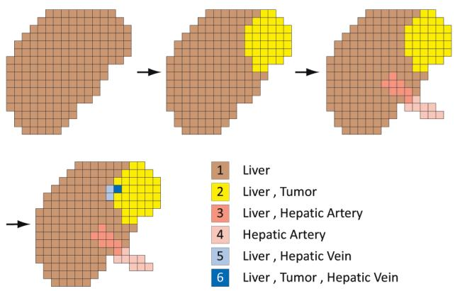

Fig. 3. Multicoded segmentation masks. Segmentation masks of single structures are sequentially added to the multicoded segmentation masks (MCSM). For each structure, all values of voxels that belong to the structure are stored separately. Thus, many segmentation masks of overlapping structures can be saved in one MCSM. For four structures, instead of 16 possible combinations, actually only six occur.

compare different intervention strategies for one patient, or to compare pre- and postoperative data. 

Multicoded segmentations. Usually, e.g., with MeVisLab, each segmentation mask, representing one structure, is stored in a single file. This is inefficient with respect to memory and performance. Storing all segmentation masks in one image stack can overcome this problem. However, one voxel of an image may belong to more than one anatomic structure, when structures overlap each other. For example, a voxel in the liver tissue may belong to a tumor and the liver tissue itself. Thus, we cannot assign one label to each structure for the resulting segmentation mask of all structures. A straightforward approach is to assign each structure to one bit of an 8 byte voxel value. But this approach is limited by the number of bits, e.g., only 64 labels could be stored in an 8 byte value. Since in real data only a small subset of all possible combinations of overlapping structures occurs, we developed a more efficient solution and refer to it as multicoded segmentation masks (MCSM). 

An MCSM contains all segmentation masks of all structures of a case. Each combination of labels of a voxel that appears in the data is encoded with a distinct voxel value (see Fig. 3). For example, all voxels simultaneously belonging to the liver tissue and the hepatic vein (and to no other structure) are assigned one unique voxel value. The mapping of voxel values to structure lists is stored separately in the case data. An MCSM is created by sequentially adding one segmentation mask after another. If a new combination of voxel labels occurs at a voxel position, a new number is assigned to this combination. After all single segmentation masks were added to the MCSM, it can be used, e.g., as an efficient base for colored overlays. The upper bound of $2 ^ { 6 4 }$ labels will never be reached with medical data sets, since even the theoretical case that in a data set of $5 1 2 ^ { 3 }$ voxels each voxel represents another combination of structures is covered by the MCSM. 

In Table 1, for four cases from the scenarios described in Section 2, the number of segmented structures and the number of labels needed in an MCSM are opposed. For the 81 segmented structures of the living liver donor transplantation, 11 bits can be used instead of 81 bits. 

TABLE 1 Number of Labels in MCSM for Example Cases

<table><tr><td>Case</td><td>Number of segmented structures</td><td>Number of labels in the MCSM</td></tr><tr><td>Neck dissection 1</td><td>36</td><td>61</td></tr><tr><td>Neck dissection 2</td><td>21</td><td>36</td></tr><tr><td>Liver tumor resection</td><td>49</td><td>361</td></tr><tr><td>Living liver donor transplantation</td><td>81</td><td>656</td></tr></table>

Larger numbers of labels for liver cases result from a more frequent overlapping of structures. 

# 4.2 Visualization Layer

In the visualization layer, all actions are performed that are necessary to provide basic and advanced 3D visualization techniques to the user. 

Based on the surfaces stored in the cache, a material is assigned to each structure to achieve appealing surface visualizations. Important structures are visualized with a high opacity. For structures which serve as anatomic context, e.g., organs or large skeletal structures, we provide silhouette rendering. Thus, they are still visible but do not hide the view onto other important structures. 

For volume rendering, the METK employs the MeVisLab GigaVoxelRenderer [18]. It enables the tagged volume rendering of segmented structures. Thus, different structures can be visualized with local transfer functions. For the sake of consistency, the colors of structures are the same as for their surface visualization. To visualize unsegmented tissue, a global transfer function can be applied and the volume rendering can be combined with the polygonal surface visualizations. 

Advanced 2D visualizations. The basic problem of the slice-based visualization, namely, the lack of an overview in cross-sectional images, has been tackled with a 2.5D approach to provide the essential information, the so-called LIFTCHART [32]. Using this technique, the range of slices that a specific structure spans over can be quickly seen. A narrow frame attached next to the cross-sectional image represents the overall extent of slices in the volume data set. The top and bottom boundary of the frame correspond to the top and bottom slice of the data set (see Fig. 4). Each segmented structure is displayed as a bar at the equivalent vertical position inside this frame. Upper bars correspond to higher structures in the body. Different arrangements of the bars are possible, e.g., condensing all structures of the same type into one column. The currently displayed slice of the volume data set is depicted by a horizontal line in the LIFTCHART widget (see Fig. 4). 

To support the correlation between structures in 3D scenes and 2D slices, structures can be visualized in 2D slice data as colored and semitransparent overlays, so the underlying gray values are still visible. If more than one structure should 

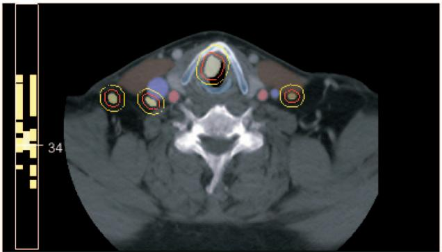

(a)

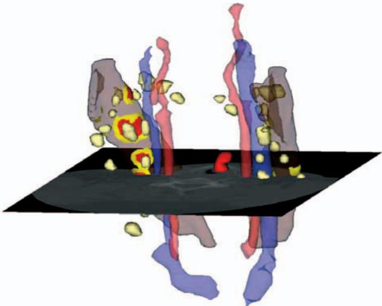

Fig. 4. LIFTCHART. (a) LIFTCHART in a 2D viewer and (b) the corresponding data set in 3D. The location of different structures in the slice stack can be identified by their color. Selecting a structure in the LIFTCHART selects the corresponding slice in the viewer. Furthermore, safety margins are depicted with red and yellow.

be displayed at the same voxel position, the combined color can be calculated in different ways: 

1. Only the color of the most important structure is chosen.1 

2. A weighted mixture of all colors of the overlapping structures is calculated. 

3. Application-dependent overlapping regions can be emphasized separately in dependency of involved structures, e.g., the infiltration of lymph nodes in a muscle can be colored red with a silhouette, even if this visualization style does not appear in one of the two structures. 

The calculation of the overlays is performed based on our multicoded segmentation masks. 

Safety margins around tumors and metastases are essential for intervention planning and intraoperative navigation. Therefore, for all structures at risk, a 3D euclidean distance transform is performed. Depicting important distance thresholds (e.g., yellow and red representing 5 and 

1. The importance is acquired from the metadata in the case description or, if this data does not exist, indirectly from the size of the structure. In surgical planning, mostly small structures are more important than large ones. 

$1 0 \mathrm { m m } ,$ ) turned out to be appropriate. The distances may be displayed in 2D as well as in 3D. In the 2D view, silhouette lines visualize the important distances (see Fig. 4a). In 3D, unicolored surfaces are drawn on structures visualizing the range of distance to critical structures, e.g., lymph nodes to vessels and muscles (see Fig. 4b). 

Illustrative visualizations. It became apparent that applying transparency is not sufficient to visualize complex structures. In particular, if the density of anatomic structures is high, illustrative techniques are employed to better convey object shapes and relations. For that reason, illustrative visualization techniques were developed. Illustrative visualization was found to be useful for selected therapy planning tasks, e.g., hatching lines convey surface shape better compared to conventional shading for radiation treatment planning [14]. The application of silhouettes to strongly transparent structures increases the recognizability. The use of local transparency was also promising (e.g., cut aways or ghosting [36]). These illustrative techniques are provided in the METK and can be flexibly combined with surface and volume rendering. Silhouette rendering is the default style in the NECKSURGERYPLANNER [33], which is used in the clinical routine and appreciated by medical doctors for providing adequate support. However, so far there is no evidence for an advantage of stippling and hatching in surgical planning. 

Medical viewers. The visualization layer also provides several viewers that consist of wrapped and extended MeVisLab viewers. The extended viewers are able to communicate their parameters (e.g., camera position and orientation) to other METK modules and can receive commands, e.g., to control the viewers remotely by the animation system. 2D viewers can display slices in many ways: singular or in a multislice view, where axial, sagittal, and coronal as well as free multiplanar reformations can be shown. 3D and 2D viewers can be freely combined in an arbitrary number and arrangements. 

# 4.3 Exploration Layer

To support the exploration process, we provide several techniques, interaction facilities, and interface widgets. 

Animation. To guide the user as well as to provide smooth transitions between different viewpoints and visualization styles, we integrated the animation framework described by Mu¨ hler et al. [22]. Using an adaptive script language, one script with an animation description can be reused for many similar cases, provided that segmentation results are stored and named in a standardized way. For example, all cases matching one scenario described in Section 2 are similar. The goals of our animation facilities are similar to Iserhardt-Bauer et al. [15] who developed standardized video generation for a specific problem, namely, the diagnosis of cerebral vasculature. The script-based animations can also be used in an interactive application to guide the user’s exploration process. Selected structures can be approached due to automatic camera flights, and appearance changes can be smoothly animated to preserve the user’s orientation. The flexibility of the animation facilities enables the use of advanced animation techniques such as those based on story telling principles [38]. Thus, applications based on the METK can provide both interactive animations in real time for 

exploration support, and rendered videos for presentation and interdisciplinary discussions, e.g., in a tumor board. 

Viewpoint selection. Finding good views on single structure or groups of structures is essential for an automatically guided exploration. In contrast to previous approaches, e.g., the viewpoint entropy of Vazquez et al. [34], the viewpoint selection technique of Mu¨ hler et al. [23] incorporates anatomic knowledge. Animations in the METK are enhanced by this dedicated viewpoint selection technique for multiobject 3D scenes that has been applied in several intervention planning tasks. After selecting a structure, the camera position is automatically transformed to a good view on this structure. The quality of a viewpoint is affected by many parameters. The structure should be visible to a maximum extent. A good viewpoint should be stable, i.e., minor rotations must not completely hide the selected structure. Medical doctors may have different preferred regions to look at a 3D scene of segmented structures. Thus, the preferred region is also an important parameter for viewpoint estimation. These and other parameters are considered by our viewpoint selection technique. As discussed by Mu¨ hler et al. [23], relatively good presets for certain application scenarios may be defined. 

Good viewpoints are employed in the METK to generate standardized views for documentation (in combination with other standardized visualization parameters). If the user picks a structure from a list or from the viewer, the camera can be automatically moved to the best viewpoint of the structure. 

Camera paths. To produce appealing movements of the camera from one viewpoint to another, we developed and integrated a set of path algorithms in the METK. To preserve the orientation on long distance, movements of the camera, we first zoom out to a global view on the scene and zoom into the target structure at the end of the flight. We also make camera movements more appealing by slow acceleration at the beginning and at the end instead of abrupt speed changes. 

Measurement tools [26] are also integrated, e.g., for distance measurements and its appropriate visualization by means of arrows. The proposed measurement tools are extended by automatic measurement facilities for computing minimal distances between two structures and by calculating a structure’s volume. 

Key states. For presentation purposes, interdisciplinary discussions, or patient consultation, several views and visualizations of the explored data need to be saved. Instead of only saving screenshots, we employ key states, which store all information about a scene and its visualization. This includes camera parameters as well as visualization properties. Thus, a complete state of a visualization can later be restored for further explorations or demonstrations. Since key states are stored in the case data, they can be transferred from one application (e.g., a surgical planning software) to another (e.g., an application for patient consultation). Naturally, key states can also be exported as screenshots for usage in documents or presentations. Usually, a surgeon creates a couple of key states during a planning process (see Fig. 5). In combination with animation facilities, videos can be created automatically from a set 

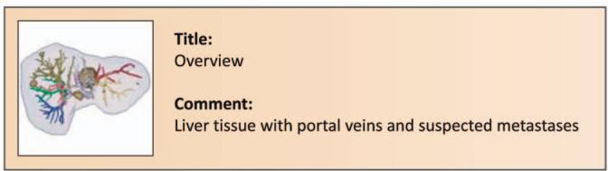

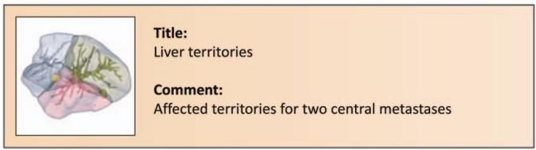

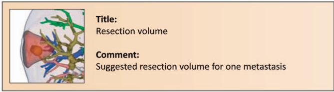

Fig. 5. Key states. Several key states that were created for planning a liver surgery. The surgeon stored the key states together with a title and a short comment.

of key states, where smooth transitions between the key states are computed. These videos, for example, are used to teach other surgeons. Key states can also be used to define presets. Applying a once-defined key state to a new case with similar structures, these structures are visualized with the same properties. 

Undo. One important feature, especially for surgeons who are inexperienced in 3D exploration, is an undo function for 3D scene manipulations. In the METK, after every performed action (e.g., a camera movement or a visualization change) the whole scene is stored in a key state. Changes performed in a very narrow time range (e.g., automatic changes of the visualization) are combined in one key state. The user can return to arbitrary steps. 

Automatic object selection. We provide several new techniques to select objects in 3D scenes with many objects of different transparencies. In such scenes, the selection is ambiguous, if there is more than one object in the picking ray. The simplest approach to disambiguate the selection is always to select the first object in the pick ray. However, if this object has a strong transparency, the user probably intends to select another object behind. In complex medical scenes, some objects are completely enclosed by others, so they are never the first object in the pick ray. For example, in liver surgery, the liver tissue always encloses nearly all intrahepatic structures, e.g., vessels and tumors (see Fig. 6a). 

We developed a procedure to automatically select an object after the user has clicked on the scene. It is assumed that the user points the mouse consciously. That means, when the mouse cursor is placed over a very large and a very small object, the user placed it deliberately over the small object. Furthermore, it is assumed that the perception of strongly transparent objects appears less prominent than the perception of more opaque objects. To identify the desired object, the algorithm proceeds as follows (Algorithm 1). 

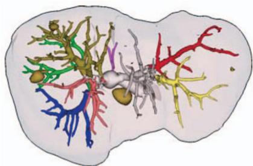

(a)

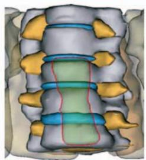

(b)

Fig. 6. Object selection. (a) The selection of inner structures such as vessels is enabled in the first place. (b) The transparent oesophagus in front of the opaque spine cannot be selected automatically.

# Algorithm 1. Object selection

Input: All objects $\{ O \}$ hit by the pick ray 

Input: Impact $I _ { T }$ of object’s transparency $O _ { T }$ 

Input: Impact $I _ { S }$ of object’s viewport size $O _ { S }$ 

Input: Total viewport size $V _ { S }$ 

Output: Object $O _ { r e s u l t }$ with highest rating Sort objects by the depth distance of their intersection point; 

$A _ { r a y } \Leftarrow 1 . 0 ;$ ; // Ray attenuation 

$R \Leftarrow 0$ // Overall rating initialization 

foreach $O _ { i } \in \{ O \}$ do 

$O _ { S } \Leftarrow$ Calculate object’s viewport size: 

$\begin{array} { r } { R _ { s } \Leftarrow \frac { ( 1 - O _ { S } ) } { V _ { S } } I _ { S } } \end{array}$ ; // Compute Ratings 

$R _ { t } \Leftarrow O _ { T } I _ { T }$ 

if $A _ { r a y } > 0 . 1$ and $R < ( R _ { S } + R _ { T } )$ then 

$$
R \Leftarrow R _ {S} + R _ {T};
$$

$$
O _ {\text {r e s u l t}} \Leftarrow O _ {i};
$$

end 

$$
A _ {r a y} \Leftarrow A _ {r a y} O _ {T};
$$

end 

All objects hit by the pick ray are determined and sorted by the depth distance of their intersection point. Only objects that are visible by at least 10 percent at the intersection point are taken into account. As a next step, the size of the projected bounding box on the viewport of all objects and the transparency degree of the single objects are determined. The impact of transparency and the projected bounding box size is adjustable to consider different types of scenes (e.g., scenes with objects of rather equal size). The object with the highest rating is selected at the end. Thus, for example, opaque structures behind structures with a strong transparency are selected. 

Interaction support of object selection. The algorithm reveals its limitations when an opaque structure lies behind a semitransparent structure, while their projections are almost equal (see Fig. 6b). In such cases, at all points where the user picks the transparent structure, the opaque one in the background is selected. Therefore, we provide two interaction techniques in the METK. The first allows the user to scroll between all structures in the pick ray, using the mouse wheel or the cursor keys. Starting with the structure that the automatic algorithm would choose, the user can scroll back and forth between objects adjacent in depth. The CSO will be clearly emphasized, using a thick silhouette and an opaque color. The second selection 

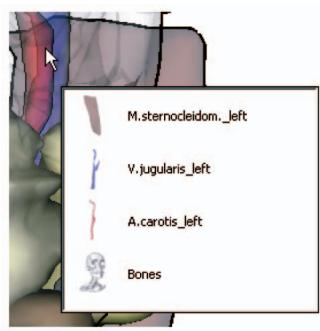

(a)

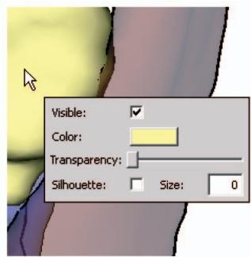

Fig. 7. Fast exploration popup menus. (a) All structures in the pick ray are presented as a fast accessible list to the user. (b) For quick parameter manipulation, a context popup is presented right to the cursor position.

technique offers a list of all structures in the pick ray directly at the cursor position in a small panel, so the user does not need to de-focus from the scene (see Fig. 7a). We extend the list of textual structure names by pictorial representations of the structures. However, this technique aims at experienced users who know all structures by name. 

Object manipulation. Even if users adjust the appearance of a visualization globally by selecting a preset, they might want to adapt the appearance of single structures individually. We provide some GUI widgets that can be integrated in a panel or window to adjust all visualization parameters such as color, transparency, or silhouette width. In addition, we provide an exploration technique, where the user can easily adjust the most important parameters directly in the viewer (see Fig. 7b). The provided list of parameters can be adapted and extended for individual application requirements. 

Graphical application interface. For a fast and efficient application development, predefined widgets for common and recurrent tasks are provided, e.g., lists to select structures or to change their visibility. We provide panels to change the visualization parameters of structures, such as color, transparency, or silhouette width, efficiently. 

Feedback from surgeons clearly revealed that a rather low level of flexibility is needed and guidance is considered essential. Surgeons prefer clear and easy to understand interfaces [10] instead of interfaces with many parameter sliders and value inputs. They want to get a good visualization for the current task or medical question automatically, or at the utmost selecting a well-defined preset from a small list of choices. The METK supports this, e.g., with key states and the animation facilities. Furthermore, ready designed graphical interfaces for surgical applications are provided as templates. The interfaces were gathered by many interviews with our medical partners and approved by evaluation [10]. 

# 5 APPLICATION DEVELOPMENT WITH THE METK

Since the METK is an extension of MeVisLab, all METK applications can be built up by creating networks of modules in a visual programming environment. The METK modules can be arbitrarily mixed up with other MeVisLab modules. Due to the high-level functions provided by the METK, a 

developer can focus on application logic. This quickly yields applications that a surgeon can use (see Fig. 9), which often elicits essential feedback. Thus, this stage should be achieved as fast as possible, and the development cycles of new applications need to be accelerated. The application’s logic is defined in Python scripts. We support application building by integrating many ready-to-use Python scripts in the METK. The design of the graphical user interfaces is scripted as well, using the module definition language of MeVisLab. We extend the basic set of widgets such as buttons and sliders by more complex widgets that can be integrated in an application with minimum scripting effort. 

To extend the METK or to supplement existing functions, developers can refine existing METK modules or create new modules. Depending on the complexity of extensions, there are basically two options: Developers can implement simple functions, e.g., a patient data management or widget panels in modules, written in Python. Advanced and especially performance critical issues can be implemented in ${ \mathrm { C } } { + + }$ libraries. Since this is only necessary for special visualization techniques not incorporated in the METK so far, such as DTI visualization, this does not contradict the supposed low programming skills that are needed to build up readyto-use applications with the METK. In Fig. 8, we illustrate the steps that are necessary to build a new METK module that visualizes the CSO with its name and anatomical affiliation. This module can, for example, be integrated as part of a larger application. 

Several full-fledged applications were designed and developed with our toolkit. Using the METK, a training system for liver surgeons was developed, the LIVERSUR-GERYTRAINER [1] (see Fig. 11). The feedback from the surgeons within the evaluation of the LIVERSURGERYTRAI-NER [10] inspired several refinements of the METK. One inspiration was the large importance of 2D slice-based visualizations in contrast to a pure focus on 3D visualizations. The NECKSURGERYPLANNER supports the decisionmaking process for neck dissections. Here, the target group is experienced surgeons [33] (see Fig. 10). 

# 6 EVALUATION BY IMPLEMENTING A REFERENCE APPLICATION

To assess the effectiveness of the METK in comparison to current application development, we implemented a small reference application in both the standard version of MeVisLab and MeVisLab extended with the METK. The application should load a given CT image and multiple segmentation masks, and visualize them as 3D surfaces and as 2D images. In 3D, the structures should be visualized with their standardized style and their visibility (on/off) should be changed individually. After the description of the particular development process, we will compare both solutions by means of development time, resulting application, and usability. 

For the solution with the basic MeVisLab version, all segmentation masks must be loaded manually. Afterwards, modules to create the surface for each single structure must be added and parameterized individually. To achieve a correct visualization style, the structures’ nodes in the network must 

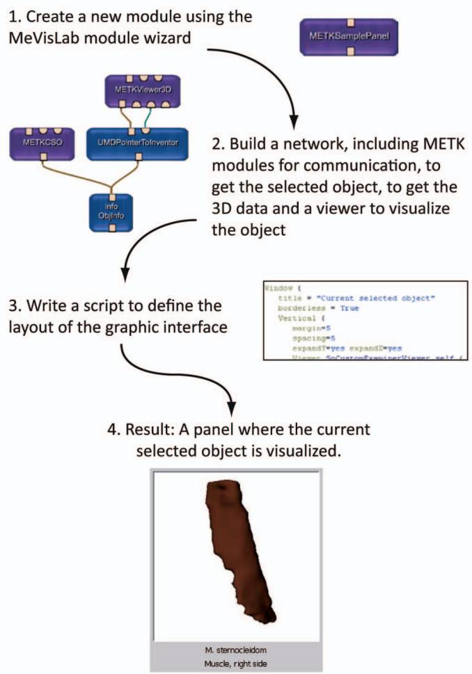

Fig. 8. Steps that are necessary to create an own METK module that visualizes the currently selected object with its name and anatomical affiliation.

be categorized (e.g., vessel or muscle) and a material (color and transparency) must be attached to each group. The scene is visualized in a simple 3D viewer. For the 2D visualization, the image is added to the network and visualized in a 2D viewer. The viewers are put together in one application interface by writing a script that defines position and extension of each viewer. To switch the visibility of each 

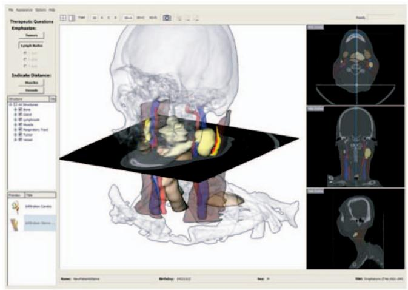

Fig. 10. NeckSurgeryPlanner. The NECKSURGERYPLANNER supports the operation planning for neck dissections. To provide deep insight in the original 2D data as well as in the segmented 3D structures, 3D and 2D views are used synchronized. On the left, a browser for enabling and disabling structures and key state previews are provided.

structure, each visibility parameter of every structure must be added manually to the script. This process must be performed again for every case, since only the network can be saved and no case data management is available. 

Using the METK, we first add a manager module that enables an application to load and save cases, and provides the communication functions for the whole application. A second module provides the import facilities for the slices and segmentation masks. For the 3D visualization, the module for surfaces visualization and an METK 3D viewer are added. For 2D slice visualization, an METK module for image loading and an METK 2D viewer are added. Afterwards, the script to arrange the widgets in the application window is written, whereas a special METK list widget is integrated for fast visibility changes of single structures. After executing the application, a new case can be created by importing an image and segmentation masks located in the same directory. For each structure, its type and anatomical affiliation can be entered. This is only necessary if the case was not segmented with an METK compatible application as mentioned in Section 1. For later 

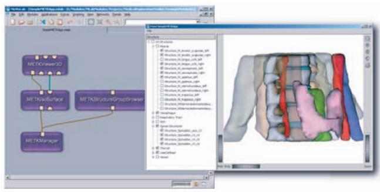

（a)

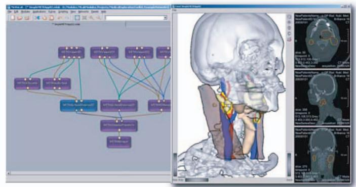

(b)

Fig. 9. Sample METK application networks. (a) A network to present segmented data sets in a 3D viewer with a GUI widget to change visibility of structures. A spine surgery data set is displayed. (b) A network of an application to synchronously explore 3D and 2D data, extended with silhouettes and a colored distance transformation in 2D and 3D. A neck surgery data set is displayed.

Authorized licensed use limited to: University of Chinese Academy of SciencesCAS. Downloaded on April 07,2026 at 07:40:48 UTC from IEEE Xplore. Restrictions apply.

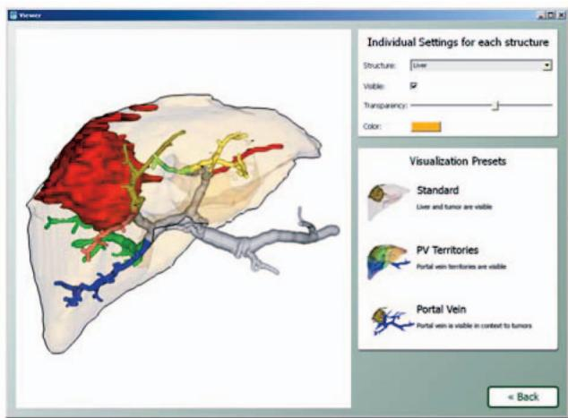

Fig. 11. LiverSurgeryTrainer. The LIVERSURGERYTRAINER is an application to teach abdominal surgeons the planning workflow for liver resection and living liver donor transplantations. The application layout contains only a few widgets.

reuse, the case can be saved, so this procedure must be performed only once. 

Since with the basic version of MeVisLab for each case a network must be created manually, it took 51 minutes to add all 148 modules for the sample case and parameterize them individually. Writing the script took 8 minutes. This process of about 1 hour needs to be repeated for every new case. The required time primarily depends on the number of segmented structures. 

With the METK it took less than 1 minute to create the application network consisting of only six METK modules. Additional 5 minutes were used to write the script for the application layout, and it took another 8 minutes to import the data into the application. 

From the beginning until the ready visualization of thedata it took 14 minutes with the METK and 59 minutes with the basic version of MeVisLab. For new cases (that only consist of images and segmentation masks and come without any METK compatible metadata), with the METK it took only the time of importing the data, whereas with the free MeVisLab version the whole network would have to be recreated. 

# 7 DISCUSSION

There are many development environments for scientific visualization available. Some of them support the developing process by sophisticated techniques, e.g., graphical network programming (e.g., SciRun [37], MeVisLab, and DEVIDE [4]). Even though SciRun and MeVisLab provide basic facilities for application development, it is still very complex to efficiently create applications that use new visualization techniques and can be used by “real users” independently. In a comparison study of four visualization frameworks (thereunder SciRun and MeVisLab), MeVisLab was determined as the “best framework for creating applications” [3]. Hence, we extended MeVisLab with a toolkit that especially supports the application building process for surgical planning. Even if there is some knowledge of python and the layout language MDL of MeVisLab necessary to build up complete applications, it is much 

easier and faster to come up with fully functional prototypes in an early development stage, since many of the most used visualization and exploration techniques are already implemented in the METK. The application networks are also easier to maintain and an reduced cognitive effort is necessary to integrate changes or extend the application. 

# 8 CONCLUSION AND FUTURE WORK

We presented an extensive toolkit for surgical application development—the MEDICALEXPLORATIONTOOLKIT (http://www.metk.net). Using the METK, applications that fulfill surgical requirements of exploration support and visualization techniques, can be built up quickly. Introducing the multicoded segmentation masks, we provide an efficient way to store multiple overlapping segmentation masks in one mask, supporting colored overlays in 2D. Advanced 3D selection techniques and key states for storing of visualization state are also dedicated to surgical planning, but useful for other application areas. With animation facilities, the viewpoint selection as well as new support for object selection, a substantial guidance for the exploration of 3D scenes is provided. Although the METK is a good basis for solving many intervention planning problems, special applications will yield new requirements. 

To bridge the gap between preoperative planning software and intraoperative usage of the planning results is a challenge for future work. The adaption of techniques such as the automatic viewpoint selection for an intraoperative use would be a useful extension, since more guidance in 3D exploration is needed there due to the particular surroundings. 

Our experiences with automatic techniques such as the object and viewpoint selection showed that more semantic information about the importance of structures and their relations into the visualizations needs to be integrated. Therewith, the presented context to structures of interest or the intended user interactions can be adjusted in a more appropriate manner. 

Recent developments with user interface devices used in surgical applications [13] necessitate the integration of a wider variety of input devices in the METK. Those extensions require the integration of device drivers in the system as well as a refinement of interaction and exploration techniques. 

# ACKNOWLEDGMENTS

This work was supported by the BMBF in the framework of the SOMIT-FUSION project (FKZ 01—BE 03B) and by the Deutsche Forschungsgemeinschaft (DFG) (Priority Programme 1124, PR 660/3-1 and PR 660/3-2). 

# REFERENCES

[1] R. Bade, I. Riedel, L. Schmidt, K.J. Oldhafer, and B. Preim, “Combining Training and Computer-Assisted Planning of Oncologic Liver Surgery,” Proc. Bildverarbeitung fu¨r die Medizin (BVM), pp. 409-413, 2006. 

[2] L. Bavoil, S.P. Callahan, P.J. Crossno, J. Freire, C.E. Scheidegger, C.T. Silva, and H.T. Vo, “Vistrails: Enabling Interactive Multiple-View Visualizations,” Proc. IEEE Conf. Visualization, pp. 135-142, 2005. 

[3] I. Bitter, R.V. Uitert, I. Wolf, L. Ibanez, and J.-M. Kuhnigk, “Comparison of Four Freely Available Frameworks for Image Processing and Visualization that Use ITK,” IEEE Trans. Visualization and Computer Graphics, vol. 13, no. 3, pp. 483-493, May/June 2007. 

[4] C.P. Botha and F.H. Post, “Hybrid Scheduling in the DeVIDE Dataflow Visualisation Environment,” Proc. Conf. Simulation and Visualization (SimVis), pp. 309-322, 2008. 

[5] H. Bourquain, A. Schenk, F. Link, B. Preim, G. Prause, and H.-O. Peitgen, “HepaVision2: A Software Assistant for Preoperative Planning in Living-Related Liver Transplantation and Oncologic Liver Surgery,” Proc. Conf. Computer Assisted Radiology and Surgery (CARS), pp. 341-346, 2002. 

[6] S. Bruckner and M.E. Gro¨ller, “Volumeshop: An Interactive System for Direct Volume Illustration,” Proc. IEEE Conf. Visualization, pp. 671-678, 2005. 

[7] J.J. Caban, A. Joshi, and P. Nagy, “Rapid Development of Medical Imaging Tools with Open-Source Libraries,” J. Digital Imaging, vol. 20, pp. 83-93, 2007. 

[8] J. Cordes, J. Dornheim, B. Preim, I. Hertel, and G. Strauss, “Preoperative Segmentation of Neck CT Data Sets for the Planning of Neck Dissections,” Proc. SPIE Medical Imaging, 2006. 

[9] J. Cordes, K. Hintz, J. Franke, C. Bochwitz, and B. Preim, “Conceptual Design and Prototyping Implementation of a Case-Based Training System for Spine Surgery,” Proc. First Int’l eLBa Science Conf. (eLearning Baltics), pp. 169-178, 2008. 

[10] J. Cordes, K. Mu¨ hler, K. Oldhafer, G. Stavrou, C. Hillert, and B. Preim, “Evaluation of a Training System of the Computer-Based Planning of Liver Surgery,” Proc. Jahrestagung der Deutschen Gesellschaft fu¨r Computer-und Roboter-Assistierte Chirurgie (CURAC), pp. 151-154, 2007. 

[11] A. Enquobahrie, P. Cheng, K. Gary, L. Ibanez, D. Gobbi, F. Lindseth, Z. Yaniv, S. Aylward, J. Jomier, and K. Cleary, “The Image-Guided Surgery Toolkit IGSTK: An Open Source ${ \mathrm { C } } { + + }$ Software Toolkit,” J. Digital Imaging, vol. 20, pp. 21-33, 2007. 

[12] G. Grevera, J. Udupa, D. Odhner, Y. Zhuge, A. Souza, T. Iwanaga, and S. Mishra, “CAVASS: A Computer-Assisted Visualization and Analysis Software System,” J. Digital Imaging, vol. 20, pp. 101-118, 2007. 

[13] C. Hansen, A. Koehn, S. Schlichting, F. Weiler, S. Zidowitz, M. Kleemann, and H.-O. Peitgen, “Intraoperative Modification of Resection Plans for Liver Surgery,” Int’l J. Computer Assisted Radiology and Surgery, vol. 3, pp. 291-297, 2008. 

[14] V. Interrante, H. Fuchs, and S.M. Pizer, “Conveying the 3D Shape of Smoothly Curving Transparent Surfaces via Texture,” IEEE Trans. Visualization and Computer Graphics, vol. 3, no. 2, pp. 98-117, Apr.-June 1997. 

[15] S. Iserhardt-Bauer, C. Rezk-Salama, T. Ertl, P. Hastreiter, and B. Tomandl, “Automated 3D Video Documentation for the Analysis of Medical Data,” Proc. Bildverarbeitung fu¨r die Medizin (BVM), pp. 409-413, 2001. 

[16] T. Jansen, B. von Rymon-Lipinski, Z. Krol, L. Ritter, and E. Keeve, “An Extendable Application Framework for Medical Visualization and Surgical Planning,” Proc. SPIE Medical Imaging, pp. 349-357, 2001. 

[17] A. Kru¨ ger, C. Tietjen, J. Hintze, B. Preim, I. Hertel, and G. Strauss, “Interactive Visualization for Neck Dissection Planning,” Proc. IEEE/Eurographics Symp. Visualization (EuroVis), pp. 295-302, 2005. 

[18] F. Link, M. Ko¨nig, and H.-O. Peitgen, “Multi-Resolution Volume Rendering with per Object Shading,” Proc. Conf. Vision Modelling and Visualization (VMV), pp. 185-191, 2006. 

[19] I.H. Manssour, S.S. Furuie, L.P. Nedel, and C.M.D.S. Freitas, “A Framework to Visualize and Interact with Multimodal Medical Images,” Proc. Joint IEEE TCVG and Eurographics Workshop Volume Graphics, pp. 385-398, 2001. 

[20] MeVis Medical Solutions—Distant Services, http://mms.mevis. de/en/Distant_Services.html, Mar. 2008. 

[21] MeVisLab, http://www.mevislab.de, Mar. 2008. 

[22] K. Mu¨ hler, R. Bade, and B. Preim, “Adaptive Script Based Animations for Intervention Planning,” Proc. Conf. Medical Image Computing and Computer-Assisted Intervention (MICCAI), pp. 478- 485, 2006. 

[23] K. Mu¨ hler, M. Neugebauer, C. Tietjen, and B. Preim, “Viewpoint Selection for Intervention Planning,” Proc. IEEE/Eurographics Symp. Visualization (EuroVis), pp. 267-274, 2007. 

[24] S. Pieper, M. Halle, and R. Kikinis, “3D Slicer,” Proc. IEEE Int’l Symp. Biomedical Imaging: Nano to Macro, 2004. 

[25] B. Preim, D. Selle, W. Spindler, K.J. Oldhafer, and H.-O. Peitgen, “Interaction Techniques and Vessel Analysis for Preoperative Planning in Liver Surgery,” Proc. Conf. Medical Imaging and Computer-Assisted Intervention, MICCAI, pp. 608-617, 2000. 

[26] B. Preim, C. Tietjen, W. Spindler, and H.-O. Peitgen, “Integration of Measurement Tools in Medical Visualizations,” Proc. IEEE Conf. Visualization, pp. 21-28, 2002. 

[27] J. Rexilius, J.-M. Kuhnigk, H.K. Hahn, and H.-O. Peitgen, “An Application Framework for Rapid Prototyping of Clinically Applicable Software Assistants,” Proc. Informatik fu¨r Menschen— Band 1, pp. 522-528, 2006. 

[28] F. Ro¨ßler, R.P. Botchen, and T. Ertl, “Dynamic Shader Generation for Flexible Multi-Volume Visualization,” Proc. IEEE Pacific Visualization Symp. (PacificVis ’08), pp. 17-24, 2008. 

[29] C. Scheidegger, H. Vo, D. Koop, J. Freire, and C. Silva, “Querying and Creating Visualizations by Analogy,” IEEE Trans. Visualization and Computer Graphics, vol. 13, no. 6, pp. 1560-1567, Nov./Dec. 2007. 

[30] C. Schumann, S. Oeltze, R. Bade, and B. Preim, “Model-Free Surface Visualization of Vascular Trees,” Proc. IEEE/Eurographics Symp. Visualization (EuroVis), pp. 283-290, 2007. 

[31] D. Stalling, M. Westerhoff, and H.-C. Hege, “Amira: A Highly Interactive System for Visual Data Analysis,” The Visualization Handbook, chapter 38, pp. 749-767, Elsevier, 2005. 

[32] C. Tietjen, B. Meyer, S. Schlechtweg, B. Preim, I. Hertel, and G. Strauss, “Enhancing Slice-Based Visualizations of Medical Volume Data,” Proc. Eurographics/IEEE VGTC Symp. Visualization (EuroVis), pp. 123-130, 2006. 

[33] C. Tietjen, B. Preim, I. Hertel, and G. Strauss, “A Software-Assistant for Pre-Operative Planning and Visualization of Neck Dissections,” Proc. Jahrestagung der Deutschen Gesellschaft fu¨r Computer- und Roboter-Assistierte Chirurgie (CURAC), pp. 176-177, 2006. 

[34] P.-P. Vazquez, M. Feixas, M. Sbert, and W. Heidrich, “Viewpoint Selection Using Viewpoint Entropy,” Proc. Conf. Vision, Modeling, and Visualization (VMV) 2001, pp. 273-280, 2001. 

[35] I. Viola, M. Feixas, M. Sbert, and M.E. Gro¨ ller, “Importance-Driven Focus of Attention,” IEEE Trans. Visualization and Computer Graphics, vol. 12, no. 5, pp. 933-940, Sept./Oct, 2006. 

[36] I. Viola and M.E. Gro¨ ller, “Smart Visibility in Visualization,” Proc. EG Workshop Computational Aesthetics Computational Aesthetics in Graphics, Visualization and Imaging, 2005. 

[37] D. Weinstein, S. Parker, J. Simpson, K. Zimmerman, and G. Jones, “Visualization in the Scirun Problem-solving Environment,” The Visualization Handbook, pp. 615-632, Elsevier, 2005. 

[38] M. Wohlfart and H. Hauser, “Story Telling for Presentation in Volume Visualization,” Proc. IEEE/Eurographics Symp. Visualization (EuroVis), pp. 91-98, 2007. 

[39] I. Wolf, M. Vetter, I. Wegner, T. Bo¨ ttger, M. Nolden, M. Scho¨binger, M. Hastenteufel, T. Kunert, and H.-P. Meinzer, “The Medical Imaging Interaction Toolkit,” Medical Image Analysis, vol. 9, pp. 594-604, 2005. 

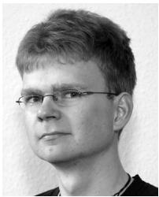

Konrad Mu¨hler received the diploma in computer science in 2005 from the University of Magdeburg, Germany, and is currently a PhD student. He is working as a researcher and software developer at the Department of Simulation and Graphics at the University of Magdeburg. His research interests include medical animations, user interface design, educational software, and software engineering methods to facilitate a fast development of 

clinically useful applications. He is a student member of the IEEE and the IEEE Computer Society. 

November 2008, he Forchheim, Germany.

Christian Tietjen is a PhD candidate in computer science at the University of Magdeburg, Germany. His research focuses on illustrative medical visualization. In detail, he actively explores the suitability of illustrative rendering techniques for intervention planning and medical education. The combination of rendering styles, the reliable approximation of curvature information, and surface smoothing techniques are the ingredients for his 3D visualizations. Since has been working for Siemens Healthcare, 

Felix Ritter received the PhD degree in computer science from the University of Magdeburg, Germany, in 2005. He is head of visualization and human computer interaction at Fraunhofer MEVIS, Bremen, Germany. His research interests include medical visualization, perception, and human factors in visualization. His current work is focused on the usability of medical workstations and the development of intraoperative user interfaces. He has authored and 

coauthored various papers in the field of medical visualization and human computer interaction. 

Bernhard Preim received the diploma in computer science in 1994 and the PhD degree in 1998 from the University of Magdeburg. In 1999, he joined the staff of MeVis (Center for Medical Diagnosis System and Visualization). In close collaboration with radiologists and surgeons he directed the work on “computer-aided planning in liver surgery” and initiated several projects in the area of computer-aided surgery. In June 2002, he received the Habilitation degree (venia 

legendi) for computer science from the University of Bremen. Since March 2003, he has been a full professor for “Visualization” at the Computer Science Department at the University of Magdeburg, heading a research group which is focused on medical visualization and applications in surgical education and surgery planning. 

. For more information on this or any other computing topic, please visit our Digital Library at www.computer.org/publications/dlib. 