# VisEval: A Benchmark for Data Visualization in the Era of Large Language Models

Nan Chen, Yuge Zhang, Jiahang Xu, Kan Ren, and Yuqing Yang 

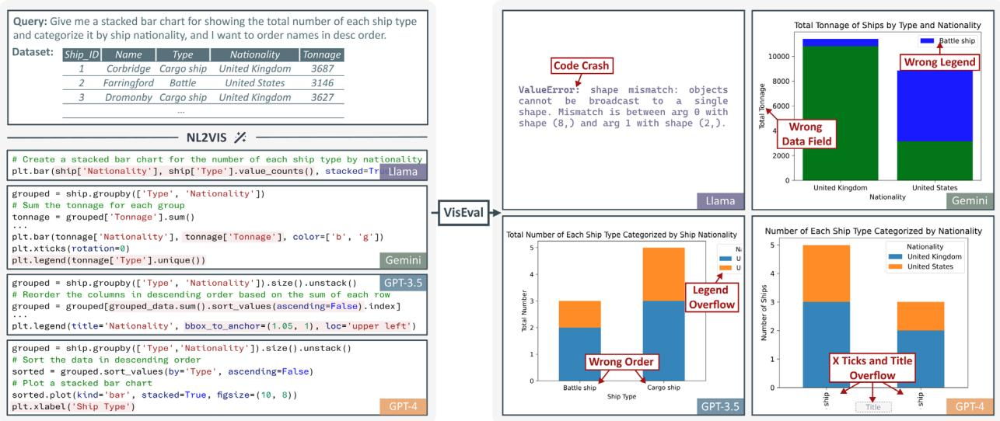


Fig. 1: Examples of generating visualization using LLMs. Llama (CodeLlama-7B) produces code that cannot be executed. Gemini (Gemini-Pro) incorrectly maps the “sum of Tonnage” to the y-axis instead of “count” and lacks a legend for the “Cargo ship” color. GPT-3.5 fails to sort as specified and positions the legend outside the canvas. Although GPT-4 almost meets the requirement, it still encounters overflow issues that impact readability.


Abstract— Translating natural language to visualization (NL2VIS) has shown great promise for visual data analysis, but it remains a challenging task that requires multiple low-level implementations, such as natural language processing and visualization design. Recent advancements in pre-trained large language models (LLMs) are opening new avenues for generating visualizations from natural language. However, the lack of a comprehensive and reliable benchmark hinders our understanding of LLMs’ capabilities in visualization generation. In this paper, we address this gap by proposing a new NL2VIS benchmark called VisEval. Firstly, we introduce a high-quality and large-scale dataset. This dataset includes 2,524 representative queries covering 146 databases, paired with accurately labeled ground truths. Secondly, we advocate for a comprehensive automated evaluation methodology covering multiple dimensions, including validity, legality, and readability. By systematically scanning for potential issues with a number of heterogeneous checkers, VisEval provides reliable and trustworthy evaluation outcomes. We run VisEval on a series of state-of-the-art LLMs. Our evaluation reveals prevalent challenges and delivers essential insights for future advancements. 

Index Terms—Visualization evaluation, automatic visualization, large language models, benchmark 

# 1 INTRODUCTION

NL2VIS, the task of translating natural language (NL) queries based on provided data tables into visualizations (VIS), has been a longstanding goal in the field of data visualization [19, 46, 56, 70]. It bridges the gap between human understanding and complex data, enabling users to handle intricate data analysis or visualization requirements in a user-friendly manner. The challenges of NL2VIS were multifaceted, with difficulties ranging from accurately interpreting NL queries to 

• Nan Chen, Yuge Zhang, Jiahang Xu, and Yuqing Yang are with Microsoft Research. Yuqing Yang and Kan Ren are corresponding authors. E-mails: {nanchen,yuge.zhang,jiahangxu,yuqing.yang}@microsoft.com. 

• Kan Ren is with ShanghaiTech University and MoE Key Laboratory of Intelligent Perception and Human Machine Collaboration. E-mails: renkan@shanghaitech.edu.cn. 

Received 31 March 2024; revised 1 July 2024; accepted 15 July 2024. Date of publication 10 September 2024; date of current version 29 November 2024. This article has supplementary downloadable material available at https://doi.org/10.1109/TVCG.2024.3456320, provided by the authors. Digital Object Identifier no. 10.1109/TVCG.2024.3456320 

effectively transforming data and selecting meaningful visual mappings [46, 56]. For instance, query interpretation involves grappling with the intricacies of natural language, while data transformation necessitates handling diverse data sources and formats. Additionally, visual mapping needs to satisfy the diverse demands of visualization. 

Recently, pre-trained large language models (LLMs) [2, 63] have demonstrated outstanding performance across various natural languagerelated tasks, such as data science [72], code generation [6], and web design [30]. This success brings hope for addressing the challenges mentioned above. LLMs-based methods have rapidly emerged as the predominant approach for addressing NL2VIS tasks. For instance, Chat2vis [42] and LIDA [11] have demonstrated proficiency in generating data visualizations through prompt tuning or engineering. Moreover, ChartLlama [18] and ChartGPT [62] leverage the training or fine-tuning of LLMs to develop specialized models for visualization, thereby further enhancing their capabilities in solving NL2VIS tasks. 

Without loss of generality, the typical workflow of visualization generation using LLMs entails assembling an NL query and serialized data tables into a prompt, then soliciting LLMs to generate code based on an established visualization library (e.g., Matplotlib [24], Vega-

Lite [55]). The code is then executed in a sandboxed environment to obtain the final chart. Regrettably, this process occasionally encounters errors, leading to flawed outcomes. As illustrated in Fig. 1, when we visualize the ship dataset with a stacked bar chart, state-of-the-art LLMs all suffer from various issues. These issues range from code execution failures to incorrect data transformations, illegal sorting, and text extending beyond the canvas. Visualizations may appear correct at first glance, but they contain easily overlooked issues that can mislead users [17, 21, 38]. Such shortcomings highlight the urgent need for systematic evaluation and benchmarking that points out potential issues in the generated results and reporting reliable evaluation outcomes. 

However, current practices of NL2VIS evaluations fall short of adequately addressing this need, due to limitations in the quality and scalability of datasets, the comprehensiveness of metrics, and the reliability of methodologies. Mainstream NL2VIS datasets either focus on narrow domains and lack scalability [16,31,59], or contain incorrect labels and ambiguous queries [39]. The comprehensiveness of evaluation is also a long-existing issue. For example, some evaluations [34, 41] solely look at the correctness of presented data, neglecting other dimensions such as readability. Some other studies [11, 18] take various metrics into consideration and leverage LLMs to assess the code generated by themselves, but LLMs-powered evaluations remain inadequately scrutinized in terms of proficiency, leading to doubts about the reliability. To the best of our knowledge, no existing benchmarks contain both high-quality and large-scale datasets along with reliable automated evaluation methodologies that cover diverse metrics. 

To fill this gap, we introduce VisEval, a novel NL2VIS benchmark that thoroughly and reliably evaluates generated visualizations. We start by constructing a dataset, comprising 2,524 representative natural language queries covering 146 databases. Aiming to create a dataset with large-scale coverage, high-quality queries, accurate ground truth, and valuable selected queries, we implement a data filtering procedure that combines the intelligence of state-of-the-art LLMs and experiences from visualization experts. We also introduce a novel labeling procedure that annotates meta-information that defines the feasible region for multiple acceptable charts, rather than the exact match of a single one [41]. Finally, we rebalance the dataset to a moderate difficulty. 

Next, an automated evaluation framework is designed to comprehensively scan for issues related to validity, legality, and readability. As shown in Fig. 5, the validity checker executes the code and verifies its capability to generate visualizations, thereby ensuring the validity. Following that, the legality checker impartially examines the legality of chart type, data, and sorting with the aid of annotated meta-information from the dataset. Finally, the assessment of readability is the most challenging and complex part, requiring consideration of various factors such as layout, scale, and color, which makes it hard to achieve through predefined rules. We leverage the power of GPT-4V(ISION) [47] and implement an automated workflow to evaluate readability. Our quantitative experiments show that the readability evaluator is well-aligned with human preferences. 

Based on the constructed dataset and the well-designed evaluation framework, we conducted a comprehensive evaluation of state-of-theart LLMs, including GPT-4 [2], GPT-3.5 [48], Gemini-Pro [61], and CodeLlama-7B [53]. The results of evaluations reveal the common challenges and limitations and provide useful insights for future advancements. To summarize, our contributions are as follows: 

• We construct a high-quality and large-scale dataset with accurate ground truth, supplemented by meta-information for evaluation. 

• We introduce a novel and reliable evaluation framework for a comprehensive assessment of the generated visualizations, covering various dimensions including validity, legality, and readability. 

• We conduct comprehensive evaluations of state-of-the-art LLMs from various perspectives, shedding light on their capability and unveiling avenues for advancement. 

# 2 RELATED WORK

# 2.1 Natural Language to Visualization Generation

Over the years, natural language has proven to be an efficient way of specifying visualization [27, 70]. Traditional methods [16, 46, 68] 

utilized semantic or lexical parsing techniques to infer user intent and then return appropriate visualizations. Recently, deep learning-based methods have further advanced the development of methods [40, 58] for translating natural language into visualizations. Despite notable enhancements achieved in NL2VIS task, limitations persist in generalization, primarily due to constraints in predefined rules or datasets. 

The emergence of LLMs introduces a new direction for data visualization generation, exhibiting excellent generalization capabilities. In most studies [11, 20, 35, 42], LLMs are used to directly generate visualization through prompt tuning and engineering. For example, Chat2vis [42] utilizes prompts containing natural language queries and a textual description of tabular data, incorporating column names and values, for generating Python visualization code using LLMs. Similarly, LIDA [11] defines visualization generation as a four-stage problem and generates visualization based on established Python visualization libraries. Another branch of research involves training or fine-tuning LLMs to develop models specialized for visualization. For example, Han et al. trained ChartLlama [18], which demonstrates superior performance across various visualization tasks including NL2VIS, based on LLaVA [36]. Tian et al. [62] broke down the process of visualization generation into step-by-step tasks and fine-tuned FLAN-t5 model [10] to align with the intended task. Although the above-mentioned methods demonstrate tremendous potential in generating various charts. We observe that their generated results still exhibit issues, ranging from code execution failures to incorrect data transformations, and missing legends. Such shortcomings highlight the urgent need for systematic evaluation to understand the capability of LLMs and the performance of LLMs-based methods and gain insights for future advancements. 

# 2.2 Evaluation for Generated Visualization

As LLMs demonstrate tremendous potential, researchers are increasingly engaged in assessing the quality of visualizations generated by LLMs [8, 9, 29, 50, 64]. A series of human evaluations were conducted from different aspects, including visualization code generation [9, 64], visualization design [8, 29], and visual data exploration [8]. Given the labor-intensive nature of human evaluation, automated evaluation methods [11,18,34,41,50] show their importance in facilitating the iteration and improvement of methods, along with providing an objective assessment. EvaLLM [50] automates the evaluation of generated Vega-Lite visualizations in JSON format. It verifies the JSON structure, assesses code and JSON structure similarity, and compares data mapping, marks, and axes with the ground truth. However, only charts written in highlevel representation languages (e.g., Vega-Lite) are applicable to this method, and doubts remain about whether code similarity is a good measure. Rule-based methods [34, 41] focus on the presented chart and automatically check whether the data along the $\mathbf { X }$ -axis and y-axis matches the ground truth data. However, they often overlook errors in channels other than the axes, such as using the same color to represent distinct categories, and they are sometimes too strict as the appropriate visual mapping can vary. Other automated methods [11, 18] employ self-evaluation strategies, wherein LLMs are utilized to assess the quality of code generated by themselves. However, it remains unexplored whether LLMs possess the capability to determine the quality of generated visualizations solely based on code. 

Most of the aforementioned methods only focus on ensuring that the visualization is “correct”, yet a “good” chart should possess many other properties, such as readability [4], effectiveness [4], memorability [54], and learnability [13]. Efforts within the visualization community have been made to automate the assessment of visualizations from these perspectives. For example, McNutt and Kindlmann [44] introduced a readability linter to assess visualizations created in Matplotlib against a set of rules. To effectively scale up the coverage of evaluated aspects, recent machine learning-based approaches [15, 67] train models to asses the aesthetics, memorability, or layout quality of visualization images. However, all these methods solely look at the visualization itself, ignoring the original natural language query. By introducing an end-to-end evaluation framework, we propose assessing the quality of generated visualizations alongside queries, thereby enhancing the comprehensiveness of the evaluation. 

# 2.3 Dataset for Visualization

Datasets serve as a fundamental pillar in the benchmark. However, previous NL2VIS datasets focused on narrow domains [16, 31, 59], which is not sufficient for comprehensive evaluation. For instance, NLV Corpus [59] collected human annotator-written utterances for each visualization but was limited to three data tables. Recently, several works have begun to collect large databases for visualization. However, they are primarily focused on real-world dataset gathering [23] or designed for specific visualization tasks such as visualization question answering [28, 43, 45], chart summarization [25, 52], and visualization recommendation [12, 22]. These datasets lack pairs of queries and visualizations, posing challenges for NL2VIS evaluation. The Quda dataset [14], which aims to advance the development of NL2VIS, comprises 14,035 user queries but lacks ground truth visualizations, further limiting its utility as a benchmark. Another notable work, nvBench [39], synthesized a dataset from an NL2SQL benchmark enabling NL2VIS model training and testing. This benchmark comprises 25,750 pairs of natural language queries and visualization, covering 105 domains across 153 datasets. Despite its extensive coverage, the dataset contains erroneous labels, along with the ambiguity of queries resulting in non-unique ground truth visualizations, which could potentially lead to inaccuracies in evaluation results [34, 41]. We are still short of a large-scale dataset with accurately labeled ground truth to effectively benchmark LLMs. In this paper, we conducted a preliminary study to identify the key requirements for a benchmark dataset. Then we constructed a high-quality dataset with ground truth that includes chart types, plotted data, and meta-information to meet these requirements. 

# 3 PRELIMINARIES

# 3.1 NL2VIS Task Formulation

In the era of large language models, a typical workflow of NL2VIS tasks involves assembling queries along with tabular data as input. Subsequently, LLMs are utilized to generate code based on established visualization libraries, resulting in intermediary output. The generated code is executed in a sandboxed environment to obtain the final chart image. Hence, for the evaluation of visualizations produced by LLMs in NL2VIS tasks, it is imperative to assess the output of each stage, including the generated code and the resulting chart image. We frame the evaluation scope within static charts, using widely adopted Python visualization libraries such as Matplotlib [24] and Seaborn [65]. These libraries are widely adopted within the community and are renowned for their versatility in producing a wide range of visualizations. 

# 3.2 Preliminary Study

To gain insights into the reliable evaluation of LLMs-generated visualizations, we conducted a preliminary study involving four human experts with more than five years of experience in the field of visualization. Three hundred queries were randomly sampled from a widely used dataset nvBench [39]. These queries were used to generate visualizations using four distinct LLMs: GPT-4, GPT-3.5, Gemini-Pro, and CodeLlama-7B. Following this, four experts independently reviewed the codes and chart images generated by each of the four models, taking the ground truth provided in nvBench as a reference. Subsequently, a roundtable meeting was convened to discuss the findings of all evaluators. We made three observations throughout this process, regarding factors that are influencing the quality of generated visualizations and issues within the evaluation process. 

Observation 1: Low-quality queries lead to nonsense results. The selected three hundred queries have more deficiencies than anticipated. This is primarily manifested when a query describes an unreasonable visualization, leading to visualizations that are either meaningless or confusing. For instance, identified data fields such as an ID were incorrectly treated as continuous numbers and mapped to the x-axis of a scatter plot. Furthermore, some queries are ambiguous, making it difficult to ascertain if they meet the expected standards, and in some cases, the ground truth of certain queries is incorrectly labeled. Upon discovering that the current generated results still exhibit numerous basic errors, we decided to focus our efforts on evaluating the generated 

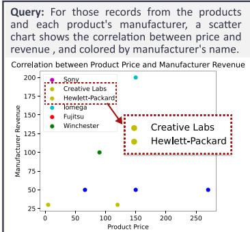


(G)


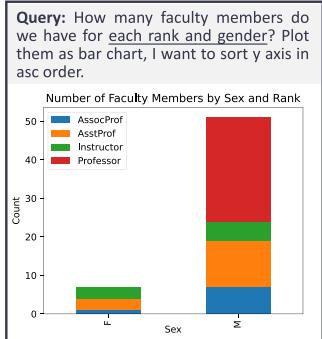


(b)


Fig. 2: Example cases where previous methods fail short: (a) the absence of consideration for color channels, leading to the oversight of identical colors being used for different categories; and (b) misjudgment due to exact matching, where the ground truth maps the “rank” data field to the x-axis and the “sex” data field to the color channel. Since the query did not explicitly specify which data field should be mapped to which channel, this case should also be considered appropriate.


visualization where queries explicitly define selected columns, aggregations, chart types, and order. This clear type of query represents the most fundamental aspect of NL2VIS tasks. 

Observation 2: Inherent defects in the generated results. We categorized the inherent defects that hinder comprehension into three dimensions based on expert discussions and previous literature related to visualization linting [7, 44] and code generation benchmark [32, 72]. I1. Invalid codes lead to rendering failure. The generated code may be invalid for rendering visualizations, for example, crashing due to incorrect API usage or printing data instead of plotting. 

I2. Illegal charts do not meet requirements. The charts may be illegal due to conflicts with queries, such as selecting incorrect data columns and plotting inaccurate legends (e.g., Fig. 2(a)). 

I3. Low readability charts hinder comprehension. The charts face challenges that hinder comprehension due to various factors such as text overflow or overlap, low-contrast colors, and typographical errors. 

Observation 3: Low-effort and reliable evaluation is challenging. While the authors and the employed experts identify numerous issues through human evaluation, this methodology proves unsustainable for future benchmarking due to its labor-intensive nature and lack of objectivity. Our preliminary attempts to reduce human effort and automate the evaluations are as follows. Firstly, we adopted some rule-based automated methods [34, 41], and found them unsatisfactory. For example, they often compared data along the x and y axes directly with the ground truth, but sometimes the suitable visual mapping can be non-unique. Fig. 2 illustrates two cases where these methods fall short. Secondly, we explored alternative methods [11, 18] that utilize LLMs to score the code they generate, without considering the discrepancies between the resulting charts and the code. These preliminary efforts, utilizing prompts specified in prior studies and leveraging LLMs to identify issues, yielded limited success. 

# 3.3 Benchmark Requirements

Therefore, we summarize three benchmark requirements as follows. R1. Incorporate a high-quality and large-scale dataset. The dataset should demonstrate high quality, with accurately annotated ground truth and non-ambiguous, rational queries. Additionally, the benchmark dataset should be large in scale and cover a broad domain to ensure comprehensive evaluation results rather than one-sided assessments. R2. Support multi-dimension evaluation. Given the potential for errors in both code and chart image, it is imperative that we systematically evaluate the visualizations for validity $( I I )$ , legality (I2), and readability (I3). In this paper, we define validity as the ability of the code to render a visualization, legality as the compliance of the visualization with the query requirements, and readability as the effectiveness of the visualization in clearly presenting information. This multi-dimension evaluation ensures that we not only detect errors stemming from incorrect API usage or data mishandling but also identify issues related to readability. 

R3. Automate reliable evaluation. Automating evaluation not only facilitates rapid iteration and refinement of NL2VIS methods during the rapid development of large language models but also ensures objectivity in assessing quality. Consequently, reliable evaluation results emerge as crucial, playing a pivotal role in effectively guiding improvement directions and informing advancement. 

# 4 VISEVAL: A BENCHMARK FOR DATA VISUALIZATION

Following the requirements outlined in Section 3.3, we construct a high-quality and large-scale dataset (R1). Building upon this dataset, we propose a novel NL2VIS evaluation framework that covers multiple dimensions (R2), including validity, legality, and readability, as illustrated in Fig. 5. To ensure the reliability (R3) of our automated methodology, we conducted quantitative experiments. 

# 4.1 Dataset Construction

The NL2VIS benchmark dataset typically includes pairs of natural language queries (NL) and corresponding visualizations (VIS). The queries and their associated data tables serve as input for the NL2VIS task, while the visualizations represent the ground truth. 

Based on our preliminary study and related benchmark works [32, 60, 72], we identified four requirements that the benchmark dataset should meet: 1) Large-Scale coverage: The dataset needs to include a substantial number of queries and databases from diverse domains to mitigate bias. Moreover, it is crucial to ensure balanced data distribution to prevent bias from specific databases. 2) High-quality queries: The queries in the dataset must be unambiguous and rational, explicitly specifying selected columns, aggregations, and chart types while describing rational visualizations. 3) Accurate ground truth: The ground truth data in the dataset should be accurately labeled and capable of precisely describing acceptable visualizations. 4) Valuable query selection: Exclude overly simplistic queries [60], which are queries that the model can almost always answer correctly, as they offer limited value but increase evaluation cost. 

Previous NL2VIS datasets either concentrate solely on narrow domains [16, 31, 59] or lack ground truth [14], which differs from our requirement. nvBench [39] is the closest match to our needs, comprising 7,247 visualizations (VIS) and 25,750 (NL, VIS) pairs from 153 databases. However, some of its queries are ambiguous, irrational, duplicated, and have incorrect ground truth. Therefore, we construct our dataset based on nvBench to meet the aforementioned requirements. The primary objective is to curate high-quality and unique queries, rectify ground truth inaccuracies, and augment meta-information while ensuring large coverage of databases. The dataset construction process is delineated as follows (refer to Appendix A for more details). 

High-quality queries selection. To select high-quality and nonduplicate queries from nvBench, we implement a rigorous selection procedure that integrates the insight of state-of-the-art LLMs and expertise from visualization experts. This procedure involves three distinct steps: rule-based, LLMs-based, and human-based selection. Firstly, we devised and implemented eight rules for filtering and correcting queries. For instance, we filtered out visualizations (VIS) that erroneously treated unique data such as IDs or codes as numerical values. Secondly, we leveraged LLMs to alleviate the workload of human experts. Due to concerns about potential biases when relying solely on a single LLM, we chose three state-of-the-art LLMs (i.e., GPT-4, GPT-3.5, Gemini-Pro) to vote on whether the queries were ambiguous or irrational. We adopted a majority rule strategy to select queries deemed high-quality by two or more LLMs. Finally, human experts reviewed queries to ensure their clarity, rationality, and non-duplication. When experts encountered queries that did not meet the requirements, if the database and chart type associated with the query had multiple other instances, it was deleted directly. Otherwise, it was manually modified or rewritten to create a new query. 

Accurate ground truth labeling. The ground truth in our dataset includes chart type, plotted data, and meta-information. This metainformation, which details implicit and explicit query specifics, serves as constraints during evaluation to determine the most appropriate charts. Human experts corrected the chart types and data, and added 

NL 1: How many faculty members do we have for each rank and gender? Plot them as bar chart, I want to sort y axis in asc order. NL 9: -tacked bar chart of the total number for faculties with each -ex in each rank, could you rank in asc by the Y-axis? 

# VIS

chart type: stacked ba x_name: "Rank" y_name: "count(*)" data: [{x: "AssocProf", y: 1, classify: "F"}, {x: "AssocProf", y: 7, classify: "M"}, {x: "AsstProf", y: 3, classify: "F"}}, {x: "AsstProf", y: 12, classify: "M"}, ...] sort: {"channel": "y", "order": "ascending", sort_by: "axis"} strict_stacSed_Par: trui channel_specified: [] meta information 

Fig. 3: Example of (NL, VIS) pairs. Two NL queries correspond to the same VIS. Note that the ground truth VIS represents a feasible region for multiple acceptable visualization instances. 

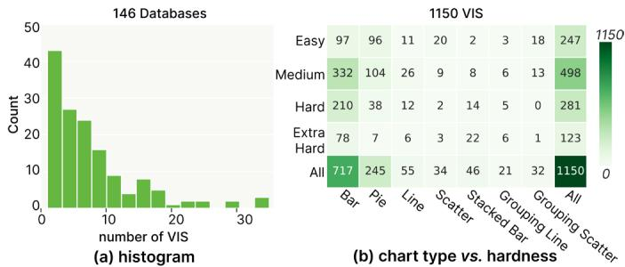


Fig. 4: Statistical analysis of the dataset: (a) A histogram of the number of visualizations per database, and (b) the distribution of visualizations across different chart types and hardness.


meta-information such as specified channels, sorting requirements, and whether grouped bar charts could be used instead of stacked bar charts. Fig. 3 presents an example of the ground truth. 

Dataset rebalancing. Motivated by previous research [60], we implemented a filter to exclude overly simple queries, which are predictable and universally solvable by most models, thereby limiting their evaluative utility. Simple queries are those for which GPT-4, GPT-3.5, Gemini-Pro, and CodeLlama-7B can generate correct answers in a zero-shot setting (as elaborated in Section 5.1). 

We end up with 1,150 distinct visualizations (VIS) and 2,524 (NL, VIS) pairs, covering 146 databases. Considering the inherent flexibility of language, we preserved multiple (~2.19) NL queries describing the same VIS, treating them as a cohesive entity during evaluation. We adhered to the hardness definition established in nvBench, which pertains to the complexity associated with chart generation. More precisely, visualizations are classified into four distinct levels of hardness: easy, medium, hard, and extra hard. Fig. 4 presents the statistics of our dataset, providing insights into coverage and diversity. 

# 4.2 Evaluation Framework Overview

To address the requirements outlined in R2 and R3, we design and illustrate the pipeline of our evaluation framework in Fig. 5. The code generated by LLMs undergoes automated assessment for validity, legality, and readability to identify any potential issues within the visualization. We describe the construction of each checker as follows. 

# 4.2.1 Validity Checker

The validity checker verifies whether the code can render visualizations through two steps. First, it executes the code in a sandboxed environment to ensure that no crashes occur during execution. Then, it performs a surface-form check to verify if the code contains the necessary code snippets to render visualizations (e.g., plt.show()). 

# 4.2.2 Legality Checker

The legality checker verifies whether the generated visualization meets the query. It begins by deconstructing the visualization to extract information (e.g., chart type, data). Then a series of impartial checks examine the chart type, data, and order with the aid of meta-information. 

After successfully rendering a visualization, the resulting image is saved in Scalable Vector Graphics (SVG) format. SVG, as a vector format, is well-suited for parsing the information contained within 

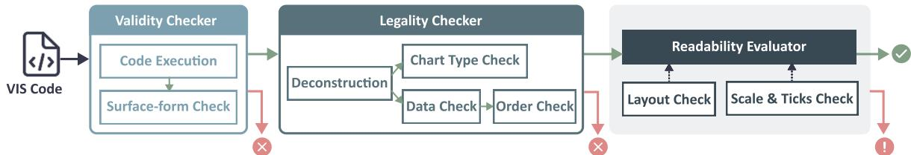


Fig. 5: The pipeline of VisEval includes three key modules: the validity checker, the legality checker, and the readability evaluator.


the visualization. While some methods exist for extracting data or analyzing chart types from raster images [18, 49, 75], they are not robust. Therefore, we adopt SVG-based deconstruction [66, 71]. The logical structure inherent in images created by visualization libraries like Matplotlib allows us to precisely extract plotted data and parse additional information such as chart type, axes, and legends through the “id” attribute. Here, “id” refers to the unique identifiers utilized in SVG. Specifically, our deconstruction process cannot handle unconventional charts, such as those with dual axes or irrational data mappings that result in missing ticks (e.g., Fig. 11 (7)). Due to our practical findings indicating that these charts are illegal, we categorize them as such by default. However, they are labeled as “unparseable”, allowing for human verification as needed for thoroughness. 

With accurately labeled ground truth and meta-information, we can reliably evaluate whether the chart type, presented data, and the order in the generated visualization meet the requirements. We evaluate the sorting order separately from the data for two main reasons. Firstly, identical values in the data can lead to multiple valid sorting outcomes, resulting in potential errors if data is directly compared. Secondly, visual sorting refers to actions applied to the resulting charts, not the underlying data itself [62]. For instance, in a stacked bar chart, the order is determined not directly by the y-axis values but by the sum of the stacked bars. Details about how our method verifies whether the generated visualization meets the query are provided in Appendix B.1. 

# 4.2.3 Readability Evaluator

To evaluate the readability of generated visualizations in the context of their queries, we propose an innovative assessment methodology integrating a multimodal model named GPT-4V(ISION) [47]. GPT-4V exhibits remarkable capabilities in processing both textual and image inputs and generating textual outputs [1, 57]. We conducted a pilot experiment to further understand the capabilities of GPT-4V. We presented GPT-4V with the visualization and posed multiple questions such as “Whether any graphic elements out of the canvas?” and “Any readability issues within this visualization?”. The model showed impressive proficiency in text recognition and comprehension of visualizations. However, it occasionally made simple errors, such as failing to identify overflow issues where text or legends extend beyond the canvas or detecting only partial problems. 

Therefore, we decided to decompose the complex readability assessment problem into smaller and more controllable sub-problems, which is a common strategy to mitigate errors in LLMs [74]. We identified two significant readability-related issues and prioritized them as subproblems to address. As depicted in Fig. 6, the readability assessment will be conducted with the help of layout check and scale & ticks check. The details of each module are as follows: 

Layout Check. The layout check entails assessing overflow and text overlap within visualizations. We conducted experiments using various prompt strategies and observed that GPT-4V’s accuracy in this task was not sufficiently high to be incorporated into the evaluation framework. At times, words partially extended beyond the canvas, with segments of the letters fully displayed, posing a challenge to the model. Moreover, there were instances where the model could infer complete words from partial text, potentially influencing its ability to accurately judge whether words were fully displayed. Consequently, we opted for a more reliable approach by simulating a browser environment. This methodology allows us to precisely determine the size of the canvas and the size and position of visualization elements in SVG format, facilitating an accurate assessment of overflow and overlap. 

Scale & Ticks Check. The scale & ticks check aims to determine 

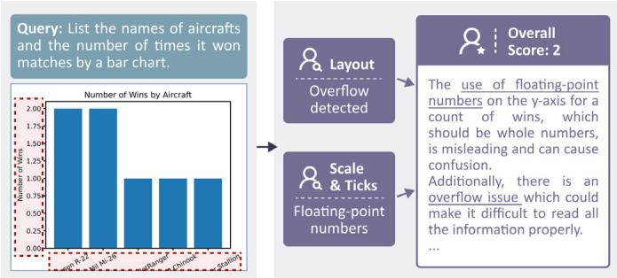


Fig. 6: An example of using the readability evaluator. The layout check identified issues with the overflow of ticks and the title on the $\mathsf { x }$ -axis. The scale & ticks check revealed that the y-axis ticks were displayed using floating-point numbers, which is unconventional for representing integer values like the count of wins. These evaluations were given to the readability evaluator, resulting in a final overall score of 2 along with a concise rationale.


if the chosen scale is suitable for interpreting values, avoiding unconventional scales such as an inverted y-axis scale. Additionally, it assesses the appropriateness of the displayed ticks when evaluating axes, avoiding unconventional choices such as representing years with floating-point numbers. One notable observation is the phenomenon of hallucination that occurs when GPT-4V interprets ticks; integer values may be inaccurately perceived as floating-point values. To address this, we incorporate deconstructed ticks from the x-axis and y-axis as auxiliary information in the prompt provided to GPT-4V. This inclusion aids the model in conducting more precise evaluations and reducing the potential for hallucination. 

Overall Readability Rating. The overall readability rating systematically evaluates the readability of visualizations, considering various factors beyond layout and scale, such as title, labels, colors, etc., assigning scores from 1 to 5 points. A score of 1 denotes that the visualization is highly challenging to comprehend, while 5 indicates that it is very easy to comprehend. As previously described, both the layout check and the scale & ticks check provide assessments on potential issues within their respective domains, accompanied by concise justifications for their evaluations. These evaluations are then integrated into the prompt for the overall readability rating. The prompt also includes the query, enabling more precise judgments by aligning with the specific demands of the visualization. For instance, it facilitates verification of the relevance and clarity of information presented in the title and labels. An important observation is that the model often exhibits skepticism regarding the accuracy of data and sorting, frequently perceiving visualizations with correct sorting as not meeting the specified requirements. Thus, we emphasize in the prompt, “Do not consider the correctness of the data and order in the visualizations, as they have already been verified.” For the detailed prompt, please refer to Appendix B.2. 

# 4.2.4 Implementation

Following the framework described above, we develop a Python package, VisEval1, which embeds a function evaluate() to evaluate generated visualization with all available checkers. Our evaluation framework is designed with modularity, making it easy to configure according to user requirements. In cases where a vision model isn’t configured, the framework checks aspects that don’t depend on a vision 

1Source code and dataset are available at https://github.com/ microsoft/VisEval. 

model. Users also have the flexibility to independently check specific aspects according to their interests; for instance, using the function readability_evaluate() will solely evaluate readability. 

# 4.3 Quality Assurance

To ensure the quality of our benchmark, each query, ground truth, and module within the evaluation framework underwent scrutiny by experts experienced in data visualization. We meticulously designed test cases to thoroughly assess the validity and legality checker. Furthermore, we evaluated the performance of our readability evaluator by collecting ratings from three human experts and quantitatively measuring the quality as follows. 

Data preparation. One hundred visualizations generated by GPT-4, GPT-3.5, Gemini-Pro, and CodeLlama-7B were randomly sampled. Detailed information about the generation is provided in Section 5.1. Three experts, each having more than five years of experience in the field of visualization, independently rated the readability of each visualization using a scale ranging from 1 to 5. Subsequently, the average score for each visualization was calculated based on their independent ratings. Furthermore, the experts convened to collectively analyze whether the visualizations presented specific layout issues such as overflow or overlap, in addition to scale and ticks issues. These identified issues were then marked using boolean values to indicate their presence. 

Metrics. We naturally treat layout check and scale & ticks check as a classification problem, evaluating them based on accuracy rate. We quantify the consistency between automated ratings and human ratings using Spearman’s rank correlation coefficient (SRCC), a widely acknowledged metric utilized in previous assessment studies [5, 15]. SRCC measures how well the order of predicted ratings matches the order of ground truth ratings, within the $[ - 1 , + 1 ]$ range where 1 indicates the predicted ratings are perfectly ordered the same as the ground truth and -1 means they are ordered in exactly the opposite way. 

Result analysis. In summary, the layout check attains a perfect accuracy rate of $100 \%$ . The scale and ticks check achieves a $9 9 \%$ accuracy rate. However, without including deconstructed ticks as auxiliary information, the accuracy decreases to $92 \%$ . Our readability rating method obtains an impressive SRCC score of 0.843, indicating a significant correlation with human experts. Additionally, we observed an average SRCC of 0.782 among pairs of experts, further highlighting the reliability of our method for readability assessment and comparative analysis. The correlation between readability evaluator ratings and average human ratings is illustrated in Fig. 7. After analysis of the evaluators’ rationales and expert interviews, variability was observed in perceptions regarding the impact of different visualization issues on readability. Further discussions will be detailed in the Appendix B.2.1. 

Furthermore, we conducted an ablation study to assess the influence of including the layout check or scale & ticks check in the readability evaluator, as detailed in Table 1. The analysis results indicate that excluding checks leads to a decrease in token count, but also a reduction in correlation. In order to ensure reliable evaluation outcomes, we retain both checks in our readability evaluator. 

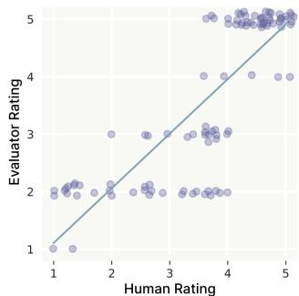


Fig. 7: Correlation between human and readability evaluator ratings. Points are slightly jittered to prevent overlap. 


Table 1: Comparison of SRCC and consumed prompt tokens among different readability evaluator prompts. We compare: default, without scale & ticks check, without layout check, and without both checks.


<table><tr><td>Prompt</td><td>SRCC</td><td># Tokens</td></tr><tr><td>default</td><td>0.843</td><td>2073.38</td></tr><tr><td>w/o scale &amp; ticks</td><td>0.732</td><td>1071.02</td></tr><tr><td>w/o layout</td><td>0.675</td><td>2063.72</td></tr><tr><td>w/o both</td><td>0.507</td><td>1057.86</td></tr></table>

# CoML4VIS Prompt

# System Message

Y n' c cc Uen U f c a g P c ac e a n i a . U c c g c c ce , n c a c a c a U c-cec n ca ac, n g mU c c cc P c ac gc c c n i a c mcc cc n c ' cqnc . 

I n a s 

- a ic cc a c c cc n i a a c n c [MatpSotSPTSeaTorKV nac `U . c ()` a U cc c . 

- Y n mn c n cc gc c ca ac UUca a ``` ace c a zc , a a aa ceU a . 

User Message 

Eec n ca ac: [code] 

V a c : .[taTSe] descrPpMoKV [taTSeJ descrPpMoKV II 

Rcqnc : [N^eryV 


Fig. 8: The prompt template for CoML4VIS.


# 5 EVALUATION

# 5.1 Setup

NL2VIS prompt. The prompt significantly influences the performance of pre-trained language models [73], making its selection crucial. In real-world scenarios, data is not always well-organized, leading to 461 out of 1150 visualizations in our dataset being generated based on multiple tables. However, LLMs-based visualization generation methods, to our knowledge, do not support generation from multiple tables. $\mathrm { C o M L } ^ { 2 }$ [69], a data science code generation method, caught our attention for its remarkable capabilities [72] and capability to generate code from multiple tables. We decided to revise its few-shot prompt [26] to specifically focus on visualization generation. 

As depicted in Fig. 8, the prompt begins with a task description and instructions, followed by executed code, table descriptions, and a natural language query. The executed code includes package imports and operations for reading tables. By default, only the tables required for generating visualizations are accessed. The table descriptions provide a summary of the information contained in the accessed tables, detailing column names and samples of $N$ rows (where $N = 1 0$ in our evaluation), as shown in Fig. 12. In line with prior research [69], which highlighted significant improvements with a single example compared to a zero-shot setting, we chose a bar chart example that integrates data from two tables as our one-shot example. To enhance the chart’s readability, we rotated the ticks and adjusted the ticks to display integers. More detailed information about the prompt design is provided in Appendix C. We refer to this revised visualization generation approach as CoML4VIS in the following sections. 

Visualization library. We compare two well-known Python visualization libraries: Matplotlib [24] and Seaborn [65]. They differ in their level of abstraction and ease of use for creating various types of plots. Matplotlib provides an extensive range of plotting options and customization capabilities. Seaborn is built on top of Matplotlib and offers a higher-level interface for creating visualizations with fewer lines of code, thus making it easier to generate aesthetically pleasing and informative plots. We specify the names of the selected libraries in the prompt, as shown in Fig. 8. 

Models. We evaluate the performance of four state-of-the-art models: GPT-4 [2], GPT-3.5 [48], Gemini-Pro [61] and CodeLlama-7B [53]. Specifically, We set the hyper-parameter temperature to 0. 

Metrics. The “Quality Score” provides a holistic assessment of the quality of generated results. If a result is determined to be invalid or illegal, its quality score is assigned a value of 0. Otherwise, the quality score is equal to the readability score assigned by the readability evaluator. Since multiple queries may correspond to the same visualization instance, the overall quality score for each visualization instance is calculated as the sum of individual scores divided by the total number of queries for that instance. Furthermore, we ascertain the “Pass Rate” as the ratio of valid or legal results to the total number of queries, excluding the readability score from this calculation to accommodate less stringent scenarios. For a more nuanced analysis, error rates can be 


Table 2: Performance of LLMs on VisEval benchmark. We compare invalid rate, illegal rate, pass rate, readability score, and quality score.


<table><tr><td>Model</td><td>Library</td><td>Invalid Rate</td><td>Illegal Rate</td><td>Pass Rate</td><td>Readability Score</td><td>Quality Score</td></tr><tr><td rowspan="4">CodeLlama-7B Gemini-Pro GPT-3.5 GPT-4</td><td rowspan="4">Maplotlib</td><td>42.95%</td><td>28.88%</td><td>28.17%</td><td>3.87</td><td>1.11</td></tr><tr><td>14.35%</td><td>34.06%</td><td>51.59%</td><td>3.95</td><td>2.06</td></tr><tr><td>8.79%</td><td>29.42%</td><td>61.79%</td><td>3.52</td><td>2.21</td></tr><tr><td>3.29%</td><td>21.44%</td><td>75.27%</td><td>3.80</td><td>2.89</td></tr><tr><td rowspan="4">CodeLlama-7B Gemini-Pro GPT-3.5 GPT-4</td><td rowspan="4">Seaborn</td><td>59.26%</td><td>24.25%</td><td>16.49%</td><td>3.64</td><td>0.61</td></tr><tr><td>21.09%</td><td>26.82%</td><td>52.09%</td><td>3.88</td><td>2.06</td></tr><tr><td>9.21%</td><td>31.00%</td><td>59.79%</td><td>3.60</td><td>2.20</td></tr><tr><td>25.41%</td><td>15.89%</td><td>58.70%</td><td>3.87</td><td>2.31</td></tr></table>

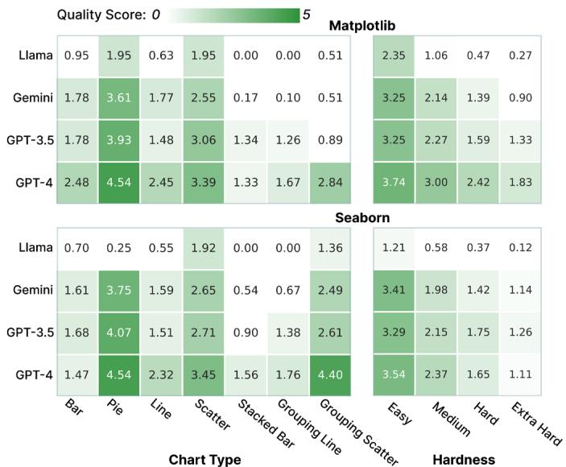


Fig. 9: Quality score on different chart types and hardness across LLMs. Llama refers to CodeLlama-7B and Gemini refers to Gemini-Pro.


separately computed for validity and legality, denoted as the “Invalid Rate” and “Illegal Rate”, respectively. Additionally, the “Readability Score” is calculated as the average readability score for visualizations that have been assessed for readability, which are only those that are valid and legal. 

# 5.2 Main Results

Quality score: Table 2 displays the quality score across four LLMs. We find that VisEval can differentiate models with different capabilities. The top-performing model GPT-4 achieves a quality score of 2.89 in the Matplotlib setting and 2.31 in the Seaborn setting, with the optimal score being 5. These scores are non-trivial but fall short of perfection, indicating that there is room for improvement. Other models have lower quality scores, and the ranking of the models is approximately as follows: CodeLlama- $\cdot 7 \mathrm { B } < \mathrm { G e m i n i - P r o } < \mathrm { G P T - 3 . 5 < G P T - 4 } ,$ . Contrary to our expectations, when using Seaborn, all models do not achieve a higher quality score. We observed an increase in their invalid rate, particularly GPT-4, which experienced the largest increase $( 2 2 . 1 2 \% )$ . This indicates that their pre-training corpus may have less content related to Seaborn compared to Matplotlib, leading to greater challenges in generating code that can render visualizations. 

Different chart type: LLMs exhibit varying performance across different chart types, as illustrated in Fig. 9. Charts requiring three visual channels (i.e., stacked bar charts, grouping line charts, and grouping scatter plots) tend to have lower quality scores compared to charts of the same type that only require two visual channels (i.e., bar charts, line charts, and scatter plots). This observation suggests that LLMs encounter difficulties when handling complex visualizations. 

Different hardness: The complexity of chart generation, as reflected in hardness, also impacts the quality of the generated chart, as depicted in Fig. 9. This trend is observed across all four models, with the quality score decreasing as the complexity of chart generation increases. 

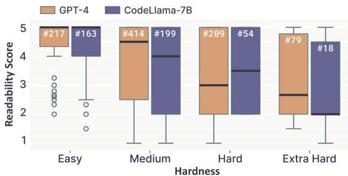


Fig. 10: Comparison of the readability scores between GPT-4 and CodeLlama-7B across different hardness using Matplotlib library. The value represented by $" \# "$ in the boxplot indicates the number of visualizations evaluated for readability scores.


Readability score: Despite achieving a strong readability score of 3.87, CodeLlama-7B exhibited the lowest pass rate at $2 8 . 1 7 \%$ in the Matplotlib setting, as indicated in Table 2. To investigate this discrepancy, we compared its readability score with that of GPT-4, which had the highest pass rate in our evaluation. As depicted in Fig. 10, there is a trend of decreasing readability scores with increasing query hardness. Only visualizations passing the validity and legality checks are evaluated for readability. Given that GPT-4 has a larger assessment size than CodeLlama, its overall readability score tends to be lower. However, when we focus on a subset of 415 visualizations that passed both validity and legality checks from GPT-4 and CodeLlama-7B, the readability score of GPT-4 (4.04) was higher than that of CodeLlama-7B (3.92). This underscores the significance of prioritizing the quality score for a comprehensive assessment of the overall performance of generation methods, even though the readability score is a useful indicator of the generated visualization’s quality in terms of readability. 

# 5.2.1 Typical Errors

To gain a better understanding of the errors encountered when generating visualizations using LLMs, we manually analyze the errors identified by each sub-check module (see Appendix C.3 for more details). We then categorize these typical errors into five categories to reveal prevalent challenges. Fig. 11 demonstrates examples of errors from each category, elaborated upon in detail below. 

Invalid code. Here are common reasons for such errors to occur: incorrect API calls or calling non-existent APIs, as illustrated in Fig. 11(1) where barplot() is given two positional arguments despite accepting zero to one argument; forgetting to import packages, as depicted in Fig. 11(2) where “numpy” (np) is used without being imported; hallucinations leading to the use of non-existent data columns. 

Illegal data transformation. This type of error refers to instances where the chart does not meet the query due to incorrect data transformations. The primary reason for such errors is incomprehension of the data table. For instance, in Fig. 11(3), two duplicate rows in the Faculty_Participates_in table should be cleaned to avoid doublecounting faculty members with the same FacID, which GPT-4 does not handle. Another reason is generating code that does not meet its intended purpose. For instance, in Fig. 11(5), the comment mentions counting the number of students and faculties, while the code calculates the record count within each actid group. 

Illegal visualization transformation. The third category indicates that the generated visualization does not undergo appropriate visual transformation. Some instances fail to create the legal chart types. This not only includes instances of mismatched chart types but also covers situations like the one shown in Fig. 11(6), where bars were overlapped. Additionally, there are instances involving improper visual mapping. In severe cases, this can lead to uninterpretable charts such as Fig. 11(7). Moreover, some instances involve forgetting to add a legend or creating an incorrect legend. For example, as depicted in Fig. 11(8), where the “name” variable was erroneously included in the legend. 

Illegal order. Sorting issues resulting from a lack of sorting or incorrect sorting criteria. For instance, in Fig. 11(9), the query specifies 

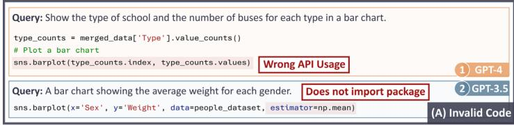


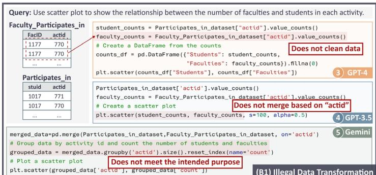


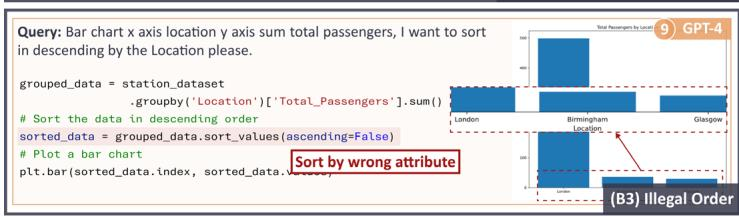


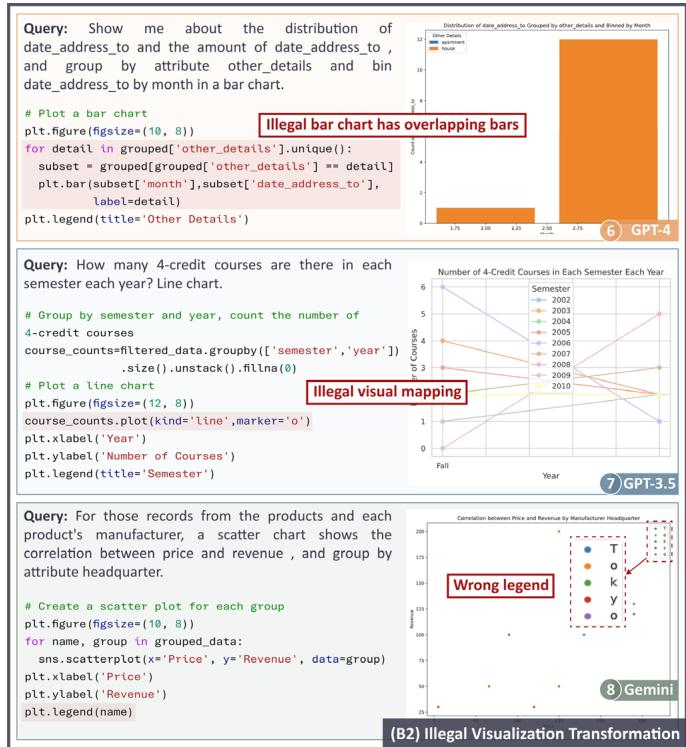


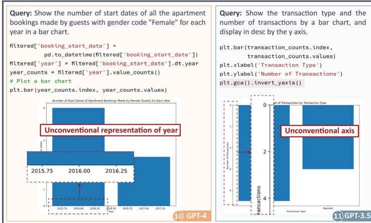


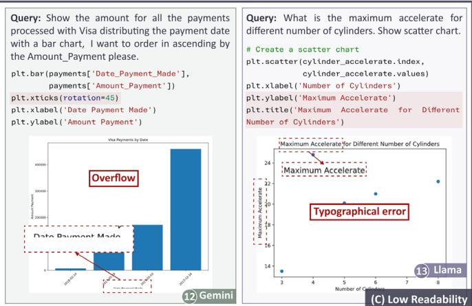


Fig. 11: Typical errors: (A) pertains to invalid code error. (B1-3) denote illegal errors occurring during data transformation, visualization transformation, and sorting processes. (C) relates to issues of low readability.


descending order based on the “Location”. However, the generated code sorts based on values (the sum of total passengers) instead. 

Low readability. Readability issues are common in the generated visualizations. For example, in Fig. 11(10), representing years using decimals may confuse readers. In Fig. 11(11), inverting the y-axis places the origin at the top-left corner, which is not consistent with common reading habits. Additionally, in Fig. 11(12), the x-axis title overflows, leading to text truncation. Lastly, in Fig. 11(13), there is a typographical error; it should be “Acceleration” instead of “Accelerate”. These issues, to varying degrees, affect the understanding of the charts. 

# 5.3 Evaluating Other Approaches

In this subsection, We demonstrate the performance of previous LLMsbased approaches, including Chat2vis [42] and LIDA [11], as well as CoML4VIS. Since both Chat2vis and LIDA are limited to generating visualizations from a single table, our comparison focuses on the quality of 689 visualizations that require data from a single table. As summarized in Table 3, CoML4VIS has the highest quality score, while Chat2vis has the highest pass rate, which shows that different prompt strategies can have varying effects on the model’s performance. 

Additionally, we noticed that previous approaches introduced distinct table formats, so we conducted an evaluation to understand how the pass 


Table 3: A comparison of pass rate and readability scores across different approaches for queries involving a single table. The evaluation results are obtained using the GPT-3.5 model.


<table><tr><td>Model</td><td>Library</td><td>Invalid Rate</td><td>Illegal Rate</td><td>Pass Rate</td><td>Readability Score</td><td>Quality Score</td></tr><tr><td>CoML4VIS</td><td></td><td>4.95%</td><td>27.50%</td><td>67.55%</td><td>3.54</td><td>2.43</td></tr><tr><td>LIDA</td><td>Maplotlib</td><td>6.59%</td><td>25.64%</td><td>67.77%</td><td>2.79</td><td>1.90</td></tr><tr><td>Chat2vis</td><td></td><td>4.92%</td><td>25.15%</td><td>69.93%</td><td>3.10</td><td>2.17</td></tr><tr><td>CoML4VIS</td><td></td><td>6.95%</td><td>32.02%</td><td>61.03%</td><td>3.66</td><td>2.27</td></tr><tr><td>LIDA</td><td>Seaborn</td><td>12.69%</td><td>35.54%</td><td>51.77%</td><td>3.39</td><td>1.77</td></tr><tr><td>Chat2vis</td><td></td><td>3.65%</td><td>31.05%</td><td>65.30%</td><td>3.04</td><td>2.02</td></tr></table>

rate of the same model varies across these different formats. As depicted in Fig. 12, CoML summarizes the column names and samples $N$ rows of data. LIDA describes the statistical information of each column in JSON format and samples $N$ values randomly for each column. Chat2vis uses natural language to describe the type of each column and provides $N$ examples for categorical data. To ensure fairness, we maintained all other settings of CoML4VIS unchanged except for the table format, and we standardized the sample size $N$ to 10 for all formatting options. We found that when using the table format of 

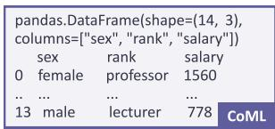


The 'aaa'oa'e ha' 'g't'n' 'ex ' oank ' 'a'aor . The 'g't'n 'ex ha' 'aaeegor va'te' 'e'a'e ' 'a'e . The 'g't'n oank ha' 'aaeegor va'te' 'og'e''go ' 'e'atoe ' a''i'aana 'og'e''go ' a''g'iaae 'og'e''go . The 'g't'n 'a'aor i' ar'e ina64 an' 'gnaain' nt'eoi' va'te'. C!  

'g't'n ' 'ex ' 'og'eote' ' 'ar'e ' 'aaeegor ' 'a'''e' ' 'e'a'e ' 'a'e '' nt'_tniqte_va'te' ' 2}}' 'g't'n ' oank ' 'og'eote' ' 'ar'e ' 'aaeegor ' 'a'''e' ' 'og'e''go ' 'e'atoe ' a''i'aana 'og'e''go ' a''g'iaae 'og'e''go '' nt'_tniqte_va'te' ' 4}}' 'g't'n ' 'a'aor ' 'og'eote' ' 'ar'e ' nt';eo ' 'a' ' 2502' 'in ' 778' 'ax ' 5684' 'a'''e' ' 2545' ...' 1255'' nt'_tniqte_va'te' ' 13}}' LIDA 


Fig. 12: Illustration of table format in CoML, LIDA, and Chat2vis.


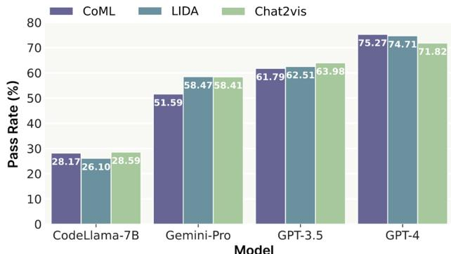


Fig. 13: Comparison of pass rate across different models and table format using Matplotlib library.


Chat2vis in CoML4VIS, the pass rate for visualizations requiring a single table can reach $7 0 . 4 3 \%$ , which is $0 . 5 \%$ higher than Chat2vis’ pass rate and $2 . 8 8 \%$ higher than the original CoML4VIS. 

However, different data formats have different impacts on the performance of different models. As depicted in Fig. 13, the pass rates of different models vary when generating visualizations using Matplotlib with different data formats. We observed that when generating with GPT-3.5, using the table format of Chat2vis results in the highest pass rate. In contrast, when generating with GPT-4, using the table format of Chat2vis yields the lowest pass rate. These observations suggest that different LLMs exhibit preferences for specific table formats, which may stem from the use of distinct training data during pretraining. This underscores the importance of carefully selecting table formats based on the chosen LLMs. 

# 5.4 Table Disruption

We conducted experiments to assess the impact of including additional unused tables when generating visualization using Matplotlib. In our dataset, each visualization corresponds to a database that contains multiple tables but only some of these tables are used for visualization. In this experiment, we randomly included two unused tables in the prompt. If the number of unused tables is less than two, then all unused tables are added to the prompt. As shown in Table 4, the pass rate of each LLM decreases to varying degrees. This suggests that it may be necessary to carefully select the required tables at the beginning of the workflow for generating visualizations. 


Table 4: Evaluating the impact of table disruption on pass rate $( \% )$ .


<table><tr><td>Choice</td><td>CodeLlama-7B</td><td>Gemini-Pro</td><td>GPT-3.5</td><td>GPT-4</td></tr><tr><td>w/o disruption</td><td>28.17</td><td>51.59</td><td>61.69</td><td>75.27</td></tr><tr><td>disruption</td><td>17.44 -10.73</td><td>31.80 -19.79</td><td>54.68 -7.01</td><td>65.86 -9.41</td></tr></table>

# 6 DISCUSSION

# 6.1 Potential Development in NL2VIS

The evaluation outcomes in Section 5 show that current methods in NL2VIS still have room for improvement. These highlight the importance of enhancing the performance of LLMs by exploring advanced techniques and knowledge in natural language processing and data visualization. We discuss the potential development as follows: 

• Incorporating supplementary methods, such as linting methods like pylint [51], can help address issues such as omissions in package imports. Linting methods analyze code for errors and style inconsistencies, providing proactive guidance and enhancing code quality. 

• Observing frequent misuses of APIs by LLMs, it is essential to develop strategies that guide LLMs using library API documentation to improve the accuracy of API usage. Such strategies may involve techniques such as retrieval augmented generation (RAG) [33] or model fine-tuning. 

• Decomposing NL2VIS tasks into subtasks is another effective approach, addressing errors across multiple steps from data transformation to visualization transformation. Therefore, simplifying complex problems into manageable steps like data understanding, column selection, visual mapping, and sorting can lead to more accurate and efficient results. 

• Iterative generation guided by feedback to refine and improve the quality of generated visualizations. While it is challenging to directly detect issues through code alone, integrating visual-based methods can provide valuable feedback. For instance, incorporating our readability evaluator into the generation process helps identify readability issues in the generated results, guiding subsequent modifications. 

# 6.2 Limitations and Future work

We summarize several limitations and propose future work direction. 

Support for integrating additional grammar or methods. In this work, we evaluate visualizations generated using Python libraries. However, our framework’s modular design makes it easy to extend and evaluate other visualization generation tools, such as JavaScript-based toolkits. To evaluate Vega-Lite-based methods, for instance, we need to configure the code execution and construction module. Specifically, we simulate a browser environment to convert Vega-Lite code into SVG format and adapt our deconstruction rules to accurately extract data from the rendered charts. As a result, our framework is capable of adaptively and robustly evaluating a broad spectrum of automatic visualization tools. This level of flexibility ensures that our framework remains useful and adaptable to emerging visualization technologies. 

Expand the scope of benchmark. Currently, our dataset focuses on common chart types. While it provides a solid foundation for benchmarking, it does not encompass the full range of natural language queries and visualizations. In the future, we aim to create a more comprehensive and challenging benchmark that can drive further advancements in the field of NL2VIS. We plan to collaborate with BI-tools teams and the broader community to expand our benchmark, including real-world queries and more complex visualizations. By leveraging our proposed construction process, which integrates the capabilities of state-of-the-art LLMs with insights from human experts, we anticipate enhancing the efficiency and quality of future dataset expansions. 

Extend the coverage of metrics. The evaluation dimensions covered in VisEval primarily focus on fundamental errors that hinder comprehension. At this point, we have not included metrics related to aesthetics or expressiveness. This is partly because these aspects represent higher-level requirements that are not the primary challenges currently faced. Additionally, they involve more subjective considerations that are influenced by the visualization’s intended use and audience, necessitating more complex evaluations. In the future, we plan to expand the assessments to include aesthetic, expressiveness, and stylistic aspects by leveraging more advanced models, enhancing the performance and capability of VisEval. 

# 7 CONCLUSION

We present VisEval, a novel NL2VIS benchmark aimed at comprehensive and reliable evaluation of generated visualizations. Our work includes the construction of a large-scale and high-quality dataset, the development of an automated evaluation framework covering dimensions of validity, legality, and readability, and the evaluation of state-of-the-art LLMs. Our evaluations reveal common challenges of LLMs, offering valuable insights for future advancements. Overall, our framework represents a significant step forward in improving the quality of NL2VIS systems in the era of LLMs. 

# REFERENCES


[1] Y. Abe, T. Daikoku, and Y. Kuniyoshi. Assessing the Aesthetic Evaluation Capabilities of GPT-4 with Vision: Insights from Group and Individual Assessments. arXiv preprint arXiv:2403.03594, 2024. 5 


[2] J. Achiam, S. Adler, S. Agarwal, L. Ahmad, I. Akkaya, F. L. Aleman, D. Almeida, J. Altenschmidt, S. Altman, S. Anadkat, et al. GPT-4 Technical Report. arXiv preprint arXiv:2303.08774, 2023. 1, 2, 6 


[3] R. Amar, J. Eagan, and J. Stasko. Low-level Components of Analytic Activity in Information Visualization. In Proc. INFOVIS, pp. 111–117. IEEE, Washington DC, 2005. doi: 10.1109/INFVIS.2005.1532136 14 


[4] M. Behrisch, M. Blumenschein, N. W. Kim, L. Shao, M. El-Assady, J. Fuchs, D. Seebacher, A. Diehl, U. Brandes, H. Pfister, T. Schreck, D. Weiskopf, and D. A. Keim. Quality Metrics for Information Visualization. Comput. Graphics Forum, 37(3):625–662, 2018. doi: 10.1111/cgf. 13446 2 


[5] M. A. Borkin, Z. Bylinskii, N. W. Kim, C. M. Bainbridge, C. S. Yeh, D. Borkin, H. Pfister, and A. Oliva. Beyond Memorability: Visualization Recognition and Recall. IEEE Trans. Visual Comput. Graphics, 22(1):519– 528, 2016. doi: 10.1109/TVCG.2015.2467732 6 


[6] M. Chen, J. Tworek, H. Jun, Q. Yuan, H. P. D. O. Pinto, J. Kaplan, H. Edwards, Y. Burda, N. Joseph, G. Brockman, et al. Evaluating Large Language Models Trained on Code. arXiv preprint arXiv:2107.03374, 2021. 1 


[7] Q. Chen, F. Sun, X. Xu, Z. Chen, J. Wang, and N. Cao. VizLinter: A Linter and Fixer Framework for Data Visualization. IEEE Trans. Visual Comput. Graphics, 28(1):206–216, 2022. doi: 10.1109/TVCG.2021.3114804 3 


[8] Z. Chen, C. Zhang, Q. Wang, J. Troidl, S. Warchol, J. Beyer, N. Gehlenborg, and H. Pfister. Beyond Generating Code: Evaluating GPT on a Data Visualization Course. In Proc. EduVis Workshop at IEEE VIS, pp. 16–21. IEEE, Washington DC, 2023. doi: 10.1109/EduVis60792.2023.00009 2 


[9] L. Cheng, X. Li, and L. Bing. Is GPT-4 a Good Data Analyst? In Proc. EMNLP, p. 9496–9514. ACL, Kerrville, 2023. doi: 10.18653/v1/2023. findings-emnlp.637 2 


[10] H. W. Chung, L. Hou, S. Longpre, B. Zoph, Y. Tay, W. Fedus, Y. Li, X. Wang, M. Dehghani, S. Brahma, et al. Scaling Instruction-finetuned Language Models. J. Mach. Learn. Res., 25(70):1–53, 2024. 2 


[11] V. Dibia. LIDA: A Tool for Automatic Generation of Grammar-Agnostic Visualizations and Infographics using Large Language Models. In Proc. ACL, pp. 113–126. ACL, Kerrville, 2023. doi: 10.18653/v1/2023.acl-demo .11 1, 2, 3, 8 


[12] V. Dibia and Ç. Demiralp. Data2Vis: Automatic Generation of Data Visualizations Using Sequence-to-Sequence Recurrent Neural Networks. IEEE Comput. Graphics Appl., 39(5):33–46, 2019. doi: 10.1109/MCG. 2019.2924636 3, 13 


[13] A. Figueiras. A Review of Visualization Assessment in Terms of User Performance and Experience. In Proc. IV, pp. 145–152. IEEE, Washington DC, 2018. doi: 10.1109/iV.2018.00035 2 


[14] S. Fu, K. Xiong, X. Ge, S. Tang, W. Chen, and Y. Wu. Quda: Natural Language Queries For Visual Data Analytics. arXiv preprint arXiv:2005.03257, 2020. 3, 4, 13 


[15] X. Fu, Y. Wang, H. Dong, W. Cui, and H. Zhang. Visualization Assessment: A Machine Learning Approach. In Proc. VIS, pp. 126–130. IEEE, Washington DC, 2019. doi: 10.1109/VISUAL.2019.8933570 2, 6 


[16] T. Gao, M. Dontcheva, E. Adar, Z. Liu, and K. G. Karahalios. DataTone: Managing Ambiguity in Natural Language Interfaces for Data Visualization. In Proc. UIST, pp. 489–500. ACM, New York, 2015. doi: 10. 1145/2807442.2807478 2, 3, 4 


[17] K. Gu, R. Shang, T. Althoff, C. Wang, and S. M. Drucker. How Do Analysts Understand and Verify AI-Assisted Data Analyses? In Proc. CHI, pp. 748:1–748:22. ACM, New York, 2024. doi: 10.1145/3613904. 3642497 2 


[18] Y. Han, C. Zhang, X. Chen, X. Yang, Z. Wang, G. Yu, B. Fu, and H. Zhang. ChartLlama: A Multimodal LLM for Chart Understanding and Generation. arXiv preprint arXiv:2311.16483, 2023. 1, 2, 3, 5 


[19] Y. He, S. Cao, Y. Shi, Q. Chen, K. Xu, and N. Cao. Leveraging Large Models for Crafting Narrative Visualization: A Survey. arXiv preprint arXiv:2401.14010, 2024. 1 


[20] M.-H. Hong and A. Crisan. Conversational AI Threads for Visualizing Multidimensional Datasets. arXiv preprint arXiv:2311.05590, 2023. 2 


[21] A. K. Hopkins, M. Correll, and A. Satyanarayan. VisuaLint: Sketchy in Situ Annotations of Chart Construction Errors. Comput. Graphics Forum, 39(3):219–228, 2020. doi: 10.1111/cgf.13975 2 


[22] K. Hu, M. A. Bakker, S. Li, T. Kraska, and C. Hidalgo. VizML: A Machine Learning Approach to Visualization Recommendation. In Proc. CHI, pp. 128:1–128:12. ACM, New York, 2019. doi: 10.1145/3290605.3300358 3, 13 


[23] K. Hu, S. N. S. Gaikwad, M. Hulsebos, M. A. Bakker, E. Zgraggen, C. Hidalgo, T. Kraska, G. Li, A. Satyanarayan, and c. Demiralp. VizNet: Towards A Large-Scale Visualization Learning and Benchmarking Repository. In Proc. CHI, pp. 662:1–662:12. ACM, New York, 2019. doi: 10. 1145/3290605.3300892 3, 13 


[24] J. D. Hunter. Matplotlib: A 2D Graphics Environment. Computing in Science & Engineering, 9(3):90–95, 2007. doi: 10.1109/MCSE.2007.55 1, 3, 6 


[25] S. Kantharaj, R. T. Leong, X. Lin, A. Masry, M. Thakkar, E. Hoque, and S. Joty. Chart-to-Text: A Large-Scale Benchmark for Chart Summarization. In Proc. ACL, pp. 4005–4023. ACL, Kerrville, 2022. doi: 10. 18653/v1/2022.acl-long.277 3, 13 


[26] J. Kaplan, S. McCandlish, T. Henighan, T. B. Brown, B. Chess, R. Child, S. Gray, A. Radford, J. Wu, and D. Amodei. Scaling Laws for Neural Language Models. arXiv preprint arXiv:2001.08361, 2020. 6 


[27] E. Kavaz, A. Puig, and I. Rodríguez. Chatbot-Based Natural Language Interfaces for Data Visualisation: A Scoping Review. Applied Sciences, 13(12):7025:1–7025:9, 2023. doi: 10.3390/app13127025 2 


[28] D. H. Kim, E. Hoque, and M. Agrawala. Answering Questions about Charts and Generating Visual Explanations. In Proc. CHI, pp. 1–13. ACM, New York, 2020. doi: 10.1145/3313831.3376467 3, 13 


[29] N. W. Kim, G. Myers, and B. Bach. How Good is ChatGPT in Giving Advice on Your Visualization Design? arXiv preprint arXiv:2310.09617, 2023. 2 


[30] T. S. Kim, D. Choi, Y. Choi, and J. Kim. Stylette: Styling the Web with Natural Language. In Proc. CHI, pp. 5:1–5:17. ACM, New York, 2022. doi: 10.1145/3491102.3501931 1 


[31] A. Kumar, J. Aurisano, B. Di Eugenio, A. Johnson, A. Gonzalez, and J. Leigh. Towards a Dialogue System that Supports Rich Visualizations of Data. In Proc.SIGDIAL, pp. 304–309. ACL, Kerrville, 2016. doi: 10. 18653/v1/W16-3639 2, 3, 4 


[32] Y. Lai, C. Li, Y. Wang, T. Zhang, R. Zhong, L. Zettlemoyer, W.-t. Yih, D. Fried, S. Wang, and T. Yu. DS-1000: A Natural and Reliable Benchmark for Data Science Code Generation. In Proc. ICML, pp. 756:1–756:27. JMLR.org, 2023. 3, 4 


[33] P. Lewis, E. Perez, A. Piktus, F. Petroni, V. Karpukhin, N. Goyal, H. Küttler, M. Lewis, W.-t. Yih, T. Rocktäschel, S. Riedel, and D. Kiela. Retrieval-Augmented Generation for Knowledge-Intensive NLP Tasks. In Proc. NIPS, vol. 33, pp. 9459–9474. Curran Associates Inc., Red Hook, 2020. 9 


[34] G. Li, X. Wang, G. Aodeng, S. Zheng, Y. Zhang, C. Ou, S. Wang, and C. H. Liu. Visualization Generation with Large Language Models: An Evaluation. arXiv preprint arXiv:2401.11255, 2024. 2, 3 


[35] S. Li, X. Chen, Y. Song, Y. Song, and C. Zhang. Prompt4Vis: Prompting Large Language Models with Example Mining and Schema Filtering for Tabular Data Visualization. arXiv preprint arXiv:2402.07909, 2024. 2 


[36] H. Liu, C. Li, Q. Wu, and Y. J. Lee. Visual Instruction Tuning. In Proc. NIPS, vol. 36, pp. 34892–34916. Curran Associates, Inc., 2023. 2 


[37] N. F. Liu, K. Lin, J. Hewitt, A. Paranjape, M. Bevilacqua, F. Petroni, and P. Liang. Lost in the Middle: How Language Models Use Long Contexts. Transactions of the Association for Computational Linguistics, 12:157–173, 2024. doi: 10.1162/tacl_a_00638 17 


[38] L. Y.-H. Lo, A. Gupta, K. Shigyo, A. Wu, E. Bertini, and H. Qu. Misinformed by Visualization: What Do We Learn From Misinformative Visualizations? Comput. Graphics Forum, 41(3):515–525, 2022. doi: 10. 1111/cgf.14559 2 


[39] Y. Luo, N. Tang, G. Li, C. Chai, W. Li, and X. Qin. Synthesizing Natural Language to Visualization (NL2VIS) Benchmarks from NL2SQL Benchmarks. In Proc. SIGMOD, pp. 1235–1247. ACM, New York, 2021. doi: 10.1145/3448016.3457261 2, 3, 4, 13 


[40] Y. Luo, N. Tang, G. Li, J. Tang, C. Chai, and X. Qin. Natural Language to Visualization by Neural Machine Translation. IEEE Trans. Visual Comput. Graphics, 28(1):217–226, 2022. doi: 10.1109/TVCG.2021.3114848 2 


[41] P. Maddigan and T. Susnjak. Chat2VIS: Fine-Tuning Data Visualisations using Multilingual Natural Language Text and Pre-Trained Large Language Models. arXiv preprint arXiv:2303.14292, 2023. 2, 3 


[42] P. Maddigan and T. Susnjak. Chat2VIS: Generating Data Visualizations via Natural Language Using ChatGPT, Codex and GPT-3 Large Language Models. IEEE Access, 11:45181–45193, 2023. doi: 10.1109/ACCESS. 2023.3274199 1, 2, 8 


[43] A. Masry, X. L. Do, J. Q. Tan, S. Joty, and E. Hoque. ChartQA: A Benchmark for Question Answering about Charts with Visual and Logical Reasoning. In Proc. Findings of ACL, pp. 2263–2279. ACL, Kerrville, 2022. doi: 10.18653/v1/2022.findings-acl.177 3, 13 


[44] A. McNutt and G. Kindlmann. Linting for Visualization: Towards a Practical Automated Visualization Guidance System. In Proc. VisGuide Workshop at IEEE VIS, 2018. 2, 3 


[45] N. Methani, P. Ganguly, M. M. Khapra, and P. Kumar. PlotQA: Reasoning over Scientific Plots. In Proc. WACV, pp. 1516–1525. IEEE, Washington DC, 2020. doi: 10.1109/WACV45572.2020.9093523 3, 13 


[46] A. Narechania, A. Srinivasan, and J. Stasko. NL4DV: A Toolkit for Generating Analytic Specifications for Data Visualization from Natural Language Queries. IEEE Trans. Visual Comput. Graphics, 27(2):369–379, 2021. doi: 10.1109/TVCG.2020.3030378 1, 2 


[47] Open AI. Chatgpt can now see, hear, and speak. https://openai.com/ blog/chatgpt-can-now-see-hear-and-speak. [Online; accessed 31-March-2024]. 2, 5 


[48] L. Ouyang, J. Wu, X. Jiang, D. Almeida, C. L. Wainwright, P. Mishkin, C. Zhang, S. Agarwal, K. Slama, A. Ray, J. Schulman, J. Hilton, F. Kelton, L. Miller, M. Simens, A. Askell, P. Welinder, P. F. Christiano, J. Leike, and R. Lowe. Training Language Models to Follow Instructions With Human Feedback. In Proc. NIPS, vol. 35, pp. 27730–27744. Curran Associates, Inc., 2022. 2, 6 


[49] J. Poco and J. Heer. Reverse-Engineering Visualizations: Recovering Visual Encodings from Chart Images. Comput. Graph. Forum, 36(3):353– 363, 2017. doi: 10.1111/cgf.13193 5 


[50] L. Podo, M. Ishmal, and M. Angelini. Vi (E) va LLM! A Conceptual Stack for Evaluating and Interpreting Generative AI-based Visualizations. arXiv preprint arXiv:2402.02167, 2024. 2 


[51] Pylint contributors. Pylint. https://github.com/pylint-dev/ pylint. [Online; accessed 31-March-2024]. 9 


[52] R. Rahman, R. Hasan, A. A. Farhad, M. T. R. Laskar, M. H. Ashmafee, and A. R. M. Kamal. ChartSumm: A Comprehensive Benchmark for Automatic Chart Summarization of Long and Short Summaries. arXiv preprint arXiv:2304.13620, 2023. 3, 13 


[53] B. Roziere, J. Gehring, F. Gloeckle, S. Sootla, I. Gat, X. E. Tan, Y. Adi, J. Liu, T. Remez, J. Rapin, et al. Code Llama: Open Foundation Models for Code. arXiv preprint arXiv:2308.12950, 2023. 2, 6 


[54] B. Saket, A. Endert, and J. Stasko. Beyond Usability and Performance: A Review of User Experience-focused Evaluations in Visualization. In Proc. BELIV, pp. 133–142. ACM, New York, 2016. doi: 10.1145/2993901 .2993903 2 


[55] A. Satyanarayan, D. Moritz, K. Wongsuphasawat, and J. Heer. Vega-Lite: A Grammar of Interactive Graphics. IEEE Trans. Visual Comput. Graphics, 23(1):341–350, 2017. doi: 10.1109/TVCG.2016.2599030 2 


[56] L. Shen, E. Shen, Y. Luo, X. Yang, X. Hu, X. Zhang, Z. Tai, and J. Wang. Towards Natural Language Interfaces for Data Visualization: A Survey. IEEE Trans. Visual Comput. Graphics, 29(6):3121–3144, 2023. doi: 10. 1109/TVCG.2022.3148007 1 


[57] Y. Shi, D. Peng, W. Liao, Z. Lin, X. Chen, C. Liu, Y. Zhang, and L. Jin. Exploring OCR Capabilities of GPT-4V(ision) : A Quantitative and Indepth Evaluation. arXiv preprint arXiv:2310.16809, 2023. 5 


[58] Y. Song, X. Zhao, R. C.-W. Wong, and D. Jiang. RGVisNet: A Hybrid Retrieval-Generation Neural Framework Towards Automatic Data Visualization Generation. In Proc. KDD, pp. 1646–1655. ACM, New York, 2022. doi: 10.1145/3534678.3539330 2 


[59] A. Srinivasan, N. Nyapathy, B. Lee, S. M. Drucker, and J. Stasko. Collecting and Characterizing Natural Language Utterances for Specifying Data Visualizations. In Proc. CHI, pp. 464:1–464:10. ACM, New York, 2021. doi: 10.1145/3411764.3445400 2, 3, 4, 13 


[60] Y. Sui, M. Zhou, M. Zhou, S. Han, and D. Zhang. Table Meets LLM: Can Large Language Models Understand Structured Table Data? A Benchmark and Empirical Study. In Proc. WSDM, pp. 645–654. ACM, New York, 2024. doi: 10.1145/3616855.3635752 4 


[61] G. Team, R. Anil, S. Borgeaud, Y. Wu, J.-B. Alayrac, J. Yu, R. Soricut, J. Schalkwyk, A. M. Dai, A. Hauth, et al. Gemini: A Family of Highly Capable Multimodal Models. arXiv preprint arXiv:2312.11805, 2023. 2, 6 


[62] Y. Tian, W. Cui, D. Deng, X. Yi, Y. Yang, H. Zhang, and Y. Wu. ChartGPT: Leveraging LLMs to Generate Charts from Abstract Natural Language. IEEE Trans. Visual Comput. Graphics, p. To appear, 2024. doi: 10.1109/ TVCG.2024.3368621 1, 2, 5 


[63] H. Touvron, L. Martin, K. Stone, P. Albert, A. Almahairi, Y. Babaei, 


N. Bashlykov, S. Batra, P. Bhargava, S. Bhosale, et al. Llama 2: Open Foundation and Fine-Tuned Chat Models. arXiv preprint arXiv:2307.09288, 2023. 1 


[64] P. Vazquez. Are LLMs Ready for Visualization? In Proc. PacificVis, pp. 343–352. IEEE Computer Society, Los Alamitos, 2024. doi: 10.1109/ PacificVis60374.2024.00049 2 


[65] M. L. Waskom. Seaborn: Statistical Data Visualization. Journal of Open Source Software, 6(60):3021–3024, 2021. doi: 10.21105/joss.03021 3, 6 


[66] A. Wu, W. Tong, T. Dwyer, B. Lee, P. Isenberg, and H. Qu. Mobile-VisFixer: Tailoring Web Visualizations for Mobile Phones Leveraging an Explainable Reinforcement Learning Framework. IEEE Trans. Visual Comput. Graphics, 27(2):464–474, 2021. doi: 10.1109/TVCG.2020. 3030423 5 


[67] A. Wu, L. Xie, B. Lee, Y. Wang, W. Cui, and H. Qu. Learning to Automate Chart Layout Configurations Using Crowdsourced Paired Comparison. In Proc. CHI, pp. 14:1–14:13. ACM, New York, 2021. doi: 10.1145/3411764 .3445179 2 


[68] B. Yu and C. T. Silva. FlowSense: A Natural Language Interface for Visual Data Exploration within a Dataflow System. IEEE Trans. Visual Comput. Graphics, 26(1):1–11, 2020. doi: 10.1109/TVCG.2019.2934668 2 


[69] L. Zhang, Y. Zhang, K. Ren, D. Li, and Y. Yang. MLCopilot: Unleashing the Power of Large Language Models in Solving Machine Learning Tasks. In Proc. ACL, pp. 2931–2959. ACL, Kerrville, 2024. 6 


[70] W. Zhang, Y. Wang, Y. Song, V. J. Wei, Y. Tian, Y. Qi, J. H. Chan, R. C.- W. Wong, and H. Yang. Natural Language Interfaces for Tabular Data Querying and Visualization: A Survey. IEEE Trans. Knowl. Data Eng, p. To appear, 2024. 1, 2 


[71] Y. Zhang, L. Cui, F. P. Tso, Q. Guan, W. Jia, and J. Zhou. Mystique: A Fine-Grained and Transparent Congestion Control Enforcement Scheme. IEEE Trans. Network Serv. Manage., 16(4):1869–1883, 2019. doi: 10. 1109/TNSM.2019.2935829 5 


[72] Y. Zhang, Q. Jiang, X. Han, N. Chen, Y. Yang, and K. Ren. Benchmarking Data Science Agents. arXiv preprint arXiv:2402.17168, 2024. 1, 3, 4, 6 


[73] Z. Zhao, E. Wallace, S. Feng, D. Klein, and S. Singh. Calibrate Before Use: Improving Few-shot Performance of Language Models. In Proc. PMLR, vol. 139, pp. 12697–12706. PMLR, 2021. 6 


[74] D. Zhou, N. Schärli, L. Hou, J. Wei, N. Scales, X. Wang, D. Schuurmans, C. Cui, O. Bousquet, Q. Le, et al. Least-to-Most Prompting Enables Complex Reasoning in Large Language Models. arXiv preprint arXiv:2205.10625, 2022. 5 


[75] M. Zhou, Y. Fung, L. Chen, C. Thomas, H. Ji, and S.-F. Chang. Enhanced Chart Understanding via Visual Language Pre-training on Plot Table Pairs. In Proc. Findings of ACL, pp. 1314–1326. ACL, Kerrville, 2023. doi: 10. 18653/v1/2023.findings-acl.85 5 

